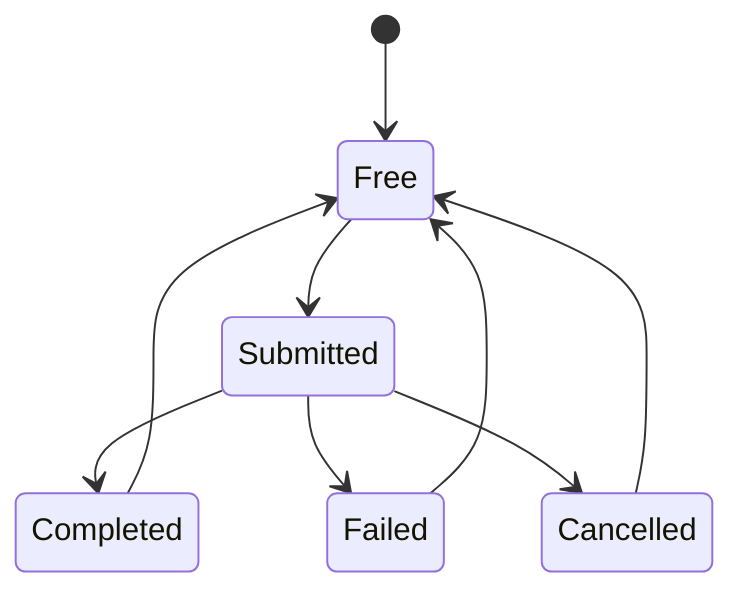

# Module 10 — Logical Fragmentation and Asynchronous I/O

In this module, **fragmentation** means that an operation selects separate regions of a file's content while leaving others untreated. When the observed operation is cryptographic, this is called *partial* or *intermittent encryption*. It does not describe the file's physical layout on a volume. The central question is how to describe selected intervals, confirm which ones actually completed, and evaluate their effects without confusing “untouched bytes” with “recoverable file.”

A `ReadFile` call can complete during the call or remain pending. In either case, a program using asynchronous I/O must know **which request produced a result, which buffer remains occupied, and when that buffer can be reused**. Multiple outstanding requests do not guarantee completion in submission order, continuous device activity, or a performance gain over simple reads.

This module connects range selection to execution: it examines `OVERLAPPED` and I/O Completion Ports (IOCP) on **read-only** disposable test files and represents intervals without applying a cryptographic transformation. [Module 05](Ransomware-Modulo5-en) introduced I/O and concurrency primitives, [Module 06](Ransomware-Modulo6-en) explained pipeline queues and outcomes, and [Module 09](Ransomware-Modulo9-en) established requirements for describing ranges in a format. Here we check what those decisions mean when operations complete or fail.

## 10.1 Synchronous execution, concurrency, and completion

A synchronous read blocks the thread waiting for its result. This does not mean **the entire CPU** is idle: the system can run other threads. With `FILE_FLAG_OVERLAPPED`, a file handle can accept requests with their own `OVERLAPPED` and offset. A request can complete immediately or report `ERROR_IO_PENDING`; the program needs a way to receive its terminal outcome.

| Mechanism | What it provides | Additional contract |
| --- | --- | --- |
| Synchronous read | Result in the thread's ordinary control flow | Check error and byte count. |
| `OVERLAPPED` with explicit wait | Requests that may remain pending | Keep buffer, handle, and structure alive until actual completion. |
| IOCP | Queue of completions associated with handles | Match packet, request, bytes, and error; manage resources and shutdown. |
| `CreateThreadpoolIo` | Manages callbacks on Windows thread-pool I/O | Still requires checking results and context lifetime. |
| Several readers or threads | Potentially more work in progress | Bound outstanding work and measure contention. |

IOCP decouples submission from receiving its result; it is **not** synonymous with `FILE_FLAG_NO_BUFFERING`. Nor does it imply a particular worker count or one encryption action per block. Current Microsoft documentation suggests `CreateThreadpoolIo` as a simpler option for new applications without a need for direct port management; this example uses IOCP to expose its states. A sample analyst should distinguish capability found in a binary, requests submitted, completions observed, and corroborated effects. [Microsoft: I/O Completion Ports](https://learn.microsoft.com/en-us/windows/win32/fileio/i-o-completion-ports).

## 10.2 Ownership of each operation

An outstanding request owns its `OVERLAPPED`, buffer, offset, requested length, and state. The same structure cannot be reused for another request before the first has a terminal result. A `chunkIndex` may act as a label, but the bytes and offset of a completion still need validation.



A buffer becomes `Free` **after** its completion is consumed. When a read is followed by a write of those bytes, the buffer has two successive I/O lifetimes: the read result is not the write result. Starting the second request is not proof that all work was completed.

`GetQueuedCompletionStatus` can return `FALSE` with `lpOverlapped == NULL` when no packet was obtained, or `FALSE` with `lpOverlapped != NULL` after dequeuing a failed operation. In the latter case, there is still a specific request needing a terminal state. Ending the loop on every `FALSE` loses its identity. [Microsoft: `GetQueuedCompletionStatus`](https://learn.microsoft.com/en-us/windows/win32/api/ioapiset/nf-ioapiset-getqueuedcompletionstatus).

### Useful invariants

When a closed set of requests finishes normally:

```text
accepted requests = completed + failed + cancelled
verified bytes ≤ requested bytes
```

Pending requests exist during execution, so the first equality does not apply to an intermediate snapshot. An operation that fails before acceptance belongs in a separate **submission failure** count. Full coverage requires a validated outcome for every expected range without unexpected gaps or overlaps. Byte totals alone can conceal a duplicated region and an omitted one.

## 10.3 An IOCP loop that drains too early

Consider an implementation that submits four initial reads and, when each completes, starts a write using its buffer. It submits the next read only if it finds **another free buffer at that moment**. All four may still be occupied when the writes are started, leaving no free slot. When a write completes later, the code frees its buffer and reduces the pending count but **does not submit the next read**. It can finish after four blocks and report success even when the file is larger.

The conceptual fix is straightforward: a terminal outcome frees a slot; if work remains and the policy permits, **that moment** allows a new request. The reader can check this property in the lab. Finishing requires both that no expected ranges remain to submit and that no requests are in flight. `pending == 0` alone is insufficient if ranges have yet to be submitted.

Another failure is using a global, stateful stream-cipher context in **completion order**. That order may differ from file offsets. Any per-block transformation would need a contract binding its cryptographic state to the proper offset and later verifying the outcome; this lab implements no such transformation. Performance examples that ignore the relationship may be fast and still produce incorrect data.

## 10.4 Caching, alignment, and final blocks

`FILE_FLAG_NO_BUFFERING` disables system caching for the relevant operations and adds requirements. According to Microsoft, access lengths and offsets must be multiples of the volume's sector size; buffer addresses should also satisfy the recommended physical alignment. Logical and physical sector sizes may differ. `VirtualAlloc` returns page-aligned memory that helps in many common cases, **but it does not replace checking the device and every operation**. [Microsoft: File buffering](https://learn.microsoft.com/en-us/windows/win32/fileio/file-buffering).

If a file's size is not a sector multiple, its final block needs special attention: requesting or writing its exact short length through an interface requiring sector multiples can fail. A policy is needed to handle it without reading or overwriting unrelated bytes. The primary exercise therefore uses **buffered I/O** to verify completion concepts first; comparison with `NO_BUFFERING` would be a separate experiment conditional on the observed sector and file system.

`FILE_FLAG_SEQUENTIAL_SCAN` tells Windows about an anticipated access pattern; it does not promise a universal percentage improvement. Likewise, `MapViewOfFile` does not automatically make mapping an entire file cheap or suitable at any size: a view occupies address space and needs error and lifetime management. [Microsoft: `CreateFileW`](https://learn.microsoft.com/en-us/windows/win32/api/fileapi/nf-fileapi-createfilew); [`MapViewOfFile`](https://learn.microsoft.com/en-us/windows/win32/api/memoryapi/nf-memoryapi-mapviewoffile).

## 10.5 Cancellation, failures, and shutdown

`CancelIoEx` requests cancellation of pending operations; it **does not wait for them to finish**. Completions may still arrive, and each request's outcome must be classified. Releasing buffers or context immediately after requesting cancellation can leave active operations referring to freed resources. [Microsoft: `CancelIoEx`](https://learn.microsoft.com/en-us/windows/win32/api/ioapiset/nf-ioapiset-cancelioex).

| Situation | State to record | Verifiable decision |
| --- | --- | --- |
| Open fails | No read request accepted | Do not invent completed counts. |
| Request submission fails | Submission failure | Stop submitting or apply a documented policy. |
| Completion reports an error | Identified failed request | Consume packet, retain error code, release resources after termination. |
| Unexpected short read | Actual bytes and expected range | Do not report full coverage. |
| Cancellation requested | I/O may still be pending | Drain results until terminal states are known. |
| Incompatible sharing | Open rejected | A bounded retry can be tested; the error is not guaranteed to disappear. |
| Access denied | Open rejected | Record context and limits; do not declare it permanent in every environment. |

Ordinary errors and an abrupt process exit leave different evidence. A missing record after a crash does not prove that the operation was never submitted or never touched the disk. Module 06 covered this uncertainty for tasks; here it also applies to I/O in flight.

## 10.6 Logical fragmentation: intervals and coverage

A clear range representation uses half-open intervals `[start, end)` within `[0, size)`. Adjacent ranges `[0, 10)` and `[10, 20)` do not overlap, while `[0, 10)` and `[5, 15)` do. Analysis of a partial plan should calculate at least unique bytes covered, gaps, overlaps, number of ranges, first and last offset, and the portion verifiable using retained metadata.

| Described pattern | Missing information if only a “partial” bit is stored |
| --- | --- |
| Prefix | Exact length and handling of the last block. |
| Prefix and suffix | Two intervals and their interaction for small files. |
| Spaced blocks | Origin, length, gap, clipping, and rule version. |
| Enumerated intervals | Bounded list, byte order, limits, and authentication. |

Byte coverage does **not** establish whether a format becomes unusable or recoverable. ZIP, PDF, images, and databases distribute data and structures differently. An ordinary application may reject a file even when much content can still be extracted with other tools; a sample may alter a few bytes and have a large apparent effect. Separate the regular reader's behavior, partial extraction, and verified restoration rather than assigning a universal rule to “the first 256 KB.”

For files larger than 4 GB, offsets and lengths need suitable types and checked conversions. Casting a 64-bit offset to `DWORD` when calculating a range boundary can truncate it. Also prevent `period = 0`, zero increments, and overflow when adding a block length and a gap.

A file may occupy several physical *extents* and still be processed in full; another may be physically contiguous while receiving a logical plan of separate intervals. `FSCTL_GET_RETRIEVAL_POINTERS` describes allocation locations on disk, a different question from the logical offsets in this lab. [Microsoft: `FSCTL_GET_RETRIEVAL_POINTERS`](https://learn.microsoft.com/en-us/windows/win32/api/winioctl/ni-winioctl-fsctl_get_retrieval_pointers).

Dividing a file into blocks **does not imply** partial encryption if every block is processed. Analysis distinguishes the range selection rule, selected intervals, accepted I/O requests, completed intervals, and untreated bytes. A mode name or one percentage cannot establish all five sets. MITRE ATT&CK documents partial encryption by INC Ransomware, while Microsoft describes noncontiguous segments in a variant of The Gentlemen. These are observed examples, not a universal rule for every family. [MITRE: INC Ransomware](https://attack.mitre.org/software/S1139/) · [Microsoft: The Gentlemen](https://www.microsoft.com/en-us/security/blog/2026/05/28/the-gentlemen-ransomware-dissecting-a-self-propagating-go-encryptor/).

## 10.7 Lab A: completions and ranges with known bytes

Save the block as `lab_module10.py` and run `py -3 lab_module10.py` on Windows 11. It uses standard Python, creates a file in a temporary directory, and **only reads it** concurrently using threads. Results are reassembled by offset rather than arrival order and compared with a known SHA-256 digest. This models state checking and coverage; **Python threads are not IOCP**. Lab B uses a real Windows completion port.

```python
"""Read-only completion-order and range-coverage lab."""
import hashlib
import os
import tempfile
from concurrent.futures import ThreadPoolExecutor, FIRST_COMPLETED, wait
from pathlib import Path

BLOCK = 64 * 1024
SLOTS = 4
DATA = bytes(range(256)) * 1043 + b"tail"

def read_range(path, offset, length):
    with path.open("rb") as handle:
        handle.seek(offset)
        data = handle.read(length)
    if len(data) != length:
        raise OSError("SHORT_READ")
    return offset, data

def spans(size):
    return [(offset, min(BLOCK, size - offset))
            for offset in range(0, size, BLOCK)]

def coverage(size, ranges):
    ordered = sorted(ranges)
    cursor = 0
    complete = True
    for offset, length in ordered:
        if length <= 0 or offset < cursor or offset > size or length > size - offset:
            raise ValueError("OVERLAP_OR_BOUNDS")
        if offset != cursor:
            complete = False
        cursor = offset + length
    return sum(length for _, length in ordered), complete and cursor == size

def partial_plan(size, block, gap):
    if block <= 0 or gap < 0:
        raise ValueError("INVALID_PLAN")
    result = []
    offset = 0
    while offset < size:
        result.append((offset, min(block, size - offset)))
        offset += block + gap
    return result

def compare_plan(planned, terminal):
    if len(set(planned)) != len(planned) or len(set(terminal)) != len(terminal):
        raise ValueError("DUPLICATE_INTERVAL")
    unknown = set(terminal) - set(planned)
    missing = set(planned) - set(terminal)
    if unknown:
        raise ValueError("UNPLANNED_INTERVAL")
    return (sum(length for _, length in planned),
            sum(length for _, length in terminal),
            sorted(missing))

with tempfile.TemporaryDirectory(prefix="module10_") as directory:
    path = Path(directory) / "known.bin"
    path.write_bytes(DATA)
    requested = spans(len(DATA))
    pending = {}
    results = {}
    next_index = 0
    with ThreadPoolExecutor(max_workers=SLOTS) as pool:
        while next_index < len(requested) or pending:
            while next_index < len(requested) and len(pending) < SLOTS:
                offset, length = requested[next_index]
                future = pool.submit(read_range, path, offset, length)
                pending[future] = offset
                next_index += 1
            done, _ = wait(pending, return_when=FIRST_COMPLETED)
            for future in done:
                expected_offset = pending.pop(future)
                offset, block = future.result()
                assert offset == expected_offset
                results[offset] = block
    reconstructed = b"".join(results[offset] for offset, _ in requested)
    print("ALL_TERMINAL", len(results) == len(requested))
    print("HASH_MATCH", hashlib.sha256(reconstructed).digest()
          == hashlib.sha256(DATA).digest())
    print("COVERAGE", coverage(len(DATA), requested))
    print("GAP", coverage(len(DATA), [(0, 10), (20, len(DATA) - 20)]))
    partial = partial_plan(len(DATA), BLOCK, BLOCK)
    print("PARTIAL", coverage(len(DATA), partial))
    print("PLAN_STATUS", compare_plan(partial, partial))
    print("MISSING_PLANNED", compare_plan(partial, partial[:1] + partial[2:]))
    virtual_size = 5 * 1024**3
    print("LARGE_DESCRIPTOR", coverage(
        virtual_size, [(0, BLOCK), (virtual_size - BLOCK, BLOCK)]))
    try:
        coverage(len(DATA), [(0, 10), (5, 10)])
    except ValueError as exc:
        print("OVERLAP", exc)
    os.unlink(path)
```

The program reports `ALL_TERMINAL True`, `HASH_MATCH True`, and full coverage. `GAP` shows that reaching the correct last offset does not prove the absence of gaps. `PARTIAL` represents intended gaps; `PLAN_STATUS` confirms that all selected ranges appear terminal; `MISSING_PLANNED` identifies a planned range without completion. Overlap is rejected. Vary `SLOTS` from 1 to 4 and measure elapsed time with `time.perf_counter()` if useful, but the result depends on device, caching, and size; it is not a universal IOCP benchmark.

## 10.8 Lab B: read-only IOCP reader

The following C++17 example uses `FILE_FLAG_OVERLAPPED` and `CreateIoCompletionPort` to **read a disposable test file supplied by the reader**. It requests no write access, does not transform data, and does not use `FILE_FLAG_NO_BUFFERING`. Each slot is reused only after its completion arrives; further reads are submitted until the known size is covered. Run it only on a disposable copy under your control on Windows 11.

With Visual Studio C++ tools and the Windows SDK installed, open a Developer Command Prompt and compile:

```bat
cl /std:c++17 /EHsc /W4 module10_iocp.cpp
```

Create a disposable file in a test directory with `py -3 -c "from pathlib import Path; p=Path('known-m10.bin'); p.write_bytes(bytes(range(256))*1043+b'tail'); print(p.resolve())"`. Run `module10_iocp.exe known-m10.bin`, compare `BYTES` with `EXPECTED`, and then remove the test file. The example follows documented Win32 contracts; compilation and behavior on the reader's particular Windows 11 build must be verified there, since this publication environment cannot run Windows binaries.

```cpp
// Windows 11 read-only IOCP demonstration. Run only on a disposable test file.
#define UNICODE
#define _UNICODE
#include <windows.h>
#include <algorithm>
#include <array>
#include <cstdint>
#include <iostream>
#include <vector>

constexpr DWORD BLOCK = 64 * 1024;
constexpr size_t SLOTS = 4;
struct Slot {
    OVERLAPPED ov{};
    std::vector<unsigned char> bytes = std::vector<unsigned char>(BLOCK);
    uint64_t offset = 0;
    DWORD requested = 0;
    bool in_flight = false;
};

int wmain(int argc, wchar_t** argv) {
    if (argc != 2) {
        std::wcerr << L"Usage: iocp_read.exe <disposable-test-file>\n";
        return 2;
    }
    HANDLE file = CreateFileW(argv[1], GENERIC_READ, FILE_SHARE_READ, nullptr,
                              OPEN_EXISTING, FILE_FLAG_OVERLAPPED, nullptr);
    if (file == INVALID_HANDLE_VALUE) {
        std::cerr << "OPEN_FAILED " << GetLastError() << "\n";
        return 2;
    }
    LARGE_INTEGER length{};
    if (!GetFileSizeEx(file, &length) || length.QuadPart < 0) {
        std::cerr << "SIZE_FAILED " << GetLastError() << "\n";
        CloseHandle(file);
        return 2;
    }
    HANDLE port = CreateIoCompletionPort(file, nullptr, 1, 0);
    if (!port) {
        std::cerr << "PORT_FAILED " << GetLastError() << "\n";
        CloseHandle(file);
        return 2;
    }

    std::array<Slot, SLOTS> slots;
    const uint64_t size = static_cast<uint64_t>(length.QuadPart);
    uint64_t next = 0, completed_bytes = 0;
    unsigned pending = 0, completed_ops = 0;
    bool failed = false;

    auto submit = [&](Slot& slot) {
        if (next >= size) return;
        slot.ov = OVERLAPPED{};
        slot.offset = next;
        slot.requested = static_cast<DWORD>(
            std::min<uint64_t>(BLOCK, size - next));
        slot.ov.Offset = static_cast<DWORD>(next);
        slot.ov.OffsetHigh = static_cast<DWORD>(next >> 32);
        BOOL immediate = ReadFile(file, slot.bytes.data(),
                                  slot.requested, nullptr, &slot.ov);
        if (!immediate && GetLastError() != ERROR_IO_PENDING) {
            std::cerr << "SUBMIT_FAILED " << GetLastError() << "\n";
            failed = true;
            return;
        }
        next += slot.requested;
        slot.in_flight = true;
        ++pending;  // Also expect a packet after immediate success with default IOCP settings.
    };

    for (auto& slot : slots) {
        if (!failed) submit(slot);
    }
    if (failed && pending) CancelIoEx(file, nullptr);
    while (pending) {
        DWORD transferred = 0;
        ULONG_PTR key = 0;
        OVERLAPPED* result = nullptr;
        BOOL ok = GetQueuedCompletionStatus(port, &transferred, &key,
                                            &result, INFINITE);
        if (!result) {
            std::cerr << "PORT_WAIT_FAILED " << GetLastError() << "\n";
            failed = true;
            CancelIoEx(file, nullptr);
            for (auto& item : slots) {
                if (!item.in_flight) continue;
                DWORD finished = 0;
                GetOverlappedResult(file, &item.ov, &finished, TRUE);
                item.in_flight = false;  // Retain all buffers until terminal state.
            }
            break;
        }
        --pending;
        Slot* slot = nullptr;
        for (auto& item : slots) {
            if (&item.ov == result) { slot = &item; break; }
        }
        if (slot) slot->in_flight = false;
        if (!slot || key != 1 || !ok || transferred != slot->requested) {
            std::cerr << "COMPLETION_FAILED " << GetLastError() << "\n";
            failed = true;
            CancelIoEx(file, nullptr);
            continue;  // Drain remaining completion packets before closing handles.
        }
        completed_bytes += transferred;
        ++completed_ops;
        if (!failed) submit(*slot);  // Refill only after this slot completed.
        if (failed && pending) CancelIoEx(file, nullptr);
    }
    CloseHandle(port);
    CloseHandle(file);
    std::cout << "COMPLETED_OPS " << completed_ops
              << " BYTES " << completed_bytes
              << " EXPECTED " << size
              << " STATUS " << (!failed && completed_bytes == size ? "OK" : "FAIL")
              << "\n";
    return !failed && completed_bytes == size ? 0 : 1;
}
```

`OK` confirms that accepted, completed requests covered the observed size for **that file and run**. It is not cryptographic verification of the bytes: for that, compare a digest before and after and confirm that the program never requested write access. Use only a temporary file: try sizes of zero, one byte, `64 KiB - 1`, `64 KiB`, `64 KiB + 1`, and more than four blocks. The last case specifically checks that the reader continues beyond its four initial requests.

An extension for cancellation would leave requests in flight, call `CancelIoEx`, and collect their terminal states before closing the port or buffers. The time of cancellation must be recorded: a request that finishes successfully during a cancellation attempt is **not** evidence of a system fault.

## 10.9 Measurement and trace analysis

Comparing synchronous reads, concurrent readers, `OVERLAPPED` with waiting, and IOCP requires **the same files**, the same validated outcome, and recorded conditions. On Windows 11, record OS build, architecture, local file system or SMB, device, logical and physical sector sizes, cold or warm cache when controllable, block size, pending slots, repetitions, and errors.

| Metric | Meaning | Limit |
| --- | --- | --- |
| Requested bytes | Volume of requests | Does not show bytes actually read. |
| Completed and verified bytes | Outcomes with valid terminal states | Could include duplicate ranges unless offsets are compared. |
| Unique coverage | Union of ranges without double counting | Does not measure whether a format can be opened. |
| Per-operation median and p95 latency | Observed distribution | Varies with cache, device, and workload. |
| Total time | Duration of this trial | Does not establish speed on another machine. |
| Maximum outstanding requests | Pressure on the queue | Does not equal device-level parallelism. |
| Failures by type | Observed limits | Absence of errors depends on the test set. |

If a scenario treats only half the bytes, report **input bytes/s, read bytes/s, and coverage** separately. A rate computed over 5 GB of treated data is not directly comparable with another computed over a 10 GB file unless both denominators are stated. `NO_BUFFERING` does not make completion times deterministic either. Windows may complete a request immediately, devices may have other loads, and hardware caching does not obey a universal rule.

A trace containing `ReadFile`, IOCP packets, and several offsets permits analysis of observed ordering. Attribution of a data transformation would require its effects and verification as well. The presence of IOCP in a process alone identifies neither malware nor a family.

## 10.10 Test sequence and failure diagnosis

Lab A lets readers inject controlled failures into **test metadata** without changing another person's file. Run the unmodified example first and save its output. Then change one factor per run; combining all faults at once obscures which change caused a result.

| Test | Isolated change | Expected outcome | What it shows and does not show |
| --- | --- | --- | --- |
| Completion order | Reverse results while retaining offsets | `ALL_TERMINAL True`, same hash and coverage | Event order does not change a range's identity. |
| Omission | Remove one interior completion | `ALL_TERMINAL False` or incomplete coverage | This does not prove an OS lost an operation: the simulator removed it. |
| Duplicate | Add a second completion for the same interval | Overlap detection or duplicate count | A byte sum alone can overstate progress. |
| Final block | Set a logical size that is not a block multiple | A shorter last interval, no out-of-range access | Requested and transferred lengths must be distinct. |
| Cancellation | Mark one result canceled and drain the rest | Terminal state for every accepted request | Requesting cancellation is not receiving confirmation. |

Lab B adds observation of a real Windows 11 API using a disposable file. Create sizes 0, 1, `65535`, `65536`, `65537`, and at least five blocks. The empty case checks exit with no requests; the three neighboring sizes expose boundary bugs; the five-block case catches a loop that fails to refill slots after its first four. Record exit code, completed operations, expected bytes, and a file hash before and after. A matching hash for an immutable file and opening with `GENERIC_READ` support the observation that this reader did not change it; they cannot establish that a device or driver never malfunctioned.

On an asynchronous error, `GetQueuedCompletionStatus` may return `FALSE` with a valid `OVERLAPPED` pointer. That request reached a **failed** terminal state: record `GetLastError`, offset, and length; decrement pending work and decide whether to cancel the rest. In contrast, `FALSE` with a null `OVERLAPPED` can signal a timeout or wait failure without identifying a request. Do not release a buffer until its terminal result is known. After `CancelIoEx`, some requests can still complete successfully while others end with `ERROR_OPERATION_ABORTED`; account for both. If the environment exposes an error the example cannot recover from, retain its output and do not reinterpret it as content corruption.

## 10.11 Fragmented selection, content, and logical scale

Represent every range as a half-open interval `[start, end)`. For a size `S`, require `0 <= start <= end <= S`; sort and check for overlaps before doing I/O. Specify whether adjacent ranges merge and whether an empty range is valid. A plan is complete when its range union is `[0, S)`; completion count and summed lengths alone are insufficient. For a partial plan, compute three separate quantities: `S` (logical size), **unique selected** bytes, and **actually completed** bytes. If a completion is missing, the last two values differ.

The virtual descriptor over 4 GiB in lab A tests offset arithmetic and descriptor validation **without allocating 4 GiB or reading a large file**. It tests neither performance, FAT32 compatibility, `SetFilePointerEx` limits, nor data recovery. An actual run checks the file system's size limits, effective access, and file changes during reading. If a file grows or shrinks between querying its size and reading it, record both observations and reject complete-coverage claims based on one stable size.

Partial plans must preserve their meaning across modules: Module 09 stores exact intervals, and Module 10 checks them against terminal operations. “First and last 1%” requires a rounding rule, a unit, behavior for small files, and a rule for overlapping intervals. A percentage can accurately describe bytes touched yet conceal that a format's index near the end was damaged. The result table should separate byte coverage from the ability to open or reconstruct the file.

| Pattern observed in a sample | Question needed for an exact description | Limit of inference |
| --- | --- | --- |
| One initial region | How many bytes and which size-dependent rule were observed? | A header may matter, but formats differ. |
| Regions at both ends | Do they overlap in small files, and which rule prevails? | Not every file format has an index at its end. |
| Separated segments | Where do they begin, how long are they, and what gaps remain? | The same coverage percentage may affect different regions. |
| Adjacent blocks covering everything | Did all blocks complete, including the short last one? | This is block processing, not partial encryption. |

Reconstruct a sample's region choices **from observed offsets and format version**; do not infer a supposedly optimal rule. To evaluate effects, use known test files of several formats and compare four distinct observations: changed bytes, opening with an ordinary reader, partial extraction with a suitable tool, and verified restoration. An intact header does not guarantee utility; a damaged header does not prove every other byte is unrecoverable. Record the tool, version, and result rather than only labeling the file “damaged.”

Module 03 adds the question of **cryptographic state per region**: when studying a real case, record whether each segment has a distinct nonce or context and which bytes each tag authenticates. IOCP completion order cannot replace the segment's identity or establish that cryptographic state can be reused. The lab implements no encryption; its offset map provides a basis for checking that the Module 09 descriptor corresponds to observed operations.

## 10.12 Reproducible measurement protocol

A repeatable trial fixes the input file and hash, block size, maximum pending requests, file system and path, cache policy, Windows 11 version, device, and known concurrent load. Alternate variant order so the first variant does not always warm the cache. Record repetitions and distributions instead of selecting only the best run. “Cold cache” needs a verifiable method; restarting, evicting a specific cache, and reading another file are not equivalent interventions.

| Per-run field | Example unit | Reason |
| --- | --- | --- |
| Total time and latency | ms; median/p95 | Distinguishes request delay from batch duration. |
| Request count and peak pending | integers | Explains queue saturation or lack of queued work. |
| Requested, transferred, and unique bytes | bytes | Finds short reads and duplicates. |
| Coverage against plan and file | percentages with stated denominator | Prevents comparing 50% of a file with 100% of a plan. |
| Errors and cancellations | codes and offsets | Exposes limits without hiding unfinished work. |
| CPU and visible competing load | time and description | Helps interpret variation without automatic causal claims. |

A useful comparison finishes with an equivalence check: both variants must read the same intervals, obtain the same digest of bytes in logical order, and reach comparable terminal states. Time, resource use, and I/O footprint can then be discussed. If one variant misses a block, its shorter duration is not a performance advantage. No number in this module is presented as a universal IOCP benchmark.

## 10.13 Actual concurrency, network I/O, and error policy

The example's four slots prove an invariant; they are **not** a configuration recommendation. Compare 1, 2, and 4 on the same disposable file and record pending requests, latency, unique bytes, and total time. An SSD, HDD, and SMB share may respond differently; size, cache, competing load, and system filters change the outcome. A larger pending limit may reduce waiting or increase contention. Report the measured curve, not a universal value or a setting intended to avoid alerts.

On SMB, observed times include network and server behavior as well as the client. A short read, disconnect, or failed open calls for the origin, path, expected size, and terminal state of each request. An authorized trial bounds work and stops submitting new requests after exceeding its error budget or agreed scope; drain accepted requests before releasing resources. `CancelIoEx` requests cancellation; it does not erase already observed activity. Cancellation can also arrive too late and coexist with successful completions.

| Observed condition | Decision that needs explanation | Recorded result |
| --- | --- | --- |
| Access denied | Skip entry or stop the set according to scope | Uncovered entry and error code. |
| Known transient failure | Finite retry under recorded conditions | Attempts, intervals, and final state. |
| Short read or changing size | Invalidate range and review identity/size | Actual bytes and pending coverage. |
| SMB disconnection | Stop new requests for the path | Pending, completed, and canceled work. |
| Stop request | Stop submitting and drain accepted work | Terminal state by offset before closing. |

I/O traces and EDR records are evidence of activity, not targets for concealment in this lab. An absent event can reflect filters, dropped events, or capture window; IOCP or `NO_BUFFERING` alone does not prove malicious behavior either. Evaluate sequences, file scope, and corroborated effects. `FILE_FLAG_DELETE_ON_CLOSE` has separate lifecycle semantics and does not help verify coverage; the course does not use it to remove traces.

## 10.14 Integrated exercise and fragmentation report

Using lab A's disposable file, compare two **analytical** plans: `spans(len(DATA))` covers the whole file, while `partial_plan(len(DATA), BLOCK, BLOCK)` leaves gaps. Keep the program output and record logical size, `(offset, length)` pairs, unique selected bytes, and the `coverage` result. `HASH_MATCH` belongs to the reconstructed full read; it does not prove a transformation of the partial ranges. Repeat after dropping one planned interior interval: distinguish a “gap required by the rule” from a “planned range with no completion.” These are different failures and require separate report columns.

| Report field | Question answered |
| --- | --- |
| Plan rule and version | How were intervals obtained for this observed size? |
| Planned and terminal intervals | Did every selected interval complete? |
| Unique selected bytes / logical size | What fraction of content was in the plan? |
| Verified terminal bytes / planned bytes | How much of the plan actually finished? |
| Intended and unintended gaps | What was omitted by rule, and what was missed by error? |
| Hash, file identity, and time | Which copy and observation does the result describe? |
| Format and recovery checks | What verifiable behavior did the test file exhibit? |

For an empty file, both denominators may be zero: report “no intervals” instead of an undefined percentage. For the virtual 5 GiB descriptor, report **plan properties only**, never speed or bytes actually read. Compare Module 09's serialized descriptor with the terminal offset list; a reader should be able to locate every discrepancy exactly.

## Xtra:

1. What evidence would show an operator that a reader covered all expected ranges rather than only the first four blocks?
2. What would follow from associating cryptographic state with completion order instead of each block's offset?
3. If `GetQueuedCompletionStatus` returns `FALSE` with a non-null `OVERLAPPED`, what information is lost by ending the loop immediately?
4. When can a buffer be reused after participating in a read followed by a write?
5. What data does a partial descriptor need for another process to reproduce exactly the selected ranges?
6. Why does reporting only “50% processed” fail to describe the effect on formats whose indexes and references occupy different locations?
7. How would measuring original-file bytes differ from measuring only bytes in selected ranges?
8. Which machine conditions should appear in a report before claiming an IOCP performance advantage?
9. Which states remain open between requesting cancellation and receiving terminal completions?
10. What would indicate that a short last block was rejected because of alignment policy rather than corrupt content?
11. How would a range omitted by the fragmentation rule differ in a record from a selected range that never completed?
12. Which metadata connects each segment to its authentication conditions without relying on completion order?
13. What observations establish partial encryption rather than full-file processing in blocks?

## Module 10 summary

Logical fragmentation selects content intervals; it is neither physical file layout nor dividing a file into blocks and processing them all. Its analysis distinguishes planned, completed, and omitted ranges while checking effects on formats and recovery separately. Asynchronous I/O needs every completion and error associated with its offset; cancellation requires draining states. The labs model coverage and failures through reads of test data without transforming its contents.

## Technical references

- [Microsoft: I/O Completion Ports](https://learn.microsoft.com/en-us/windows/win32/fileio/i-o-completion-ports).
- [Microsoft: `GetQueuedCompletionStatus`](https://learn.microsoft.com/en-us/windows/win32/api/ioapiset/nf-ioapiset-getqueuedcompletionstatus).
- [Microsoft: `CancelIoEx`](https://learn.microsoft.com/en-us/windows/win32/api/ioapiset/nf-ioapiset-cancelioex).
- [Microsoft: File buffering](https://learn.microsoft.com/en-us/windows/win32/fileio/file-buffering).
- [Microsoft: `CreateFileW`](https://learn.microsoft.com/en-us/windows/win32/api/fileapi/nf-fileapi-createfilew).
- [Microsoft: `MapViewOfFile`](https://learn.microsoft.com/en-us/windows/win32/api/memoryapi/nf-memoryapi-mapviewoffile).
- [Microsoft: `FSCTL_GET_RETRIEVAL_POINTERS`](https://learn.microsoft.com/en-us/windows/win32/api/winioctl/ni-winioctl-fsctl_get_retrieval_pointers).
- [MITRE ATT&CK: INC Ransomware](https://attack.mitre.org/software/S1139/).
- [Microsoft Security: The Gentlemen](https://www.microsoft.com/en-us/security/blog/2026/05/28/the-gentlemen-ransomware-dissecting-a-self-propagating-go-encryptor/).

© 2026 Aldair Maihuiri. All rights reserved. Sharing with attribution to the author is permitted. Reproduction without prior authorization is prohibited.
© 2026 Aldair Maihuiri. Todos los derechos reservados. Se permite compartir con atribución al autor. La reproducción sin autorización previa está prohibida.
