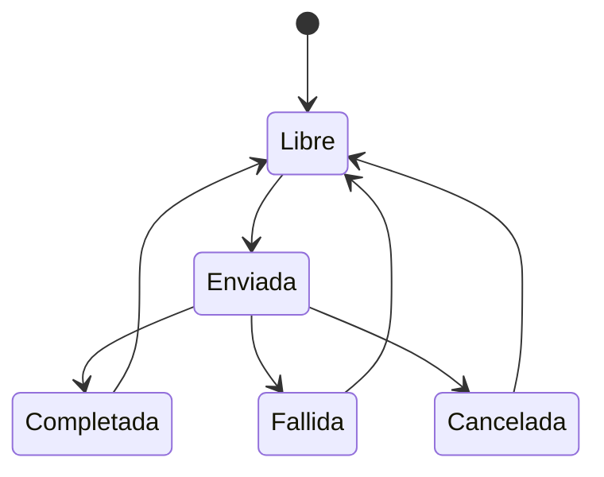

# Módulo 10 — E/S asíncrona y cobertura por rangos

Una llamada a `ReadFile` puede terminar durante la llamada o quedar pendiente. En ambos casos, un programa que usa E/S asíncrona debe saber **a qué solicitud corresponde el resultado, qué búfer sigue ocupado y cuándo puede reutilizarlo**. Poner varias operaciones en vuelo no asegura que concluyan en el orden en que se enviaron, que el dispositivo permanezca ocupado todo el tiempo ni que el rendimiento mejore frente a una lectura sencilla.

Este módulo tiene dos partes conectadas. La primera estudia `OVERLAPPED` e I/O Completion Ports (IOCP) sobre archivos temporales **solo de lectura**. La segunda representa intervalos de bytes en un archivo y mide su cobertura, sin aplicar una transformación criptográfica. El [Módulo 05](Ransomware-Modulo5) introdujo E/S y primitivas de concurrencia, el [06](Ransomware-Modulo6) explicó las colas y los resultados del pipeline, y el [09](Ransomware-Modulo9) fijó los requisitos para describir rangos dentro de un formato. Aquí se comprueba cómo se comportan esas decisiones cuando las operaciones completan o fallan.

## 10.1 Sincronía, concurrencia y finalización

Una lectura sincrónica bloquea al hilo que espera su resultado. Eso no implica que **toda la CPU** permanezca ociosa: el sistema puede ejecutar otros hilos. Con `FILE_FLAG_OVERLAPPED`, un identificador de archivo permite presentar solicitudes con un `OVERLAPPED` y un desplazamiento por operación. Una solicitud puede completar inmediatamente o informar `ERROR_IO_PENDING`; el programa necesita un mecanismo para reconocer su resultado terminal.

| Mecanismo | Qué aporta | Qué contrato adicional exige |
| --- | --- | --- |
| Lectura sincrónica | Resultado en el flujo normal del hilo | Comprobar error y bytes leídos. |
| `OVERLAPPED` con espera explícita | Operaciones que pueden seguir pendientes | Mantener búfer, identificador y estructura vivos hasta el fin real. |
| IOCP | Cola de finalizaciones asociada a identificadores | Relacionar paquete, solicitud, bytes y error; administrar recursos y cierre. |
| `CreateThreadpoolIo` | Gestiona callbacks sobre E/S del thread pool de Windows | Exige seguir comprobando resultado y tiempo de vida del contexto. |
| Varios lectores o hilos | Más trabajo potencial en curso | Controlar la cantidad pendiente y medir contención. |

IOCP desacopla la solicitud de la recepción de su resultado; **no** es sinónimo de `FILE_FLAG_NO_BUFFERING`. Tampoco obliga a crear ocho hilos o a cifrar un bloque cada vez. La documentación actual de Microsoft propone `CreateThreadpoolIo` como opción más simple para aplicaciones nuevas sin necesidad de controlar el puerto directamente; el ejemplo aquí usa IOCP para mostrar sus estados. El observador de una muestra debe diferenciar capacidad presente en el binario, solicitudes enviadas, finalizaciones observadas y efectos corroborados. [Microsoft: I/O Completion Ports](https://learn.microsoft.com/en-us/windows/win32/fileio/i-o-completion-ports).

## 10.2 Propiedad de cada operación

Una operación en vuelo posee su `OVERLAPPED`, su búfer, su desplazamiento, su longitud solicitada y un estado. No puede reutilizarse la misma estructura para otra solicitud antes de que la primera tenga resultado terminal. Un `chunkIndex` puede servir de etiqueta, pero los bytes y el desplazamiento de una finalización son la fuente que debe verificarse.



Un búfer vuelve a `Libre` **después** de que se consuma su finalización. Si la primera operación es una lectura y se inicia luego una escritura con esos bytes, hay dos vidas de E/S sucesivas para el búfer: el resultado de lectura no es el resultado de escritura. No se contabiliza como trabajo completo al lanzar la segunda solicitud.

La llamada `GetQueuedCompletionStatus` puede devolver `FALSE` con `lpOverlapped == NULL`, cuando no obtuvo paquete, o devolver `FALSE` con `lpOverlapped != NULL`, cuando extrajo una operación fallida. En el segundo caso sigue habiendo una solicitud concreta que debe recibir estado terminal. Cortar el bucle ante cualquier `FALSE` perdería su identidad. [Microsoft: `GetQueuedCompletionStatus`](https://learn.microsoft.com/en-us/windows/win32/api/ioapiset/nf-ioapiset-getqueuedcompletionstatus).

### Invariantes útiles

Al acabar normalmente un conjunto cerrado de solicitudes:

```text
solicitudes aceptadas = completadas + fallidas + canceladas
bytes verificados ≤ bytes solicitados
```

Durante la ejecución hay pendientes, por lo que la primera igualdad no se aplica a un estado intermedio. Una operación que falló antes de ser aceptada se contabiliza por separado como **fallo de envío**. Para afirmar cobertura completa, cada rango esperado debe tener un resultado validado sin huecos ni solapamientos inesperados. El total de bytes por sí solo puede ocultar una región duplicada y otra omitida.

## 10.3 Un bucle IOCP que se vacía antes de tiempo

Considérese una implementación que envía cuatro lecturas iniciales y, cuando cada una completa, inicia una escritura con su mismo búfer. Intenta enviar la próxima lectura solo si encuentra **otro búfer libre en ese instante**. Los cuatro búferes suelen estar ocupados mientras se lanzan las escrituras. Cuando después termina una escritura, el código libera su búfer y reduce el contador de pendientes, pero **no vuelve a enviar la siguiente lectura**. Puede terminar tras cuatro bloques e informar éxito aunque el archivo sea mayor.

La solución conceptual es sencilla: el estado terminal de una operación libera un espacio; si queda trabajo pendiente y la política permite continuar, **ese momento** permite reponer la solicitud. El lector comprobará esta propiedad en la práctica. El criterio de fin necesita simultáneamente que no queden rangos por enviar y que no haya solicitudes en vuelo; `pending == 0` por sí solo no basta si aún quedan rangos sin presentar.

Otro fallo es usar un cifrador de flujo con estado global según el **orden de las finalizaciones**. Ese orden puede diferir de los offsets de archivo. Cualquier transformación por bloques dependería de un contrato que asocie estado criptográfico con el desplazamiento correcto y de la verificación posterior; este laboratorio no implementa tal transformación. Los ejemplos de rendimiento que ignoran esta relación pueden ser rápidos y producir datos incorrectos.

## 10.4 Caché, alineación y últimos bloques

`FILE_FLAG_NO_BUFFERING` desactiva el almacenamiento en caché del sistema para las operaciones indicadas y exige restricciones adicionales. Según Microsoft, las longitudes y offsets de acceso deben cumplir múltiplos del tamaño de sector del volumen; las direcciones de los búferes deben atender también a la alineación física recomendada. Los sectores lógicos y físicos pueden diferir. `VirtualAlloc` proporciona alineación de página que sirve en muchos casos comunes, **sin reemplazar una comprobación del dispositivo y de cada operación**. [Microsoft: File buffering](https://learn.microsoft.com/en-us/windows/win32/fileio/file-buffering).

Un archivo cuyo tamaño no sea múltiplo del sector tiene un último bloque especialmente importante: solicitar o escribir su longitud exacta por una ruta que exige múltiplos puede fallar. Debe fijarse una política para manejarlo sin leer ni sobrescribir bytes ajenos. Por eso la práctica principal usa **E/S con caché** y verifica primero los conceptos de finalización; una comparación con `NO_BUFFERING` sería un experimento separado, condicionado al sector y al sistema de archivos observado.

Las lecturas con `FILE_FLAG_SEQUENTIAL_SCAN` comunican al sistema un patrón previsto; no prometen un porcentaje universal de mejora. Un mapeo con `MapViewOfFile` tampoco convierte automáticamente el archivo entero en una vista barata o apta para cualquier tamaño: reserva espacio de direcciones y requiere gestionar errores y el tiempo de vida de las vistas. [Microsoft: `CreateFileW`](https://learn.microsoft.com/en-us/windows/win32/api/fileapi/nf-fileapi-createfilew); [`MapViewOfFile`](https://learn.microsoft.com/en-us/windows/win32/api/memoryapi/nf-memoryapi-mapviewoffile).

## 10.5 Cancelación, fallos y cierre

`CancelIoEx` solicita cancelar operaciones pendientes; **no espera a que terminen**. Las finalizaciones pueden llegar después y el resultado debe clasificarse por solicitud. Liberar búferes o cerrar una estructura de contexto inmediatamente tras pedir la cancelación puede dejar operaciones activas apuntando a recursos que ya no existen. [Microsoft: `CancelIoEx`](https://learn.microsoft.com/en-us/windows/win32/api/ioapiset/nf-ioapiset-cancelioex).

| Situación | Estado que se registra | Decisión comprobable |
| --- | --- | --- |
| Error al abrir | Ninguna solicitud de lectura aceptada | No crear contadores ficticios de completadas. |
| Fallo al enviar una solicitud | Fallo de envío | Detener nuevas solicitudes o aplicar política documentada. |
| Finalización con error | Solicitud identificada y fallida | Consumir paquete, conservar código y liberar recursos al finalizar. |
| Lectura corta inesperada | Bytes reales y rango esperado | No marcar cobertura completa. |
| Cancelación pedida | Aún puede quedar E/S en vuelo | Drenar resultados hasta conocer estados terminales. |
| Compartición incompatible | Apertura rechazada | Un reintento acotado puede probarse; el error no garantiza que desaparezca. |
| Acceso denegado | Apertura rechazada | Registrar contexto y límites; no afirmar que será permanente en todo entorno. |

Los errores ordinarios y una caída abrupta del proceso dejan evidencias distintas. Si falta un registro tras la caída, no se puede concluir que la operación nunca se presentó o nunca tocó el disco. El Módulo 06 trató esta incertidumbre de las tareas; aquí se añade el estado de la E/S que estaba en vuelo.

## 10.6 Intervalos de bytes y cobertura

Una representación clara de rangos utiliza intervalos semiabiertos `[inicio, fin)` dentro de `[0, tamaño)`. Dos rangos adyacentes, `[0, 10)` y `[10, 20)`, no se solapan; `[0, 10)` y `[5, 15)` sí. Para analizar un plan parcial se calculan, como mínimo: bytes cubiertos únicos, huecos, solapamientos, cantidad de rangos, primer y último offset, y qué parte puede verificarse con los metadatos conservados.

| Patrón descrito | Dato que falta si solo se guarda un bit «parcial» |
| --- | --- |
| Prefijo | Longitud exacta y tratamiento del último bloque. |
| Prefijo y sufijo | Dos intervalos, interacción si el archivo es pequeño. |
| Bloques espaciados | Origen, longitud, separación, recorte y versión de la regla. |
| Intervalos enumerados | Lista acotada, orden de bytes, límites y autenticación. |

La cobertura en bytes **no** equivale a inutilidad o recuperabilidad de un formato. ZIP, PDF, imágenes y bases de datos distribuyen datos y estructuras de formas distintas. Un programa puede rechazar un archivo aunque gran parte de su contenido siga accesible mediante otras herramientas; una muestra puede alterar pocos bytes y provocar un gran efecto aparente. La explicación debe distinguir capacidad del lector habitual, extracción parcial y restauración verificada, sin asignar una regla universal a «los primeros 256 KB».

Para archivos de más de 4 GB, todos los offsets y cálculos de longitudes necesitan tipos apropiados y comprobaciones de conversión. Convertir un offset de 64 bits a `DWORD` para decidir el final de un rango puede truncarlo. También hay que evitar `periodo = 0`, incrementos nulos y desbordamientos al sumar longitud más separación.

## 10.7 Laboratorio A: finalizaciones y rangos con bytes conocidos

Guarda el bloque como `lab_modulo10.py` y ejecútalo con `py -3 lab_modulo10.py` en Windows 11. Usa Python 3 estándar, crea un archivo en un directorio temporal y solo **lo lee** en paralelo mediante hilos. Los resultados se reúnen según offsets, no por orden de llegada, y se comparan con un SHA-256 conocido. Es un modelo de comprobación de estados y cobertura; **los hilos de Python no son IOCP**. La práctica B usa realmente el puerto de finalización de Windows.

```python
"""Read-only completion-order and range-coverage lab."""
import hashlib
import os
import tempfile
from concurrent.futures import ThreadPoolExecutor, FIRST_COMPLETED, wait
from pathlib import Path

BLOCK = 64 * 1024
SLOTS = 4
DATA = bytes(range(256)) * 1043 + b"tail"

def read_range(path, offset, length):
    with path.open("rb") as handle:
        handle.seek(offset)
        data = handle.read(length)
    if len(data) != length:
        raise OSError("SHORT_READ")
    return offset, data

def spans(size):
    return [(offset, min(BLOCK, size - offset))
            for offset in range(0, size, BLOCK)]

def coverage(size, ranges):
    ordered = sorted(ranges)
    cursor = 0
    complete = True
    for offset, length in ordered:
        if length <= 0 or offset < cursor or offset > size or length > size - offset:
            raise ValueError("OVERLAP_OR_BOUNDS")
        if offset != cursor:
            complete = False
        cursor = offset + length
    return sum(length for _, length in ordered), complete and cursor == size

def partial_plan(size, block, gap):
    if block <= 0 or gap < 0:
        raise ValueError("INVALID_PLAN")
    result = []
    offset = 0
    while offset < size:
        result.append((offset, min(block, size - offset)))
        offset += block + gap
    return result

with tempfile.TemporaryDirectory(prefix="module10_") as directory:
    path = Path(directory) / "known.bin"
    path.write_bytes(DATA)
    requested = spans(len(DATA))
    pending = {}
    results = {}
    next_index = 0
    with ThreadPoolExecutor(max_workers=SLOTS) as pool:
        while next_index < len(requested) or pending:
            while next_index < len(requested) and len(pending) < SLOTS:
                offset, length = requested[next_index]
                future = pool.submit(read_range, path, offset, length)
                pending[future] = offset
                next_index += 1
            done, _ = wait(pending, return_when=FIRST_COMPLETED)
            for future in done:
                expected_offset = pending.pop(future)
                offset, block = future.result()
                assert offset == expected_offset
                results[offset] = block
    reconstructed = b"".join(results[offset] for offset, _ in requested)
    print("ALL_TERMINAL", len(results) == len(requested))
    print("HASH_MATCH", hashlib.sha256(reconstructed).digest()
          == hashlib.sha256(DATA).digest())
    print("COVERAGE", coverage(len(DATA), requested))
    print("GAP", coverage(len(DATA), [(0, 10), (20, len(DATA) - 20)]))
    partial = partial_plan(len(DATA), BLOCK, BLOCK)
    print("PARTIAL", coverage(len(DATA), partial))
    virtual_size = 5 * 1024**3
    print("LARGE_DESCRIPTOR", coverage(
        virtual_size, [(0, BLOCK), (virtual_size - BLOCK, BLOCK)]))
    try:
        coverage(len(DATA), [(0, 10), (5, 10)])
    except ValueError as exc:
        print("OVERLAP", exc)
    os.unlink(path)
```

El programa informa `ALL_TERMINAL True`, `HASH_MATCH True` y cobertura completa. El caso `GAP` muestra que un último offset correcto no prueba que no haya huecos. El solapamiento se rechaza. Cambia `SLOTS` entre 1 y 4 y registra tiempo con `time.perf_counter()` si quieres medir este conjunto; el resultado depende de dispositivo, caché y tamaño y no constituye un benchmark universal de IOCP.

## 10.8 Laboratorio B: lector IOCP de solo lectura

El siguiente ejemplo C++17 usa `FILE_FLAG_OVERLAPPED` y `CreateIoCompletionPort` para **leer un archivo temporal de prueba proporcionado por el usuario**. No solicita acceso de escritura, no transforma datos y no usa `FILE_FLAG_NO_BUFFERING`. Reutiliza cada slot solo tras recibir su finalización y repone lecturas hasta llegar al tamaño conocido. No se debe ejecutarlo sobre datos ajenos: la práctica está pensada para una copia descartable en una máquina Windows 11.

Con las herramientas de C++ de Visual Studio y Windows SDK instaladas, abre un *Developer Command Prompt* y compila:

```bat
cl /std:c++17 /EHsc /W4 module10_iocp.cpp
```

Crea un archivo descartable con `py -3 -c "from pathlib import Path; p=Path('known-m10.bin'); p.write_bytes(bytes(range(256))*1043+b'tail'); print(p.resolve())"` dentro de una carpeta de pruebas. Ejecuta `module10_iocp.exe known-m10.bin`, compara `BYTES` con `EXPECTED` y borra después ese archivo de prueba. El ejemplo se apoya en contratos documentados de Win32; su compilación y comportamiento en la edición concreta de Windows 11 del lector deben comprobarse allí, porque el entorno de esta publicación no ejecuta binarios Windows.

```cpp
// Windows 11 read-only IOCP demonstration. Run only on a disposable test file.
#define UNICODE
#define _UNICODE
#include <windows.h>
#include <algorithm>
#include <array>
#include <cstdint>
#include <iostream>
#include <vector>

constexpr DWORD BLOCK = 64 * 1024;
constexpr size_t SLOTS = 4;
struct Slot {
    OVERLAPPED ov{};
    std::vector<unsigned char> bytes = std::vector<unsigned char>(BLOCK);
    uint64_t offset = 0;
    DWORD requested = 0;
    bool in_flight = false;
};

int wmain(int argc, wchar_t** argv) {
    if (argc != 2) {
        std::wcerr << L"Usage: iocp_read.exe <disposable-test-file>\n";
        return 2;
    }
    HANDLE file = CreateFileW(argv[1], GENERIC_READ, FILE_SHARE_READ, nullptr,
                              OPEN_EXISTING, FILE_FLAG_OVERLAPPED, nullptr);
    if (file == INVALID_HANDLE_VALUE) {
        std::cerr << "OPEN_FAILED " << GetLastError() << "\n";
        return 2;
    }
    LARGE_INTEGER length{};
    if (!GetFileSizeEx(file, &length) || length.QuadPart < 0) {
        std::cerr << "SIZE_FAILED " << GetLastError() << "\n";
        CloseHandle(file);
        return 2;
    }
    HANDLE port = CreateIoCompletionPort(file, nullptr, 1, 0);
    if (!port) {
        std::cerr << "PORT_FAILED " << GetLastError() << "\n";
        CloseHandle(file);
        return 2;
    }

    std::array<Slot, SLOTS> slots;
    const uint64_t size = static_cast<uint64_t>(length.QuadPart);
    uint64_t next = 0, completed_bytes = 0;
    unsigned pending = 0, completed_ops = 0;
    bool failed = false;

    auto submit = [&](Slot& slot) {
        if (next >= size) return;
        slot.ov = OVERLAPPED{};
        slot.offset = next;
        slot.requested = static_cast<DWORD>(
            std::min<uint64_t>(BLOCK, size - next));
        slot.ov.Offset = static_cast<DWORD>(next);
        slot.ov.OffsetHigh = static_cast<DWORD>(next >> 32);
        BOOL immediate = ReadFile(file, slot.bytes.data(),
                                  slot.requested, nullptr, &slot.ov);
        if (!immediate && GetLastError() != ERROR_IO_PENDING) {
            std::cerr << "SUBMIT_FAILED " << GetLastError() << "\n";
            failed = true;
            return;
        }
        next += slot.requested;
        slot.in_flight = true;
        ++pending;  // Also expect a packet after immediate success with default IOCP settings.
    };

    for (auto& slot : slots) {
        if (!failed) submit(slot);
    }
    if (failed && pending) CancelIoEx(file, nullptr);
    while (pending) {
        DWORD transferred = 0;
        ULONG_PTR key = 0;
        OVERLAPPED* result = nullptr;
        BOOL ok = GetQueuedCompletionStatus(port, &transferred, &key,
                                            &result, INFINITE);
        if (!result) {
            std::cerr << "PORT_WAIT_FAILED " << GetLastError() << "\n";
            failed = true;
            CancelIoEx(file, nullptr);
            for (auto& item : slots) {
                if (!item.in_flight) continue;
                DWORD finished = 0;
                GetOverlappedResult(file, &item.ov, &finished, TRUE);
                item.in_flight = false;  // Retain all buffers until terminal state.
            }
            break;
        }
        --pending;
        Slot* slot = nullptr;
        for (auto& item : slots) {
            if (&item.ov == result) { slot = &item; break; }
        }
        if (slot) slot->in_flight = false;
        if (!slot || key != 1 || !ok || transferred != slot->requested) {
            std::cerr << "COMPLETION_FAILED " << GetLastError() << "\n";
            failed = true;
            CancelIoEx(file, nullptr);
            continue;  // Drain remaining completion packets before closing handles.
        }
        completed_bytes += transferred;
        ++completed_ops;
        if (!failed) submit(*slot);  // Refill only after this slot completed.
        if (failed && pending) CancelIoEx(file, nullptr);
    }
    CloseHandle(port);
    CloseHandle(file);
    std::cout << "COMPLETED_OPS " << completed_ops
              << " BYTES " << completed_bytes
              << " EXPECTED " << size
              << " STATUS " << (!failed && completed_bytes == size ? "OK" : "FAIL")
              << "\n";
    return !failed && completed_bytes == size ? 0 : 1;
}
```

El estado `OK` confirma que las solicitudes aceptadas y completadas sumaron el tamaño observado para **ese archivo**, bajo esa ejecución. No es una prueba de integridad criptográfica de los bytes: para eso, calcular el resumen del archivo antes y después y corroborar que el programa nunca abrió acceso de escritura. Modifica únicamente el archivo temporal: prueba tamaño cero, un byte, `64 KiB - 1`, `64 KiB`, `64 KiB + 1` y más de cuatro bloques. El último caso verifica específicamente que el lector no termina tras sus cuatro solicitudes iniciales.

En una ampliación de cancelación, se dejarían solicitudes en vuelo, se pediría `CancelIoEx` y se contabilizarían sus estados finales antes de cerrar el puerto o los búferes. Esa ampliación requiere medir el momento de la cancelación: que una solicitud termine con éxito mientras se pide cancelar **no** constituye un fallo del sistema.

## 10.9 Medición y análisis de trazas

Una comparación entre lectura sincrónica, lectores concurrentes, `OVERLAPPED` con espera e IOCP requiere el **mismo conjunto de archivos**, el mismo resultado validado y condiciones registradas. Para Windows 11, anota versión del sistema, arquitectura, sistema de archivos local o SMB, unidad, tamaño lógico/físico del sector, caché fría o caliente cuando sea controlable, tamaño de bloque, ranuras pendientes, repeticiones y errores.

| Métrica | Significado | Límite |
| --- | --- | --- |
| Bytes solicitados | Volumen de peticiones | No demuestra que se leyeran. |
| Bytes completados y verificados | Resultados con estado terminal válido | Puede incluir rangos duplicados si no se comparan offsets. |
| Cobertura única | Unión de rangos sin contar duplicados | No mide capacidad de abrir un formato. |
| Latencia por operación, mediana y p95 | Distribución observada | Varía con caché, dispositivo y carga. |
| Tiempo total | Duración de ese ensayo | No establece rendimiento de cualquier otra máquina. |
| Máximo de solicitudes en vuelo | Presión ejercida sobre la cola | No equivale a paralelismo físico del dispositivo. |
| Fallos por tipo | Límites observados | La ausencia de error depende del conjunto de prueba. |

Si un escenario procesa solo la mitad de los bytes, mostrar **bytes examinados/s, bytes leídos/s y cobertura** por separado. Una cifra basada en 5 GB de datos tratados no se compara sin aclaración con otra basada en un archivo de 10 GB. `NO_BUFFERING` tampoco hace que los tiempos de finalización sean deterministas. Windows puede completar una solicitud inmediatamente, el dispositivo puede tener otras cargas y la memoria caché del hardware queda fuera de una regla universal.

Una traza con `ReadFile`, paquetes IOCP y varios offsets permite estudiar el orden observado. Para atribuir una transformación de datos harían falta además sus efectos y su verificación. La presencia de IOCP en un proceso no identifica por sí sola malware ni una familia.

## 10.10 Secuencia de pruebas y diagnósticos de fallo

El laboratorio A permite introducir fallos controlados en **metadatos de prueba** sin cambiar un archivo ajeno. Primero ejecuta el ejemplo intacto y conserva su salida. Después modifica un solo factor por ejecución; registrar simultáneamente todos los fallos dificulta saber cuál produjo cada resultado.

| Prueba | Cambio aislado | Resultado esperado | Qué demuestra y qué no |
| --- | --- | --- | --- |
| Orden de finalización | Invierte la lista de resultados pero conserva offsets | `ALL_TERMINAL True`, mismo hash y cobertura | El orden de eventos no cambia la identidad de un rango. |
| Omisión | Elimina una finalización interior | `ALL_TERMINAL False` o cobertura incompleta | No prueba que el sistema operativo perdiera una operación: el simulador la eliminó. |
| Duplicado | Añade otra finalización del mismo intervalo | Detección de solapamiento o recuento duplicado | Una suma de bytes sola puede sobrestimar el avance. |
| Último bloque | Cambia el tamaño lógico a uno no múltiplo del bloque | Un intervalo final más corto, sin acceso fuera de rango | El tamaño solicitado y el transferido deben distinguirse. |
| Cancelación | Marca un resultado como cancelado y luego drena los restantes | Estado terminal para cada solicitud aceptada | Pedir cancelación no equivale a recibirla. |

El laboratorio B agrega una observación de API real de Windows 11 en un archivo desechable. Crea casos de tamaño 0, 1, `65535`, `65536`, `65537` y al menos cinco bloques. El caso vacío comprueba la condición de salida sin peticiones; los tres tamaños vecinos localizan errores de borde; el caso de cinco bloques detecta un bucle que deja de reponer ranuras tras las cuatro primeras. Anota código de salida, operaciones completadas, bytes esperados y hash del archivo antes y después. Un hash coincidente de un archivo inmutable y apertura con `GENERIC_READ` apoya la observación de que el lector no lo alteró; no prueba que un dispositivo o controlador nunca haya fallado.

En un error asíncrono, `GetQueuedCompletionStatus` puede devolver `FALSE` junto con un `OVERLAPPED` válido. Esa solicitud llegó a un estado terminal de **fallo**: registra `GetLastError`, offset y longitud; reduce el contador de pendientes y decide si cancelar las restantes. En cambio, `FALSE` con `OVERLAPPED` nulo puede indicar timeout o error de espera sin identificar una petición concreta. No liberes un búfer hasta conocer su resultado terminal. Cuando se solicita `CancelIoEx`, algunas solicitudes aún pueden completarse con éxito y otras con `ERROR_OPERATION_ABORTED`; ambas deben contarse. Si el entorno muestra un error que el ejemplo no recupera, conserva la salida y no lo reinterpretes como corrupción de contenido.

## 10.11 Rangos seleccionados y escala lógica

Representa cada rango como intervalo semiabierto `[inicio, fin)`. Para un archivo de tamaño `S`, exige `0 <= inicio <= fin <= S`; ordena y comprueba solapamientos antes de ejecutar E/S. Define si los rangos contiguos se fusionan y si un rango vacío está permitido. El plan es completo cuando la unión de rangos es `[0, S)`; el número de finalizaciones y la suma de longitudes no bastan. Para un plan parcial, calcula tres cantidades separadas: `S` (tamaño lógico), suma de bytes **seleccionados únicos** y bytes **efectivamente completados**. Si faltó una finalización, las dos últimas cifras divergen.

La extensión virtual de más de 4 GiB en el laboratorio A prueba aritmética de offsets y validación de un descriptor **sin reservar 4 GiB ni leer un archivo grande**. No prueba rendimiento, compatibilidad con un sistema FAT32, límites de `SetFilePointerEx`, ni capacidad de recuperación de datos. En un ensayo real se comprueban tamaño y límites del sistema de archivos, acceso efectivo y posibles cambios del archivo mientras se lee. Si el archivo crece o se trunca entre consulta de tamaño y lectura, se registran ambas observaciones y se rechaza la afirmación de cobertura completa bajo un tamaño único.

Los planes parciales deben conservar su semántica entre módulos: el Módulo 09 guarda intervalos exactos y el Módulo 10 comprueba que coincidan con las operaciones terminales. «Primero y último 1 %» requiere especificar redondeo, unidad, qué hacer con archivos pequeños y si dos intervalos se solapan. Un porcentaje puede describir bytes tocados y aun así ocultar que se destruyó un índice al final de un formato. La tabla de resultados debe separar cobertura de bytes de posibilidad de abrir o reconstruir el archivo.

## 10.12 Protocolo de medición reproducible

Un ensayo repetible fija archivo de entrada y hash, tamaño de bloque, número máximo de solicitudes, sistema de archivos y ruta, política de caché, versión de Windows 11, dispositivo y carga concurrente conocida. Alterna el orden de las variantes para que la primera no cargue siempre la caché. Registra repeticiones y distribuciones en lugar de elegir solo la mejor. «Caché fría» exige un método comprobable; reiniciar, vaciar una caché concreta y leer otro archivo no son intervenciones equivalentes.

| Campo de registro por ejecución | Ejemplo de unidad | Motivo |
| --- | --- | --- |
| Tiempo total y latencias | ms; mediana/p95 | Distingue retraso de la operación y duración del lote. |
| Cantidad de peticiones y máximo pendiente | enteros | Permite explicar saturación o falta de trabajo en cola. |
| Bytes solicitados, transferidos y únicos | bytes | Detecta lecturas cortas y duplicados. |
| Cobertura contra plan y contra archivo | porcentajes con denominador escrito | Evita comparar 50 % del archivo con 100 % del plan. |
| Errores y cancelaciones | códigos y offsets | Identifica límites sin esconder trabajo incompleto. |
| CPU y carga ajena visible | tiempo y descripción | Ayuda a interpretar variación, sin atribuir causalidad automática. |

Una comparación útil termina con una comprobación de equivalencia: ambas variantes deben leer los mismos intervalos, obtener el mismo resumen de bytes en el mismo orden lógico y llegar a estados terminales comparables. Después se puede discutir tiempo, consumo y huella de E/S. Si una variante omite un bloque, su menor duración no es una ventaja de rendimiento. Ningún número de este módulo pretende ser un benchmark universal de IOCP.

## Xtra:

1. ¿Qué evidencia permitiría a un operador saber que su lector cubrió todos los rangos esperados y no solo los cuatro primeros bloques?
2. ¿Qué consecuencia tendría asociar un estado criptográfico con el orden de finalización en vez de hacerlo con el offset de cada bloque?
3. Si `GetQueuedCompletionStatus` devuelve `FALSE` con `OVERLAPPED` no nulo, ¿qué información se perdería al abandonar el bucle de inmediato?
4. ¿Cuándo puede reutilizarse un búfer que participó sucesivamente en una lectura y una escritura?
5. ¿Qué datos necesitaría un descriptor parcial para que otro proceso reprodujera exactamente la selección de rangos?
6. ¿Por qué informar solo «50 % procesado» no describe el efecto sobre formatos con índices o referencias en posiciones distintas?
7. ¿Qué diferencia habría entre medir bytes del archivo original y medir únicamente bytes pertenecientes a rangos seleccionados?
8. ¿Qué condiciones del equipo tendrían que figurar en un informe antes de atribuir una ventaja de rendimiento a IOCP?
9. ¿Qué estados seguirían abiertos después de solicitar la cancelación y antes de recibir las finalizaciones?
10. ¿Qué indicaría que un último bloque corto fue rechazado por una política de alineación y no por corrupción de contenido?

## Resumen del módulo 10

La corrección de E/S asíncrona depende de identificar cada solicitud, conservar sus recursos hasta el resultado terminal y verificar cobertura por offsets. IOCP comunica finalizaciones, incluidas las fallidas; la cancelación necesita drenar estados. La E/S sin caché introduce restricciones adicionales y no garantiza velocidad. Un plan de rangos debe describirse de manera exacta y medirse con denominadores claros. Los laboratorios separan lectura, finalización y cobertura de cualquier transformación del contenido.

## Referencias técnicas

- [Microsoft: I/O Completion Ports](https://learn.microsoft.com/en-us/windows/win32/fileio/i-o-completion-ports).
- [Microsoft: `GetQueuedCompletionStatus`](https://learn.microsoft.com/en-us/windows/win32/api/ioapiset/nf-ioapiset-getqueuedcompletionstatus).
- [Microsoft: `CancelIoEx`](https://learn.microsoft.com/en-us/windows/win32/api/ioapiset/nf-ioapiset-cancelioex).
- [Microsoft: File buffering](https://learn.microsoft.com/en-us/windows/win32/fileio/file-buffering).
- [Microsoft: `CreateFileW`](https://learn.microsoft.com/en-us/windows/win32/api/fileapi/nf-fileapi-createfilew).
- [Microsoft: `MapViewOfFile`](https://learn.microsoft.com/en-us/windows/win32/api/memoryapi/nf-memoryapi-mapviewoffile).

© 2026 Aldair Maihuiri. Todos los derechos reservados. Se permite compartir con atribución al autor. La reproducción sin autorización previa está prohibida.
