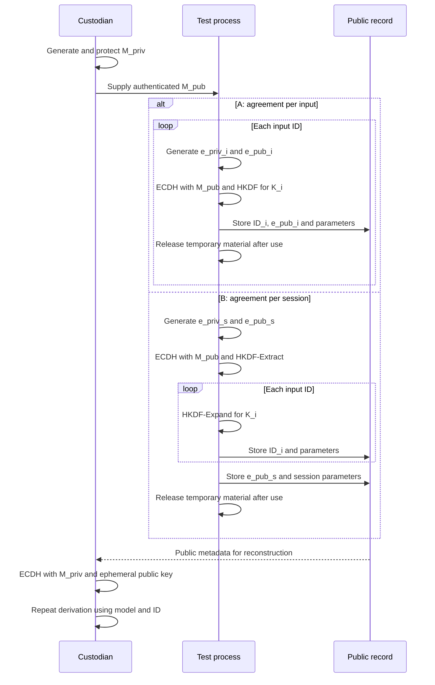

# Module 03 — Key Generation Algorithms

In [Module 02](Ransomware-Modulo2-en), we examined encryption and key agreement algorithms. Here we follow cryptographic material through its life cycle: where it comes from, what each value does, how it is derived, and what information must be retained to make an experiment reproducible. The next module covers file enumeration; for now, we use only laboratory inputs selected in advance.

An architecture can use sound algorithms and still fail because it generates predictable secrets, confuses a public key with a private key, reuses a nonce, or loses a derivation parameter. Key generation is therefore best studied as a complete protocol rather than an isolated call to a random number generator.

### The question that frames this module

Imagine an authorized exercise with three test inputs. For two participants to reproduce the same result, they must agree on a **cryptographic identity**, an algorithm, a source of randomness, a key-derivation method, and the public parameters to preserve. They must also decide who holds the long-lived secret and how to demonstrate that the exercise can be reversed. The number of files resolves none of these decisions; it tells us how many times part of the protocol is repeated.

This chapter has four layers. **Generation:** the CSPRNG and curve library create material that must not be predictable. **Agreement:** two key pairs produce a shared secret through ECDH. **Derivation:** HKDF turns that material into keys for specific uses. **Custody and reconstruction:** public parameters are preserved and the master private key is protected so that the result can be verified later. The output of one layer does not automatically replace the next: an ECDH secret is not an encrypted file, an ephemeral public key is not a secret, and a unique identifier is not a key.

The module compares two teaching models, **A, agreement per input**, and **B, agreement per session with per-input derivations**. They are models for reasoning about isolation, dependency, and cost; they are not automatically attributable to any real family. The exercise uses synthetic inputs and does not process other people's data. By the end, you should be able to explain what each side retains, what is lost when a parameter disappears, the exposure scope of a secret, and the evidence needed to describe a real sample's scheme.

## 3.1 Vocabulary and scope

| Term | Meaning | Secret? | Relevant property |
| --- | --- | --- | --- |
| Entropy | Uncertainty in the source feeding a generator | Depends on the source | Cannot be inferred from the number of output bytes |
| CSPRNG | Generator suitable for cryptographic purposes | Its internal state is secret | Unpredictable output and correct state management |
| ECDH private key | Scalar used in a key agreement | Yes | Protection and limited lifetime |
| ECDH public key | Point associated with the private key | No | Correct format and validation on import |
| Shared secret | Result of the ECDH agreement | Yes | Input to a KDF, not automatically a key for every purpose |
| PRK / OKM | Intermediate material / HKDF output | Yes | Length, context, and separation of uses |
| Working key | Key intended for a specific operation | Yes | Must not be reused for another purpose |
| Salt | KDF input | Usually no | Must be reproduced if it was used in derivation |
| Nonce | Number used once within a particular scheme | Usually no | Must satisfy the uniqueness rule for the scheme and key |
| IV | Initialization value for a mode | Usually no | Requirements depend on the mode |
| Session or file ID | Label distinguishing instances | No | Stable identity and unambiguous encoding |

The nominal length of a key does not measure the entropy of its source. Thirty-two bytes obtained from a predictable timestamp are not equivalent to a 256-bit key produced by a CSPRNG. A key, salt, and nonce are not interchangeable merely because all three are represented as bytes.

In the sections below, **master key pair** means the persistent pair in the model, **ephemeral pair** means a pair created for a particular agreement, and **working key** means output assigned to an operation on data. These are roles, not mandatory variable names or a single implementation recipe.

## 3.2 From entropy to keying material

`rand()`, `srand(time(NULL))`, a PID, the system time, and timing counters are not adequate sources of keys on their own. A system CSPRNG is intended to produce bytes that cannot practically be predicted from observed output. On Windows, the relevant interface is `BCryptGenRandom` with `BCRYPT_USE_SYSTEM_PREFERRED_RNG`; elsewhere, a maintained library typically exposes the operating system's cryptographic generator. [1]

Four separate questions help review a generation step:

1. Who supplies the randomness, and what happens if the call fails?
2. How many bytes does the object require: a scalar, salt, nonce, or identifier?
3. Does the object have additional requirements, such as belonging to a curve's scalar range or being unique for a given key?
4. Will the value be stored, published, or reconstructed later?

A curve library should generate scalars through its own API or accept a compatible cryptographic source. Taking 32 arbitrary bytes and treating them as a P-256 private key overlooks the scalar-range requirement. CSPRNG output addresses unpredictability; it does not automatically settle format, identity, or lifetime.

**Random and unique are different requirements.** An identifier can be unique without being secret. A randomly generated nonce can collide even when each individual output appears unpredictable. A nonce policy depends on the algorithm, the number of operations, and the key under which it is used. Under RFC 8439, a 96-bit ChaCha20-Poly1305 nonce must not repeat with the same key. [2]

## 3.3 Dependency map

The design studied here starts with a master pair and compares two ways to obtain working keys. The master public key is available to the side initiating the agreement; the master private key remains under the control of the side that must reconstruct it later. Both sides need exactly the same public derivation parameters.

The order and information boundaries are easier to see in the sequence below. “Record” represents only public laboratory metadata; it is neither a required server nor a mandatory transport path. The holder of the master private key can perform reconstruction later with that metadata.



The diagram distinguishes **who generates what**, **what is transmitted**, and **what remains secret**. `M_priv`, ephemeral private keys, `Z`, `PRK`, and working keys are not written to the public record. A working key may have a short lifetime without proving that all of its copies have left memory. A specific implementation must define the ordering of metadata storage and the use of `K_i`; the diagram shows dependencies only.

| Material | Model A: per input | Model B: per session | Kept publicly? |
| --- | --- | --- | --- |
| Master private key | One for the set of exercises | Same | No |
| Master public key | Same | Same | Yes |
| Ephemeral private key | A new one per input | A new one per session | No |
| Ephemeral public key | Different for each input | Shared within that session | Yes, with its scope identified |
| ECDH secret | Different for each input | Shared within the session | No |
| Working key | Different for each input | Different according to input context | No |
| Input ID | Useful as context | Required to distinguish derivations | Yes, if reconstruction is needed |

An ephemeral public key cannot stand in for a private key in ECDH. Nor can we say that the session private key is “encrypted with the master public key” when the described flow is an ECDH agreement. One side combines *its own private key* with *the other side's public key*. The other side does the converse, and the results match. Key transport or wrapping would be a different protocol.

## 3.4 What ECDH does

Let `G` be the curve's base point. If one side holds private key `a` and publishes `A = a·G`, while the other holds `b` and publishes `B = b·G`, both can calculate the same point:

```text
side A:  a·B = a·(b·G) = (a·b)·G
side B:  b·A = b·(a·G) = (a·b)·G
```

The equality explains the agreement, not the encoding of a final key. Libraries define how the ECDH result is represented and how points are validated; the protocol must also specify the KDF and its parameters. Knowing `A` and `B` is not equivalent to knowing `a` or `b`. ECDH does not encrypt a message by itself. NIST SP 800-56A Rev. 3 documents key-establishment schemes based on elliptic curves and Diffie–Hellman. [3]

In both models, the master pair represents one side and an ephemeral pair represents the other. A basic test confirms that both sides obtain the same agreement material **before** deriving keys. If they do not, check the curve, public-key format, validation, and implementation first; a KDF cannot fix an incorrectly specified agreement.

### Who owns the master public key?

ECDH yields an agreement but **does not, on its own, authenticate whoever supplied the public key**. If someone replaces `M_pub` before an exercise, the process may derive material under that substitute. The intended master private key will not reproduce the agreement; moreover, the holder of the private key corresponding to the substitute public key could do so with the preserved public parameters. This is a problem of **binding a public key to its owner**, not a failure of ECDH mathematics. Replacement during distribution resembles an intermediary attack; when the public key is already packaged in an artifact, the artifact's integrity and provenance matter as well. [3][8]

In a laboratory, a responsible party can compare a fingerprint recorded through an independent channel, verify a signature on the configuration, or check the integrity of an authorized artifact. Including the public key in a binary removes a runtime download, **but it does not automatically authenticate that binary**. The algorithm, curve, representation, and suitability of the public key must also be checked. A signature on a public key in turn requires a verifier key whose identity is already trusted; a text label is not a root of trust.

To distinguish these failures, an exercise can retain fingerprints of two different public keys and ask whether a substitution would be detected **before** agreement, while checking parameters, or only during reconstruction. There is no need to modify a real system: compare records from two test data sets.

## 3.5 Architecture A: one ephemeral agreement per input

Module 02 introduces this model through a per-file ephemeral pair. Here we examine its key generation. For every input `i`, an independent ephemeral pair is created; its private key and the master public key produce `Z_i`. The corresponding ephemeral public key allows the holder of the master private key to reproduce that agreement.

```text
Input 01: (e_priv_01, e_pub_01) → Z_01 → HKDF → K_01
Input 02: (e_priv_02, e_pub_02) → Z_02 → HKDF → K_02
Input 03: (e_priv_03, e_pub_03) → Z_03 → HKDF → K_03
```

For N inputs, this means **N ephemeral pairs and N ECDH agreements**, as well as N derivations. A public key for each input identifies its corresponding agreement. Failure to preserve one input's public information affects the reconstruction of that input, even if the others retain their parameters.

Independence does not justify saying that exposure of any working key can never affect other data: the *material exposed* must be specified. Exposing `K_01` has a different scope from exposing the master private key. Exposing a session secret in model B has a different scope from exposing a single working key. The outcome also depends on whether keys or contexts were reused.

> **Question:** How many “keys per input” are involved? At least an ephemeral pair and a derived working key. They serve different purposes. The public key is not secret, and the ECDH secret should not be confused with the working key.

## 3.6 Architecture B: one agreement per session, separate derivations

Here a single ephemeral pair is generated for a session. Agreement with the master public key produces `Z_s`. Session material is established from `Z_s`, and a different, stable context for each input yields `K_01`, `K_02`, and so on.

```text
session ephemeral pair + master public key → Z_s
Z_s + session salt → HKDF-Extract → PRK_s
PRK_s + context(input 01) → HKDF-Expand → K_01
PRK_s + context(input 02) → HKDF-Expand → K_02
PRK_s + context(input 03) → HKDF-Expand → K_03
```

**One ECDH operation per session does not imply an identical key for every file.** Different `info` values distinguish the derivations. Conversely, the same `PRK`, `info`, and output length produce the same result: HKDF is deterministic. The salt need not be secret, but its exact value must be available for reconstruction.

| Aspect | A: ECDH per input | B: ECDH per session |
| --- | --- | --- |
| Ephemeral pairs for N inputs | N | 1 |
| ECDH agreements | N | 1 |
| Working-key derivations | N | N |
| Ephemeral public key | Changes for each input | Shared within the session |
| Context distinguishing inputs | Recommended and explicit | Essential |
| Scope of a compromised intermediate secret | Corresponding input | Corresponding session |
| Public parameters to preserve | Parameters for each input | Session and per-input parameters |

This table describes an architecture, not a performance measurement. Actual costs depend on the platform, cryptographic provider, storage, and number of inputs. A hybrid RSA scheme can reuse an existing public key: it need not generate a new RSA pair for every file. An ECDH comparison should therefore not count full RSA key-pair generation for every input. A valid benchmark must identify the operations measured and the hardware used.

### Why choose A or B in an exercise?

The decision turns on **the scope of compromise and reconstruction**. When inputs must be analyzed separately, A provides independent ECDH secrets: losing one ephemeral private key or `Z_i` affects that input, provided the master private key has not been compromised. It requires more agreements, more ephemeral pairs, and associated metadata for each input. B reduces pair generation and ECDH agreements to one per session; its working keys remain distinct if every `info` has a distinct identity, but exposure of `Z_s` or `PRK_s` may affect every input in that session. The master private key remains a shared exposure point in **both** models.

| Design question | A: per input | B: per session |
| --- | --- | --- |
| What is isolated? | Each input's agreement | Each working key, under a shared session origin |
| What if an ephemeral public key is lost? | The reconstruction parameter for one input is missing | The whole session may be affected if its only session public key is lost |
| Which temporary secret has the widest scope? | `Z_i`, for input `i` | `Z_s` or `PRK_s`, for the session |
| Which costs grow with N? | N pair generations, N ECDH operations, N derivations | N contexts and N derivations; one pair generation and ECDH operation per session |
| What must be checked? | Mapping of each input ID to its public key | Unique session identity, distinct input IDs, and reproducible contexts |

For `N = 10,000` inputs, the **theoretical** counts are `10,000` pairs and `10,000` agreements for A, versus `1` pair and `1` agreement per session for B; both require `10,000` working-key derivations. With multiple sessions, multiply B's fixed cost by the number of sessions. Metadata volume cannot be calculated from public keys alone: IDs, versions, salts, format fields, and any duplication imposed by the design also count. These are operation counts, not measured times or a universal ranking.

### Documented families and the limits of analogy

A report can document a “symmetric key per file” without establishing “ECDH per file.” It can also mention Curve25519 without specifying the scope of each agreement. The chapter's models should only be attributed to a sample when analysis shows **which pair is generated, which material is reused, and where the parameters needed to recover each key are kept**.

| Family and specific source | What the source documents | What the source does not establish |
| --- | --- | --- |
| **LockBit-NG-Dev**, sample analyzed by Trend Micro | AES with a random key per file, protected using the RSA public key included in the configuration. [9] | This is neither A nor B: the described scheme wraps keys with RSA rather than performing those ECDH agreements. Do not extend the finding to every LockBit version. |
| **BlackCat/ALPHV**, Microsoft description | File content may be encrypted with AES-CTR or ChaCha20 according to configuration; the description notes random material used in AES key derivation. [10] | It does not, by itself, establish whether asymmetric establishment follows A or B or whether all variants share one hierarchy. |
| **Cl0p Linux**, ELF sample studied by SentinelLABS | RC4 with a per-file key and an embedded RC4 master key; analysts were able to recover keys protected by that mechanism in this sample. [11] | It is not A or B, and it does not describe every Cl0p variant or its Windows versions. |
| **RansomHub**, joint agency advisory | Reports the use of Curve25519 in its cryptographic stage and characteristics observed in affected files. [12] | Naming a curve does not establish pair-generation frequency, KDF details, or the session identity of our models. |

This comparison suggests an order for reading evidence: identify the reported mechanism, determine its scope, and only then ask whether it corresponds to the teaching model. **A key per file does not automatically mean an ECDH operation per file.**

## 3.7 HKDF-SHA-256: extract and expand

RFC 5869 separates HKDF into two operations. **Extract** takes a `salt` and `IKM` (input keying material) and produces a `PRK`; **Expand** takes the `PRK`, `info`, and length `L` and produces `OKM`. With SHA-256, the hash output is 32 bytes and the maximum expansion length is `255 × 32` bytes. [4]

```text
PRK  = HMAC-SHA-256(salt, IKM)

T(0) = empty string
T(1) = HMAC-SHA-256(PRK, T(0) || info || 0x01)
T(2) = HMAC-SHA-256(PRK, T(1) || info || 0x02)
...
OKM  = first L bytes of T(1) || T(2) || ...
```

Argument order matters. Applying `HMAC(secret, info)` and then a custom operation does not make the result HKDF merely because it produces bytes. Two implementations, for example in C and Rust, will match only if their algorithm, inputs, and parameter encodings match. Nor is calling `BCRYPT_KDF_HASH` sufficient to claim HKDF: the operation and its parameters must match the specification. Windows `BCryptDeriveKey` supports several KDFs and parameters; the function name alone does not fix the hash or the complete protocol. [5]

### Domain separation

`info` binds a derivation to its context. For example, the conceptual labels `course/mod03/input-key/v1` and `course/mod03/metadata-key/v1` represent different uses. Simply concatenating strings without defining their boundaries is insufficient: `ab || c` and `a || bc` produce the same bytes. A specification can use fixed-length fields or length prefixes, and can include a protocol version, algorithm, session ID, and input ID. Every participant must encode these in the same way.

An example encoding contract that does not use paths as identities:

```text
info = versioned_label || session_id[16] || input_id[16]
```

Fixed-length byte IDs make the result unambiguous. The protocol must define how they are generated, where they are retained, and what happens if an ID repeats within a session. A file-system path is a fragile context: renaming or moving a file can prevent the derivation from being reproduced. Two paths that look alike are not necessarily encoded or normalized to the same UTF-8 bytes.

### Salt versus `info`

The salt feeds the extraction phase; `info` distinguishes uses during expansion. A random salt helps separate instances sharing input material, but it does not replace a per-input ID when the same PRK is expanded multiple times. If a salt is used, its value must be available later. RFC 5869 specifies a default when the salt is omitted, but implementations must not silently disagree about which convention they follow. [4]

## 3.8 Reproducible test vector

RFC 5869 test case A.1 exercises HKDF-SHA-256 with fixed inputs. Since these values are published, **they are not production keys**; their purpose is to catch encoding, argument-order, and length errors. The complete expected output appears in the official reference. [4]

```text
IKM  = 0b repeated 22 times
salt = 000102030405060708090a0b0c
info = f0f1f2f3f4f5f6f7f8f9
L    = 42 bytes

Expected PRK:
077709362c2e32df0ddc3f0dc47bba6390b6c73bb50f9c3122ec844ad7c2b3e5

Expected OKM:
3cb25f25faacd57a90434f64d0362f2a2d2d0a90cf1a5a4c5db02d56ecc4c5bf
34007208d5b887185865
```

The following program verifies **only this public HKDF vector**. It does not open files, traverse directories, or encrypt data:

```python
import hashlib
import hmac


def hkdf_extract(salt: bytes, ikm: bytes) -> bytes:
    return hmac.new(salt, ikm, hashlib.sha256).digest()


def hkdf_expand(prk: bytes, info: bytes, length: int) -> bytes:
    hash_len = hashlib.sha256().digest_size
    if not 0 <= length <= 255 * hash_len:
        raise ValueError("length outside the RFC 5869 range")
    previous = b""
    result = bytearray()
    for counter in range(1, (length + hash_len - 1) // hash_len + 1):
        previous = hmac.new(
            prk, previous + info + bytes([counter]), hashlib.sha256
        ).digest()
        result.extend(previous)
    return bytes(result[:length])


ikm = bytes.fromhex("0b" * 22)
salt = bytes.fromhex("000102030405060708090a0b0c")
info = bytes.fromhex("f0f1f2f3f4f5f6f7f8f9")
expected_prk = bytes.fromhex(
    "077709362c2e32df0ddc3f0dc47bba6390b6c73bb50f9c3122ec844ad7c2b3e5"
)
expected_okm = bytes.fromhex(
    "3cb25f25faacd57a90434f64d0362f2a2d2d0a90cf1a5a4c5db02d56ecc4c5bf"
    "34007208d5b887185865"
)

prk = hkdf_extract(salt, ikm)
okm = hkdf_expand(prk, info, 42)
assert prk == expected_prk
assert okm == expected_okm
print("RFC 5869, test case A.1: PASS")
```

Exercise: change one byte of `info` and observe that `OKM` changes; restore the official value and confirm `PASS`. The same vector can also be implemented with a C or Rust library and the 42 bytes compared. The comparison is meaningful only if both implementations use precisely the `IKM`, `salt`, `info`, SHA-256, and `L` from test case A.1.

## 3.9 Nonces, IVs, salts, and identifiers

Module 02 covers CBC, CTR, and ChaCha20-Poly1305. Their auxiliary values do not follow a single universal rule:

| Mode or function | Value | Size in the course example | What to check |
| --- | --- | --- | --- |
| AES-CBC | IV | 16 bytes, the AES block size | Unpredictability and protocol format; CBC without authentication does not detect malicious changes |
| AES-CTR | Initial counter / nonce | Defined by the particular construction | Do not reuse the counter stream under the same key or allow counter overflow |
| RFC 8439 ChaCha20-Poly1305 | Nonce | 12 bytes | Uniqueness per key; the output includes a 16-byte tag |
| HKDF | Salt | Defined by the protocol | Exact reproducibility during reconstruction |
| HKDF context | ID | Defined by the protocol | Stable identity and unambiguous encoding |

The Poly1305 tag authenticates the message and associated data according to the AEAD format. CRC32 only detects some accidental errors; it cannot replace the tag. Storing a nonce in public metadata does not reveal the key, but reusing the **key + nonce** pair in ChaCha20-Poly1305 violates the scheme's requirement. [2]

The phrase “ChaCha20 nonce” should distinguish the stream cipher from the authenticated ChaCha20-Poly1305 scheme. This module identifies where the values come from and how they are distinguished; the encryption design and complete tag handling belong to their dedicated modules.

## 3.10 P-256 public-key serialization

The same P-256 public point `(X, Y)` can be carried in different formats. The uncompressed SEC1 form is `0x04 || X[32] || Y[32]`: **65 bytes**. A Windows CNG `BCRYPT_ECCPUBLIC_BLOB` has a `BCRYPT_ECCKEY_BLOB` header with two `ULONG` fields followed by `X[32] || Y[32]`: **72 bytes** for P-256. CNG uses big-endian coordinates. Seventy-two bytes describes that specific blob, not a universal P-256 public-key size. [6][7]

| Representation | Structure | Uncompressed P-256 size |
| --- | --- | ---: |
| SEC1 | `0x04 || X || Y` | 65 bytes |
| CNG ECC public blob | `dwMagic || cbKey || X || Y` | 72 bytes |

Conversion must interpret the header, check type and length, extract the coordinates, and validate the point with the receiving library. Changing an array size from 72 to 65 bytes does not perform a conversion. An exported private blob should not automatically be treated as a standard key file either: its format, protection at rest, and destination are separate decisions.

Before attributing a C/Rust mismatch to HKDF, compare stages: curve → public representation → ECDH agreement → `IKM` → `salt` → `PRK` → `info` → `OKM`. Secret values at these stages should be observed only in an isolated test environment and removed from any logs that will be published.

### P-256 and X25519 are not the same format at different lengths

In the uncompressed SEC1 representation used here, a P-256 public key has both coordinates `(X, Y)` and occupies `65` bytes; the particular CNG public blob occupies `72` bytes including its header. X25519, specified by RFC 7748 for agreement on Curve25519 in Montgomery form, uses a `32`-byte public value representing the `u` coordinate. Neither trimming bytes nor renaming the curve converts between these formats. Scalar handling, input validation, and representation of the result also depend on the scheme. [7][13]

| Question | P-256 in this module | X25519 |
| --- | --- | --- |
| What public value is shown? | Point `(X, Y)`, uncompressed SEC1 | A 32-byte public value defined by RFC 7748 |
| What length is quoted? | 65 bytes for SEC1; 72 bytes for the specific CNG blob | 32 bytes in the raw RFC 7748 format; other containers add headers |
| Which mathematics does the interface expose? | Operations on a Weierstrass curve | An exchange function based on the `u` coordinate of a Montgomery curve |
| What must be checked on import? | Format, curve, and point validation | Encoding and library rules; check for an all-zero shared result according to the protocol |
| What decides the choice in this course? | Interoperability with the available formats and providers | Interoperability with agreed X25519 implementations and formats |

TLS 1.3 requires interoperability with P-256 and recommends support for X25519: both are deployed, so calling one the “de facto standard” does not replace a platform compatibility decision. RFC 7748 describes the X25519 exchange and a possible check for an all-zero shared secret; a specification such as RFC 9180 requires that check for its construction. Neither public-key length nor a curve label establishes the speed of a complete system. [14][13][8]

### A note on post-quantum cryptography

NIST published **ML-KEM** in FIPS 203 for establishing a secret through encapsulation and **ML-DSA** in FIPS 204 for digital signatures. They perform different jobs: ML-DSA does not replace HKDF or a symmetric cipher, and ML-KEM is not simply “ECDH with a longer key.” A new protocol would need to specify authentication, encapsulation and decapsulation, KDF, parameter formats, compatibility, and reconstruction. [15][16]

Public material and encapsulation-ciphertext sizes are measurable considerations. For example, a recent hybrid TLS 1.3 profile combines X25519 with ML-KEM-768 and specifies an `1184`-byte ML-KEM public component and a `1088`-byte encapsulation ciphertext. **Those figures belong to that profile**; they do not describe a ransomware footer or establish that a family uses the scheme. The family reports cited here do not show that all of them have adopted post-quantum mechanisms or explain why any particular one has not. The subject calls for protocol comparisons and evidence about specific versions, not a mechanical substitution of ML-KEM for ECDH. [17]

## 3.11 Key lifetime and exposure scope

A key exists for a period of time. Its creation, use, retention, and disposal must be distinguished:

| Object | When it is needed | Risk of retaining it longer than necessary |
| --- | --- | --- |
| Master private key | For agreement on the master side | Compromise of all material under that pair |
| Per-input ephemeral private key | During its agreement | Exposure of that input's agreement |
| Session ephemeral private key | During the session agreement | Exposure of that session's agreement |
| Shared secret / session PRK | While deriving dependent keys | May affect the session's derivations |
| Working key | During its assigned use | Exposure of data protected by that key |
| Public parameters | During reconstruction and verification | Their loss can make the protocol impossible to reproduce |

Destroying a library *handle*, overwriting a buffer, and deleting a file are different operations. Overwriting an application-owned buffer does not guarantee the absence of internal copies, logs, dumps, or paged material. `SecureZeroMemory` and `zeroize` help shorten the lifetime of copies controlled by the application; they do not promise complete forensic erasure. The description and implementation must agree on when an ephemeral private key is actually destroyed: retaining it in a context until final cleanup is not the same as destroying it immediately after agreement.

Exposure must be described precisely: `K_01` is not `PRK_s`, and `PRK_s` is not the master private key. Domain separation limits accidental reuse, but it does not make every output independent of a compromised parent value.

### Where the master private key lives between runs

The master private key is a persistent secret **belonging to the party responsible for reconstruction**. The test process does not need it to perform ECDH with the public key. In an exercise, appoint a custodian and document storage, access, a recovery copy, rotation, and disposal. NIST SP 800-57 covers the protection, availability, recovery, and inventory of keying material. [18]

| Custody model | Consequence to evaluate |
| --- | --- |
| Private key embedded in a distributed artifact | Anyone who obtains the artifact can try to extract the key; the two sides are not separated. |
| Store managed by the custody team | Access controls, logging, recovery copy, and availability for verification must be identified. |
| Private key protected by a key derived from a password | Protection depends on password entropy, KDF, parameters, and credential management. Calling it “encrypted” does not settle the question. |
| Private key controlled by a remote service | Availability, authentication, permissions, and logging become dependencies. Such a service is not assumed in an offline exercise. |

Deriving a private key directly from a password does not rescue a weak password; it also requires a suitable KDF and a valid way to obtain a curve scalar. A conceptually different option is to generate the private key through a cryptographic library and protect its storage using a key derived from credentials. Recovery and access control still have to be specified.

Module 07 examines transport or protection of material according to the architecture. Here, the essential questions are **who holds the private key and how authorized recovery works**. The master public key can be distributed, but it must be bound to that custodian and the approved configuration.

### Exercise rules and chain of custody

Before generating a single key, the Rules of Engagement (RoE) should define the allowed inputs, whether any modification is permitted, the designated custodian, storage location, who may verify derivations, and how materials will be handed over or deleted at closeout. Synthetic labels and data suffice for this module; a team can prove agreement equality and derived-key equality without encrypting client information.

A useful handover record includes a session ID, protocol version, fingerprint of the master public key, custodian of the private key, inventory of public parameters, results of the reconstruction check, and acknowledgment of receipt or disposal as agreed. **A fingerprint does not replace a recovery copy**; it establishes identity only when compared against a trusted value. Secrets do not belong in openly distributed reports. Specific custody mechanisms must follow the client's policies and the engagement agreement.

### Memory, observability, and OPSEC limits

Pair generation and agreements produce a pattern of operations: calls to cryptographic libraries, creation of key objects, memory allocations, and, where parameters are written, changes to test files. **What is visible** depends on instrumentation and provider. A `BCryptGenRandom` call alone does not establish weak randomness, and its absence from a log does not prove that no randomness was generated. Misuse of a CSPRNG is identified by examining its source, error checks, value semantics, and sometimes observed repetition; there is no universal indicator that directly diagnoses poor entropy.

To limit accidental exposure of secrets, avoid printing them, bound their lifetime in the process, and examine copies, dumps, logs, and paged memory. On Windows, `VirtualLock` prevents **locked pages** from being written to the pagefile while they remain locked, but it cannot guarantee the absence of other copies or dumps. Clearing an application-owned buffer does not automatically erase a library's internal state. State these partial guarantees within their actual scope. [19]

## 3.12 Public parameters and this module's boundaries

Reproducing a calculation requires a complete specification, not just an algorithm name. At minimum, document the version, curve and public-key representation, agreement method, KDF and hash, salt, context labels and their encoding, stable IDs, output length, and rules for auxiliary values. Depending on the mechanism that processes data, a nonce, algorithm identifiers, and, with AEAD, the tag and AAD definition will also be needed.

This section identifies **cryptographic dependencies**; it does not define a binary footer structure. Module 09 covers its format and sizes; Module 07 covers protecting or transporting key material where applicable; Module 14 covers the complete reverse operation. This division makes Key Generation precise without assuming a final file format already exists.

A session public key should not be named `encrypted_keys`: it is not a set of encrypted keys. A `DWORD` for `orig_size` limits the field to 32 bits. When the file format is designed, the original size will require an explicit representation that accommodates large files. CRC32 does not establish authenticity.

## 3.13 Lab A: observe independent agreements

Prepare three test inputs with known names: `sample01.txt`, `sample02.bin`, and `sample03.dat`. Comparing keys does not require opening or modifying their content. The exercise performs a separate agreement for each input using the same master public key, records the three ephemeral public keys, and verifies the result on both sides of each agreement.

| Input | Ephemeral pair | ECDH result | HKDF context | Expected result |
| --- | --- | --- | --- | --- |
| `sample01.txt` | New | `Z_01` | Stable ID 01 | `K_01` |
| `sample02.bin` | New | `Z_02` | Stable ID 02 | `K_02` |
| `sample03.dat` | New | `Z_03` | Stable ID 03 | `K_03` |

For each input, record the identifier, a fingerprint of the ephemeral public key, the length of the agreement material, and confirmation that both sides obtain the same value. Compare the working keys in memory and report `equal` or `different`, without publishing their bytes. Substituting another input's public key should change the agreement or fail contextual identity checks: the exercise examines dependencies rather than encrypting a file.

**Result to explain:** the three public keys and three agreements will normally differ; each new pair requires generation and an ECDH operation. An unexpected match calls for checking what was reused. Three samples cannot establish a statistical security claim: the exercise tests the logical flow, not CSPRNG quality.

## 3.14 Lab B: one session, three contexts

Use the same three input labels, but now with one ephemeral session public key and a single ECDH secret. First confirm that both sides agree. Then derive a session PRK using a fixed salt **only for this lab comparison**. Form three `info` values with the same structure and different input IDs, and compare the three 32-byte outputs.

```text
same session + same salt + same IKM → same PRK
PRK + info(01) → K_01
PRK + info(02) → K_02
PRK + info(03) → K_03
```

Repeating `info(01)` must reproduce `K_01` exactly. Changing only the visible name of `sample01.txt` must not change the key when the context uses a stable ID independent of the path. Changing the ID must produce a different output. This demonstrates the practical difference between using an input's identity and its current location as context.

The student's results table can record `same/different` for the PRK and keys. There is no need to print the shared secret, PRK, or keys. To validate a custom implementation, first pass the official vector in Section 3.8, then compare lab results with an independent library.

### Measuring A and B without confusing theory and performance

Document an exercise with **theoretical operation counts** separately from **measurements**. The first follow from the protocol; the second require hardware, library and cryptographic-provider versions, curve, cache conditions, repetition count, and execution conditions. Do not attribute to the curve a difference caused by writing results or initializing a library.

| Measure | How to obtain it | What to record |
| --- | --- | --- |
| Pair generations | Count completed calls in each batch | `N` in A; one per session in B, with separately prepared master pairs |
| ECDH agreements | Count completed agreements | `N` in A; one per session in B, for the side preparing the batch |
| Per-input derivations | Count HKDF-Expand calls with distinct contexts | `N` in both; verify that an ID does not repeat within a session |
| Time per stage | Monotonic clock before and after separate batches | Median and spread over repeats, errors, and provider version |
| Public material | Serialized length of each public value and all other parameters | Actual message or record size, not merely a curve's key length |
| Working memory | Instrument the process over batches of known size | Peak usage and whether an inventory is retained; do not publish secrets to measure it |
| Reconstruction | Verify equality with the custodian on synthetic inputs | Number of reconstructable inputs, failures, and each reason |

An **illustrative calculation, not a benchmark**, for `10,000` inputs with uncompressed SEC1 P-256 public keys: A produces `10,000 × 65 = 650,000` bytes of ephemeral public values alone, whereas B needs one `65`-byte value **per session**. With a `72`-byte CNG blob, A accumulates `720,000` bytes of blobs before IDs, salts, and headers. If B copies its single public key into every record, the format can erase the physical storage saving: measure the actual serialized result. These counts exclude the master public key and do not establish a file-per-second rate.

A minimal results sheet can state `N`, model, curve, library, system, planned and completed operations, times per stage, public bytes, errors, and reconstruction verification. When reporting a time for `10,000` inputs, specify whether it includes master-pair generation, serialization, and storage. The module does not claim that one architecture is always faster; it shows how to justify a comparison.

## 3.15 Errors to recognize when reviewing an implementation

| Symptom | Possible cause | Check |
| --- | --- | --- |
| Two languages derive different keys | Public-key formats, ECDH representation, or HKDF parameters differ | Compare each stage separately |
| A key changes after an input is renamed | A path was used as context | Use a documented stable ID |
| Two inputs produce the same key | Repeated `info` or ID, or reused base material | Inspect encoding, not just length |
| “HKDF” fails the RFC vector | Extract and Expand reversed or custom expansion | Check HMAC, counter, and length |
| A 65-byte value cannot be imported as a CNG blob | SEC1 and CNG have different headers | Convert and validate the point |
| A supposedly new nonce repeats under the same key | Uniqueness is not tracked across operations | Check key and nonce scope |
| CRC passes although data was modified | CRC does not authenticate | Verify the AEAD tag |
| A comment says a private key is “destroyed,” but its context retains it | Described and actual lifetimes differ | Identify the last use and remaining copies |

### Documented case: a Linux Cl0p variant

SentinelLABS analyzed a Cl0p ELF executable and found an **embedded RC4 master key**. In that sample, the RC4 key used for each file was protected with the embedded symmetric key instead of the RSA process described for Windows versions. The researchers reported that the flaw made affected files recoverable and published a decryptor for **that variant**. They also observed that the write associated with the key material included additional memory data, potentially exposing forensic information about the file. [11]

The lesson is not that “Cl0p always has weak keys” or that “any embedded key makes every case recoverable.” The result depends on a particular sample and how its per-file key was protected. The case gives substance to three questions that a generic error table cannot settle: **What material was recoverable in the sample? What metadata survived? What evidence supports the possibility of reconstruction?** A different version requires a fresh review of its binary and format, without transferring this conclusion automatically.

It also shows why a random-generator failure, a custody failure, and a serialization failure should be distinguished. In the case described, the possibility of recovery relates to protection of per-file keys; the extra memory data comes from a write-length problem. It is not a proven example of ECDH nonce reuse or confusion between SEC1 and CNG. Naming another family as an example of those faults would require original research that actually demonstrates them.

## 3.16 Review questions

1. Why can an ephemeral public key be disclosed without disclosing its private key?
2. How does an ECDH secret differ from a 32-byte working key?
3. How many agreements are performed for three inputs in model A? In model B?
4. What is the scope of exposure if `K_01` is lost? What changes if the session PRK is lost?
5. Why do the same PRK and `info` produce the same HKDF output?
6. Which information must match byte for byte to reproduce a derivation?
7. Why is a file name not always a good cryptographic identity?
8. Must a salt remain secret? Must it be available to repeat HKDF?
9. How does nonce uniqueness differ from key unpredictability?
10. Why can 65 and 72 bytes represent the same P-256 point?
11. Does ECDH alone authenticate the identity of the other side?
12. Why can CRC32 not replace a Poly1305 tag?
13. What does an HKDF test vector prove, and what does it not prove about the complete system?
14. Why is measuring RSA key-pair generation for each file not necessarily representative of a hybrid RSA scheme?

## Module 03 Summary

Key generation involves selecting a cryptographic source, defining roles and scopes, agreeing on a secret when two key pairs are involved, deriving material with a specified KDF, separating uses with unambiguous contexts, preserving the public parameters needed later, and limiting the lifetime of secret material. **Per-input ECDH** and **per-session ECDH with per-input derivation** are distinct models: A distributes dependency across agreements, while B concentrates agreement in a session and separates working keys through contexts. Both still depend on protection of the master private key and authenticity of the master public key.

The outcome of this module is a verifiable specification, two observations with known inputs, and a measurement template that distinguishes operation counts from measured times. The comparison with LockBit-NG-Dev, BlackCat/ALPHV, Cl0p Linux, and RansomHub is limited to the cited evidence: use of a curve or per-file keys alone cannot justify assigning A or B to a family. File discovery belongs to the next chapter. Material transport, the final footer, and full reconstruction are covered in the modules identified in the index.

**Next:** [Module 04 — File Enumeration and Selection](Ransomware-Modulo4-en).

## Technical references

1. Microsoft Learn, [BCryptGenRandom](https://learn.microsoft.com/en-us/windows/win32/api/bcrypt/nf-bcrypt-bcryptgenrandom).
2. IETF, [RFC 8439: ChaCha20 and Poly1305 for IETF Protocols](https://www.rfc-editor.org/rfc/rfc8439.html), Sections 2.8 and 2.8.1.
3. NIST, [SP 800-56A Rev. 3: Pair-Wise Key-Establishment Schemes](https://csrc.nist.gov/pubs/sp/800/56/a/r3/final).
4. IETF, [RFC 5869: HMAC-based Extract-and-Expand Key Derivation Function](https://www.rfc-editor.org/rfc/rfc5869.html), Section 2 and Appendix A.1.
5. Microsoft Learn, [BCryptDeriveKey](https://learn.microsoft.com/en-us/windows/win32/api/bcrypt/nf-bcrypt-bcryptderivekey).
6. IETF, [RFC 5480: Elliptic Curve Cryptography Subject Public Key Information](https://www.rfc-editor.org/rfc/rfc5480.html), Section 2.2.
7. Microsoft Learn, [BCRYPT_ECCKEY_BLOB](https://learn.microsoft.com/en-us/windows/win32/api/bcrypt/ns-bcrypt-bcrypt_ecckey_blob).
8. IETF, [RFC 9180: Hybrid Public Key Encryption](https://www.rfc-editor.org/rfc/rfc9180.html), sections on authentication and public-key validation.
9. Trend Micro, [technical analysis of LockBit-NG-Dev](https://www.trendmicro.com/content/dam/trendmicro/global/en/research/24/b/lockbit-attempts-to-stay-afloat-with-a-new-version/technical-appendix-lockbit-ng-dev-analysis.pdf), page 4.
10. Microsoft Security Intelligence, [Ransom:Win32/Blackcat description](https://www.microsoft.com/en-us/wdsi/threats/malware-encyclopedia-description?Name=Ransom%3AWin32%2FBlackcat), file-encryption section.
11. SentinelLABS, [Cl0p Ransomware Targets Linux Systems with Flawed Encryption](https://www.sentinelone.com/labs/cl0p-ransomware-targets-linux-systems-with-flawed-encryption-decryptor-available/).
12. CISA, FBI, MS-ISAC, and HHS, [joint RansomHub advisory (AA24-242A)](https://www.cisa.gov/sites/default/files/2024-09/aa24-242a-stopransomware-ransomhub-ransomware_1.pdf).
13. IETF, [RFC 7748: Elliptic Curves for Security](https://www.rfc-editor.org/rfc/rfc7748.html), Sections 5 and 6.1.
14. IETF, [RFC 8446: The Transport Layer Security (TLS) Protocol Version 1.3](https://www.rfc-editor.org/rfc/rfc8446.html), Sections 4.2.7 and 4.2.8.2.
15. NIST, [FIPS 203: Module-Lattice-Based Key-Encapsulation Mechanism Standard](https://csrc.nist.gov/pubs/fips/203/final).
16. NIST, [FIPS 204: Module-Lattice-Based Digital Signature Standard](https://csrc.nist.gov/pubs/fips/204/final).
17. IETF, [RFC 10024: Post-Quantum Traditional Hybrid Key Agreement Mechanisms for TLS 1.3](https://www.rfc-editor.org/rfc/rfc10024.html), Section 4.
18. NIST, [SP 800-57 Part 1 Rev. 5: Recommendation for Key Management](https://csrc.nist.gov/pubs/sp/800/57/pt1/r5/final).
19. Microsoft Learn, [VirtualLock](https://learn.microsoft.com/en-us/windows/win32/api/memoryapi/nf-memoryapi-virtuallock).

---

© 2026 Aldair Maihuiri. All rights reserved. Sharing with attribution to the author is permitted. Reproduction without prior authorization is prohibited.
