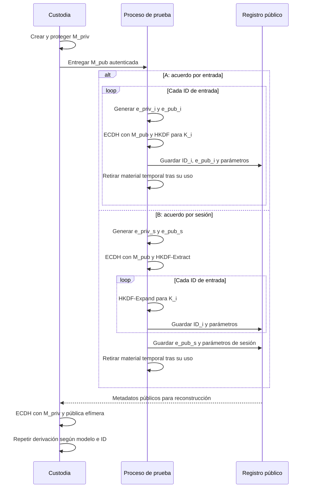

# Módulo 03 — Algoritmos de Generación de Claves

En el [Módulo 02](Ransomware-Modulo2) revisamos algoritmos de cifrado y acuerdo de claves. Aquí seguimos el recorrido del material criptográfico: de dónde sale, qué función cumple cada valor, cómo se deriva y qué información debe conservarse para que un experimento sea reproducible. El módulo siguiente tratará la enumeración de archivos; por ahora se trabajará únicamente con entradas de laboratorio elegidas de antemano.

Una arquitectura puede utilizar algoritmos sólidos y aun así fallar por generar secretos predecibles, confundir una clave pública con una privada, reutilizar un nonce o perder un parámetro de derivación. Por eso conviene estudiar la generación de claves como un protocolo completo, no como una llamada aislada a un generador aleatorio.

### La pregunta que organiza el módulo

Imagina un ejercicio autorizado con tres entradas de prueba. Para que dos participantes puedan comprobar el mismo resultado, deben ponerse de acuerdo en una **identidad criptográfica**, un algoritmo, una fuente de aleatoriedad, una forma de derivar claves y los parámetros públicos que se conservarán. También tienen que definir quién mantiene el secreto de larga duración y cómo se comprobará que el experimento puede revertirse. El número de archivos no resuelve ninguna de esas decisiones: indica cuántas veces se repetirá parte del protocolo.

El modelo de este capítulo tiene cuatro capas. **Generación:** el CSPRNG y la biblioteca de curvas crean material que no se debe predecir. **Acuerdo:** dos pares de claves producen un secreto compartido mediante ECDH. **Derivación:** HKDF convierte ese material en claves destinadas a usos concretos. **Custodia y reconstrucción:** se preservan los parámetros públicos y se protege la privada maestra para que el resultado pueda verificarse después. La salida de una capa no sustituye automáticamente a la siguiente: un secreto ECDH no es un archivo cifrado, una pública efímera no es un secreto y un identificador único no es una clave.

Este módulo compara dos diseños didácticos, **A, acuerdo por entrada**, y **B, acuerdo por sesión con derivaciones por entrada**. Son modelos para razonar sobre aislamiento, dependencia y coste; no representan una atribución automática a una familia real. El ejercicio usa entradas sintéticas y no procesa datos ajenos. Al terminar, deberías poder explicar qué conserva cada lado, qué se pierde si desaparece un parámetro, cuál es el alcance de la exposición de un secreto y qué evidencia permitiría describir el esquema de una muestra real.

## 3.1 Vocabulario y alcance

| Término | Qué representa | ¿Secreto? | Propiedad que importa |
| - | - | - | - |
| Entropía | Incertidumbre de la fuente que alimenta un generador | Según la fuente | No se deduce del número de bytes producidos |
| CSPRNG | Generador de bytes apto para fines criptográficos | Su estado interno, sí | Salida impredecible y manejo correcto del estado |
| Clave privada ECDH | Escalar empleado en un acuerdo de claves | Sí | Protección y vida útil acotada |
| Clave pública ECDH | Punto asociado a la privada | No | Formato correcto y validación al importarlo |
| Secreto compartido | Resultado del acuerdo ECDH | Sí | Alimentar una KDF, no asumir que ya es una clave para cualquier uso |
| PRK / OKM | Material intermedio / salida de HKDF | Sí | Longitud, contexto y separación de usos |
| Clave de trabajo | Clave destinada a una operación concreta | Sí | No reutilizarla fuera de su propósito |
| Salt | Entrada de una KDF | Generalmente no | Debe reproducirse si intervino en la derivación |
| Nonce | Número usado una vez en un esquema concreto | Generalmente no | Cumplir la regla de unicidad del esquema y de la clave |
| IV | Valor de inicialización de un modo | Generalmente no | Sus requisitos dependen del modo: no son universales |
| ID de sesión o de archivo | Etiqueta para distinguir instancias | No | Identidad estable, codificación inequívoca |


La longitud de una clave nominal no mide la entropía de su origen. Treinta y dos bytes obtenidos a partir de una hora predecible no equivalen a una clave de 256 bits generada mediante un CSPRNG. Tampoco son intercambiables una clave, un salt y un nonce solo porque los tres se representen como bytes.

En las secciones siguientes llamaremos **par maestro** al par persistente del modelo, **par efímero** al par creado para un acuerdo concreto y **clave de trabajo** a la salida destinada a una operación con datos. Son roles, no nombres obligatorios de variables ni una receta única de implementación.

## 3.2 De la entropía al material de clave

`rand()`, `srand(time(NULL))`, PID, hora del sistema y contadores de tiempo no constituyen por sí solos una fuente adecuada de claves. La función de un CSPRNG del sistema es producir bytes que no puedan anticiparse de forma práctica a partir de salidas observadas. En Windows, la interfaz de referencia es `BCryptGenRandom` con `BCRYPT_USE_SYSTEM_PREFERRED_RNG`; en otros entornos se emplea el generador criptográfico del sistema a través de una biblioteca mantenida. [1]

Para revisar una operación de generación, se hacen cuatro preguntas distintas:

1. ¿Quién proporciona la aleatoriedad y qué ocurre si la llamada falla?

2. ¿Cuántos bytes exige el objeto: escalar, salt, nonce o identificador?

3. ¿El objeto tiene requisitos adicionales, como pertenecer al rango de una curva o ser único respecto de una clave?

4. ¿Se guardará, publicará o deberá reconstruirse en otra etapa?

Una biblioteca de curvas debe generar sus escalares con su propia API o aceptar una fuente criptográfica compatible. Tomar 32 bytes y tratarlos sin más como una clave privada P-256 omite los requisitos del rango del escalar. La salida de un CSPRNG resuelve la imprevisibilidad; no resuelve automáticamente el formato, la identidad o el ciclo de vida.

**Aleatorio y único son requisitos distintos.** Un identificador puede ser único sin ser secreto. Un nonce generado al azar puede colisionar, aunque cada resultado individual parezca impredecible. La política de nonce se elige atendiendo al algoritmo, al volumen de operaciones y a la clave bajo la que se usa. Para ChaCha20-Poly1305 según RFC 8439, se exige no repetir el nonce de 96 bits con la misma clave. [2]

## 3.3 Mapa de dependencias

El diseño que estudiaremos parte de un par maestro y compara dos formas de obtener claves de trabajo. La clave pública maestra está disponible en el lado que inicia el acuerdo; la privada maestra permanece bajo control del lado que debe reconstruirlo posteriormente. Las dos partes necesitan conocer exactamente los mismos parámetros públicos de derivación.

El orden y las fronteras de información se ven mejor en la siguiente secuencia. «Registro» representa únicamente metadatos públicos del laboratorio; no es un servidor ni una ruta de transporte obligatoria. El titular de la privada maestra puede efectuar la reconstrucción después de recibir esos metadatos.



El diagrama distingue **quién genera**, **qué viaja** y **qué permanece secreto**. `M_priv`, las privadas efímeras, `Z`, `PRK` y las claves de trabajo no se escriben en el registro público. Una clave de trabajo puede tener una vida breve sin que eso pruebe que todas sus copias desaparecieron de la memoria. El orden de guardar metadatos y usar `K_i` debe especificarse en una implementación concreta; aquí solo se representan las dependencias.

| Material | Modelo A: por entrada | Modelo B: por sesión | ¿Se conserva públicamente? |
| - | - | - | - |
| Privada maestra | Una por el conjunto de ejercicios | Igual | No |
| Pública maestra | Igual | Igual | Sí |
| Privada efímera | Una nueva por entrada | Una nueva por sesión | No |
| Pública efímera | Distinta por entrada | Común a esa sesión | Sí, con indicación de alcance |
| Secreto ECDH | Distinto por entrada | Compartido por la sesión | No |
| Clave de trabajo | Distinta por entrada | Distinta por contexto de entrada | No |
| ID de entrada | Útil como contexto | Necesario para distinguir derivaciones | Sí, si debe reconstruirse |


La pública efímera no se introduce como sustituto de una privada en ECDH y no se puede afirmar que la privada de sesión se “cifra con la pública maestra” si el flujo descrito es un acuerdo ECDH. En un acuerdo, un lado combina *su propia privada* con *la pública del otro*. El otro lado combina *su privada* con *la pública del primero*. El resultado coincide. Un mecanismo de transporte o envoltura de claves sería un protocolo distinto.

## 3.4 Qué hace ECDH

Sea `G` el punto base de la curva. Si un lado posee la privada `a` y publica `A = a·G`, y el otro posee `b` y publica `B = b·G`, ambos pueden calcular el mismo punto:

```text
lado A:  a·B = a·(b·G) = (a·b)·G  
lado B:  b·A = b·(a·G) = (a·b)·G
```

La igualdad explica el acuerdo, no cómo codificar una clave final. Las bibliotecas definen la representación del resultado ECDH y las reglas de validación de puntos; el protocolo debe definir además la KDF y sus parámetros. Conocer `A` y `B` no equivale a conocer `a` o `b`. ECDH tampoco cifra por sí mismo un mensaje. NIST SP 800-56A Rev. 3 documenta esquemas de establecimiento de claves basados en curvas elípticas y Diffie–Hellman. [3]

En nuestros dos modelos, el par maestro representa a un lado y el par efímero al otro. Una prueba elemental consiste en verificar que ambos lados obtienen el mismo material de acuerdo **antes** de intentar derivar claves. Si no coincide, primero se revisan curva, formato de la pública, validación e implementación; una KDF no corrige un acuerdo mal especificado.

### ¿De quién es la pública maestra?

ECDH produce un acuerdo, pero **no autentica por sí solo a quien entregó la clave pública**. Si alguien sustituye `M_pub` antes del ejercicio, el proceso puede derivar material bajo la pública sustituida. La privada maestra prevista ya no reproducirá ese acuerdo; además, el titular de la privada correspondiente a la pública sustituta podría hacerlo con los parámetros públicos conservados. El problema es la **vinculación de la pública con su titular**, no una falla de la operación matemática ECDH. Una sustitución durante la distribución se parece a un ataque de intermediario; si la pública ya se empaquetó en un artefacto, la cuestión también incluye integridad y procedencia de ese artefacto. [3][8]

En un laboratorio, el responsable puede verificar una huella registrada por un canal independiente, validar una firma sobre la configuración o comprobar la integridad de un artefacto autorizado. Incluir la pública en un binario evita una descarga durante la ejecución, **pero no autentica automáticamente el binario**. También se verifica el algoritmo, la curva, la representación y la pertenencia de la pública al esquema esperado. Una firma de la pública necesita, a su vez, una clave verificadora cuya identidad ya sea confiable; ninguna etiqueta textual es una raíz de confianza.

Para distinguir los fallos, la práctica puede conservar dos huellas de públicas distintas y preguntar si una sustitución se detectaría **antes** del acuerdo, durante la comprobación de parámetros o solo al intentar reconstruir. No se modifica un sistema real: basta con comparar los registros de dos conjuntos de datos de prueba.

## 3.5 Arquitectura A: un acuerdo efímero por entrada

El Módulo 02 presenta este modelo al hablar de un par efímero por archivo. Aquí lo examinamos desde la generación de claves. Para cada entrada `i` se crea un par efímero independiente; la privada efímera y la pública maestra producen `Z_i`. La pública efímera correspondiente permite que el titular de la privada maestra reproduzca ese mismo acuerdo.

```text
Entrada 01: (e_priv_01, e_pub_01) → Z_01 → HKDF → K_01  
Entrada 02: (e_priv_02, e_pub_02) → Z_02 → HKDF → K_02  
Entrada 03: (e_priv_03, e_pub_03) → Z_03 → HKDF → K_03
```

Esto implica **N pares efímeros y N acuerdos ECDH para N entradas**. También implica N derivaciones. Una pública por entrada identifica el acuerdo respectivo. Una falla al preservar la información pública de una entrada afecta a la reconstrucción de esa entrada, aunque las demás tengan sus propios parámetros.

La independencia no autoriza a afirmar que la exposición de cualquier clave de trabajo nunca afecta otros datos: hay que precisar *qué* material se comprometió. Exponer `K_01` tiene un alcance distinto de exponer la privada maestra. Exponer un secreto de sesión en el modelo B tiene un alcance distinto de exponer una sola clave de trabajo. El resultado depende además de si las claves y contextos se reutilizaron.

> **Pregunta:** ¿cuántas “claves por entrada” existen? Al menos interviene un par efímero y una clave de trabajo derivada. Son objetos con propósitos diferentes. La pública no es secreta y el secreto ECDH no debe confundirse con la clave de trabajo.

## 3.6 Arquitectura B: un acuerdo por sesión y derivaciones separadas

Aquí se genera un único par efímero para una sesión. El acuerdo con la pública maestra produce `Z_s`. A partir de `Z_s` se establece material de sesión y, con un contexto estable distinto para cada entrada, se obtienen `K_01`, `K_02`, etcétera.

```text
par efímero de sesión + pública maestra → Z_s  
Z_s + salt de sesión → HKDF-Extract → PRK_s  
PRK_s + contexto(entrada 01) → HKDF-Expand → K_01  
PRK_s + contexto(entrada 02) → HKDF-Expand → K_02  
PRK_s + contexto(entrada 03) → HKDF-Expand → K_03
```

**Un ECDH por sesión no significa una clave idéntica para todos los archivos.** Las derivaciones se distinguen mediante `info` distintos. A la inversa, usar el mismo `PRK`, el mismo `info` y la misma longitud entrega la misma salida: HKDF es determinista. El salt no tiene que ser secreto, pero debe conocerse exactamente durante una reconstrucción.

| Aspecto | A: ECDH por entrada | B: ECDH por sesión |
| - | - | - |
| Pares efímeros para N entradas | N | 1 |
| Acuerdos ECDH | N | 1 |
| Derivaciones de claves de trabajo | N | N |
| Pública efímera | Cambia por entrada | Se comparte dentro de la sesión |
| Contexto que distingue entradas | Recomendable, explícito | Esencial |
| Alcance de un secreto intermedio comprometido | Entrada correspondiente | Sesión correspondiente |
| Parámetros públicos que preservar | Los de cada entrada | Los de sesión y los de cada entrada |


La tabla describe una arquitectura, no una medición de rendimiento. El coste real depende de plataforma, proveedor criptográfico, almacenamiento y número de entradas. Un esquema híbrido RSA puede reutilizar una clave pública ya generada: no requiere generar un nuevo par RSA por archivo. Por ello, una comparación con ECDH no debe contabilizar una generación RSA completa para cada entrada. Una comparación experimental válida debe especificar exactamente qué operaciones mide y en qué equipo.

### Por qué elegir A o B en un ejercicio

La elección se formula a partir del **alcance del compromiso y la reconstrucción**. Si las entradas deben poder analizarse por separado, A ofrece secretos ECDH independientes: la pérdida de una privada efímera o de `Z_i` afecta a esa entrada, siempre que no se haya comprometido la privada maestra. Requiere más acuerdos, más pares efímeros y metadatos asociados por entrada. B reduce la generación de pares y los acuerdos a una vez por sesión; mantiene claves de trabajo distintas si cada `info` tiene identidad propia, pero la exposición de `Z_s` o `PRK_s` puede afectar todas las entradas de la sesión. La clave maestra sigue siendo un punto de exposición compartido en **ambos** modelos.

| Pregunta de decisión | A: por entrada | B: por sesión |
| --- | --- | --- |
| ¿Qué se quiere aislar? | Cada acuerdo de entrada | Cada clave de trabajo, bajo un origen de sesión compartido |
| ¿Qué ocurre si se pierde una pública efímera? | Falta el parámetro de reconstrucción de una entrada | Puede afectar a toda la sesión si se pierde la única pública de sesión |
| ¿Qué secreto temporal tiene el mayor alcance? | `Z_i`, sobre la entrada `i` | `Z_s` o `PRK_s`, sobre la sesión |
| ¿Qué costes aumentan con N? | N generaciones de pares, N ECDH, N derivaciones | N contextos y N derivaciones; una generación y un ECDH por sesión |
| ¿Qué se debe comprobar? | Correspondencia entre ID y pública de cada entrada | Identidad única de sesión, ID distintos y reconstrucción de sus contextos |

Para `N = 10 000` entradas, los conteos **teóricos** son `10 000` pares y `10 000` acuerdos para A, frente a `1` par y `1` acuerdo por sesión para B; ambos precisan `10 000` derivaciones de clave de trabajo. Si se ensayan varias sesiones, se multiplica el coste fijo de B por el número de sesiones. El volumen de metadatos no se obtiene sumando solamente públicas: también cuentan IDs, versiones, salts, campos del formato y duplicaciones que imponga el diseño. Estos números describen operaciones, no tiempos reales ni superioridad universal.

### Familias documentadas y límites de la analogía

Un informe puede documentar «clave simétrica por archivo» sin probar «ECDH por archivo». También puede mencionar Curve25519 sin especificar el alcance de cada acuerdo. Los dos modelos del capítulo solo se atribuyen a una muestra cuando el análisis muestra **qué par se genera, qué material se reutiliza y dónde quedan los parámetros necesarios para recuperar cada clave**.

| Familia y fuente concreta | Lo que la fuente sí documenta | Lo que no se concluye de esa fuente |
| --- | --- | --- |
| **LockBit-NG-Dev**, muestra analizada por Trend Micro | AES con una clave aleatoria por archivo y protección de esa clave mediante la pública RSA incluida en la configuración. [9] | No es A ni B: se describe una envoltura RSA, no esos acuerdos ECDH. No extrapolar el resultado a toda versión de LockBit. |
| **BlackCat/ALPHV**, descripción de Microsoft | El algoritmo de contenido puede ser AES-CTR o ChaCha20 según configuración; la descripción señala material aleatorio empleado en la derivación de AES. [10] | No determina, por sí sola, si el establecimiento asimétrico sigue A o B ni si todas las variantes comparten jerarquía. |
| **Cl0p Linux**, muestra ELF estudiada por SentinelLABS | RC4 con una clave por archivo y una clave maestra RC4 incrustada; el mecanismo de protección de claves de ese ejemplar era recuperable por los analistas. [11] | No representa A o B. Tampoco describe toda la familia Cl0p o sus variantes Windows. |
| **RansomHub**, aviso conjunto de agencias | Informa uso de Curve25519 en la etapa criptográfica y características observadas de los archivos afectados. [12] | Mencionar una curva no establece la frecuencia de generación de pares, la KDF ni la identidad de sesión de nuestros modelos. |

La comparación aporta un criterio de lectura: primero se identifica el mecanismo publicado, luego su alcance, y solo después se pregunta si corresponde al modelo didáctico. **Una clave por archivo no equivale automáticamente a un ECDH por archivo.**

## 3.7 HKDF-SHA-256: extracción y expansión

RFC 5869 divide HKDF en dos operaciones. La **extracción** recibe `salt` e `IKM` (material de entrada) y produce `PRK`; la **expansión** recibe `PRK`, `info` y la longitud `L`, y produce `OKM`. Para SHA-256, la longitud de salida del hash es 32 bytes y el límite de expansión es `255 × 32` bytes. [4]

```text
PRK  = HMAC-SHA-256(salt, IKM)  
  
T(0) = cadena vacía  
T(1) = HMAC-SHA-256(PRK, T(0) || info || 0x01)  
T(2) = HMAC-SHA-256(PRK, T(1) || info || 0x02)  
...  
OKM  = primeros L bytes de T(1) || T(2) || ...
```

El orden de los argumentos importa. `HMAC(secret, info)` seguido de otra operación diseñada a medida no pasa a llamarse HKDF solo por producir bytes. Dos implementaciones, por ejemplo en C y Rust, solo producirán la misma salida si coinciden el algoritmo, las entradas y la codificación de cada parámetro. Tampoco basta con usar `BCRYPT_KDF_HASH` y denominarlo HKDF: la operación y sus parámetros tienen que corresponder a la especificación. En Windows, `BCryptDeriveKey` admite varias KDF y parámetros; el nombre de una llamada no fija por sí solo el hash ni el protocolo completo. [5]

### Separación de dominios

`info` liga una derivación a su contexto. Por ejemplo, las etiquetas conceptuales `curso/mod03/clave-entrada/v1` y `curso/mod03/clave-metadatos/v1` representan usos diferentes. No basta con concatenar cadenas sin especificar sus límites: `ab || c` y `a || bc` generan los mismos bytes. Una especificación puede usar campos de longitud fija o prefijos de longitud, e incluir versión de protocolo, algoritmo, ID de sesión e ID de entrada. Todos los participantes deben codificarlos de la misma manera.

Un ejemplo de contrato de codificación, sin tomar rutas como identidad:

```text
info = etiqueta_versionada || id_sesion[16] || id_entrada[16]
```

Si los ID son bytes de longitud fija, el resultado no es ambiguo. El protocolo debe definir cómo se generan, dónde se conservan y qué ocurre cuando se repite un ID dentro de una sesión. Una ruta del sistema es un contexto frágil: renombrar o mover el archivo puede impedir reproducir la derivación. Tampoco debe suponerse que dos rutas textual o visualmente parecidas tienen la misma codificación UTF-8 o normalización.

### Salt frente a `info`

El salt alimenta la etapa de extracción; `info` diferencia usos en la expansión. Un salt aleatorio ayuda a separar instancias que comparten material de entrada, pero no reemplaza un ID por entrada cuando el mismo PRK se expande varias veces. Si el salt se usa, su valor debe estar disponible después. RFC 5869 permite un salt omitido con un valor por defecto definido, pero no se debe cambiar entre implementaciones sin documentarlo. [4]

## 3.8 Vector de prueba reproducible

El caso A.1 de RFC 5869 prueba HKDF-SHA-256 con entradas fijas. Al tratarse de valores publicados, **no sirven como claves de producción**; su finalidad es detectar errores de codificación, orden de argumentos o longitud. La salida esperada completa puede consultarse en la referencia oficial. [4]

```text
IKM  = 0b repetido 22 veces  
salt = 000102030405060708090a0b0c  
info = f0f1f2f3f4f5f6f7f8f9  
L    = 42 bytes  
  
PRK esperado:  
077709362c2e32df0ddc3f0dc47bba6390b6c73bb50f9c3122ec844ad7c2b3e5  
  
OKM esperado:  
3cb25f25faacd57a90434f64d0362f2a2d2d0a90cf1a5a4c5db02d56ecc4c5bf  
34007208d5b887185865
```

El siguiente programa verifica **solo este vector público de HKDF**. No abre archivos, no recorre directorios y no cifra datos:

```python
import hashlib  
import hmac  
  
  
def hkdf_extract(salt: bytes, ikm: bytes) -> bytes:  
    return hmac.new(salt, ikm, hashlib.sha256).digest()  
  
  
def hkdf_expand(prk: bytes, info: bytes, length: int) -> bytes:  
    hash_len = hashlib.sha256().digest_size  
    if not 0 <= length <= 255 * hash_len:  
        raise ValueError("longitud fuera del rango de RFC 5869")  
    previous = b""  
    result = bytearray()  
    for counter in range(1, (length + hash_len - 1) // hash_len + 1):  
        previous = hmac.new(  
            prk, previous + info + bytes([counter]), hashlib.sha256  
        ).digest()  
        result.extend(previous)  
    return bytes(result[:length])  
  
  
ikm = bytes.fromhex("0b" * 22)  
salt = bytes.fromhex("000102030405060708090a0b0c")  
info = bytes.fromhex("f0f1f2f3f4f5f6f7f8f9")  
expected_prk = bytes.fromhex(  
    "077709362c2e32df0ddc3f0dc47bba6390b6c73bb50f9c3122ec844ad7c2b3e5"  
)  
expected_okm = bytes.fromhex(  
    "3cb25f25faacd57a90434f64d0362f2a2d2d0a90cf1a5a4c5db02d56ecc4c5bf"  
    "34007208d5b887185865"  
)  
  
prk = hkdf_extract(salt, ikm)  
okm = hkdf_expand(prk, info, 42)  
assert prk == expected_prk  
assert okm == expected_okm  
print("RFC 5869, caso A.1: PASS")
```

Ejercicio: sustituir `info` por un byte diferente y observar que el `OKM` cambia; después restaurar el valor oficial y confirmar `PASS`. También puede implementarse el mismo vector con una biblioteca en C o Rust y comparar los 42 bytes. La comparación tiene sentido solo si las dos implementaciones usan exactamente `IKM`, `salt`, `info`, SHA-256 y `L` del caso A.1.

## 3.9 Nonce, IV, salt e identificadores

En el Módulo 02 aparecen CBC, CTR y ChaCha20-Poly1305. Sus valores auxiliares no obedecen una regla única:

| Modo o función | Valor | Tamaño en el ejemplo del curso | Qué debe comprobarse |
| - | - | - | - |
| AES-CBC | IV | 16 bytes, tamaño de bloque AES | Imprevisibilidad y formato del protocolo; CBC sin autenticación no detecta cambios maliciosos |
| AES-CTR | Contador inicial / nonce | Definido por la construcción concreta | No reutilizar el flujo de contador con la misma clave ni permitir que el contador se desborde |
| ChaCha20-Poly1305 de RFC 8439 | Nonce | 12 bytes | Unicidad por clave; el resultado incluye un tag de 16 bytes |
| HKDF | Salt | Longitud definida por el protocolo | Reproducibilidad exacta en la reconstrucción |
| Contexto HKDF | ID | Longitud definida por el protocolo | Identidad estable y ausencia de ambigüedad |


El tag Poly1305 verifica la autenticidad del mensaje y de los datos adicionales asociados según el formato AEAD. Un CRC32 solo detecta ciertos errores accidentales: no sustituye el tag. Guardar el nonce en metadatos públicos no revela la clave, pero repetir el par **clave + nonce** en ChaCha20-Poly1305 viola el requisito del esquema. [2]

La expresión “nonce de ChaCha20” debe distinguir el cifrador de flujo del esquema autenticado ChaCha20-Poly1305. Este módulo define de dónde salen y cómo se identifican los valores; el diseño del cifrado y el tratamiento completo del tag se estudian en los módulos dedicados.

## 3.10 Serialización de claves públicas P-256

Un mismo punto público P-256 `(X, Y)` puede viajar en formatos diferentes. La forma SEC1 no comprimida contiene `0x04 || X[32] || Y[32]`: **65 bytes**. Un `BCRYPT_ECCPUBLIC_BLOB` de Windows CNG contiene un encabezado `BCRYPT_ECCKEY_BLOB` con dos campos `ULONG` seguido de `X[32] || Y[32]`: **72 bytes** para P-256. En CNG las coordenadas se expresan en big-endian. La cifra de 72 bytes corresponde a ese blob concreto, no al tamaño universal de una pública P-256. [6][7]

| Representación | Estructura | Tamaño P-256 no comprimida |
| - | - | -: |
| SEC1 | `0x04 || X || Y` | 65 bytes |
| CNG ECC public blob | `dwMagic || cbKey || X || Y` | 72 bytes |


La conversión debe interpretar el encabezado, comprobar tipo y longitud, extraer coordenadas y validar el punto mediante la biblioteca receptora. Cambiar el tamaño del arreglo de 72 a 65 bytes no realiza una conversión. Tampoco corresponde tratar un blob privado exportado como si fuera un archivo estándar de clave: el formato, la protección en reposo y el destino de la clave son decisiones distintas.

Antes de atribuir una discrepancia C/Rust a HKDF, conviene comparar por etapas: curva → representación de la pública → acuerdo ECDH → `IKM` → `salt` → `PRK` → `info` → `OKM`. Los valores secretos de estas etapas se observan solo en un entorno de prueba aislado y se retiran de cualquier registro que vaya a publicarse.

### P-256 y X25519 no son el mismo formato con otro tamaño

P-256, en la representación SEC1 no comprimida del ejemplo, expresa las dos coordenadas `(X, Y)` en `65` bytes; el blob público CNG estudiado ocupa `72` bytes con su encabezado. X25519, definido en RFC 7748 para acuerdo de claves sobre Curve25519 en forma de Montgomery, emplea una pública de `32` bytes que representa la coordenada `u`. No se convierte entre ambos formatos recortando bytes ni cambiando el nombre de la curva. El tratamiento de escalares, la validación de entradas y la representación del resultado también dependen del esquema. [7][13]

| Pregunta | P-256 en este módulo | X25519 |
| --- | --- | --- |
| ¿Qué pública se muestra? | Punto `(X, Y)`, SEC1 sin comprimir | Valor público de 32 bytes definido por RFC 7748 |
| ¿Qué tamaño se cita? | 65 bytes SEC1; 72 bytes para el blob CNG concreto | 32 bytes en el formato crudo de RFC 7748; otros contenedores añaden encabezados |
| ¿Qué matemáticas usa la interfaz? | Operaciones sobre una curva de Weierstrass | Función de intercambio basada en la coordenada `u` de una curva de Montgomery |
| ¿Qué revisar al recibir la pública? | Formato, curva y validación del punto | Codificación y reglas de la biblioteca; comprobar el resultado compartido nulo según el protocolo |
| ¿Qué determina la elección en el curso? | Interoperabilidad con formatos y proveedores presentes | Interoperabilidad con implementaciones X25519 y formatos acordados |

TLS 1.3 especifica interoperabilidad con P-256 y recomienda soporte de X25519: ambos tienen adopción, de modo que «estándar de facto» no sustituye a una decisión de compatibilidad con una plataforma concreta. RFC 7748 explica el intercambio X25519 y la posible comprobación del secreto compartido completamente nulo; una especificación como RFC 9180 la exige para su construcción. Ni el tamaño de la pública ni una etiqueta de curva proporcionan por sí solos una comparación de velocidad del sistema completo. [14][13][8]

### Nota de perspectiva: criptografía poscuántica

NIST publicó **ML-KEM** en FIPS 203 para establecimiento de un secreto mediante encapsulación y **ML-DSA** en FIPS 204 para firmas digitales. Cumplen funciones diferentes: ML-DSA no sustituye a HKDF ni a un cifrador simétrico, y ML-KEM no es simplemente «ECDH con una clave más larga». En un protocolo nuevo habría que especificar autenticación, encapsulación/decapsulación, KDF, formato de parámetros, compatibilidad y reconstrucción. [15][16]

El tamaño del material público y del texto de encapsulación es una consideración verificable; por ejemplo, un perfil híbrido reciente de TLS 1.3 combina X25519 con ML-KEM-768 y define una parte pública de ML-KEM de `1184` bytes y un texto de encapsulación de `1088` bytes. **Esas cifras pertenecen a ese perfil**, no describen el footer de ransomware ni prueban que una familia use el esquema. Los informes de familias citados aquí no permiten afirmar ni que todas hayan adoptado mecanismos poscuánticos ni por qué no lo habrían hecho. El tema pertenece a una comparación de protocolos y evidencia de versiones concretas, no a sustituir mecánicamente ECDH por ML-KEM. [17]

## 3.11 Ciclo de vida y alcance de exposición

Una clave existe durante un intervalo. Hay que distinguir creación, uso, conservación y eliminación:

| Objeto | Cuándo se necesita | Riesgo de conservarlo más tiempo del necesario |
| - | - | - |
| Privada maestra | Para el acuerdo desde el lado maestro | Compromiso de todo el material bajo ese par |
| Privada efímera por entrada | Mientras se efectúa su acuerdo | Expone el acuerdo de esa entrada |
| Privada efímera de sesión | Mientras se efectúa el acuerdo de sesión | Expone el acuerdo de esa sesión |
| Secreto compartido / PRK de sesión | Mientras se derivan claves dependientes | Puede afectar a las derivaciones de la sesión |
| Clave de trabajo | Durante el uso correspondiente | Expone los datos protegidos por esa clave |
| Parámetros públicos | Durante reconstrucción y verificación | Su pérdida puede impedir reproducir el protocolo |


Destruir un *handle* de biblioteca, sobrescribir un búfer y borrar un archivo son operaciones diferentes. La sobrescritura de un búfer propio no garantiza que no existan copias internas, registros, volcados o material paginado. `SecureZeroMemory` y `zeroize` ayudan a reducir la vida de copias controladas por la aplicación, sin prometer una eliminación forense total. La descripción y la implementación deben coincidir en el instante real de destrucción de la privada efímera: retenerla en un contexto hasta la limpieza final no equivale a destruirla tras el acuerdo.

Una exposición debe describirse con precisión: `K_01` no es `PRK_s`; `PRK_s` no es la privada maestra. La separación de dominios limita reutilizaciones accidentales, pero no hace independientes todas las salidas frente a la pérdida del material padre.

### Dónde reside la privada maestra entre ejecuciones

La privada maestra es un secreto persistente **del responsable de la reconstrucción**, no una variable que el proceso de prueba necesite recibir para calcular ECDH con la pública. En un ejercicio, se designa un custodio y se documentan almacenamiento, acceso, copia de recuperación, rotación y destrucción. NIST SP 800-57 trata la protección, disponibilidad, recuperación e inventario del material de clave. [18]

| Modelo de custodia | Consecuencia que hay que evaluar |
| --- | --- |
| Privada incrustada en un artefacto que se distribuye | Quien obtenga el artefacto puede intentar extraerla; no representa separación entre lados. |
| Almacén administrado por el equipo custodio | Se identifican controles de acceso, registro, copia de recuperación y disponibilidad cuando sea necesaria una verificación. |
| Privada protegida mediante una clave derivada de una contraseña | La protección depende de la entropía de la contraseña, de la KDF, de los parámetros y de la gestión de credenciales. No se supone segura por llamarla «cifrada». |
| Privada bajo control de un servicio remoto | Aparecen dependencias de disponibilidad, autenticación, permisos y registros. No se presupone que el servicio esté presente en un ejercicio sin red. |

Derivar directamente una privada de una contraseña no remedia una contraseña débil y exige, además, especificar una KDF adecuada y una forma válida de obtener el escalar de la curva. Una alternativa conceptualmente distinta es generar la privada con una biblioteca criptográfica y proteger su almacenamiento con una clave derivada de credenciales; tampoco evita documentar recuperación y control de acceso.

El Módulo 07 profundiza en el transporte o la protección del material según la arquitectura; aquí importa fijar **quién posee la privada y cómo se recupera legítimamente**. La pública maestra puede distribuirse, pero debe quedar vinculada a ese custodio y a la configuración aprobada.

### Reglas del ejercicio y cadena de custodia

Antes de generar una sola clave, las reglas de participación (*Rules of Engagement*, RoE) deben precisar el alcance de las entradas, la prohibición o autorización explícita de cualquier modificación, el custodio designado, el lugar de almacenamiento, quién puede verificar las derivaciones y cómo se entregarán o eliminarán los materiales al cierre. Para este módulo basta con etiquetas y datos sintéticos; el equipo puede demostrar igualdad de acuerdos y claves derivadas sin cifrar información del cliente.

Un registro de entrega útil contiene: identificador de sesión, versión del protocolo, huella de la pública maestra, responsable de la privada, inventario de parámetros públicos, resultados de la prueba de reconstrucción y acta de recepción o eliminación según lo pactado. **Una huella no reemplaza una copia de recuperación**; acredita identidad solo si se compara con un valor confiable. Tampoco se adjuntan secretos a informes de libre distribución. Los mecanismos exactos de custodia deben seguir las políticas del cliente y el contrato de la actividad.

### Memoria, observabilidad y límites de OPSEC

La generación de pares y los acuerdos dejan un perfil de operaciones: llamadas a bibliotecas criptográficas, creación de objetos de clave, asignaciones de memoria y, si se escriben parámetros, cambios en archivos de prueba. El alcance de lo **visible** depende de la instrumentación y del proveedor; una llamada a `BCryptGenRandom` por sí sola no demuestra debilidad, ni su ausencia en un registro demuestra que no se generó aleatoriedad. Un CSPRNG mal empleado se identifica por el análisis de la fuente, las comprobaciones de error, la semántica de los valores y, en algunos casos, repeticiones observadas; no existe un indicador universal que diagnostique directamente una mala entropía.

Para limitar exposición accidental de secretos se evita imprimirlos, se acota su vida en el proceso y se estudian copias, volcados, registros y memoria paginada. En Windows, `VirtualLock` impide que **las páginas bloqueadas** se escriban al archivo de paginación mientras permanecen bloqueadas, pero eso no garantiza que otras copias o volcados estén ausentes. Limpiar un búfer propio tampoco borra automáticamente el estado interno de una biblioteca. Estas son garantías parciales que deben enunciarse con su alcance real. [19]

## 3.12 Parámetros públicos y límites de este módulo

Para poder repetir un cálculo se necesita una especificación completa, no solo un nombre de algoritmo. Como mínimo se documentan: versión, curva y representación de la pública; método de acuerdo; KDF y hash; salt; etiquetas de contexto y su codificación; ID estables; longitud de salida; y reglas para valores auxiliares. Según el mecanismo que procese los datos, también harán falta nonce, identificadores del algoritmo y, si se emplea AEAD, el tag y la definición de AAD.

Aquí se enumeran **dependencias criptográficas**, no se define una estructura binaria de footer. El Módulo 09 aborda el formato y sus tamaños; el Módulo 07, la protección o transporte de claves cuando corresponda; el Módulo 14, la operación inversa completa. Esta separación permite que Key Generation sea preciso sin asumir que ya existe un formato de archivo definitivo.

Una pública de sesión no debe llamarse `encrypted_keys`, porque no son claves cifradas; y `orig_size` en un `DWORD` limita el campo a 32 bits. Cuando se diseñe el formato de archivos, el tamaño original necesitará una representación explícita suficiente para archivos grandes. CRC32 no es una prueba de autenticidad.

## 3.13 Laboratorio A: observar acuerdos independientes

Se preparan tres entradas de prueba con nombres conocidos: `sample01.txt`, `sample02.bin` y `sample03.dat`. Para comparar claves no se necesita abrirlas ni modificar su contenido. La práctica consiste en ejecutar un acuerdo aislado por cada entrada con la misma pública maestra, registrar las tres públicas efímeras y verificar los resultados de ambos lados del acuerdo.

| Entrada | Par efímero | Resultado ECDH | Contexto HKDF | Resultado esperado |
| - | - | - | - | - |
| `sample01.txt` | Nuevo | `Z_01` | ID estable 01 | `K_01` |
| `sample02.bin` | Nuevo | `Z_02` | ID estable 02 | `K_02` |
| `sample03.dat` | Nuevo | `Z_03` | ID estable 03 | `K_03` |


Anotar para cada entrada: identificador, huella de la pública efímera, longitud del material de acuerdo y confirmación de que los dos lados producen el mismo valor. Comparar en memoria las claves de trabajo y reportar `iguales` o `distintas`, sin publicar sus bytes. Cambiar una pública por la de otra entrada debe alterar el acuerdo o hacer fallar la verificación de identidad contextual: se trata de observar la dependencia, no de cifrar el archivo.

**Resultado que hay que explicar:** las tres públicas y los tres acuerdos normalmente serán distintos; cada par nuevo consume una generación y un ECDH. Una coincidencia inesperada exige revisar qué se reutilizó. No se puede deducir una seguridad concreta a partir de tres muestras: la práctica verifica el flujo lógico, no la calidad estadística del CSPRNG.

## 3.14 Laboratorio B: una sesión, tres contextos

Se usan las mismas tres etiquetas de entrada, pero ahora hay una única pública efímera de sesión y un solo secreto ECDH. Primero se comprueba la igualdad del acuerdo desde los dos lados. Después se calcula un PRK de sesión con un salt fijo **solo para la comparación de laboratorio**. Se forman tres `info` de igual estructura con ID de entrada distintos y se comparan las tres salidas de 32 bytes.

```text
misma sesión + mismo salt + mismo IKM → mismo PRK  
PRK + info(01) → K_01  
PRK + info(02) → K_02  
PRK + info(03) → K_03
```

Repetir `info(01)` debe reproducir exactamente `K_01`. Cambiar solo el nombre visible de `sample01.txt` no debe cambiarla si el contexto utiliza un ID estable independiente de la ruta. Cambiar el ID sí debe producir otra salida. Esta es la diferencia práctica entre usar la identidad de una entrada y usar su ubicación actual como contexto.

La tabla de resultados del alumno puede consignar `mismo/diferente` para PRK y claves. No hace falta imprimir el secreto compartido, el PRK ni las claves. Para validar una implementación propia, primero debe superar el vector oficial de la sección 3.8 y luego contrastar resultados del laboratorio con una biblioteca independiente.

### Medir A y B sin confundir teoría con rendimiento

Para documentar un ejercicio se separan **conteos teóricos** de **mediciones**. El primero se obtiene del protocolo; el segundo exige especificar equipo, versión de biblioteca, proveedor criptográfico, curva, estado de caché, número de repeticiones y condiciones de ejecución. No se atribuye a la curva una diferencia causada por escritura de resultados o por inicialización de la biblioteca.

| Medida | Cómo se obtiene | Qué se consigna |
| --- | --- | --- |
| Generaciones de pares | Conteo de llamadas completadas por lote | `N` en A; una por sesión en B, más los pares maestros preparados aparte |
| Acuerdos ECDH | Conteo de acuerdos completados | `N` en A; uno por sesión en B, para el lado que prepara el lote |
| Derivaciones por entrada | Conteo de HKDF-Expand con contextos distintos | `N` en ambos; verificar que no se repite un ID dentro de la sesión |
| Tiempo por etapa | Reloj monotónico antes y después de lotes separados | Mediana y dispersión de repeticiones, número de errores y versión de proveedor |
| Material público | Longitud serializada de cada pública y de los demás parámetros | Tamaño del mensaje o registro real, no solo tamaño de la curva |
| Memoria de trabajo | Instrumentación del proceso durante lotes de tamaño conocido | Pico de uso y si se retiene inventario; no publicar secretos para medirlo |
| Reconstrucción | Verificar igualdad con el custodio en entradas sintéticas | Número de entradas recuperables, fallidas y motivo de cada fallo |

Ejemplo de **cálculo, no de benchmark** para `10 000` entradas con públicas P-256 SEC1 sin comprimir: A produciría `10 000 × 65 = 650 000` bytes solo de públicas efímeras, mientras B necesitaría una pública de `65` bytes **por sesión**. Con un blob CNG de `72` bytes, A acumularía `720 000` bytes de blobs, antes de IDs, salts y cualquier encabezado. Si en B se copia la misma pública en cada registro, el formato puede anular ese ahorro físico: el tamaño real se mide sobre la serialización elegida. Las cuentas no incluyen la pública maestra ni prueban una tasa de archivos por segundo.

Una plantilla mínima de resultado puede indicar `N`, modelo, curva, biblioteca, sistema, operaciones previstas/completadas, tiempos por etapa, bytes públicos, errores y verificación de recuperación. Al informar una cifra de tiempo para `10 000` entradas, se aclara si incluye creación de la maestra, serialización y almacenamiento. Este módulo no afirma que una arquitectura sea siempre más rápida; muestra cómo justificar una comparación.

## 3.15 Errores que deben reconocerse al revisar una implementación

| Síntoma | Causa posible | Comprobación |
| - | - | - |
| Dos lenguajes producen claves diferentes | Formatos de pública, representación ECDH o parámetros HKDF distintos | Comparar cada etapa por separado |
| La clave cambia al renombrar una entrada | La ruta se usó como contexto | Sustituirla por ID estable documentado |
| Dos entradas producen la misma clave | `info` o ID repetido; mismo material base | Inspeccionar la codificación, no solo la longitud |
| Un “HKDF” falla el vector RFC | Extract y Expand intercambiados o expansión casera | Verificar HMAC, contador y longitud |
| Un valor de 65 bytes no se importa como blob CNG | SEC1 y CNG tienen encabezados diferentes | Convertir y validar el punto |
| Se usa un nonce nuevo con la misma clave, pero se repite por accidente | No hay control de unicidad a lo largo de las operaciones | Revisar el ámbito de clave y nonce |
| El CRC pasa, pero los datos fueron modificados | CRC no autentica | Verificar el tag del esquema AEAD |
| La privada “se destruye” en el comentario, pero el contexto la retiene | Ciclo de vida descrito distinto del real | Identificar el último uso y las copias existentes |


### Caso documentado: una variante Linux de Cl0p

SentinelLABS analizó un ejecutable ELF de Cl0p y encontró una **clave RC4 maestra incrustada**. En esa muestra, la clave RC4 empleada para cada archivo se protegía mediante esa clave simétrica incrustada en lugar del procedimiento RSA descrito para versiones Windows. Los investigadores informaron que la falla hacía posible recuperar archivos afectados y publicaron un descifrador para **esa variante**. También observaron que al escribir el material asociado a la clave se incluían datos de memoria adicionales, con posible información forense sobre el archivo. [11]

La lección no es que «Cl0p tenga siempre claves débiles» ni que «cualquier clave incrustada permita recuperar todos los casos». El resultado depende de un ejemplar y de cómo se protegía su clave por archivo. El caso permite ejercitar tres preguntas que la tabla genérica no resuelve: **¿qué material era recuperable en la muestra?, ¿qué metadatos se conservaban?, ¿qué evidencia respalda la posibilidad de reconstrucción?** Para analizar una versión distinta haría falta repetir la revisión de su binario y su formato, sin trasladar automáticamente esta conclusión.

También ilustra por qué hay que distinguir una falla del generador aleatorio, una falla de custodia y una falla de serialización. En el caso descrito, la posibilidad de recuperación se relaciona con la protección de las claves por archivo; los datos de memoria adicionales proceden de un problema de escritura. No se trata de un ejemplo probado de reutilización de nonce ECDH ni de una confusión entre SEC1 y CNG. Si se quiere enseñar una de esas otras fallas con nombre de familia, se necesita primero una investigación original que la demuestre.

## 3.16 Preguntas de revisión

1. ¿Por qué la pública efímera puede divulgarse sin que eso equivalga a divulgar la privada?

2. ¿Qué diferencia hay entre un secreto ECDH y una clave de trabajo de 32 bytes?

3. En el modelo A, ¿cuántos acuerdos se realizan para tres entradas? ¿Y en el modelo B?

4. Si se pierde `K_01`, ¿qué alcance tiene el incidente? ¿Qué cambia si se pierde el PRK de sesión?

5. ¿Por qué el mismo PRK y el mismo `info` producen la misma salida HKDF?

6. ¿Qué información debe coincidir byte a byte para reproducir una derivación?

7. ¿Por qué un nombre de archivo no siempre es una buena identidad criptográfica?

8. ¿Un salt debe mantenerse secreto? ¿Debe poder recuperarse para repetir HKDF?

9. ¿En qué difieren la unicidad de un nonce y la imprevisibilidad de una clave?

10. ¿Por qué 65 y 72 bytes pueden representar el mismo punto P-256?

11. ¿ECDH aporta autenticación de la identidad del otro lado por sí solo?

12. ¿Por qué un CRC32 no sustituye un tag Poly1305?

13. ¿Qué demuestra un vector de prueba HKDF y qué no demuestra sobre la seguridad de todo el sistema?

14. ¿Por qué medir generación de pares RSA por archivo no representa necesariamente un esquema híbrido RSA?

## Resumen Módulo 03

Generar claves implica elegir una fuente criptográfica, definir roles y alcances, acordar un secreto cuando intervienen dos pares de claves, derivar material con una KDF especificada, separar usos mediante contextos inequívocos, conservar los parámetros públicos necesarios y limitar la vida del material secreto. **ECDH por entrada** y **ECDH por sesión con derivación por entrada** son modelos distintos: A distribuye la dependencia entre acuerdos, mientras B concentra el acuerdo en una sesión y separa las claves de trabajo mediante contextos. Ambos siguen dependiendo de la protección de la privada maestra y de una pública maestra auténtica.

El resultado de este módulo es una especificación verificable, dos observaciones con entradas conocidas y una plantilla de medición que separa conteos de tiempos reales. La comparación con LockBit-NG-Dev, BlackCat/ALPHV, Cl0p Linux y RansomHub se limita a lo que publican las fuentes citadas: no se atribuye A o B a una familia por el solo uso de una curva o de claves por archivo. La búsqueda de archivos pertenece al siguiente capítulo. El transporte de material, el footer definitivo y la reconstrucción integral se tratan en los módulos indicados en el índice.

**Siguiente:** [Módulo 04 — Enumeración y selección de archivos](Ransomware-Modulo4).


## Referencias técnicas

1. Microsoft Learn, [BCryptGenRandom](https://learn.microsoft.com/en-us/windows/win32/api/bcrypt/nf-bcrypt-bcryptgenrandom).
2. IETF, [RFC 8439: ChaCha20 and Poly1305 for IETF Protocols](https://www.rfc-editor.org/rfc/rfc8439.html), secciones 2.8 y 2.8.1.
3. NIST, [SP 800-56A Rev. 3: Pair-Wise Key-Establishment Schemes](https://csrc.nist.gov/pubs/sp/800/56/a/r3/final).
4. IETF, [RFC 5869: HMAC-based Extract-and-Expand Key Derivation Function](https://www.rfc-editor.org/rfc/rfc5869.html), secciones 2 y apéndice A.1.
5. Microsoft Learn, [BCryptDeriveKey](https://learn.microsoft.com/en-us/windows/win32/api/bcrypt/nf-bcrypt-bcryptderivekey).
6. IETF, [RFC 5480: Elliptic Curve Cryptography Subject Public Key Information](https://www.rfc-editor.org/rfc/rfc5480.html), sección 2.2.
7. Microsoft Learn, [BCRYPT_ECCKEY_BLOB](https://learn.microsoft.com/en-us/windows/win32/api/bcrypt/ns-bcrypt-bcrypt_ecckey_blob).
8. IETF, [RFC 9180: Hybrid Public Key Encryption](https://www.rfc-editor.org/rfc/rfc9180.html), secciones sobre autenticación y validación de claves públicas.
9. Trend Micro, [análisis técnico de LockBit-NG-Dev](https://www.trendmicro.com/content/dam/trendmicro/global/en/research/24/b/lockbit-attempts-to-stay-afloat-with-a-new-version/technical-appendix-lockbit-ng-dev-analysis.pdf), página 4.
10. Microsoft Security Intelligence, [descripción de Ransom:Win32/Blackcat](https://www.microsoft.com/en-us/wdsi/threats/malware-encyclopedia-description?Name=Ransom%3AWin32%2FBlackcat), apartado sobre cifrado de archivos.
11. SentinelLABS, [Cl0p Ransomware Targets Linux Systems with Flawed Encryption](https://www.sentinelone.com/labs/cl0p-ransomware-targets-linux-systems-with-flawed-encryption-decryptor-available/).
12. CISA, FBI, MS-ISAC y HHS, [aviso conjunto sobre RansomHub (AA24-242A)](https://www.cisa.gov/sites/default/files/2024-09/aa24-242a-stopransomware-ransomhub-ransomware_1.pdf).
13. IETF, [RFC 7748: Elliptic Curves for Security](https://www.rfc-editor.org/rfc/rfc7748.html), secciones 5 y 6.1.
14. IETF, [RFC 8446: The Transport Layer Security (TLS) Protocol Version 1.3](https://www.rfc-editor.org/rfc/rfc8446.html), secciones 4.2.7 y 4.2.8.2.
15. NIST, [FIPS 203: Module-Lattice-Based Key-Encapsulation Mechanism Standard](https://csrc.nist.gov/pubs/fips/203/final).
16. NIST, [FIPS 204: Module-Lattice-Based Digital Signature Standard](https://csrc.nist.gov/pubs/fips/204/final).
17. IETF, [RFC 10024: Post-Quantum Traditional Hybrid Key Agreement Mechanisms for TLS 1.3](https://www.rfc-editor.org/rfc/rfc10024.html), sección 4.
18. NIST, [SP 800-57 Part 1 Rev. 5: Recommendation for Key Management](https://csrc.nist.gov/pubs/sp/800/57/pt1/r5/final).
19. Microsoft Learn, [VirtualLock](https://learn.microsoft.com/en-us/windows/win32/api/memoryapi/nf-memoryapi-virtuallock).

---

© 2026 Aldair Maihuiri. Todos los derechos reservados. Se permite compartir con atribución al autor. La reproducción sin autorización previa está prohibida.
