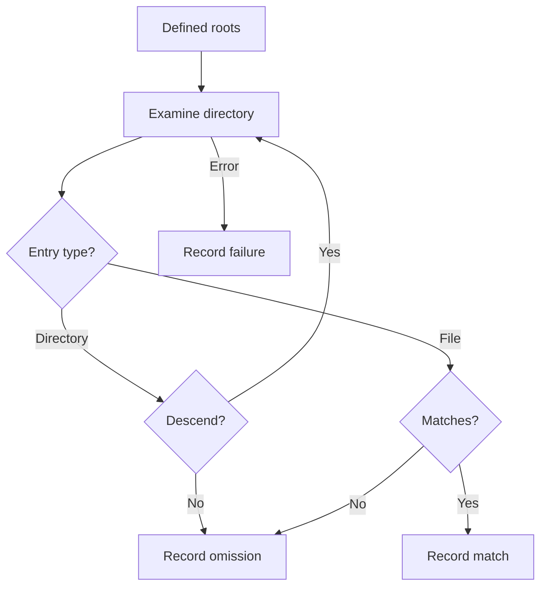

# Module 04 — File Enumeration and Selection

In [Module 03](Ransomware-Modulo3-en), we studied how cryptographic material is generated and organized. Before any encryption scheme can be applied to data, a file-oriented program must solve another problem: **identify the locations it can examine and decide which entries are relevant**. This module studies that stage through Windows documentation, analyses of observed behavior, and a fictional data set.

Enumeration does not necessarily imply encryption. Backup programs, indexers, and search tools also traverse directories. Two ransomware samples can use the same cryptographic algorithm yet differ substantially in scope, exclusions, and error handling. The analyst's task is to describe **what was observed**, distinguish inference from evidence, and identify what remains unknown.

By the end of this module, you should be able to:

1. Explain the scope and selection decisions that precede file processing.
2. Interpret the data and limits of Windows directory enumeration.
3. Distinguish a drive letter, a UNC network path, and a volume mounted as a folder.
4. Examine the effects of permissions, long paths, reparse points, changing files, and errors.
5. Evaluate what an extension list, an exclusion list, or a single event can and cannot establish.

ATT&CK terminology helps locate the subject: **File and Directory Discovery (T1083)** describes discovery of files and directories; **Data Encrypted for Impact (T1486)** concerns encryption that disrupts access; **Service Stop (T1489)** concerns stopping services. One operation may include all three behaviors, but they should not be conflated when reading a sample or writing a report. [MITRE ATT&CK: T1083](https://attack.mitre.org/techniques/T1083/) · [T1486](https://attack.mitre.org/techniques/T1486/) · [T1489](https://attack.mitre.org/techniques/T1489/).

## 4.1 Overview: five decisions before interpreting a traversal

Enumeration can be described as a series of decisions. Their order here is conceptual: a real implementation may interleave steps or receive configuration parameters.

| Decision | Analytical question | What cannot be assumed |
| --- | --- | --- |
| **Roots** | Which folders, volumes, or shares start the traversal? | That “all drives” includes all organizational data. |
| **Descent** | Which directories are visited or skipped? | That a depth limit guarantees coverage or eliminates every cycle. |
| **Classification** | Which attributes of an entry affect selection? | That a filename extension always represents actual content or value. |
| **Exception handling** | What happens to inaccessible, long, or changing paths? | That a discovered path remains available or can later be opened. |
| **Output** | Is an inventory retained, are statistics produced, or is each finding handed to another stage? | That enumerating a file proves it was modified. |

The flow can be represented as follows. Each outcome is recorded separately so that the result does not depend only on the final number of matches.



A compact way to read a sample is **traversal origin → observation of entries → application of criteria → recording of results and errors**. This model distinguishes enumeration from encryption, exfiltration, and subsequent actions. It also supports comparisons without assuming that ransomware has a single architecture.

### Three questions behind every claim

If a report says “the sample searches for documents,” ask whether an embedded list was found, an API call was followed during execution, or affected files were inspected. If it says “the sample skips system files,” ask whether this was tested with different paths and configurations. If it says “the sample covers the network,” ask which resources were accessible to the account and execution context. **Code presence, potential capability, and observed behavior represent different levels of evidence.**

## 4.2 Scope: local roots, volumes, and network resources

A starting path limits what can appear in the enumeration. A folder under a user profile is not an entire drive; a drive letter does not necessarily represent all accessible volumes or shares.

| Access form | Laboratory example | Relevant consideration |
| --- | --- | --- |
| Specific folder | `C:\Lab\Data` | Scope depends on that root and permissions on its descendants. |
| Drive letter | `D:\` | A letter can identify a local volume, removable medium, or mapped network drive. |
| Volume mount folder | `C:\Lab\Mounted` | A volume can be exposed through a folder without another drive letter. |
| UNC network path | `\\lab-server\share` | Access depends on network context, credentials, and permissions. |

`GetLogicalDrives` returns a bitmask of the drive letters currently assigned. Microsoft's examples of logical drives include local disks, removable media, and **mapped** network resources. Observing that call therefore does not prove that the program discovered every UNC share or all network data. `GetDriveTypeW` classifies a queried root; `DRIVE_REMOTE` identifies a network drive for that query, not a general inventory of servers. [Microsoft: GetLogicalDrives](https://learn.microsoft.com/en-us/windows/win32/api/fileapi/nf-fileapi-getlogicaldrives) · [GetDriveTypeW](https://learn.microsoft.com/en-us/windows/win32/api/fileapi/nf-fileapi-getdrivetypew).

Mapped drives may differ between sessions and users. Effective scope also depends on permissions and availability. In an analysis, record **the identity and context under which traversal was observed**; do not translate “examines drive letters” into “reaches all shared folders.”

Separating roots, discovery mechanism, and permissions explains why the same program can produce different results on two machines. Record each condition instead of attributing every difference to the code.

### The file system changes what can be observed

A directory API does not make all volume features equivalent. Before generalizing a finding, distinguish a local file system from a path served over a network.

| Environment | Points to consider |
| --- | --- |
| **NTFS** | Has an MFT and supports reparse points and a USN change journal. The existence of these features does not mean a sample uses them. |
| **ReFS** | Has its own features and formats; it supports certain USN operations but should not be described as “NTFS with another name.” |
| **FAT32** | Does not have NTFS-style reparse points and has its own limits, including a maximum file size below 4 GiB. |
| **SMB** | A client sees a share; it cannot assume access to the server volume's internal structures. Latency and permissions depend on the environment. |
| **Folder-mounted volume** | A path may cross into another volume without a new drive letter. The policy for reparse points affects whether that boundary is crossed. |

A table claiming to cover “all files” should specify the platform, file system, version, path, and permissions. Microsoft compares NTFS and FAT32 features, documents ReFS and mounted folders, and explains how USN operations may target NTFS or ReFS according to the applicable format. [Microsoft: file system functionality comparison](https://learn.microsoft.com/en-us/windows/win32/fileio/filesystem-functionality-comparison) · [ReFS](https://learn.microsoft.com/en-us/windows-server/storage/refs/refs-overview) · [USN operations](https://learn.microsoft.com/en-us/windows/win32/fileio/walking-a-buffer-of-change-journal-records) · [mounted folders](https://learn.microsoft.com/en-us/windows/win32/fileio/volume-mount-points).

## 4.3 What directory enumeration does in Windows

`FindFirstFileW` finds the first entry matching a pattern and opens a search handle; `FindNextFileW` continues the search; `FindClose` releases that handle. The `W` variant uses wide-character strings. Each entry's information is returned in `WIN32_FIND_DATAW`. The pattern and directory matter: one call does not automatically traverse subdirectories. [Microsoft: FindFirstFileW](https://learn.microsoft.com/en-us/windows/win32/api/fileapi/nf-fileapi-findfirstfilew) · [FindNextFileW](https://learn.microsoft.com/en-us/windows/win32/api/fileapi/nf-fileapi-findnextfilew).

| Field or result | Basic meaning | Interpretive limit |
| --- | --- | --- |
| `cFileName` | Returned entry name | Does not classify the content. |
| `dwFileAttributes` | Attributes, including directory and reparse point | An attribute alone does not identify a link target. |
| `nFileSizeHigh` and `nFileSizeLow` | Two parts of the file size | Reading only the low part loses information for large sizes. |
| `INVALID_HANDLE_VALUE` at start | A valid search was not opened | Inspect the error to distinguish causes. |
| End of `FindNextFileW` | No more entries or an error | `ERROR_NO_MORE_FILES` separates normal completion from other failures. |

The size is `nFileSizeHigh × 2^32 + nFileSizeLow`. If the high part is `1` and the low part is `2`, the result is `4,294,967,298` bytes, not `2` bytes. The structure and calculation rule are in Microsoft's documentation. [Microsoft: WIN32_FIND_DATAW](https://learn.microsoft.com/en-us/windows/win32/api/minwinbase/ns-minwinbase-win32_find_dataw).

The API **does not sort** results. A search also does not create a stable snapshot of the volume: entries can change, permissions can prevent access, and some paths can fail. If reproducibility matters, retain the scope, time, context, and errors observed. [Microsoft: FindFirstFileW remarks](https://learn.microsoft.com/en-us/windows/win32/api/fileapi/nf-fileapi-findfirstfilew) · [FindNextFileW errors](https://learn.microsoft.com/en-us/windows/win32/api/fileapi/nf-fileapi-findnextfilew).

### Recursion and pending directories

Examining subdirectories requires repeating the search within each one. Two common models are a recursive function and an explicit list or queue of pending directories.

| Aspect | Recursive function | Pending list |
| --- | --- | --- |
| Traversal state | Call stack | Data structure visible to the program |
| Small example | Usually straightforward to read | Requires an additional structure |
| Deep directories | May exhaust the stack or hit a limit | Requires managing list growth |
| Error accounting | Must propagate or record failures at every call | Can associate failures with pending items |
| Coverage | Depends on the same roots and descent rules | Depends on the same roots and descent rules |

A limit such as “20 levels” bounds recursion depth; it **does not establish a complete inventory**. It can stop a path before relevant entries are reached. A cycle reachable within those levels can also cause repeated visits. Define coverage in terms of included roots, omissions, and reasons.

### Other sources of file information

The following interfaces answer different questions. The performance column identifies **what to measure**, rather than claiming a universal speed ranking. None has a fixed “stealthier” rating: observability depends on operations, workload, and enabled logging.

| Mechanism | Purpose and dependency | What to compare and observe |
| --- | --- | --- |
| `FindFirstFileW` / `FindNextFileW` | Directory entries through Win32; depends on accessible file systems and permissions. | Time per root, errors, and directory operations; may produce observable I/O. |
| `NtQueryDirectoryFile` | Entry information for an open directory through a native interface. | Information class, request volume, and compatibility. A native call **does not guarantee** lower visibility. |
| **MFT** metadata | Internal NTFS structure with different access requirements and limits from path traversal. | Record identity, coverage, and access cost; do not extrapolate to FAT32, ReFS, or SMB. |
| **USN change journal** | Change records for an NTFS or ReFS volume when available; format and journal state must be interpreted. | Time span and journal continuity; recorded changes do not automatically constitute a complete inventory. |
| `ReadDirectoryChangesW` | Notification of changes to a watched directory, not an initial listing of all its files. | Lost events, watched scope, and observation time. |
| `.NET Directory.EnumerateFiles` | Managed API for traversing entries with search options. | Library behavior, exceptions, and observed cost; the use of .NET alone does not prove a different underlying mechanism. |
| WMI `CIM_DataFile` | Queries through a WMI provider. | Query scope and provider load; broad queries can be expensive. |

Microsoft documents native queries, notifications, USN operations, and the cost of broad WMI queries. Compare the “footprint” through actual configured logs and I/O, not through the API name alone. [Microsoft: NtQueryDirectoryFile](https://learn.microsoft.com/en-us/windows-hardware/drivers/ddi/ntifs/nf-ntifs-ntquerydirectoryfile) · [ReadDirectoryChangesW](https://learn.microsoft.com/en-us/windows/win32/api/winbase/nf-winbase-readdirectorychangesw) · [USN journal](https://learn.microsoft.com/en-us/windows/win32/fileio/walking-a-buffer-of-change-journal-records) · [.NET EnumerateFiles](https://learn.microsoft.com/en-us/dotnet/api/system.io.directory.enumeratefiles) · [CIM_DataFile](https://learn.microsoft.com/en-us/windows/win32/cimwin32prov/cim-datafile) · [ETW FileIo](https://learn.microsoft.com/en-us/windows/win32/etw/fileio).

## 4.4 Extensions, sizes, and exclusions: selection models

An extension list observed in a sample describes a **name-based** classification rule, not inspection of an internal format. A `.pdf` file may not contain a PDF; a file without an extension may hold vital information. Many ordinary Windows filename comparisons are case-insensitive, but actual behavior depends on the file system and operation. “Windows is never case-sensitive” would be too broad. [Microsoft: naming files and namespaces](https://learn.microsoft.com/en-us/windows/win32/fileio/naming-a-file).

| Conceptual policy | What it includes | Interpretive risk |
| --- | --- | --- |
| Allowlist of extensions | Matches a declared set | Unlisted formats are missed even when relevant. |
| Exclusion list of extensions | Entries that do not match exclusions | May cover unanticipated file types. |
| Combined criteria | Extension, location, attributes, and size | Outcome depends on rule order and precedence. |
| Variable configuration | Criteria supplied to the sample | A list extracted from one version may not describe another run. |

An extension associated with databases does not by itself prove that an active database exists in the environment. Likewise, finding `.key`, `.pem`, or `.pfx` on a list does not establish that **every** such file contains a unique, irrecoverable private key. Impact depends on content, use, custody, revocation options, and available backups.

Exclusions deserve the same care. They may avoid incompatibilities or reflect a particular configuration. There is no universal rule that all families always preserve the operating system: ATT&CK documents variation, including behavior affecting critical files or boot sectors. For a particular sample, distinguish a **declared exclusion**, an **applied exclusion**, and a **verified effect**. [MITRE ATT&CK: Data Encrypted for Impact](https://attack.mitre.org/techniques/T1486/).

### Size thresholds: a hypothesis, not a file property

Thresholds such as `128 bytes` and `4 GB` in examples are arbitrary unless tied to a case, measurement, and sample version. A tiny file may contain essential configuration. A large one may be a database, virtual machine, or backup the organization needs. Skipping a file does not show that it has no value.

State a finding like this: “In this configuration, entries outside the interval did not pass to the next stage.” That describes what was established. A statement such as “files larger than 4 GB have little value” does not follow from size.

### Matching paths and names

An imprecise prefix comparison can confuse `C:\Windows` with `C:\WindowsArchive`. Checking only the final component also does not represent a compound path such as `AppData\Local\Temp`. Relative paths, separators, normalization, and locale introduce further nuances. Analysis of an exclusion list must inspect **how** strings are compared, not only what strings appear.

## 4.5 File system edge cases

### Reparse points, links, and mounted folders

`FILE_ATTRIBUTE_REPARSE_POINT` identifies a reparse point, a category spanning several mechanisms. A symbolic link, a *junction point*, and a mounted volume folder are not interchangeable terms. Skipping all reparse points can prevent cycles, but may also leave out locations that a user sees as part of a tree. Following them without examining their targets may revisit paths or leave the intended scope. [Microsoft: Reparse Points](https://learn.microsoft.com/en-us/windows/win32/fileio/reparse-points) · [effects on file-system functions](https://learn.microsoft.com/en-us/windows/win32/fileio/reparse-points-and-file-operations).

The Rust examples require similar precision: `DirEntry::metadata()` **does not follow** a symbolic link to get metadata about its target. That behavior alone does not turn symbolic-link checking into a complete policy for every class of Windows reparse point. [Rust: `DirEntry`](https://doc.rust-lang.org/std/fs/struct.DirEntry.html).

### Long paths and truncation

A large buffer does not automatically change an API's path limit or make truncation correct. Microsoft documents the usual `MAX_PATH` length, extended-path syntax, and the conditions for alternative behavior in some functions and Windows versions. A truncated path may no longer identify the original entry. [Microsoft: Maximum Path Length Limitation](https://learn.microsoft.com/en-us/windows/win32/fileio/maximum-file-path-limitation).

### Permissions, errors, and changes during traversal

An inaccessible folder is a result to record, not another way to say “empty folder.” An error may arise from permissions, a vanished path, an unavailable device, or another condition. A file may change or disappear after being returned by a search. Consequently, the number of entries seen, entries classified, and later operations completed are different measures.

In Rust, `std::fs::read_dir` returns an iterator whose individual items may fail **after** the iterator was obtained. Its order is also not stable across calls. Using `flatten()` simplifies an example but drops item-level errors: a rigorous review should count them. [Rust: `read_dir`](https://doc.rust-lang.org/std/fs/fn.read_dir.html).

### Error policy also defines the result

Errors are not a single counter. Record them together with the **stage** where they occur and the chosen response. For example, a failure of `FindFirstFileW` while opening a folder is different from `ERROR_NO_MORE_FILES` at the normal end of a search; a sharing violation may arise later when opening a previously discovered file.

| Situation | Conceptual responses | Consequence for the report |
| --- | --- | --- |
| Directory access denied | Record and continue to other roots; end the run if the root was indispensable | Coverage of that tree remains unverified. |
| Path disappeared or device unavailable | Record the state and, where appropriate, recheck within a declared limit | Inventories from two moments may differ. |
| Long path or a name unsupported by the chosen method | Record the incompatibility | Absence from results does not prove the entry is absent. |
| Transient error | Decide whether a bounded additional attempt is appropriate | Count attempts and outcomes. |
| Repeated failures for a root | Continue with a coverage note or end according to the stated rule | Do not label an incomplete run a full success. |

“Skip without recording” may yield shorter output, but then an intentional exclusion cannot be distinguished from an access failure. The continuation or termination policy belongs in the experiment's design and report. For `FindNextFileW`, Microsoft distinguishes `ERROR_NO_MORE_FILES` from other failures; the normal end is not an error. [Microsoft: FindNextFileW](https://learn.microsoft.com/en-us/windows/win32/api/fileapi/nf-fileapi-findnextfilew).

## 4.6 From a discovered entry to the next stage

Enumeration can hand off each entry as it appears or accumulate an inventory first. Neither approach guarantees that the information will remain current.

| Model | What it facilitates | What to examine |
| --- | --- | --- |
| Immediate handoff | No need to hold an entire list in memory | The next stage can encounter changed or locked files. |
| Prior inventory | Entries can be counted and reviewed before another operation | The list may grow large and become stale. |

An implementation that stores entries in memory must account for growth, allocation errors, and sizes. `HeapReAlloc` can fail; Microsoft states that the original allocation remains valid when it does. Overwriting the only pointer before checking the result can lose access to the block. This is a code-quality observation, **not a property specific to ransomware**. [Microsoft: HeapReAlloc](https://learn.microsoft.com/en-us/windows/win32/api/heapapi/nf-heapapi-heaprealloc).

Enumeration does not automatically grant read or write access either. On a later file open, Windows checks the requested access and the sharing modes of other open handles. An incompatibility can produce `ERROR_SHARING_VIOLATION`. One cannot claim that **all** database engines open **all** their files in the same mode; it depends on product, version, file, and operation. [Microsoft: CreateFile sharing modes](https://learn.microsoft.com/en-us/windows/win32/api/fileapi/nf-fileapi-createfilew).

## 4.7 Metrics, coverage, and traversal load

Measurement requires defining **what is counted**, the root, the context, and the start and end times. A speed figure without these definitions cannot support a comparison between runs.

| Metric | Definition in this module | Interpretation |
| --- | --- | --- |
| Directories visited | Folders whose search was started | Excludes folders omitted before opening. |
| Entries seen | Entries returned by searches, whether files or directories | Does not equal the number of files. |
| Files classified | Files to which the selection policy could be applied | May be lower than files seen if metadata access failed. |
| Matches | Classified files meeting the policy | Does not mean files were modified or subsequently processed. |
| Errors by stage and type | Failures opening folders, reading entries, querying metadata, or accessing a file later | `ERROR_SHARING_VIOLATION` from a later open does not belong in the entry-search error count. |
| Time per root | End time minus start time for that root | Specify whether preparation, classification, and report output are included. |
| Entries per second | Entries seen ÷ elapsed time, if time is positive | Descriptive measure affected by caching, media, tree size, and concurrent load. |

**Known coverage:** if a test tree contains seven distinct files and six are seen, inventory coverage against that known set is `6/7 ≈ 85.7%`. If the seventh entry is under an excluded folder, explain why. On a network or host without a reference inventory, “actual coverage” cannot be calculated with an unknown denominator; report **estimated coverage** and describe its limitations. A root that cannot be accessed does not become a root containing zero files.

### Short results sheet for an exercise

| Field | Example from Section 4.11 |
| --- | --- |
| Root and context | Temporary directory created by the program itself; one local process. |
| Directories visited / omitted | 4 / 1. |
| Entries seen | 10: six files and four directory entries returned. |
| Files seen / classified / matches | 6 / 6 / 3. |
| Errors | 0 in this run; the program breaks them down by stage and class when they occur. |
| Time and entries per second | Values printed for that run; compare only under repeated, controlled conditions. |
| Coverage against the known set | 6 of 7 prepared files; one lies under the excluded folder. |

### Performance and operational scope

A prior inventory consumes memory in proportion to retained entries; an immediate stream reduces inventory storage but does not solve permissions or changing files. Traversing several roots in parallel can change both duration and I/O load: **more threads do not imply linear improvement** on a local disk or network share. Here we measure time, errors, and observed load; synchronization and worker groups belong to the planned Module 06.

Compare a **broad-scope** and a **limited-scope** run by their roots, duration, results, and load rather than universal “aggressive” or “stealthy” labels. Prioritizing roots means respecting the exercise's objectives and bounds and declaring what remains pending. A different API does not automatically make traversal less observable: file operations may be studied with available instrumentation. [Microsoft: ETW FileIo](https://learn.microsoft.com/en-us/windows/win32/etw/fileio).

## 4.8 Services and processes: related behavior, separate subject

Reports on ransomware sometimes describe stopping applications or services before accessing certain files. MITRE classifies this as **Service Stop (T1489)**; behavior that impairs recovery may also relate to **Inhibit System Recovery (T1490)**. File enumeration ends where action against processes or services begins. Explain their connection without treating them as one API or a mandatory sequence. [MITRE ATT&CK: T1489](https://attack.mitre.org/techniques/T1489/) · [T1490](https://attack.mitre.org/techniques/T1490/).

Two common errors arise when reading examples of this behavior:

- `OpenServiceW` takes the **name of an existing service**, not a wildcard expression such as `MSSQL$*`. Do not confuse its internal service name with the name displayed in a user interface. [Microsoft: OpenServiceW](https://learn.microsoft.com/en-us/windows/win32/api/winsvc/nf-winsvc-openservicew).
- A fixed delay does not show that resources have been released or that the previous action worked. Check actual state and errors before attributing an outcome.

Security event **4689** can show that a process exited when the relevant process-termination audit generates the record. Alone, it does not establish that another program terminated the process or why it exited. A timeline supports hypotheses; causation needs additional evidence. [Microsoft: event 4689](https://learn.microsoft.com/en-us/previous-versions/windows/it-pro/windows-10/security/threat-protection/auditing/event-4689) · [Audit Process Termination](https://learn.microsoft.com/en-us/previous-versions/windows/it-pro/windows-10/security/threat-protection/auditing/audit-process-termination).

## 4.9 Reading a public report: what is known and what is missing

The [joint FBI, CISA, MS-ISAC, and HHS advisory on RansomHub](https://www.cisa.gov/sites/default/files/2024-09/aa24-242a-stopransomware-ransomhub-ransomware_1.pdf) reports that the executable **typically does not encrypt executable files** and describes the extension change and the ransom note usually left behind. These are observations from that advisory, not a rule governing every sample or version.

| Statement | Evidence category | Sound interpretation |
| --- | --- | --- |
| The advisory says executable files are typically not encrypted. | Behavior reported by the agencies. | Does not establish that every variant excludes them. |
| The exclusion may help keep programs available. | Explanatory hypothesis. | Additional evidence is needed to attribute that motive to the sample. |
| The sample traverses all network resources. | Does not follow from the cited point. | Evidence of scope and execution conditions is required. |
| An extension was added to affected files. | Reported behavior. | A name change alone does not describe the enumeration routine. |

This exercise illustrates a useful rule: **do not turn an observed property of the results into a complete reconstruction of the algorithm that produced them**. API documentation describes technical possibilities; an advisory reports observations within its scope; analysis of a specific version requires evidence for that version as well.

## 4.10 Reading lab: fictional inventory

This exercise uses an **invented manifest** and does not examine a real system. Its hypothetical policy accepts `.pdf`, `.docx`, and `.db`; skips folders named `System`; and considers entries of **128 bytes to 4 GB, inclusive**. The policy is not attributed to a real family.

| ID | Manifest entry | Size | Note |
| --- | --- | ---: | --- |
| A | `C:\Lab\Data\minutes.docx` | 50,000 B | Ordinary file. |
| B | `C:\Lab\Data\summary.PDF` | 100 B | Uppercase extension. |
| C | `C:\Lab\Data\schedule.db` | 4,294,967,296 B | Exactly 4 GB. |
| D | `C:\Lab\System\manual.pdf` | 20,000 B | Excluded folder. |
| E | `C:\Lab\Data\no_extension` | 800 B | Unknown content. |
| F | `C:\Lab\Data\link.docx` | 2,000 B | Symbolic-link entry. |
| G | `C:\Lab\Data\database.db` | 5,000 B | File disappears after inventory. |
| H | `\\lab-server\data\contract.pdf` | 30,000 B | UNC share outside the `C:\Lab` root. |

**Reasoned reading:** A meets the nominal criteria. B has an extension that may match if comparison is case-insensitive, but fails the size test. C lies exactly at the upper limit and passes the size test under the stated inclusive rule; changing the comparison changes the result. D is excluded by folder. E fails the name test although its content is unknown. F requires a link policy; extension and size alone are insufficient. G may have been classified during inventory, but its disappearance prevents any inference about a later operation. H cannot appear if `C:\Lab` is the only root, even though the filename matches the policy.

The exercise is meant to build precise, conditional statements. “Appeared in a listing,” “meets a nominal filter,” and “was affected” are three different claims.

## 4.11 Executable lab: traversal and classification of test data

**Requirements:** Python 3.10 or later; no third-party packages. Save the following block as `lab_mod4.py` and run `python lab_mod4.py` on Windows or `python3 lab_mod4.py` on Linux and macOS. The program creates seven small files under a temporary directory, examines only that directory, prints its classification, and removes the test data on exit. It does not modify the files it inventories.

```python
"""Enumeration lab: operates only inside a temporary directory."""

import os
import tempfile
from collections import Counter
from pathlib import Path
from time import perf_counter

EXTENSIONS = {".pdf", ".docx", ".db"}
MIN_BYTES = 128
MAX_BYTES = 4 * 1024**3


def create_entry(root: Path, relative: str, size: int) -> None:
    target = root / relative
    target.parent.mkdir(parents=True, exist_ok=True)
    target.write_bytes(b"x" * size)


def prepare_data(root: Path) -> None:
    create_entry(root, "Data/minutes.docx", 256)
    create_entry(root, "Data/summary.PDF", 100)
    create_entry(root, "Data/schedule.db", 512)
    create_entry(root, "System/manual.pdf", 512)
    create_entry(root, "Data/Deep/report.pdf", 128)
    create_entry(root, "Data/no_extension", 800)
    create_entry(root, "Other/image.png", 300)


def classify(name: str, size: int) -> str:
    if Path(name).suffix.casefold() not in EXTENSIONS:
        return "skip: extension"
    if not MIN_BYTES <= size <= MAX_BYTES:
        return "skip: size"
    return "match"


def inventory(root: Path) -> tuple[list[tuple[str, str]], Counter, float]:
    results = []
    pending = [root]
    metrics = Counter()
    start = perf_counter()

    while pending:
        directory = pending.pop()
        try:
            with os.scandir(directory) as entries:
                metrics["directories_visited"] += 1
                for entry in entries:
                    metrics["entries_seen"] += 1
                    path = Path(entry.path)
                    relative = path.relative_to(root).as_posix()
                    try:
                        if entry.is_symlink():
                            metrics["links_skipped"] += 1
                            results.append((relative, "skip: link"))
                        elif entry.is_dir(follow_symlinks=False):
                            if entry.name.casefold() == "system":
                                metrics["directories_skipped"] += 1
                                results.append((relative + "/", "skip: folder"))
                            else:
                                pending.append(path)
                        elif entry.is_file(follow_symlinks=False):
                            metrics["files_seen"] += 1
                            size = entry.stat(follow_symlinks=False).st_size
                            decision = classify(entry.name, size)
                            metrics["files_classified"] += 1
                            if decision == "match":
                                metrics["matches"] += 1
                            results.append((relative, decision))
                    except OSError as error:
                        metrics[f"entry_error_{error.__class__.__name__}"] += 1
                        results.append((relative, f"error: {error.__class__.__name__}"))
        except OSError as error:
            metrics[f"directory_error_{error.__class__.__name__}"] += 1
            relative = directory.relative_to(root).as_posix()
            results.append((relative + "/", f"error: {error.__class__.__name__}"))

    return sorted(results), metrics, perf_counter() - start


def main() -> None:
    with tempfile.TemporaryDirectory(prefix="module4_") as temporary:
        root = Path(temporary)
        prepare_data(root)
        results, metrics, seconds = inventory(root)
        for path, decision in results:
            print(f"{path:35} {decision}")
        for name in sorted(metrics):
            print(f"{name}: {metrics[name]}")
        print(f"Duration: {seconds:.6f} s")
        if seconds > 0:
            print(f"Entries/s: {metrics['entries_seen'] / seconds:.2f}")
        print("Exact limit:", classify("schedule.db", MAX_BYTES))
        print("One byte above:", classify("schedule.db", MAX_BYTES + 1))


if __name__ == "__main__":
    main()
```

`prepare_data` constructs a repeatable case. `inventory` maintains an explicit list of pending folders; `os.scandir` returns entries; `is_dir(follow_symlinks=False)` avoids descending into symbolic links; `stat` reads the size. `classify` applies an example **name-and-size** policy without inspecting or changing content. Errors from entries and directories are recorded by stage and class. `perf_counter` measures traversal duration and `Counter` holds the metrics. `sorted` orders the exercise output; it does not imply that the file system returned entries in that order.

| Lab operation | Corresponding Windows concept | Comparison limit |
| --- | --- | --- |
| `os.scandir(directory)` | Open and continue an entry search | Does not claim that Python uses exactly the same API on every version or platform. |
| `entry.stat(...).st_size` | Interpret an entry's size | Win32 combines `nFileSizeHigh` and `nFileSizeLow`. |
| `entry.is_symlink()` | Handle symbolic links | Windows has other reparse points; the example does not classify all of them. |
| `pending` | Explicit state of directories to visit | Roots and permissions still define coverage. |

**Expected output** (spacing can vary with terminal fonts):

```text
Data/Deep/report.pdf                match
Data/minutes.docx                   match
Data/no_extension                   skip: extension
Data/schedule.db                    match
Data/summary.PDF                    skip: size
Other/image.png                     skip: extension
System/                             skip: folder
directories_skipped: 1
directories_visited: 4
entries_seen: 10
files_classified: 6
files_seen: 6
matches: 3
Duration: <variable> s
Entries/s: <variable>
Exact limit: match
One byte above: skip: size
```

The two variable values depend on the run. With such a small set, they check the formula and instrumentation; they are **not** a representative benchmark. If an error occurs, additional counters appear by stage and class.

### Guided practice

1. **Check and explain.** Run the unchanged program. Identify three matches, two extension exclusions, one size exclusion, and one excluded folder. Explain why it does not print `System/manual.pdf`: it never examined that folder's entries.
2. **Change one condition.** Replace `MIN_BYTES = 128` with `MIN_BYTES = 0`. Predict the classification of `Data/summary.PDF`, run the program, and restore the original value.
3. **Separate name and content.** Add `create_entry(root, "Data/fake.pdf", 200)` to `prepare_data`. Why does “match” not establish that the bytes form a PDF? The function checks only the extension and size.
4. **Examine a name-based exclusion.** Add `create_entry(root, "System2/note.pdf", 200)`. Predict whether the folder is skipped. Explain the difference between an exact `System` name comparison and a prefix comparison.
5. **Examine the boundary.** Explain why `MAX_BYTES` and `MAX_BYTES + 1` produce different results without creating a 4 GB file. Locate the exact condition in `classify`.
6. **Connect to Windows.** Calculate the size for `nFileSizeHigh = 1` and `nFileSizeLow = 2`. Check it against the formula in Section 4.3 and explain the error in reading only the low part.
7. **Read the metrics.** Confirm that ten entries seen include six files and four directories; only four directories are visited because one is skipped. Why are six classified files different from seven prepared files?

**Check results:** in exercise 2, `summary.PDF` becomes a match because the extension comparison ignores case; in exercise 3, `fake.pdf` matches even though its content is not a PDF; in exercise 4, `System2/note.pdf` matches because `System2` is not equal to `System`; in exercise 5, the exact limit matches while one more byte falls outside; in exercise 6, the size is `4,294,967,298` bytes. In exercise 7, `System/manual.pdf` was prepared but neither seen nor classified because its folder was skipped.

The exercise performs **local classification of temporary test data**. It does not inspect drive letters, UNC shares, or services. Those cases are studied through their own documentation and evidence, as Sections 4.2 and 4.8 explain.

## 4.12 Win32 lab: observe the APIs in a temporary folder

This second exercise shows `FindFirstFileW`, `FindNextFileW`, `FindClose`, and fields of `WIN32_FIND_DATAW` directly. It is confined to two files that the program creates in a process-specific temporary folder; it does not traverse subdirectories. It deletes both files and the folder when finished. This is a comparison of interfaces, not an implementation of the selection policy in Section 4.11.

**Requirements:** Windows with MSVC and the Windows SDK. In a *Developer Command Prompt for Visual Studio*, save the block as `lab_win32_mod4.c`, compile it with `cl /W4 /utf-8 lab_win32_mod4.c`, and run `lab_win32_mod4.exe`.

```c
/* Win32 lab: only a temporary folder created by this program. */
#define UNICODE
#define _UNICODE
#include <windows.h>
#include <stdio.h>
#include <wchar.h>

static BOOL create_test_file(const WCHAR *path, DWORD amount) {
    BYTE data[256];
    for (DWORD i = 0; i < sizeof data; ++i) data[i] = (BYTE)'x';
    HANDLE h = CreateFileW(path, GENERIC_WRITE, 0, NULL, CREATE_NEW,
                           FILE_ATTRIBUTE_NORMAL, NULL);
    if (h == INVALID_HANDLE_VALUE) return FALSE;
    DWORD written = 0;
    BOOL ok = WriteFile(h, data, amount, &written, NULL);
    CloseHandle(h);
    return ok && written == amount;
}

int wmain(void) {
    WCHAR temp[MAX_PATH], root[MAX_PATH], pattern[MAX_PATH];
    WCHAR file1[MAX_PATH], file2[MAX_PATH];
    DWORD n = GetTempPathW(MAX_PATH, temp);
    if (n == 0 || n >= MAX_PATH) return 1;
    if (swprintf_s(root, MAX_PATH, L"%lsModule4API_%lu", temp,
                   GetCurrentProcessId()) < 0) return 1;
    if (!CreateDirectoryW(root, NULL)) return 1;

    if (swprintf_s(file1, MAX_PATH, L"%ls\\minutes.docx", root) < 0 ||
        swprintf_s(file2, MAX_PATH, L"%ls\\summary.pdf", root) < 0 ||
        swprintf_s(pattern, MAX_PATH, L"%ls\\*", root) < 0) {
        RemoveDirectoryW(root);
        return 1;
    }

    if (!create_test_file(file1, 256) || !create_test_file(file2, 100)) {
        fwprintf(stderr, L"Could not prepare test data.\n");
        DeleteFileW(file1);
        DeleteFileW(file2);
        RemoveDirectoryW(root);
        return 1;
    }

    WIN32_FIND_DATAW entry;
    HANDLE search = FindFirstFileW(pattern, &entry);
    if (search == INVALID_HANDLE_VALUE) {
        fwprintf(stderr, L"FindFirstFileW failed: %lu\n", GetLastError());
        DeleteFileW(file1);
        DeleteFileW(file2);
        RemoveDirectoryW(root);
        return 1;
    }

    do {
        if (wcscmp(entry.cFileName, L".") == 0 ||
            wcscmp(entry.cFileName, L"..") == 0) continue;
        if (!(entry.dwFileAttributes & FILE_ATTRIBUTE_DIRECTORY)) {
            ULONGLONG size = ((ULONGLONG)entry.nFileSizeHigh << 32) |
                              entry.nFileSizeLow;
            wprintf(L"%ls: %llu bytes\n", entry.cFileName, size);
        }
    } while (FindNextFileW(search, &entry));

    DWORD last_error = GetLastError();
    FindClose(search);
    DeleteFileW(file1);
    DeleteFileW(file2);
    RemoveDirectoryW(root);
    if (last_error != ERROR_NO_MORE_FILES) {
        fwprintf(stderr, L"Traversal interrupted: %lu\n", last_error);
        return 1;
    }
    return 0;
}
```

The output contains `minutes.docx: 256 bytes` and `summary.pdf: 100 bytes`; the order is not guaranteed. `nFileSizeHigh` and `nFileSizeLow` are combined before printing the size. After the last `FindNextFileW`, the program distinguishes `ERROR_NO_MORE_FILES` from an interrupted search. `FindClose` releases the search handle. [Microsoft: FindFirstFileW](https://learn.microsoft.com/en-us/windows/win32/api/fileapi/nf-fileapi-findfirstfilew) · [FindNextFileW](https://learn.microsoft.com/en-us/windows/win32/api/fileapi/nf-fileapi-findnextfilew) · [FindClose](https://learn.microsoft.com/en-us/windows/win32/api/fileapi/nf-fileapi-findclose).

**Suggested checks:**

1. Why does the Win32 example show two files while the Python example sees six files?
2. Which example uses an explicit list of pending directories?
3. Which Win32 data are comparable to `files_seen`, and what is missing to calculate `entries_seen` for an entire tree?

## 4.13 Guide to reading code and reports on enumeration

When reviewing a sample or a published analysis, record the following elements and the exact source of each finding:

| Element | Verification question |
| --- | --- |
| Version and environment | Which sample, configuration, system, and date produced the observation? |
| Roots | Were they observed at runtime, extracted from configuration, or inferred from affected files? |
| Traversal type | Is there evidence of subdirectory descent and the limits applied? |
| Selection | Is it known how names, paths, attributes, and sizes are compared? |
| Exceptions | Are access denied, normal end, absent path, and other errors distinguished? |
| Transition to another stage | Is there separate evidence of reading, renaming, encryption, or another action? |
| Variability | Does the finding apply to a variant, a configuration option, or the entire family? |

A rigorous description also preserves **negative results**. If no access to a folder was observed, possible explanations include exclusion, insufficient permissions, absence of the path, an experimental limit, or insufficient visibility in the analytical instrument. Without distinguishing these possibilities, “it was not enumerated” is too strong a conclusion.

## Xtra:

1. What information do `FindFirstFileW` and `FindNextFileW` return, and which of those fields suffice to classify an entry without opening the file?
2. What do documented extension and exclusion lists for a ransomware family reveal about its priorities? Which conclusions cannot be supported by those lists alone?
3. How do an extension allowlist and an extension exclusion list differ when a new or unusual format appears?
4. How do a drive letter, a folder-mounted volume, and a UNC path differ? Which location is unproven when a report only says “traverses drives”?
5. How do symbolic links and junction points affect traversal? Why does a depth limit not establish that all files were examined?
6. In what environments could a 128-byte-to-4-GB threshold omit relevant data? What information is needed to interpret the scope of that omission?
7. How do a recursive function and a queue of pending directories differ in memory use, error control, and coverage reporting?
8. What does `ERROR_SHARING_VIOLATION` indicate, and why does discovering a file not guarantee that it can be opened later?
9. How do the scope and selection criteria of two documented families differ? Which parts of the comparison are observations and which remain inferences?
10. What evidence could support a claim that a sample examined “every file on the network”? What limits do drive letters, UNC paths, and permissions impose?
11. When do apparently equivalent classification policies produce different outcomes for paths, extensions, sizes, or excluded folders?
12. What evidence links interruption of a process or service to subsequent access to certain files? What other explanations could fit the observed sequence?

## Module 04 summary

Enumeration determines **which entries are considered**. Results depend on scope, descent rules, nominal criteria, environment, and errors. `FindFirstFileW` and `FindNextFileW` search entries in a directory; `GetLogicalDrives` reports assigned drive letters, not every resource on a network. An extension or an exclusion alone does not establish what ultimately happened to a file. The lab demonstrates these differences with temporary files and repeatable output.

To study a real family, connect each claim to a version and source. Record the conditions of analysis, distinguish capability from observed execution, and do not convert an impact hypothesis into a technical fact. Stopping processes and services may relate to files in use, but it is a separate behavior requiring its own evidence.

**Next:** Module 05 — Windows Internals: file I/O, threads, synchronization, and worker groups.

---

© 2026 Aldair Maihuiri. All rights reserved. Sharing with attribution to the author is permitted. Reproduction without prior authorization is prohibited.
