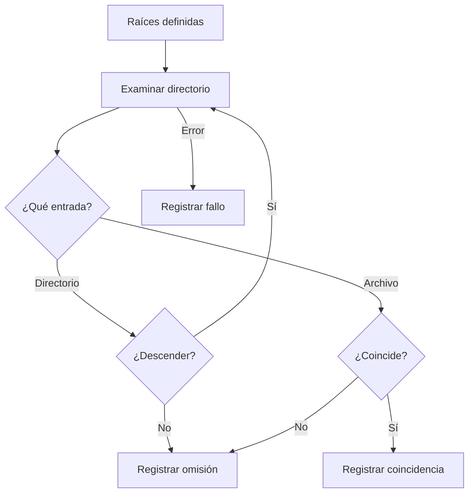

# Módulo 04 — Enumeración y selección de archivos

En el [Módulo 03](Ransomware-Modulo3) estudiamos cómo se genera y organiza el material criptográfico. Antes de que cualquier esquema de cifrado se aplique a datos, una muestra que trabaja sobre archivos debe resolver otro problema: **identificar qué ubicaciones puede examinar y decidir qué entradas considera pertinentes**. Este módulo estudia esa etapa a través de documentación de Windows, análisis de comportamientos observados y un conjunto de datos ficticios.

La enumeración no implica necesariamente cifrado. Un programa de copias de seguridad, un indexador y una herramienta de búsqueda también recorren directorios. Asimismo, dos muestras de ransomware pueden compartir un algoritmo criptográfico y diferir mucho en su alcance, sus exclusiones y la manera de tratar errores. La tarea del analista es describir **qué se observó**, separar lo que se infiere y reconocer lo que aún no se sabe.

Al terminar el módulo deberías poder:

1. Explicar las decisiones de alcance y selección que preceden al tratamiento de archivos.
2. Interpretar los datos y límites de la enumeración de directorios en Windows.
3. Distinguir una unidad con letra, un recurso de red por ruta UNC y una carpeta montada como volumen.
4. Examinar los efectos de permisos, rutas largas, puntos de análisis, archivos cambiantes y errores.
5. Evaluar qué prueban —y qué no prueban— una lista de extensiones, una lista de exclusiones y un evento aislado.

La terminología de ATT&CK ayuda a ubicar el tema: **File and Directory Discovery (T1083)** describe el descubrimiento de archivos y directorios; **Data Encrypted for Impact (T1486)** se refiere al cifrado que interrumpe el acceso; **Service Stop (T1489)** trata la detención de servicios. Una misma operación puede incluir las tres conductas, pero no deben confundirse al leer una muestra o redactar un informe. [MITRE ATT&CK: T1083](https://attack.mitre.org/techniques/T1083/) · [T1486](https://attack.mitre.org/techniques/T1486/) · [T1489](https://attack.mitre.org/techniques/T1489/).

## 4.1 Panorama general: cinco decisiones antes de interpretar un recorrido

Una enumeración puede describirse como una secuencia de decisiones. El orden siguiente es conceptual: una implementación real puede intercalar pasos o recibir parámetros de configuración.

| Decisión | Pregunta de análisis | Lo que no puede suponerse |
| --- | --- | --- |
| **Raíces** | ¿Desde qué carpetas, unidades o recursos comienza el recorrido? | Que «todas las unidades» abarque todos los datos de la organización. |
| **Descenso** | ¿Qué directorios se visitan y cuáles se omiten? | Que limitar la profundidad garantice cobertura o elimine todos los ciclos. |
| **Clasificación** | ¿Qué atributos de cada entrada influyen en la selección? | Que la extensión represente siempre el contenido real o el valor de un archivo. |
| **Tratamiento de excepciones** | ¿Qué ocurre con rutas inaccesibles, largas o cambiantes? | Que una ruta encontrada siga disponible o pueda abrirse después. |
| **Salida** | ¿Se conserva un inventario, se producen estadísticas o se entrega cada hallazgo a otra etapa? | Que haber enumerado un archivo demuestre que fue modificado. |

El flujo puede representarse así. Cada salida se registra por separado para que el resultado no dependa solo del número final de coincidencias.



Una forma compacta de leer una muestra es: **origen del recorrido → observación de entradas → aplicación de criterios → registro de resultados y errores**. Ese esquema distingue la enumeración del cifrado, de la exfiltración y de otras acciones posteriores. También permite comparar programas sin asumir que existe una única arquitectura de ransomware.

### Tres preguntas que deben acompañar cualquier afirmación

Cuando un informe diga «la muestra busca documentos», pregunta: ¿se observó una lista en el binario, se siguió una llamada durante la ejecución o se examinaron archivos afectados? Cuando diga «omite el sistema», pregunta si se ha probado en distintas rutas y configuraciones. Cuando diga «abarca la red», pregunta qué recursos estaban accesibles bajo la cuenta y el contexto en que se ejecutó. **Presencia de código, capacidad potencial y comportamiento observado son niveles de evidencia diferentes.**

## 4.2 Alcance: raíces locales, unidades y recursos de red

Una ruta inicial limita el universo que puede aparecer en la enumeración. Una carpeta bajo el perfil de un usuario no equivale a una unidad completa; una unidad con letra no representa necesariamente todos los volúmenes o recursos accesibles.

| Forma de acceso | Ejemplo de laboratorio | Aspecto relevante |
| --- | --- | --- |
| Carpeta específica | `C:\Lab\Datos` | El alcance depende de esa raíz y de los permisos sobre sus descendientes. |
| Unidad con letra | `D:\` | Una letra puede identificar un volumen local, un medio extraíble o una asignación de red. |
| Carpeta de volumen montado | `C:\Lab\Montado` | Un volumen puede quedar expuesto mediante una carpeta, sin recibir otra letra. |
| Recurso de red UNC | `\\servidor-lab\compartido` | Su acceso depende del contexto de red, credenciales y permisos. |

`GetLogicalDrives` devuelve un mapa de bits de las letras asignadas en ese momento. Microsoft incluye entre los ejemplos de unidad lógica una unidad local, un medio extraíble y un recurso de red **asignado con letra**. Por tanto, observar esa llamada no demuestra que el programa haya descubierto todos los recursos UNC ni todos los datos de la red. `GetDriveTypeW` clasifica el tipo de raíz consultada; `DRIVE_REMOTE` indica una unidad de red para esa consulta, no un inventario general de servidores. [Microsoft: GetLogicalDrives](https://learn.microsoft.com/en-us/windows/win32/api/fileapi/nf-fileapi-getlogicaldrives) · [GetDriveTypeW](https://learn.microsoft.com/en-us/windows/win32/api/fileapi/nf-fileapi-getdrivetypew).

Las unidades de red asignadas pueden variar entre sesiones y usuarios. El alcance efectivo también depende de permisos y disponibilidad. En un análisis, anota **desde qué identidad y en qué contexto se observó el recorrido**; evita traducir «examina letras de unidad» como «alcanza todas las carpetas compartidas».

La separación entre raíces, mecanismo de descubrimiento y permisos explica por qué el mismo programa puede obtener resultados distintos en dos equipos. Se documenta cada condición, en lugar de atribuir toda diferencia al código.

### El sistema de archivos cambia lo que puede observarse

La llamada de directorio no garantiza que todas las características del volumen sean iguales. Antes de generalizar un hallazgo, distingue el sistema de archivos local de una ruta servida por la red.

| Entorno | Qué conviene tener presente |
| --- | --- |
| **NTFS** | Incluye la MFT y admite puntos de análisis y diario USN. La presencia de esas funciones no implica que una muestra las utilice. |
| **ReFS** | Tiene características y formatos propios; admite ciertas operaciones USN, pero no debe describirse como «NTFS con otro nombre». |
| **FAT32** | No dispone de puntos de análisis al modo de NTFS y tiene límites propios, entre ellos un máximo de archivo menor que 4 GiB. |
| **SMB** | El cliente ve un recurso compartido; no puede asumir que tiene acceso a la estructura interna del volumen del servidor. Latencia y permisos también dependen del entorno. |
| **Volumen montado en carpeta** | La ruta puede pasar a otro volumen sin que aparezca una letra nueva. La política sobre puntos de análisis afecta si se cruza ese límite. |

Una tabla sobre «todos los archivos» debería identificar plataforma, sistema de archivos, versión, ruta y permisos. Microsoft compara las funciones de NTFS y FAT32, documenta ReFS y explica las carpetas montadas; las operaciones USN pueden dirigirse a NTFS o ReFS según el formato correspondiente. [Microsoft: comparación de sistemas de archivos](https://learn.microsoft.com/en-us/windows/win32/fileio/filesystem-functionality-comparison) · [ReFS](https://learn.microsoft.com/en-us/windows-server/storage/refs/refs-overview) · [operaciones USN](https://learn.microsoft.com/en-us/windows/win32/fileio/walking-a-buffer-of-change-journal-records) · [carpetas montadas](https://learn.microsoft.com/en-us/windows/win32/fileio/volume-mount-points).

## 4.3 Qué hace una enumeración de directorio en Windows

`FindFirstFileW` busca la primera entrada que coincide con un patrón y abre un identificador de búsqueda; `FindNextFileW` continúa la búsqueda; `FindClose` libera ese identificador. La variante `W` utiliza cadenas anchas. La información de cada entrada llega mediante `WIN32_FIND_DATAW`. El patrón y el directorio en el que se busca importan: la API no recorre automáticamente subdirectorios por llamar una sola vez. [Microsoft: FindFirstFileW](https://learn.microsoft.com/en-us/windows/win32/api/fileapi/nf-fileapi-findfirstfilew) · [FindNextFileW](https://learn.microsoft.com/en-us/windows/win32/api/fileapi/nf-fileapi-findnextfilew).

| Campo o resultado | Interpretación básica | Límite al interpretarlo |
| --- | --- | --- |
| `cFileName` | Nombre devuelto para la entrada | No es una clasificación del contenido. |
| `dwFileAttributes` | Atributos, entre ellos directorio y punto de análisis | Un atributo no explica por sí solo el destino de un vínculo. |
| `nFileSizeHigh` y `nFileSizeLow` | Dos partes del tamaño de archivo | Leer solo la parte baja pierde información para tamaños grandes. |
| `INVALID_HANDLE_VALUE` al iniciar | No se abrió una búsqueda válida | Es preciso consultar el error para distinguir causas. |
| Fin de `FindNextFileW` | No hay otra entrada o ocurrió un error | `ERROR_NO_MORE_FILES` distingue la terminación normal de otros errores. |

El tamaño se obtiene como `nFileSizeHigh × 2^32 + nFileSizeLow`. Por ejemplo, si la parte alta vale `1` y la baja `2`, el tamaño es `4 294 967 298` bytes, no `2` bytes. La estructura y la regla de cálculo constan en la documentación de Microsoft. [Microsoft: WIN32_FIND_DATAW](https://learn.microsoft.com/en-us/windows/win32/api/minwinbase/ns-minwinbase-win32_find_dataw).

La API **no ordena** los resultados. Tampoco convierte por sí sola una búsqueda en un inventario estable del volumen: las entradas pueden cambiar durante el trabajo, los permisos pueden impedir el acceso y algunas rutas pueden fallar. Si la reproducibilidad importa, se conservan el alcance, el momento, el contexto y los errores observados. [Microsoft: FindFirstFileW, observaciones](https://learn.microsoft.com/en-us/windows/win32/api/fileapi/nf-fileapi-findfirstfilew) · [FindNextFileW, códigos de error](https://learn.microsoft.com/en-us/windows/win32/api/fileapi/nf-fileapi-findnextfilew).

### Recursión y lista de pendientes

Para examinar subdirectorios se necesita repetir la búsqueda en cada uno. Dos modelos habituales son una función recursiva y una lista o cola explícita de directorios pendientes.

| Aspecto | Función recursiva | Lista de pendientes |
| --- | --- | --- |
| Estado del recorrido | Pila de llamadas | Estructura de datos visible para el programa |
| Claridad en un ejemplo pequeño | Suele ser fácil de seguir | Requiere explicar la estructura adicional |
| Directorios muy anidados | Puede agotar la pila o detenerse por un límite | Exige gestionar el crecimiento de la lista |
| Contabilidad de errores | Debe propagarse o registrarse en cada llamada | Puede asociarse a cada elemento pendiente |
| Cobertura | Depende de las mismas raíces y reglas de descenso | Depende de las mismas raíces y reglas de descenso |

Un límite como «20 niveles» contiene la profundidad de la recursión, **no prueba que el inventario esté completo**. También puede interrumpir un camino antes de llegar a entradas importantes. Un ciclo accesible dentro de esos niveles puede causar visitas repetidas. El criterio de cobertura tiene que declararse: qué raíces se incluyeron, qué se omitió y por qué.

### Otras fuentes de información sobre archivos

Las interfaces siguientes responden a preguntas distintas. La columna de rendimiento describe **qué debe medirse**, no asigna una velocidad universal. Del mismo modo, ninguna interfaz recibe una calificación fija de «más sigilosa»: la actividad observable depende de las operaciones, el volumen de trabajo y los registros activos.

| Mecanismo | Propósito y dependencia | Qué comparar y qué puede observarse |
| --- | --- | --- |
| `FindFirstFileW` / `FindNextFileW` | Entradas de un directorio mediante Win32; depende del sistema de archivos y permisos accesibles. | Tiempo por raíz, errores y operaciones de directorio; puede generar actividad de E/S observable. |
| `NtQueryDirectoryFile` | Información de entradas sobre un directorio abierto, mediante una interfaz nativa. | Tipo de información, volumen de solicitudes y compatibilidad. La llamada nativa **no garantiza** menor visibilidad. |
| Metadatos de la **MFT** | Estructura interna de NTFS, con requisitos y limitaciones distintos de un recorrido por rutas. | Identidad de registros, cobertura y costes de acceso; no extrapolar a FAT32, ReFS o SMB. |
| **Diario USN** | Registros de cambios de un volumen NTFS o ReFS, cuando están disponibles; requiere interpretar el formato y estado del diario. | Intervalo temporal y continuidad del diario; los cambios registrados no equivalen automáticamente a un inventario completo. |
| `ReadDirectoryChangesW` | Notificación de cambios en un directorio vigilado, no listado inicial de todos sus archivos. | Pérdida de eventos, alcance vigilado y tiempo de observación. |
| `.NET Directory.EnumerateFiles` | API administrada para recorrer entradas con opciones de búsqueda. | Comportamiento de la biblioteca, excepciones y coste observado; no asumir otro mecanismo físico solo por usar .NET. |
| WMI `CIM_DataFile` | Consulta mediante el proveedor WMI. | Alcance de la consulta y carga del proveedor; una consulta amplia puede ser costosa. |

La documentación de Microsoft describe la consulta nativa, las notificaciones y las operaciones USN; también advierte sobre consultas WMI amplias. Para comparar «huella» deben observarse los registros configurados y las operaciones de E/S, no inferirla a partir del nombre de la API. [Microsoft: NtQueryDirectoryFile](https://learn.microsoft.com/en-us/windows-hardware/drivers/ddi/ntifs/nf-ntifs-ntquerydirectoryfile) · [ReadDirectoryChangesW](https://learn.microsoft.com/en-us/windows/win32/api/winbase/nf-winbase-readdirectorychangesw) · [diario USN](https://learn.microsoft.com/en-us/windows/win32/fileio/walking-a-buffer-of-change-journal-records) · [.NET EnumerateFiles](https://learn.microsoft.com/en-us/dotnet/api/system.io.directory.enumeratefiles) · [CIM_DataFile](https://learn.microsoft.com/en-us/windows/win32/cimwin32prov/cim-datafile) · [ETW FileIo](https://learn.microsoft.com/en-us/windows/win32/etw/fileio).

## 4.4 Extensiones, tamaños y exclusiones: modelos de selección

Una lista de extensiones observada en una muestra describe un criterio de clasificación por **nombre**, no una inspección del formato interno. Un `.pdf` puede no contener un PDF; un archivo sin extensión puede contener información esencial. En Windows, muchas comparaciones habituales de nombres se realizan sin distinguir mayúsculas y minúsculas, pero el comportamiento concreto depende del sistema de archivos y de la operación; por eso la afirmación «Windows nunca distingue mayúsculas» sería demasiado amplia. [Microsoft: nombres de archivos y espacios de nombres](https://learn.microsoft.com/en-us/windows/win32/fileio/naming-a-file).

| Política conceptual | Qué incluye | Riesgo de interpretación |
| --- | --- | --- |
| Lista de extensiones aceptadas | Coincidencias con un conjunto declarado | Los formatos no listados quedan fuera, aunque sean relevantes. |
| Lista de extensiones excluidas | Entradas que no coinciden con las exclusiones | Puede abarcar tipos de archivo imprevistos. |
| Criterios combinados | Extensión, ubicación, atributos y tamaño | El resultado depende del orden y las prioridades de las reglas. |
| Configuración variable | Criterios recibidos por la muestra | Una lista extraída de una versión puede no describir otra ejecución. |

Una extensión asociada a bases de datos no demuestra por sí sola que exista una base de datos activa en el entorno. Del mismo modo, encontrar `.key`, `.pem` o `.pfx` en una lista no permite afirmar que **todos** esos archivos contienen claves privadas únicas o irrecuperables. El impacto depende de su contenido, uso, custodia, posibilidad de revocación y copias disponibles.

Las exclusiones merecen el mismo cuidado. Pueden evitar incompatibilidades o reflejar una configuración concreta. No hay una regla universal según la cual todas las familias preserven siempre el sistema operativo: ATT&CK documenta variaciones, incluso comportamientos que afectan archivos críticos o sectores de arranque. En la muestra examinada hay que distinguir **exclusión declarada**, **exclusión aplicada** y **efecto comprobado**. [MITRE ATT&CK: Data Encrypted for Impact](https://attack.mitre.org/techniques/T1486/).

### Umbrales de tamaño: una hipótesis, no una propiedad del archivo

Los umbrales `128 bytes` y `4 GB` que aparecen a menudo en ejemplos son decisiones arbitrarias si no se acompañan de un caso, una medición y una versión de la muestra. Un archivo pequeño puede contener una configuración imprescindible. Uno grande puede ser una base de datos, una máquina virtual o una copia que la organización necesita. Que un programa omita un archivo no demuestra que carezca de valor.

Conviene expresar los hallazgos así: «En esta configuración, las entradas fuera de un intervalo no pasaron a la etapa siguiente». Eso describe lo comprobado. Frases como «los archivos mayores de 4 GB tienen poco valor» no se derivan del tamaño.

### Coincidencias de rutas y nombres

Una comparación por prefijo mal definida puede confundir, por ejemplo, `C:\Windows` con `C:\WindowsArchive`. La comparación de un nombre final tampoco representa una ruta compuesta como `AppData\Local\Temp`. Rutas relativas, separadores, normalización y configuración regional añaden matices. El análisis de una lista de exclusiones debe examinar **cómo se compara** cada entrada, no solo qué cadenas contiene.

## 4.5 Casos límite del sistema de archivos

### Puntos de análisis, vínculos y carpetas montadas

`FILE_ATTRIBUTE_REPARSE_POINT` identifica un punto de análisis, categoría que abarca varios mecanismos. Un enlace simbólico, un *junction point* y una carpeta de volumen montado no son términos intercambiables. Omitir todos los puntos de análisis puede impedir ciclos, pero también deja fuera ubicaciones que el usuario ve como parte de un árbol. Seguirlos sin estudiar su destino puede repetir rutas o salir del alcance inicialmente supuesto. [Microsoft: Reparse Points](https://learn.microsoft.com/en-us/windows/win32/fileio/reparse-points) · [efectos en funciones del sistema de archivos](https://learn.microsoft.com/en-us/windows/win32/fileio/reparse-points-and-file-operations).

En los ejemplos de Rust conviene ser igual de preciso: `DirEntry::metadata()` **no sigue** un enlace simbólico para obtener los metadatos del destino. Esa característica no convierte por sí sola la comprobación de enlaces simbólicos en una política completa para todas las clases de puntos de análisis de Windows. [Rust: `DirEntry`](https://doc.rust-lang.org/std/fs/struct.DirEntry.html).

### Rutas largas y truncamiento

Un búfer grande no amplía automáticamente el límite de la API ni vuelve correcto truncar una ruta. Microsoft describe la longitud habitual de `MAX_PATH`, el formato de rutas extendidas y, para algunas funciones y versiones de Windows, las condiciones para optar por un tratamiento distinto. Una ruta truncada ya no identifica necesariamente la entrada original. [Microsoft: Maximum Path Length Limitation](https://learn.microsoft.com/en-us/windows/win32/fileio/maximum-file-path-limitation).

### Permisos, errores y cambios durante el recorrido

Una carpeta inaccesible es un resultado que debe constar, no un sinónimo de «carpeta vacía». El error puede deberse a permisos, a la desaparición de la ruta, a un dispositivo no disponible o a otras condiciones. Un archivo puede cambiar o desaparecer después de aparecer en la búsqueda. Por eso el número de entradas vistas, el número de entradas clasificadas y el número de operaciones posteriores completadas son medidas distintas.

En Rust, `std::fs::read_dir` entrega un iterador cuyos elementos pueden producir errores **después** de que se obtuvo el iterador. Su orden tampoco es estable entre llamadas. Usar `flatten()` simplifica el ejemplo, pero descarta los errores de las entradas individuales: una revisión rigurosa debe contabilizarlos. [Rust: `read_dir`](https://doc.rust-lang.org/std/fs/fn.read_dir.html).

### Una política de errores también define el resultado

Los errores no son un único contador. Hay que anotarlos junto con la **etapa** en que ocurren y la respuesta que se adoptó. Por ejemplo, un fallo de `FindFirstFileW` al abrir una carpeta no equivale a `ERROR_NO_MORE_FILES` al finalizar correctamente una búsqueda; una violación de uso compartido puede aparecer más tarde, cuando se intenta abrir un archivo ya descubierto.

| Situación | Respuestas conceptuales | Consecuencia para el informe |
| --- | --- | --- |
| Acceso denegado al directorio | Registrar y continuar con otras raíces; finalizar si la raíz era indispensable | La cobertura de ese árbol queda sin comprobar. |
| Ruta desaparecida o dispositivo no disponible | Registrar el estado y, si corresponde, comprobar de nuevo dentro de un límite definido | El inventario puede diferir entre dos momentos. |
| Ruta larga o nombre no representable por el método elegido | Registrar la incompatibilidad | Una ausencia en resultados no demuestra que la entrada no exista. |
| Error transitorio | Decidir si procede un intento adicional acotado | El número de intentos y su resultado deben contabilizarse. |
| Fallos reiterados de una raíz | Continuar con una nota de cobertura o terminar según la regla anunciada | No etiquetar una ejecución incompleta como éxito pleno. |

«Saltar sin registrar» puede dejar una salida breve, pero impide distinguir exclusión voluntaria de fallo de acceso. La política de continuación o finalización debe formar parte del diseño del experimento y de su informe. Para `FindNextFileW`, Microsoft distingue `ERROR_NO_MORE_FILES` de otras causas de fallo; no se cuentan ambas como error. [Microsoft: FindNextFileW](https://learn.microsoft.com/en-us/windows/win32/api/fileapi/nf-fileapi-findnextfilew).

## 4.6 De la entrada encontrada a la siguiente etapa

La enumeración puede entregar cada entrada conforme aparece o acumular un inventario antes de continuar. Ningún modelo garantiza por sí mismo que la información siga vigente.

| Modelo | Qué facilita | Qué exige examinar |
| --- | --- | --- |
| Entrega inmediata | No necesita mantener toda la lista en memoria | La etapa siguiente puede encontrar archivos cambiados o bloqueados. |
| Inventario previo | Permite contar y revisar entradas antes de otra operación | La lista puede crecer mucho y quedar desactualizada. |

Si una implementación guarda entradas en memoria, debe tratar con cuidado el crecimiento, los errores de asignación y los tamaños. `HeapReAlloc` puede fallar; Microsoft indica que, en ese caso, la asignación original continúa válida. Sobrescribir el único puntero sin comprobar el resultado puede perder el acceso al bloque. Esta es una observación sobre la calidad del código, **no una propiedad especial del ransomware**. [Microsoft: HeapReAlloc](https://learn.microsoft.com/en-us/windows/win32/api/heapapi/nf-heapapi-heaprealloc).

La enumeración tampoco concede automáticamente acceso de lectura o escritura. Al abrir después un archivo, Windows comprueba el acceso solicitado y los modos de uso compartido de otros identificadores abiertos. Una incompatibilidad puede producir `ERROR_SHARING_VIOLATION`. No puede afirmarse que **todos** los motores de base de datos abren **todos** sus archivos con el mismo modo; depende del producto, versión, archivo y operación. [Microsoft: CreateFile y modos de uso compartido](https://learn.microsoft.com/en-us/windows/win32/api/fileapi/nf-fileapi-createfilew).

## 4.7 Métricas, cobertura y carga del recorrido

Medir requiere fijar **qué se cuenta**, la raíz, el contexto y los instantes de inicio y fin. Una cifra de velocidad sin esa definición no permite comparar dos ejecuciones.

| Métrica | Definición para este módulo | Interpretación |
| --- | --- | --- |
| Directorios visitados | Carpetas cuya búsqueda llegó a iniciarse | No incluye las excluidas antes de abrirse. |
| Entradas vistas | Entradas devueltas por las búsquedas, sean archivos o directorios | No equivale al número de archivos. |
| Archivos clasificados | Archivos para los que se pudo aplicar la política de selección | Puede ser menor que los archivos vistos si falló la lectura de metadatos. |
| Coincidencias | Archivos clasificados que cumplieron la política | No equivale a archivos modificados ni procesados después. |
| Errores por etapa y tipo | Conteo de fallos al abrir carpetas, leer entradas, consultar metadatos o acceder posteriormente al archivo | `ERROR_SHARING_VIOLATION` de una apertura posterior no pertenece al contador de búsqueda de entradas. |
| Tiempo por raíz | Instante final menos instante inicial de esa raíz | Indicar si incluye preparación, clasificación y escritura del informe. |
| Entradas por segundo | Entradas vistas ÷ tiempo medido, si el tiempo es mayor que cero | Métrica descriptiva; depende de caché, medio, tamaño del árbol y carga concurrente. |

**Cobertura conocida:** si un árbol de prueba contiene siete archivos distintos y se observan seis, la cobertura del inventario frente a ese conjunto es `6/7 ≈ 85,7 %`. Si la séptima entrada está bajo una carpeta excluida, explica esa causa. En una red o equipo sin inventario de referencia no puede calcularse la «cobertura real» con un denominador desconocido; se informa **cobertura estimada** y se describen los límites de esa estimación. Una raíz sin acceso no se convierte en cero archivos existentes.

### Ficha breve de resultados para un ejercicio

| Campo | Ejemplo con la práctica de 4.11 |
| --- | --- |
| Raíz y contexto | Directorio temporal creado por el propio programa; un proceso local. |
| Directorios visitados / omitidos | 4 / 1. |
| Entradas vistas | 10: seis archivos y cuatro directorios encontrados. |
| Archivos vistos / clasificados / coincidencias | 6 / 6 / 3. |
| Errores | 0 en esta ejecución; el programa los desglosa por etapa y clase cuando aparecen. |
| Tiempo y entradas por segundo | Valores que imprime el programa para esa ejecución; no se comparan sin repetir condiciones. |
| Cobertura frente al conjunto conocido | 6 de 7 archivos preparados; uno está bajo la carpeta excluida. |

### Rendimiento y alcance operativo

Un inventario previo consume memoria proporcional a las entradas guardadas; un flujo inmediato reduce ese inventario, pero no resuelve permisos ni archivos cambiantes. Recorrer varias raíces en paralelo puede alterar la duración y la carga de E/S: **más hilos no implica una mejora lineal** en disco local o recurso de red. Aquí se miden tiempo, errores y carga observada; la sincronización y los grupos de hilos pertenecen al módulo 6 previsto en la serie.

La comparación entre una ejecución de **alto alcance** y otra de **alcance acotado** se documenta por raíces, duración, resultados y carga, no mediante etiquetas universales de «agresivo» o «sigiloso». Priorizar el orden de las raíces significa respetar el objetivo y los límites del ejercicio y declarar qué quedó pendiente. Una API distinta tampoco convierte automáticamente un recorrido en menos observable: las operaciones de archivo pueden estudiarse con la instrumentación disponible. [Microsoft: ETW FileIo](https://learn.microsoft.com/en-us/windows/win32/etw/fileio).

## 4.8 Servicios y procesos: conducta relacionada, objeto de estudio distinto

Detener aplicaciones o servicios antes de acceder a ciertos archivos aparece en informes sobre ransomware. MITRE lo clasifica como **Service Stop (T1489)**; cuando se perjudica la recuperación, también puede relacionarse con **Inhibit System Recovery (T1490)**. La enumeración de archivos termina donde comienza la acción sobre procesos o servicios: su relación debe explicarse, sin presentarlas como una única API ni como un paso obligatorio. [MITRE ATT&CK: T1489](https://attack.mitre.org/techniques/T1489/) · [T1490](https://attack.mitre.org/techniques/T1490/).

Hay dos errores frecuentes al leer ejemplos de esta conducta:

- `OpenServiceW` recibe el **nombre de un servicio existente**, no una expresión con comodines como `MSSQL$*`. Tampoco hay que confundir el nombre interno del servicio con su nombre visible en una interfaz. [Microsoft: OpenServiceW](https://learn.microsoft.com/en-us/windows/win32/api/winsvc/nf-winsvc-openservicew).
- Un tiempo de espera fijo no demuestra que los recursos ya estén liberados, ni que la acción anterior haya funcionado. Hay que verificar el estado real y los errores antes de atribuir un resultado.

En un informe, el evento de seguridad **4689** puede acreditar que un proceso salió cuando la auditoría de terminación correspondiente genera ese registro. Por sí solo no establece que otro programa lo haya terminado ni explica por qué salió. Una secuencia temporal ayuda a formular hipótesis; para sostener causalidad se requieren más datos. [Microsoft: evento 4689](https://learn.microsoft.com/en-us/previous-versions/windows/it-pro/windows-10/security/threat-protection/auditing/event-4689) · [Audit Process Termination](https://learn.microsoft.com/en-us/previous-versions/windows/it-pro/windows-10/security/threat-protection/auditing/audit-process-termination).

## 4.9 Análisis de un informe público: qué se sabe y qué falta

El [aviso conjunto de FBI, CISA, MS-ISAC y HHS sobre RansomHub](https://www.cisa.gov/sites/default/files/2024-09/aa24-242a-stopransomware-ransomhub-ransomware_1.pdf) informa que el ejecutable **habitualmente no cifra archivos ejecutables** y describe el cambio de extensión y la nota que suele dejar. Se trata de observaciones de ese aviso, no de una ley aplicable a cada muestra o versión.

| Enunciado | Clasificación de evidencia | Lectura correcta |
| --- | --- | --- |
| El aviso indica que habitualmente no cifra ejecutables. | Comportamiento reportado por las agencias. | No permite asegurar que toda variante los excluye. |
| La exclusión puede estar relacionada con mantener programas disponibles. | Hipótesis explicativa. | Necesita datos adicionales para atribuir esa motivación a la muestra. |
| La muestra recorre todos los recursos de red. | No se desprende del dato citado. | Hacen falta evidencia del alcance y condiciones de ejecución. |
| Se añadió una extensión a los archivos afectados. | Comportamiento reportado. | El cambio de nombre no describe por sí solo la rutina de enumeración. |

El ejercicio ilustra una regla útil: **no convertir una característica de los resultados en una reconstrucción completa del algoritmo que los produjo**. La documentación de la API explica posibilidades técnicas; un aviso describe hechos observados en su ámbito; el análisis de una versión concreta requiere además evidencia de esa versión.

## 4.10 Laboratorio de lectura: inventario ficticio

Este ejercicio utiliza un **manifiesto inventado**, sin examinar un sistema real. La política hipotética del ejercicio acepta `.pdf`, `.docx` y `.db`; omite las carpetas llamadas `Sistema`; y considera solo entradas de **128 bytes a 4 GB, inclusive**. No se trata de una política atribuida a una familia real.

| ID | Entrada en el manifiesto | Tamaño | Observación |
| --- | --- | ---: | --- |
| A | `C:\Lab\Datos\acta.docx` | 50 000 B | Archivo ordinario. |
| B | `C:\Lab\Datos\resumen.PDF` | 100 B | Extensión en mayúsculas. |
| C | `C:\Lab\Datos\agenda.db` | 4 294 967 296 B | Exactamente 4 GB. |
| D | `C:\Lab\Sistema\manual.pdf` | 20 000 B | Carpeta excluida. |
| E | `C:\Lab\Datos\sin_extension` | 800 B | Contenido desconocido. |
| F | `C:\Lab\Datos\enlace.docx` | 2 000 B | La entrada es un enlace simbólico. |
| G | `C:\Lab\Datos\base.db` | 5 000 B | El archivo desaparece después del inventario. |
| H | `\\servidor-lab\datos\contrato.pdf` | 30 000 B | Recurso UNC ajeno a la raíz `C:\Lab`. |

**Lectura razonada:** A satisface los criterios nominales. B tiene una extensión que podría coincidir si la comparación no distingue mayúsculas, pero falla por tamaño. C se encuentra exactamente en el límite superior y, bajo la regla inclusiva declarada, pasa el filtro de tamaño; cambiar la comparación del límite cambiaría ese resultado. D queda fuera por la carpeta según la política hipotética. E queda fuera por el nombre, aunque se desconoce su contenido. F requiere conocer la regla para enlaces; la extensión y el tamaño no bastan. G pudo clasificarse durante el inventario, pero su desaparición impide inferir una operación posterior. H no puede aparecer si el único origen del recorrido es `C:\Lab`, aunque el nombre del archivo coincida con la política.

El propósito del ejercicio es escribir resultados con condiciones precisas. «Apareció en un listado», «cumple un filtro nominal» y «quedó afectado» son tres afirmaciones diferentes.

## 4.11 Laboratorio ejecutable: recorrido y clasificación en datos de prueba

**Requisitos:** Python 3.10 o posterior; no se requieren paquetes externos. Guarda el siguiente bloque como `lab_mod4.py` y ejecútalo con `python lab_mod4.py` en Windows o `python3 lab_mod4.py` en Linux y macOS. El programa crea siete archivos pequeños bajo un directorio temporal, examina únicamente ese directorio, imprime una clasificación y elimina los datos al finalizar. No modifica los archivos inventariados.

```python
"""Laboratorio de enumeración: trabaja solo dentro de un directorio temporal."""

import os
import tempfile
from collections import Counter
from pathlib import Path
from time import perf_counter

EXTENSIONES = {".pdf", ".docx", ".db"}
MIN_BYTES = 128
MAX_BYTES = 4 * 1024**3


def crear_entrada(raiz: Path, relativa: str, tamano: int) -> None:
    destino = raiz / relativa
    destino.parent.mkdir(parents=True, exist_ok=True)
    destino.write_bytes(b"x" * tamano)


def preparar_datos(raiz: Path) -> None:
    crear_entrada(raiz, "Datos/acta.docx", 256)
    crear_entrada(raiz, "Datos/resumen.PDF", 100)
    crear_entrada(raiz, "Datos/agenda.db", 512)
    crear_entrada(raiz, "Sistema/manual.pdf", 512)
    crear_entrada(raiz, "Datos/sin_extension", 800)
    crear_entrada(raiz, "Datos/Profundo/informe.pdf", 128)
    crear_entrada(raiz, "Otros/imagen.png", 300)


def clasificar(nombre: str, tamano: int) -> str:
    if Path(nombre).suffix.casefold() not in EXTENSIONES:
        return "omitir: extension"
    if not MIN_BYTES <= tamano <= MAX_BYTES:
        return "omitir: tamano"
    return "coincide"


def inventariar(raiz: Path) -> tuple[list[tuple[str, str]], Counter, float]:
    resultado = []
    pendientes = [raiz]
    metricas = Counter()
    inicio = perf_counter()

    while pendientes:
        directorio = pendientes.pop()
        try:
            with os.scandir(directorio) as entradas:
                metricas["directorios_visitados"] += 1
                for entrada in entradas:
                    metricas["entradas_vistas"] += 1
                    ruta = Path(entrada.path)
                    relativa = ruta.relative_to(raiz).as_posix()
                    try:
                        if entrada.is_symlink():
                            metricas["enlaces_omitidos"] += 1
                            resultado.append((relativa, "omitir: enlace"))
                        elif entrada.is_dir(follow_symlinks=False):
                            if entrada.name.casefold() == "sistema":
                                metricas["directorios_omitidos"] += 1
                                resultado.append((relativa + "/", "omitir: carpeta"))
                            else:
                                pendientes.append(ruta)
                        elif entrada.is_file(follow_symlinks=False):
                            metricas["archivos_vistos"] += 1
                            tamano = entrada.stat(follow_symlinks=False).st_size
                            decision = clasificar(entrada.name, tamano)
                            metricas["archivos_clasificados"] += 1
                            if decision == "coincide":
                                metricas["coincidencias"] += 1
                            resultado.append((relativa, decision))
                    except OSError as error:
                        metricas[f"error_entrada_{error.__class__.__name__}"] += 1
                        resultado.append((relativa, f"error: {error.__class__.__name__}"))
        except OSError as error:
            metricas[f"error_directorio_{error.__class__.__name__}"] += 1
            relativa = directorio.relative_to(raiz).as_posix()
            resultado.append((relativa + "/", f"error: {error.__class__.__name__}"))

    return sorted(resultado), metricas, perf_counter() - inicio


def main() -> None:
    with tempfile.TemporaryDirectory(prefix="modulo4_") as temporal:
        raiz = Path(temporal)
        preparar_datos(raiz)
        inventario, metricas, segundos = inventariar(raiz)
        for ruta, resultado in inventario:
            print(f"{ruta:35} {resultado}")
        for nombre in sorted(metricas):
            print(f"{nombre}: {metricas[nombre]}")
        print(f"Duración: {segundos:.6f} s")
        if segundos > 0:
            print(f"Entradas/s: {metricas['entradas_vistas'] / segundos:.2f}")
        print("Límite exacto:", clasificar("agenda.db", MAX_BYTES))
        print("Un byte por encima:", clasificar("agenda.db", MAX_BYTES + 1))


if __name__ == "__main__":
    main()
```

La función `preparar_datos` construye un caso que puede repetirse. `inventariar` mantiene una lista explícita de carpetas pendientes; `os.scandir` devuelve las entradas; `is_dir(follow_symlinks=False)` evita descender por enlaces simbólicos; `stat` consulta el tamaño. `clasificar` aplica una política de ejemplo sobre **nombre y tamaño**, sin inspeccionar ni alterar contenido. Los errores de lectura de entradas y carpetas se registran por etapa y clase. `perf_counter` mide la duración del recorrido, y `Counter` lleva las métricas. La llamada `sorted` ordena la salida del ejercicio; no significa que el sistema de archivos entregara ese orden.

| Operación del laboratorio | Concepto equivalente que hay que reconocer en Windows | Límite de la comparación |
| --- | --- | --- |
| `os.scandir(directorio)` | Abrir y continuar una búsqueda de entradas | No afirma que Python llame exactamente a la misma API en toda versión o plataforma. |
| `entrada.stat(...).st_size` | Interpretar el tamaño disponible en la entrada | En Win32 se combinan `nFileSizeHigh` y `nFileSizeLow`. |
| `entrada.is_symlink()` | Tratar enlaces simbólicos | En Windows existen otros puntos de análisis; el ejemplo no los clasifica todos. |
| `pendientes` | Estado explícito de directorios por visitar | La lista de raíces y los permisos siguen definiendo la cobertura. |

**Salida esperada** (las columnas pueden variar según la fuente de la terminal):

```text
Datos/Profundo/informe.pdf          coincide
Datos/acta.docx                     coincide
Datos/agenda.db                     coincide
Datos/resumen.PDF                   omitir: tamano
Datos/sin_extension                 omitir: extension
Otros/imagen.png                    omitir: extension
Sistema/                            omitir: carpeta
archivos_clasificados: 6
archivos_vistos: 6
coincidencias: 3
directorios_omitidos: 1
directorios_visitados: 4
entradas_vistas: 10
Duración: <variable> s
Entradas/s: <variable>
Límite exacto: coincide
Un byte por encima: omitir: tamano
```

Los dos valores marcados como variables dependen de la ejecución. Con un conjunto tan pequeño sirven para comprobar la fórmula y la instrumentación, **no** para obtener un benchmark representativo. Si aparecen errores, se imprimen contadores adicionales por etapa y clase.

### Práctica guiada

1. **Comprobar y explicar.** Ejecuta el programa sin modificarlo. Identifica tres entradas que coinciden, dos excluidas por extensión, una por tamaño y una carpeta excluida. Explica por qué el programa no imprime `Sistema/manual.pdf`: no llegó a examinar sus entradas.
2. **Cambiar una sola condición.** Sustituye `MIN_BYTES = 128` por `MIN_BYTES = 0`. Antes de ejecutar, predice la clasificación de `Datos/resumen.PDF`. Comprueba la predicción y restablece el valor original.
3. **Distinguir nombre y contenido.** Añade `crear_entrada(raiz, "Datos/falso.pdf", 200)` a `preparar_datos`. Observa el resultado. ¿Por qué «coincide» no demuestra que los bytes formen un PDF? La función solo examina la extensión y el tamaño.
4. **Examinar una exclusión por nombre.** Añade `crear_entrada(raiz, "Sistema2/nota.pdf", 200)`. Predice si se omitirá esa carpeta. Explica la diferencia entre comparar el nombre completo `Sistema` y comparar un prefijo.
5. **Examinar el límite.** Explica por qué `MAX_BYTES` y `MAX_BYTES + 1` reciben resultados distintos sin crear físicamente un archivo de 4 GB. Localiza la condición exacta en `clasificar`.
6. **Relacionar con Windows.** Para un archivo de más de 4 GB, calcula el tamaño a partir de `nFileSizeHigh = 1` y `nFileSizeLow = 2`. Comprueba tu resultado con la fórmula de 4.3 y explica el error de usar solo la parte baja.
7. **Leer las métricas.** Comprueba que diez entradas vistas incluyen seis archivos y cuatro directorios; solo cuatro directorios se visitan porque uno se omite. ¿Por qué los seis archivos clasificados no equivalen a los siete archivos preparados?

**Resultados de control:** en la práctica 2, `resumen.PDF` pasa a «coincide» porque su extensión se compara sin distinguir mayúsculas; en la 3, `falso.pdf` también coincide aunque el contenido no sea un PDF; en la 4, `Sistema2/nota.pdf` coincide porque `Sistema2` no es igual a `Sistema`; en la 5, el límite exacto coincide y un byte adicional queda fuera; en la 6, el tamaño es `4 294 967 298` bytes. En la 7, `Sistema/manual.pdf` fue preparado, pero no se vio ni clasificó porque el recorrido omitió esa carpeta.

El ejercicio reproduce una **clasificación local de datos temporales**. No examina letras de unidad, recursos UNC ni servicios. Esos casos se estudian con sus documentos y evidencias propios, tal como se explicó en 4.2 y 4.8.

## 4.12 Laboratorio Win32: observar las API en una carpeta temporal

Este segundo ejercicio muestra directamente `FindFirstFileW`, `FindNextFileW`, `FindClose` y los campos de `WIN32_FIND_DATAW`. Se limita a dos archivos que el propio programa crea en una carpeta temporal con un nombre asociado al proceso; no recorre subdirectorios. Al terminar, elimina esos dos archivos y la carpeta. Es una comparación de interfaces, no una aplicación de la política de selección de 4.11.

**Requisitos:** Windows con MSVC y Windows SDK. En una *Developer Command Prompt for Visual Studio*, guarda el bloque como `lab_win32_mod4.c`, compílalo con `cl /W4 /utf-8 lab_win32_mod4.c` y ejecuta `lab_win32_mod4.exe`.

```c
/* Laboratorio Win32: solo una carpeta temporal creada por este programa. */
#define UNICODE
#define _UNICODE
#include <windows.h>
#include <stdio.h>
#include <wchar.h>

static BOOL crear_prueba(const WCHAR *ruta, DWORD cantidad) {
    BYTE datos[256];
    for (DWORD i = 0; i < sizeof datos; ++i) datos[i] = (BYTE)'x';
    HANDLE h = CreateFileW(ruta, GENERIC_WRITE, 0, NULL, CREATE_NEW,
                           FILE_ATTRIBUTE_NORMAL, NULL);
    if (h == INVALID_HANDLE_VALUE) return FALSE;
    DWORD escritos = 0;
    BOOL ok = WriteFile(h, datos, cantidad, &escritos, NULL);
    CloseHandle(h);
    return ok && escritos == cantidad;
}

int wmain(void) {
    WCHAR temporal[MAX_PATH], raiz[MAX_PATH], patron[MAX_PATH];
    WCHAR archivo1[MAX_PATH], archivo2[MAX_PATH];
    DWORD n = GetTempPathW(MAX_PATH, temporal);
    if (n == 0 || n >= MAX_PATH) return 1;
    if (swprintf_s(raiz, MAX_PATH, L"%lsModulo4API_%lu", temporal,
                   GetCurrentProcessId()) < 0) return 1;
    if (!CreateDirectoryW(raiz, NULL)) return 1;

    if (swprintf_s(archivo1, MAX_PATH, L"%ls\\acta.docx", raiz) < 0 ||
        swprintf_s(archivo2, MAX_PATH, L"%ls\\resumen.pdf", raiz) < 0 ||
        swprintf_s(patron, MAX_PATH, L"%ls\\*", raiz) < 0) {
        RemoveDirectoryW(raiz);
        return 1;
    }

    if (!crear_prueba(archivo1, 256) || !crear_prueba(archivo2, 100)) {
        fwprintf(stderr, L"No se pudieron preparar los datos de prueba.\n");
        DeleteFileW(archivo1);
        DeleteFileW(archivo2);
        RemoveDirectoryW(raiz);
        return 1;
    }

    WIN32_FIND_DATAW entrada;
    HANDLE busqueda = FindFirstFileW(patron, &entrada);
    if (busqueda == INVALID_HANDLE_VALUE) {
        fwprintf(stderr, L"FindFirstFileW falló: %lu\n", GetLastError());
        DeleteFileW(archivo1);
        DeleteFileW(archivo2);
        RemoveDirectoryW(raiz);
        return 1;
    }

    do {
        if (wcscmp(entrada.cFileName, L".") == 0 ||
            wcscmp(entrada.cFileName, L"..") == 0) continue;
        if (!(entrada.dwFileAttributes & FILE_ATTRIBUTE_DIRECTORY)) {
            ULONGLONG tamano = ((ULONGLONG)entrada.nFileSizeHigh << 32) |
                                 entrada.nFileSizeLow;
            wprintf(L"%ls: %llu bytes\n", entrada.cFileName, tamano);
        }
    } while (FindNextFileW(busqueda, &entrada));

    DWORD ultimo_error = GetLastError();
    FindClose(busqueda);
    DeleteFileW(archivo1);
    DeleteFileW(archivo2);
    RemoveDirectoryW(raiz);
    if (ultimo_error != ERROR_NO_MORE_FILES) {
        fwprintf(stderr, L"Recorrido interrumpido: %lu\n", ultimo_error);
        return 1;
    }
    return 0;
}
```

La salida contiene `acta.docx: 256 bytes` y `resumen.pdf: 100 bytes`; el orden no está garantizado. `nFileSizeHigh` y `nFileSizeLow` se combinan antes de imprimir el tamaño. Tras la última llamada a `FindNextFileW`, el programa distingue `ERROR_NO_MORE_FILES` de una interrupción de la búsqueda. `FindClose` libera el identificador de búsqueda. [Microsoft: FindFirstFileW](https://learn.microsoft.com/en-us/windows/win32/api/fileapi/nf-fileapi-findfirstfilew) · [FindNextFileW](https://learn.microsoft.com/en-us/windows/win32/api/fileapi/nf-fileapi-findnextfilew) · [FindClose](https://learn.microsoft.com/en-us/windows/win32/api/fileapi/nf-fileapi-findclose).

**Comprobaciones propuestas:**

1. ¿Por qué el ejercicio Win32 muestra dos archivos mientras el de Python muestra seis archivos vistos?
2. ¿Cuál de los dos ejemplos usa una lista explícita de directorios pendientes?
3. ¿Qué datos del ejemplo Win32 son comparables con `archivos_vistos` y cuáles no permiten calcular `entradas_vistas` de todo un árbol?

## 4.13 Guía para leer código o informes sobre enumeración

Al revisar una muestra o un análisis publicado, registra los siguientes elementos y la fuente exacta de cada uno:

| Elemento | Pregunta de verificación |
| --- | --- |
| Versión y entorno | ¿A qué muestra, configuración, sistema y fecha corresponde la observación? |
| Raíces | ¿Fueron vistas en ejecución, extraídas de configuración o inferidas de archivos afectados? |
| Tipo de recorrido | ¿Hay evidencia de descenso por subdirectorios y de los límites aplicados? |
| Selección | ¿Se sabe cómo se comparan nombres, rutas, atributos y tamaños? |
| Excepciones | ¿Se distinguen acceso denegado, fin normal, ausencia de ruta y otros errores? |
| Transición a otra etapa | ¿Existe evidencia separada de lectura, cambio de nombre, cifrado u otra acción? |
| Variabilidad | ¿El hallazgo pertenece a una variante, a una opción de configuración o a toda la familia? |

Una descripción rigurosa conserva también los **resultados negativos**. Si no se vio acceso a una carpeta, puede deberse a exclusión, falta de permisos, ausencia de la ruta, límite del experimento o falta de visibilidad del instrumento de análisis. Sin distinguir esas posibilidades, «no se enumeró» es una conclusión demasiado fuerte.

## Xtra:

1. ¿Qué información entregan `FindFirstFileW` y `FindNextFileW`, y cuáles de esos datos bastan para clasificar una entrada sin abrir el archivo?
2. ¿Qué revelan las listas de extensiones y exclusiones documentadas para una familia de ransomware acerca de sus prioridades? ¿Qué conclusiones no se sostienen solo con esas listas?
3. ¿En qué difieren una selección por extensiones permitidas y otra por extensiones excluidas cuando aparece un formato nuevo o poco habitual?
4. ¿Qué diferencias hay entre una unidad con letra, un volumen montado en una carpeta y una ruta UNC? ¿Cuál de esas ubicaciones queda sin demostrar cuando un informe solo menciona «recorrer las unidades»?
5. ¿Cómo intervienen los enlaces simbólicos y los *junction points* en un recorrido? ¿Por qué un límite de profundidad no demuestra que todos los archivos fueron examinados?
6. ¿En qué entornos un umbral de 128 bytes a 4 GB podría dejar fuera datos relevantes? ¿Qué información haría falta para interpretar el alcance de esa exclusión?
7. ¿Qué diferencias de memoria, control de errores y registro de cobertura presentan una función recursiva y una cola de directorios pendientes?
8. ¿Qué indica `ERROR_SHARING_VIOLATION` y por qué descubrir un archivo no garantiza que pueda abrirse después?
9. ¿Cómo difieren los criterios de alcance y selección de dos familias documentadas? ¿Qué parte de la comparación corresponde a observaciones y qué parte sigue siendo inferencia?
10. ¿Qué evidencia permitiría sostener que una muestra examinó «todos los archivos de la red»? ¿Qué límites introducen las letras de unidad, las rutas UNC y los permisos?
11. ¿Cuándo dos políticas de clasificación que parecen equivalentes producen resultados distintos para rutas, extensiones, tamaños o carpetas excluidas?
12. ¿Qué evidencia vincula la interrupción de un proceso o servicio con el posterior acceso a ciertos archivos? ¿Qué otras explicaciones pueden existir para la secuencia temporal observada?

## Resumen del módulo 04

La enumeración determina **qué entradas llegan a ser consideradas**. Sus resultados dependen del alcance, de las reglas de descenso, de los criterios nominales, del entorno y de los errores. `FindFirstFileW` y `FindNextFileW` describen la búsqueda de entradas en un directorio; `GetLogicalDrives` informa letras asignadas, no todos los recursos de una red. Una extensión o una exclusión no demuestra por sí sola el destino final de un archivo. El laboratorio permite comprobar estas diferencias con archivos temporales y una salida reproducible.

Para estudiar una familia real, vincula cada afirmación a una versión y una fuente. Registra las condiciones del análisis, diferencia capacidad de ejecución observada y evita convertir una hipótesis sobre el impacto en un hecho técnico. La interrupción de procesos y servicios puede relacionarse con archivos en uso, pero constituye otra conducta y requiere su propia evidencia.

**Siguiente:** Módulo 05 — Windows Internals: E/S de archivos, hilos, sincronización y grupos de trabajo.
