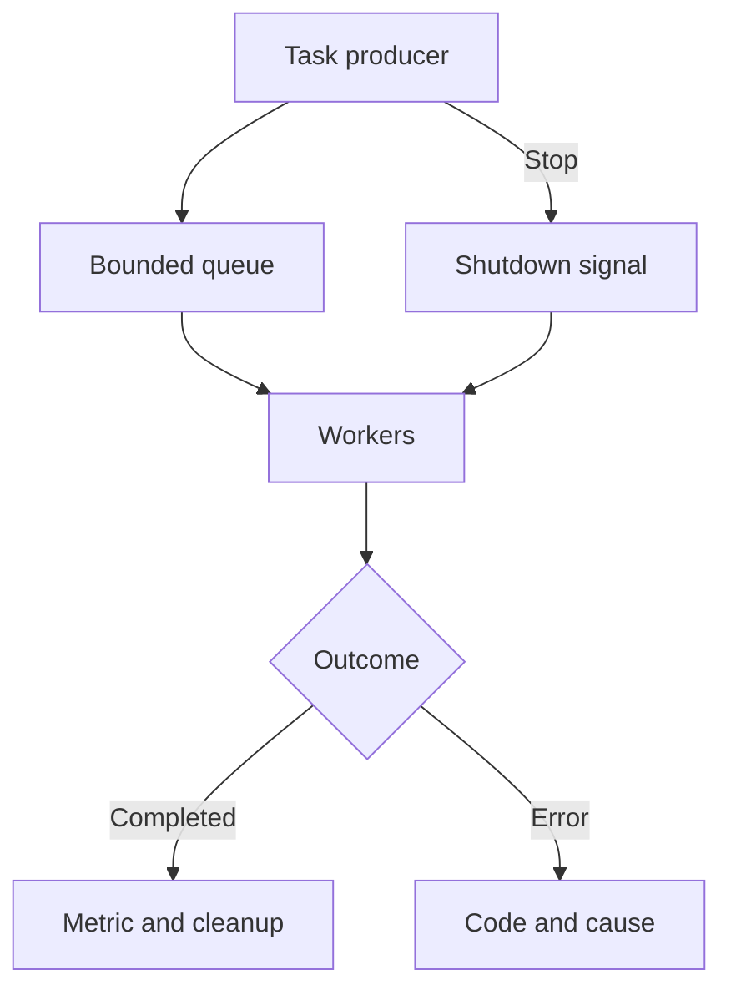

# Module 05 — Concurrency and I/O in Windows

Windows coordinates concurrent work through threads, synchronization objects, and input/output (I/O) operations. When a process handles many tasks, its correctness and performance depend on how it distributes work, limits outstanding operations, detects errors, and releases resources. An API alone does not establish a performance level: the outcome depends on task size, the file system, storage, cache state, and other activity on the machine.

[Module 04](Ransomware-Modulo4-en) separated directory traversal, classification, and observed outcomes. This module examines **what happens after a unit of work is produced**: how it enters a queue, how a worker receives it, how I/O takes place, and how the outcome is recorded. This subject matters when analyzing ransomware because such processes may handle many entries. The same mechanisms also appear in indexers, backup software, and server applications. The lab uses synthetic tasks and a temporary file that its own program creates and removes; it accepts no user-supplied file paths and modifies no existing documents.

By the end of this module, you should be able to:

1. Distinguish concurrency, parallelism, and pending I/O, and describe the lifecycle of threads, objects, and handles.
2. Build a bounded queue and explain the roles of mutual exclusion, semaphores, events, and atomic counters.
3. Compare synchronous reads, overlapped reads (`OVERLAPPED`), and memory-mapped reads without assuming that any method is always faster.
4. Explain the lifecycle contract of a `PTP_WORK` object and how to wait for its callbacks to finish.
5. Measure elapsed time and outcomes, reproduce failures, interpret traces, and state the limits of a comparison.

## 5.1 The work model



A **task** is an accountable unit with an identifier, state, and outcome. The producer must not equate “submitted” with “completed.” In sample analysis, an operation that started likewise does not prove that it succeeded. A **bounded queue** prevents the producer from accumulating unlimited work while the consumer runs more slowly. When the queue fills, the producer waits: this is backpressure. The worker count limits concurrent execution, whereas queue capacity limits outstanding work. These are separate parameters.

**Concurrency** means that several tasks can be in progress over an interval; **parallelism** means that some of them execute instructions at the same time on different processors. A worker blocked on I/O still occupies a thread, even if it uses no CPU. An `OVERLAPPED` operation can remain pending without blocking the thread that initiated it, depending on how completion is collected. Requests may complete immediately or remain pending. [Microsoft: Synchronous and Asynchronous I/O](https://learn.microsoft.com/en-us/windows/win32/fileio/synchronous-and-asynchronous-i-o).

### Lifecycle and resources

| Resource | Creation | Use | Completion |
| --- | --- | --- | --- |
| Explicit thread | `CreateThread` | Wait on a valid handle; thread procedure returns | Wait, then `CloseHandle` for each created handle |
| Critical section | `InitializeCriticalSection` | `EnterCriticalSection` / `LeaveCriticalSection` | `DeleteCriticalSection` after all access has ceased |
| Semaphore or event | `CreateSemaphoreW` / `CreateEventW` | Wait, release, or signal | `CloseHandle` after all waits have ended |
| Pool work object | `CreateThreadpoolWork` | `SubmitThreadpoolWork` and callbacks | `WaitForThreadpoolWorkCallbacks`, then `CloseThreadpoolWork` |
| File and mapping | `CreateFileW` / `CreateFileMappingW` | Read, map, and unmap | `UnmapViewOfFile`; close mapping and file |
| Overlapped operation | Live `OVERLAPPED`, buffer, and event | `ReadFile` and completion | Confirm completion before reuse or release |

`WaitForMultipleObjects` accepts at most `MAXIMUM_WAIT_OBJECTS` handles per call, returns `WAIT_FAILED` on failure, and does not accept a count of zero. Waiting in batches does not undo the cost of creating too many threads; impose the limit **beforehand**, through the worker count or queue. A thread reserves virtual address space for its stack and consumes other resources, but reservation does not mean constant physical memory use. No worker count is optimal for every machine. [Microsoft: WaitForMultipleObjects](https://learn.microsoft.com/en-us/windows/win32/api/synchapi/nf-synchapi-waitformultipleobjects).

### Which mechanism does what?

| Mechanism | What it provides | Caution |
| --- | --- | --- |
| `CRITICAL_SECTION` | Mutual exclusion within one process | Keep the protected region small; avoid slow I/O while holding the lock. |
| Semaphore | Count of available slots or ready tasks | Every acquisition requires the corresponding release. |
| Manual-reset event | Shared persistent state, such as cancellation | Remains signaled until `ResetEvent`; every worker can observe it. |
| Auto-reset event | Wakes one waiter | Does not represent a broadcast shutdown signal. |
| `Interlocked*` | Atomic updates to one value | Two separate counters do not automatically form one consistent snapshot. |
| Thread pool | Manages threads that execute callbacks | Capping pool threads does not replace an application-level bounded queue. |

A manual-reset event suits a stop request that several workers must observe. An auto-reset event releases only one waiter per signal. `InterlockedIncrement64` suffices for an independent counter when its storage meets the alignment requirements; a relationship among multiple fields needs a critical section or another protocol. These primitives have no fixed nanosecond cost: contention and platform details matter. [Microsoft: CreateEventW](https://learn.microsoft.com/en-us/windows/win32/api/synchapi/nf-synchapi-createeventw) · [Synchronization Functions](https://learn.microsoft.com/en-us/windows/win32/sync/synchronization-functions).

## 5.2 Lab A: a bounded queue with Win32 threads

The following program accepts 1–16 workers and 1–100,000 tasks. It maintains 32 queue slots, uses one semaphore for free slots and another for ready tasks, protects the ring with a critical section, and counts outcomes with atomic operations. Each task performs synthetic computation; task identifiers divisible by 127 produce an injected failure. The `--cancel` option sets a manual-reset event halfway through submission, so tasks may remain queued. Normal shutdown enqueues one sentinel per worker.

In **Developer PowerShell for Visual Studio**, configured for x64 with MSVC and the Windows SDK installed (Windows 11; no administrator privileges required):

```powershell
cl /nologo /std:c11 /W4 /O2 /utf-8 /DUNICODE /D_UNICODE /Fe:lab_workers.exe lab_workers.c
.\lab_workers.exe 4 1000
.\lab_workers.exe 4 1000 --cancel
```

Save this block as `lab_workers.c`:

```c
#define WIN32_LEAN_AND_MEAN
#include <windows.h>
#include <stdio.h>
#include <stdlib.h>
#include <wchar.h>

#define CAPACITY 32
#define MAX_WORKERS 16

typedef struct {
    DWORD id;
} TASK;

typedef struct {
    TASK ring[CAPACITY];
    unsigned head, tail, pending;
    CRITICAL_SECTION lock;
    HANDLE slots, ready, stop;
    volatile LONG64 completed, failed, checksum;
} QUEUE;

static DWORD WINAPI worker(LPVOID arg) {
    QUEUE *q = (QUEUE *)arg;
    HANDLE wait_on[2] = { q->stop, q->ready };
    for (;;) {
        DWORD wait = WaitForMultipleObjects(2, wait_on, FALSE, INFINITE);
        if (wait == WAIT_OBJECT_0) return 0;
        if (wait != WAIT_OBJECT_0 + 1) {
            DWORD code = GetLastError();
            SetEvent(q->stop);
            return code ? code : 1;
        }

        EnterCriticalSection(&q->lock);
        TASK task = q->ring[q->head];
        q->head = (q->head + 1) % CAPACITY;
        --q->pending;
        LeaveCriticalSection(&q->lock);
        if (!ReleaseSemaphore(q->slots, 1, NULL)) {
            DWORD code = GetLastError();
            SetEvent(q->stop);
            return code ? code : 1;
        }
        if (task.id == 0xffffffffu) return 0;

        /* Synthetic workload: opens or modifies no files. */
        unsigned long long x = (unsigned long long)task.id + 1;
        for (int i = 0; i < 20000; ++i) x = x * 1664525u + 1013904223u;
        if (task.id % 127 == 0) {
            InterlockedIncrement64(&q->failed); /* Injected failure. */
        } else {
            InterlockedIncrement64(&q->completed);
            InterlockedAdd64(&q->checksum, (LONG64)(x & 0xffffu));
        }
    }
}

static int number(const wchar_t *s, unsigned long lo, unsigned long hi, DWORD *out) {
    wchar_t *end = NULL;
    unsigned long value = wcstoul(s, &end, 10);
    if (s == end || *end != L'\0' || value < lo || value > hi) return 0;
    *out = (DWORD)value;
    return 1;
}

int wmain(int argc, wchar_t **argv) {
    DWORD nworkers, ntasks, started = 0, submitted = 0;
    HANDLE threads[MAX_WORKERS] = { 0 };
    QUEUE q = { 0 };
    LARGE_INTEGER frequency, begin, end;
    int cancel = 0, error = 0;
    if ((argc != 3 && argc != 4) ||
        !number(argv[1], 1, MAX_WORKERS, &nworkers) ||
        !number(argv[2], 1, 100000, &ntasks) ||
        (argc == 4 && (wcscmp(argv[3], L"--cancel") != 0))) {
        fwprintf(stderr, L"Usage: lab_workers.exe WORKERS[1..16] TASKS[1..100000] [--cancel]\n");
        return 2;
    }
    cancel = argc == 4;
    if (!QueryPerformanceFrequency(&frequency) || !QueryPerformanceCounter(&begin)) return 1;
    InitializeCriticalSection(&q.lock);
    q.slots = CreateSemaphoreW(NULL, CAPACITY, CAPACITY, NULL);
    q.ready = CreateSemaphoreW(NULL, 0, CAPACITY, NULL);
    q.stop = CreateEventW(NULL, TRUE, FALSE, NULL); /* Manual reset: notifies all workers. */
    if (!q.slots || !q.ready || !q.stop) {
        fwprintf(stderr, L"Object creation failed: error %lu\n", GetLastError());
        error = 1;
        goto cleanup;
    }

    for (DWORD i = 0; i < nworkers; ++i) {
        threads[i] = CreateThread(NULL, 0, worker, &q, 0, NULL);
        if (!threads[i]) {
            fwprintf(stderr, L"CreateThread: error %lu\n", GetLastError());
            error = 1;
            goto cleanup;
        }
        ++started;
    }
    for (DWORD i = 0; i < ntasks; ++i) {
        HANDLE wait_on[2] = { q.stop, q.slots };
        DWORD wait = WaitForMultipleObjects(2, wait_on, FALSE, INFINITE);
        if (wait != WAIT_OBJECT_0 + 1) {
            fwprintf(stderr, L"Producer wait failed: %lu\n", wait);
            error = 1;
            goto cleanup;
        }
        EnterCriticalSection(&q.lock);
        q.ring[q.tail].id = i;
        q.tail = (q.tail + 1) % CAPACITY;
        ++q.pending;
        LeaveCriticalSection(&q.lock);
        ++submitted;
        if (!ReleaseSemaphore(q.ready, 1, NULL)) {
            fwprintf(stderr, L"ReleaseSemaphore: error %lu\n", GetLastError());
            error = 1;
            goto cleanup;
        }
        if (cancel && i + 1 == (ntasks + 1) / 2) {
            if (!SetEvent(q.stop)) error = 1;
            break;
        }
    }

cleanup:
    if (q.stop && (error || cancel)) SetEvent(q.stop);
    if (q.ready && !error && !cancel) {
        /* One sentinel per worker; the queue remains bounded. */
        for (DWORD i = 0; i < started; ++i) {
            HANDLE wait_on[2] = { q.stop, q.slots };
            if (WaitForMultipleObjects(2, wait_on, FALSE, INFINITE) != WAIT_OBJECT_0 + 1) {
                error = 1;
                break;
            }
            EnterCriticalSection(&q.lock);
            q.ring[q.tail].id = 0xffffffffu;
            q.tail = (q.tail + 1) % CAPACITY;
            ++q.pending;
            LeaveCriticalSection(&q.lock);
            if (!ReleaseSemaphore(q.ready, 1, NULL)) { error = 1; break; }
        }
    }
    if (error && q.stop) SetEvent(q.stop);
    for (DWORD i = 0; i < started; ++i) {
        if (WaitForSingleObject(threads[i], INFINITE) != WAIT_OBJECT_0) error = 1;
        DWORD status = 0;
        if (!GetExitCodeThread(threads[i], &status) || status != 0) error = 1;
        CloseHandle(threads[i]);
    }
    if (q.slots) CloseHandle(q.slots);
    if (q.ready) CloseHandle(q.ready);
    if (q.stop) CloseHandle(q.stop);
    DeleteCriticalSection(&q.lock);
    if (!QueryPerformanceCounter(&end)) return 1;
    printf("submitted=%lu completed=%lld failed=%lld queued=%u checksum=%lld elapsed_ms=%.3f\n",
           submitted, (long long)q.completed, (long long)q.failed, q.pending,
           (long long)q.checksum,
           1000.0 * (double)(end.QuadPart - begin.QuadPart) / (double)frequency.QuadPart);
    return error ? 1 : 0;
}
```

For a normal run, check `submitted = completed + failed`, `queued = 0`, and a zero exit status. For a canceled run, `submitted` may be lower than the requested total and `queued` may be positive; work already started may still finish. The completed count is not a promise of immediate cancellation. The `checksum` counter prevents the synthetic workload from becoming a no-op, but it is not a cryptographic hash. Elapsed time includes worker creation and shutdown.

**Guided experiments**

1. Run 1, 2, 4, 8, and 16 workers with 10,000 tasks. Record elapsed time, `submitted`, `completed`, `failed`, and `queued`. Identify where performance improves and where it stops improving.
2. Repeat with `--cancel`. Explain why `queued` can vary across runs even though the producer signals cancellation at the same point.
3. Change queue capacity from 32 to 2 and then 128, leaving everything else unchanged. Distinguish producer waiting, outstanding tasks, and thread count.
4. To simulate more CPU work, increase the loop from 20,000 to 200,000 iterations; record this modification before comparing results.

## 5.3 Lab B: the native Windows thread pool

One `PTP_WORK` object can receive multiple `SubmitThreadpoolWork` calls; here, a semaphore limits outstanding submissions to 32. The pool allows up to four threads for this exercise. After the final submission, the main thread waits for callbacks and closes the work object **once**. The callback does not close it. This example neither creates file-processing tasks nor establishes that a pool always outperforms persistent workers.

```powershell
cl /nologo /std:c11 /W4 /O2 /utf-8 /DUNICODE /D_UNICODE /Fe:lab_threadpool.exe lab_threadpool.c
.\lab_threadpool.exe
```

Save this block as `lab_threadpool.c`:

```c
#define _WIN32_WINNT 0x0A00
#define WIN32_LEAN_AND_MEAN
#include <windows.h>
#include <stdio.h>

typedef struct {
    HANDLE slots;
    volatile LONG64 done;
} STATE;

static VOID CALLBACK run(PTP_CALLBACK_INSTANCE instance, PVOID context, PTP_WORK work) {
    (void)instance;
    (void)work;
    STATE *state = (STATE *)context;
    volatile unsigned long value = 1;
    for (int i = 0; i < 20000; ++i) value = value * 1664525u + 1013904223u;
    (void)value;
    InterlockedIncrement64(&state->done);
    ReleaseSemaphore(state->slots, 1, NULL);
}

int wmain(void) {
    STATE state = { 0 };
    PTP_POOL pool = NULL;
    PTP_WORK work = NULL;
    TP_CALLBACK_ENVIRON env;
    LARGE_INTEGER freq, begin, end;
    DWORD submitted = 0;
    int error = 0;

    state.slots = CreateSemaphoreW(NULL, 32, 32, NULL);
    pool = CreateThreadpool(NULL);
    if (!state.slots || !pool) { error = 1; goto finish; }
    SetThreadpoolThreadMaximum(pool, 4);
    InitializeThreadpoolEnvironment(&env);
    SetThreadpoolCallbackPool(&env, pool);
    work = CreateThreadpoolWork(run, &state, &env);
    if (!work) { error = 1; goto finish_env; }
    if (!QueryPerformanceFrequency(&freq) || !QueryPerformanceCounter(&begin)) {
        error = 1;
        goto finish_work;
    }
    for (DWORD i = 0; i < 1000; ++i) {
        if (WaitForSingleObject(state.slots, INFINITE) != WAIT_OBJECT_0) {
            error = 1;
            break;
        }
        SubmitThreadpoolWork(work);
        ++submitted;
    }
    /* FALSE: wait for submitted callbacks; do not cancel them. */
    WaitForThreadpoolWorkCallbacks(work, FALSE);
    if (!QueryPerformanceCounter(&end)) error = 1;
    if (!error) printf("submitted=%lu completed=%lld elapsed_ms=%.3f\n",
                       submitted, (long long)state.done,
                       1000.0 * (double)(end.QuadPart - begin.QuadPart) / freq.QuadPart);
    if (state.done != submitted) error = 1;

finish_work:
    CloseThreadpoolWork(work); /* Main thread closes it exactly once. */
finish_env:
    DestroyThreadpoolEnvironment(&env);
finish:
    if (pool) CloseThreadpool(pool);
    if (state.slots) CloseHandle(state.slots);
    if (error) fwprintf(stderr, L"Lab failure (Win32=%lu).\n", GetLastError());
    return error ? 1 : 0;
}
```

The expected equality is `submitted = completed = 1000`. The pool can adjust its activity within the specified maximum; `SetThreadpoolThreadMaximum` is not a formula for optimal throughput. An application that uses a *cleanup group* must follow that group's cleanup contract and must not also call `CloseThreadpoolWork` on an object managed by it. [Microsoft: CloseThreadpoolWork](https://learn.microsoft.com/en-us/windows/win32/api/threadpoolapiset/nf-threadpoolapiset-closethreadpoolwork) · [SetThreadpoolThreadMaximum](https://learn.microsoft.com/en-us/windows/win32/api/threadpoolapiset/nf-threadpoolapiset-setthreadpoolthreadmaximum).

## 5.4 I/O: three distinct contracts

| Mode | Who waits | State that must remain valid | Outcome |
| --- | --- | --- | --- |
| Synchronous `ReadFile` | Calling thread | Buffer until the call returns | `BOOL` and bytes read; zero indicates end of file when reading a file. |
| `ReadFile` with `FILE_FLAG_OVERLAPPED` | Depends on the completion strategy | Dedicated buffer and `OVERLAPPED` until completion | Immediate completion or `ERROR_IO_PENDING`; obtain the result with `GetOverlappedResult`. |
| `CreateFileMappingW` + `MapViewOfFile` | Page access occurs on demand | Mapping handle and view throughout access | The view exposes mapped bytes; it is not an I/O callback. |

An overlapped operation that completes immediately **still** has a result that must be handled. Keep its buffer and `OVERLAPPED` alive until completion is confirmed. If `CancelIoEx` is used, issuing the cancellation request is not the same as waiting for the operation to end. At greater scale, an *I/O completion port* can collect completions without assigning an event to each request. [Microsoft: ReadFile](https://learn.microsoft.com/en-us/windows/win32/api/fileapi/nf-fileapi-readfile) · [GetOverlappedResult](https://learn.microsoft.com/en-us/windows/win32/api/ioapiset/nf-ioapiset-getoverlappedresult) · [CancelIoEx](https://learn.microsoft.com/en-us/windows/win32/api/ioapiset/nf-ioapiset-cancelioex) · [I/O completion ports](https://learn.microsoft.com/en-us/windows/win32/fileio/i-o-completion-ports).

A mapped file does not imply unlimited address space: process architecture, view size, and offset alignment granularity matter. Large files can be processed with windows of mapped data; zero-length mappings need explicit handling. A read-only view avoids creating a user buffer as large as the entire file, but accessing it may trigger page faults. None of the three approaches guarantees superior speed. If views are modified, `FlushViewOfFile` and persistence guarantees require separate analysis; this lab only **reads** through the views. [Microsoft: MapViewOfFile](https://learn.microsoft.com/en-us/windows/win32/api/memoryapi/nf-memoryapi-mapviewoffile) · [CreateFileMappingW](https://learn.microsoft.com/en-us/windows/win32/api/memoryapi/nf-memoryapi-createfilemappingw) · [FlushViewOfFile](https://learn.microsoft.com/en-us/windows/win32/api/memoryapi/nf-memoryapi-flushviewoffile).

## 5.5 Lab C: verified reads from a temporary file

The program creates its own 16 MiB file with known bytes in `%TEMP%`, closes its handles, and deletes the file at the end, including when an error occurs after file creation. It reads the same bytes through three paths and compares 64-bit FNV-1a digests. Here, FNV-1a is only a lightweight lab equality check; a matching digest does not replace byte-for-byte comparison when strict proof is required. The overlapped path keeps **at most one** request outstanding and waits for its result before reusing the buffer and event. It demonstrates the API contract, not the benefits of pipelining several concurrent requests.

```powershell
cl /nologo /std:c11 /W4 /O2 /utf-8 /DUNICODE /D_UNICODE /Fe:lab_io.exe lab_io.c
.\lab_io.exe
```

Save this block as `lab_io.c`:

```c
#define WIN32_LEAN_AND_MEAN
#include <windows.h>
#include <stdio.h>
#include <stdint.h>

#define CHUNK (64u * 1024u)
#define TOTAL (16u * 1024u * 1024u)
#define BASIS UINT64_C(14695981039346656037)

static uint64_t digest(uint64_t h, const BYTE *data, DWORD length) {
    for (DWORD i = 0; i < length; ++i) h = (h ^ data[i]) * UINT64_C(1099511628211);
    return h;
}

static double milliseconds(LARGE_INTEGER a, LARGE_INTEGER b, LARGE_INTEGER f) {
    return 1000.0 * (double)(b.QuadPart - a.QuadPart) / (double)f.QuadPart;
}

int wmain(void) {
    WCHAR dir[MAX_PATH + 1], name[MAX_PATH + 1] = { 0 };
    HANDLE file = INVALID_HANDLE_VALUE, async_file = INVALID_HANDLE_VALUE;
    HANDLE mapping = NULL, event = NULL;
    BYTE *view = NULL;
    BYTE buffer[CHUNK];
    uint64_t sync_hash = BASIS, map_hash = BASIS, async_hash = BASIS;
    LARGE_INTEGER frequency, begin, end;
    double t_sync = 0, t_map = 0, t_async = 0;
    DWORD code = 0;
    int ok = 0;

    if (!QueryPerformanceFrequency(&frequency)) return 1;
    DWORD n = GetTempPathW(MAX_PATH + 1, dir);
    if (!n || n > MAX_PATH || !GetTempFileNameW(dir, L"m05", 0, name)) {
        fwprintf(stderr, L"Could not create temporary file: %lu\n", GetLastError());
        return 1;
    }
    /* GetTempFileNameW created this new path; write only to that file. */
    file = CreateFileW(name, GENERIC_READ | GENERIC_WRITE,
                       FILE_SHARE_READ, NULL, OPEN_EXISTING,
                       FILE_ATTRIBUTE_NORMAL, NULL);
    if (file == INVALID_HANDLE_VALUE) goto cleanup;
    for (DWORD offset = 0; offset < TOTAL; offset += CHUNK) {
        for (DWORD i = 0; i < CHUNK; ++i) buffer[i] = (BYTE)((offset + i) & 255u);
        DWORD written = 0;
        if (!WriteFile(file, buffer, CHUNK, &written, NULL) || written != CHUNK)
            goto cleanup;
    }
    if (!FlushFileBuffers(file)) goto cleanup;
    LARGE_INTEGER zero = { 0 };
    if (!SetFilePointerEx(file, zero, NULL, FILE_BEGIN)) goto cleanup;

    if (!QueryPerformanceCounter(&begin)) goto cleanup;
    DWORD count = 0;
    for (;;) {
        DWORD got = 0;
        if (!ReadFile(file, buffer, CHUNK, &got, NULL)) goto cleanup;
        if (got == 0) break;
        count += got;
        sync_hash = digest(sync_hash, buffer, got);
    }
    if (!QueryPerformanceCounter(&end) || count != TOTAL) goto cleanup;
    t_sync = milliseconds(begin, end, frequency);

    mapping = CreateFileMappingW(file, NULL, PAGE_READONLY, 0, 0, NULL);
    if (!mapping) goto cleanup;
    view = (BYTE *)MapViewOfFile(mapping, FILE_MAP_READ, 0, 0, 0);
    if (!view) goto cleanup;
    if (!QueryPerformanceCounter(&begin)) goto cleanup;
    map_hash = digest(map_hash, view, TOTAL);
    if (!QueryPerformanceCounter(&end)) goto cleanup;
    t_map = milliseconds(begin, end, frequency);

    async_file = CreateFileW(name, GENERIC_READ, FILE_SHARE_READ | FILE_SHARE_WRITE,
                             NULL, OPEN_EXISTING,
                             FILE_ATTRIBUTE_NORMAL | FILE_FLAG_OVERLAPPED, NULL);
    if (async_file == INVALID_HANDLE_VALUE) goto cleanup;
    event = CreateEventW(NULL, TRUE, FALSE, NULL);
    if (!event) goto cleanup;
    if (!QueryPerformanceCounter(&begin)) goto cleanup;
    for (DWORD offset = 0; offset < TOTAL; ) {
        OVERLAPPED op = { 0 };
        DWORD got = 0;
        op.Offset = offset;
        op.hEvent = event;
        if (!ResetEvent(event)) goto cleanup;
        BOOL immediate = ReadFile(async_file, buffer, CHUNK, NULL, &op);
        if (!immediate && GetLastError() != ERROR_IO_PENDING) goto cleanup;
        /* Retrieve the result even if ReadFile completed immediately. */
        if (!GetOverlappedResult(async_file, &op, &got, TRUE)) goto cleanup;
        if (got == 0 || got > CHUNK || got > TOTAL - offset) goto cleanup;
        async_hash = digest(async_hash, buffer, got);
        offset += got;
    }
    if (!QueryPerformanceCounter(&end)) goto cleanup;
    t_async = milliseconds(begin, end, frequency);
    ok = sync_hash == map_hash && map_hash == async_hash;
    if (!ok) SetLastError(ERROR_CRC);

cleanup:
    if (!ok) code = GetLastError();
    if (event) CloseHandle(event);
    if (view) UnmapViewOfFile(view);
    if (mapping) CloseHandle(mapping);
    if (async_file != INVALID_HANDLE_VALUE) CloseHandle(async_file);
    if (file != INVALID_HANDLE_VALUE) CloseHandle(file);
    if (name[0] && !DeleteFileW(name)) {
        code = GetLastError();
        ok = 0;
    }
    if (!ok) {
        fwprintf(stderr, L"Read, verification, or cleanup failed (Win32=%lu).\n", code);
    } else {
        printf("bytes=%u sync_hash=%016llx map_hash=%016llx overlapped_hash=%016llx "
               "sync_ms=%.3f map_ms=%.3f overlapped_ms=%.3f\n",
               TOTAL, (unsigned long long)sync_hash, (unsigned long long)map_hash,
               (unsigned long long)async_hash, t_sync, t_map, t_async);
    }
    return ok ? 0 : 1;
}
```

Output shows `bytes=16777216`, matching digests for all three paths, and three durations. File generation time is excluded from the comparison; operating-system cache effects are **not** excluded. The third path often benefits from pages read earlier. Change the order only if you also document that program change. `FILE_FLAG_NO_BUFFERING` introduces additional alignment rules and is not used here.

**Guided experiments**

1. Run the program three times in succession. Compare variation across each path and explain possible effects of cache state and competing activity.
2. Change `CHUNK` to 4 KiB and then 1 MiB, rebuild, and record the results; verify that the equality condition still holds.
3. In a disposable lab copy, force an error by replacing the `async_file` open with a nonexistent path. Restore the original program and describe which handles, views, and temporary files the failure branch closes.
4. Explain why `map_hash` timing includes memory accesses that may fault in pages but excludes `CreateFileMappingW` and `MapViewOfFile`. Move the timing points to compare end-to-end costs and document what is included.

## 5.6 A dependency-free Rust variant

Rust does not remove contention or guarantee balanced task distribution by itself. This variant implements a `Mutex<VecDeque<_>>` queue with two condition variables: one wakes consumers when work becomes available, and the other wakes the producer when there is room. `close()` wakes all workers so they can exit after draining the queue. `AtomicU64` with `Ordering::Relaxed` suffices for individual counters read **after** `join`; it does not make the relationship between both counters atomic during execution. The exercise has no third-party dependency whose version may later become obsolete. [Rust: Ordering](https://doc.rust-lang.org/std/sync/atomic/enum.Ordering.html) · [Condvar](https://doc.rust-lang.org/std/sync/struct.Condvar.html).

In PowerShell with the Rust compiler for Windows available:

```powershell
rustc -O -o lab_rust.exe lab_rust.rs
.\lab_rust.exe 4 1000
```

Save this block as `lab_rust.rs`:

```rust
use std::collections::VecDeque;
use std::env;
use std::sync::atomic::{AtomicU64, Ordering};
use std::sync::{Arc, Condvar, Mutex};
use std::thread;
use std::time::Instant;

const CAPACITY: usize = 32;

struct Inner {
    tasks: VecDeque<u64>,
    closed: bool,
}
struct Queue {
    inner: Mutex<Inner>,
    available: Condvar,
    space: Condvar,
}
impl Queue {
    fn new() -> Self {
        Self {
            inner: Mutex::new(Inner { tasks: VecDeque::new(), closed: false }),
            available: Condvar::new(),
            space: Condvar::new(),
        }
    }
    fn push(&self, task: u64) {
        let mut state = self.inner.lock().expect("poisoned mutex");
        while state.tasks.len() == CAPACITY {
            state = self.space.wait(state).expect("poisoned mutex");
        }
        state.tasks.push_back(task);
        self.available.notify_one();
    }
    fn pop(&self) -> Option<u64> {
        let mut state = self.inner.lock().expect("poisoned mutex");
        loop {
            if let Some(task) = state.tasks.pop_front() {
                self.space.notify_one();
                return Some(task);
            }
            if state.closed { return None; }
            state = self.available.wait(state).expect("poisoned mutex");
        }
    }
    fn close(&self) {
        let mut state = self.inner.lock().expect("poisoned mutex");
        state.closed = true;
        self.available.notify_all();
    }
}

fn main() {
    let args: Vec<String> = env::args().collect();
    if args.len() != 3 {
        eprintln!("Usage: lab_rust.exe WORKERS[1..16] TASKS[1..100000]");
        std::process::exit(2);
    }
    let workers: usize = args[1].parse().expect("worker count");
    let jobs: u64 = args[2].parse().expect("task count");
    assert!((1..=16).contains(&workers) && (1..=100_000).contains(&jobs));
    let queue = Arc::new(Queue::new());
    let completed = Arc::new(AtomicU64::new(0));
    let failed = Arc::new(AtomicU64::new(0));
    let start = Instant::now();
    let mut handles = Vec::new();
    for _ in 0..workers {
        let q = Arc::clone(&queue);
        let good = Arc::clone(&completed);
        let bad = Arc::clone(&failed);
        handles.push(thread::spawn(move || {
            while let Some(task) = q.pop() {
                let mut value = task + 1;
                for _ in 0..20_000 {
                    value = value.wrapping_mul(1_664_525).wrapping_add(1_013_904_223);
                }
                if task % 127 == 0 { bad.fetch_add(1, Ordering::Relaxed); }
                else { good.fetch_add(1, Ordering::Relaxed); }
                std::hint::black_box(value);
            }
        }));
    }
    for task in 0..jobs { queue.push(task); }
    queue.close();
    for handle in handles { handle.join().expect("worker panicked"); }
    let good = completed.load(Ordering::Relaxed);
    let bad = failed.load(Ordering::Relaxed);
    assert_eq!(good + bad, jobs);
    println!("submitted={jobs} completed={good} failed={bad} elapsed_ms={:.3}",
             start.elapsed().as_secs_f64() * 1000.0);
}
```

Compare the Rust and C invariants. Do not treat their timings as if they came from the same benchmark: the workload and accounting differ, compilers optimize differently, and execution conditions must be controlled. If a worker panics, `join()` reports failure and the process cannot present a complete result.

## 5.7 Errors, cancellation, and shutdown

| Situation | Design decision | Useful evidence |
| --- | --- | --- |
| Worker creation fails | Signal stop, wait for already created workers, close resources | Number of threads created and `GetLastError`. |
| Queue is full | Wait for a slot or cancel submission | Producer wait time, peak occupancy, submissions. |
| Individual task fails | Count separately; continue or abort under a predefined rule | Identifier, error type and code. |
| Stop requested | Stop producer and notify all workers; allow active tasks to finish | Submitted, completed, failed, and still queued. |
| `ReadFile` returns a partial read or zero | Account for actual bytes and verify expected end of file | Offset, requested bytes, returned bytes. |
| Overlapped I/O remains pending | Keep buffer and `OVERLAPPED` valid until final outcome | Immediate completion, pending, error, or cancellation. |
| Mapping fails | Do not access the view; close valid handles | Size, architecture, Win32 error. |

A report should state whether an error is skipped, retried with a limit, logged, or used to stop the process. Retrying forever can create an indefinite wait. Ignoring an error can overstate coverage. For an authorized simulation, define error thresholds, permitted resources, and stop criteria in advance; preserve counts for each outcome category.

## 5.8 Measurement and observation

`QueryPerformanceCounter` and `QueryPerformanceFrequency` measure intervals using a high-resolution counter. At minimum, measure submitted and finished tasks, total duration, queue wait time, bytes read, failures by type, peak outstanding work, and machine conditions. The metric `tasks/second = completed / elapsed seconds` is useful only alongside task size and error rate. For comparisons, keep the data set fixed, repeat runs, report median and spread, and distinguish warm-cache effects from storage reads. [Microsoft: QueryPerformanceCounter](https://learn.microsoft.com/en-us/windows/win32/api/profileapi/nf-profileapi-queryperformancecounter).

| Test | Workers | Queue | Completed | Failed | Pending | Time (ms) | Environment and observations |
| --- | ---: | ---: | ---: | ---: | ---: | ---: | --- |
| A1 | 1 | 32 |  |  |  |  |  |
| A2 | 4 | 32 |  |  |  |  |  |
| A3 | 16 | 32 |  |  |  |  |  |

To observe operations on the temporary file, filter for `lab_io.exe` and its temporary path in [Process Monitor](https://learn.microsoft.com/en-us/sysinternals/downloads/procmon). Distinguish opens, reads, mapping, and cleanup from the program's own summary. For broader profiling, **Event Tracing for Windows (ETW)** records events from system or application providers; Windows Performance Recorder and Windows Performance Analyzer can help inspect CPU and I/O. The absence of an event in a capture does not prove that an operation did not occur: enabled providers, filters, and dropped events matter. [Microsoft: ETW](https://learn.microsoft.com/en-us/windows/win32/etw/about-event-tracing).

### What can be concluded

- If `submitted = completed + failed` at normal shutdown, every accounted task reached one of those two outcomes. This equality does not establish that each task produced the correct result.
- One configuration being faster in a single run does not establish that it will remain faster with another workload, cache state, or device.
- An `OVERLAPPED` read followed immediately by a wait may be slower than a synchronous read: its teaching value here is explicit management of the operation's state.
- Sample analysis requires correlating calls, parameters, errors, and observed effects. API names alone cannot establish intent or identify a malware family.

## 5.9 Architecture decisions and next steps

| Question | Simple option | Option requiring more design |
| --- | --- | --- |
| How many tasks may remain outstanding? | A measured fixed limit | Dynamic tuning justified with telemetry. |
| How many threads? | A small number tested under load | Pool with limits and short callbacks. |
| How are I/O completions received? | Synchronous `ReadFile` | `OVERLAPPED` events or a completion port. |
| What happens on cancellation? | Stop new submissions and await active tasks | Cancel I/O and handle every terminal outcome. |
| How are options compared? | Same work, repeated runs, recorded conditions | Controlled ETW profiles. |

This module covers primitives and their lifecycle contracts. Integrating multiple stages of a concurrent workflow belongs to [Module 06](Ransomware-Modulo6-en). API choice should be justified by measured outcomes and observable limits, rather than a universal speed ranking or a thread count calculated only from CPU count.

## Xtra:

1. What trace evidence would distinguish 64 threads created for 64 tasks from four workers reused for thousands of tasks?
2. What observable difference would you expect between limiting workers and limiting only the number of outstanding tasks?
3. What are the consequences of closing a thread handle before confirming that its thread procedure has finished?
4. Why can an auto-reset event leave workers unaware of a broadcast stop request?
5. Which sequence of calls and return values would show that an `OVERLAPPED` read was actually pending?
6. Under what conditions could a mapped view perform worse than block reads for a particular workload?
7. How would you distinguish submitted, started, completed, failed, and canceled tasks in a report using observable data?
8. Which ETW or Process Monitor fields would help separate process activity from file-system and cache effects?
9. What lifetime errors arise if a callback retains a pointer to context that the main thread frees when closing a pool?
10. How does immediate completion of cached I/O requests affect interpretation of a measurement?
11. What criteria would support a finding that a sample implements backpressure rather than merely capping its thread count?
12. Which documented behavior of a ransomware family could be associated with concurrency, and what additional evidence would be needed to attribute a specific internal architecture?

## Technical references

- [Microsoft Learn: Thread Pool API](https://learn.microsoft.com/en-us/windows/win32/procthread/thread-pool-api).
- [Microsoft Learn: Synchronization Functions](https://learn.microsoft.com/en-us/windows/win32/sync/synchronization-functions).
- [Microsoft Learn: Synchronous and Asynchronous I/O](https://learn.microsoft.com/en-us/windows/win32/fileio/synchronous-and-asynchronous-i-o).
- [Microsoft Learn: File Mapping](https://learn.microsoft.com/en-us/windows/win32/memory/file-mapping).
- [Microsoft Learn: QueryPerformanceCounter](https://learn.microsoft.com/en-us/windows/win32/api/profileapi/nf-profileapi-queryperformancecounter).
- [The Rust Standard Library: `std::sync`](https://doc.rust-lang.org/std/sync/).

---

© 2026 Aldair Maihuiri. All rights reserved. Sharing with attribution to the author is permitted. Reproduction without prior authorization is prohibited.
