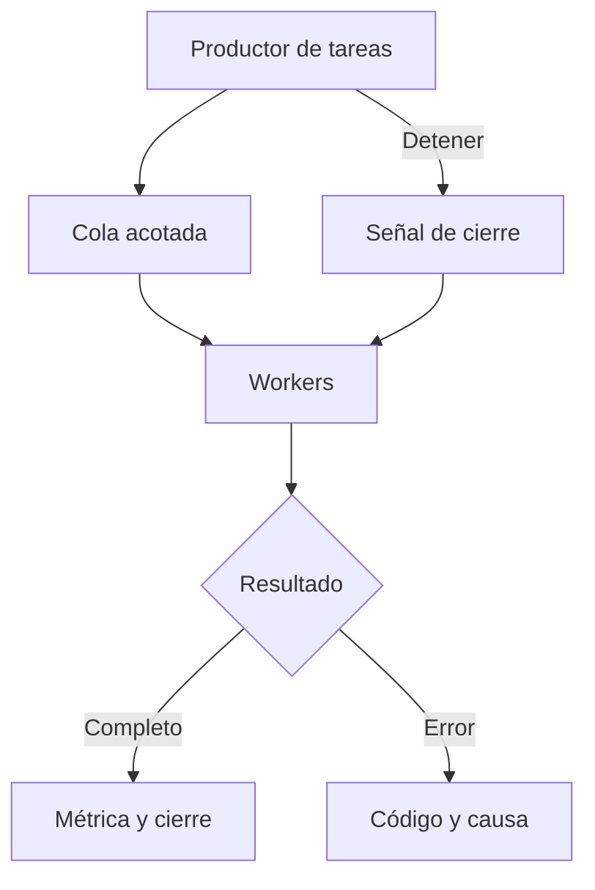

# Módulo 05 — Concurrencia y entrada/salida en Windows

Windows coordina trabajo concurrente mediante hilos, objetos de sincronización y operaciones de entrada/salida (E/S). Cuando un proceso atiende muchas tareas, su corrección y su rendimiento dependen de cómo distribuye el trabajo, limita el número de operaciones pendientes, detecta los errores y libera los recursos. Las API por sí solas no establecen un nivel de rendimiento: el resultado depende del tamaño de las tareas, del sistema de archivos, del almacenamiento, de la caché y de la carga del equipo.

En el [Módulo 04](Ransomware-Modulo4) se separaron el recorrido de directorios, la clasificación y los resultados observados. Este módulo estudia **qué ocurre después de producir una unidad de trabajo**: cómo pasa a una cola, cómo la recibe un worker, cómo se efectúa la E/S y cómo se registra el resultado. El tema interesa al análisis de ransomware porque estos procesos pueden operar sobre numerosas entradas, pero los mismos mecanismos existen en indexadores, copias de seguridad y aplicaciones de servidor. El laboratorio utiliza tareas sintéticas y un archivo temporal que crea y elimina el propio programa; no procesa rutas proporcionadas por el usuario ni modifica documentos existentes.

Al terminar deberías poder:

1. Distinguir concurrencia, paralelismo y E/S pendiente, y describir el ciclo de vida de hilos, objetos y handles.
2. Construir una cola acotada y explicar qué hacen la exclusión mutua, los semáforos, los eventos y los contadores atómicos.
3. Comparar lecturas sincrónicas, solapadas (`OVERLAPPED`) y mediante archivos mapeados sin atribuirles ventajas universales.
4. Explicar el contrato de vida de un objeto `PTP_WORK` y cómo esperar el fin de sus callbacks.
5. Medir tiempo y resultados, reproducir fallos, interpretar trazas y señalar límites de una comparación.

## 5.1 El modelo de trabajo



Una **tarea** representa una unidad contable: identificador, estado y resultado. El productor no debe confundir «enviada» con «completada». En un análisis de muestra, una operación iniciada tampoco prueba que haya tenido éxito. La **cola acotada** impide que el productor acumule indefinidamente trabajos mientras el consumidor avanza más despacio; cuando se llena, el productor espera y aparece la contrapresión (*backpressure*). La cantidad de workers limita la ejecución concurrente, mientras que la capacidad de la cola limita el trabajo pendiente. Son parámetros diferentes.

**Concurrencia** significa que varias tareas pueden estar en curso durante un intervalo; **paralelismo**, que algunas ejecutan instrucciones simultáneamente en distintos procesadores. Un worker bloqueado en E/S sigue ocupando un hilo, aunque no esté usando CPU. Una operación `OVERLAPPED` puede permanecer pendiente sin que el hilo que la inició se bloquee, según el mecanismo usado para recibir la finalización. Las solicitudes pueden terminar inmediatamente o permanecer pendientes. [Microsoft: E/S sincrónica y asincrónica](https://learn.microsoft.com/en-us/windows/win32/fileio/synchronous-and-asynchronous-i-o).

### Ciclo de vida y recursos

| Recurso | Creación | Uso | Finalización |
| --- | --- | --- | --- |
| Hilo explícito | `CreateThread` | Espera con un handle válido; el procedimiento retorna | Esperar y `CloseHandle` para cada handle creado |
| Sección crítica | `InitializeCriticalSection` | `EnterCriticalSection` / `LeaveCriticalSection` | `DeleteCriticalSection` cuando nadie pueda entrar |
| Semáforo o evento | `CreateSemaphoreW` / `CreateEventW` | Esperar, liberar o señalar | `CloseHandle` después de terminar las esperas |
| Trabajo del pool | `CreateThreadpoolWork` | `SubmitThreadpoolWork` y callbacks | `WaitForThreadpoolWorkCallbacks`, luego `CloseThreadpoolWork` |
| Archivo y mapeo | `CreateFileW` / `CreateFileMappingW` | Leer, mapear y desmapear | `UnmapViewOfFile`, cerrar mapeo y archivo |
| Operación solapada | `OVERLAPPED`, buffer y evento vivos | `ReadFile` y finalización | Confirmar finalización antes de reutilizar o liberar |

`WaitForMultipleObjects` admite como máximo `MAXIMUM_WAIT_OBJECTS` handles en una llamada, devuelve `WAIT_FAILED` ante fallo y no admite un recuento cero. Esperar en lotes no impide haber creado demasiados hilos; el límite debe imponerse **antes**, en los workers o la cola. Un hilo reserva espacio de pila virtual y consume otros recursos, pero reserva no equivale a consumo físico constante. No existe un número óptimo de hilos que valga para todos los equipos. [Microsoft: WaitForMultipleObjects](https://learn.microsoft.com/en-us/windows/win32/api/synchapi/nf-synchapi-waitformultipleobjects).

### ¿Qué pertenece a cada mecanismo?

| Mecanismo | Propiedad que aporta | Precaución |
| --- | --- | --- |
| `CRITICAL_SECTION` | Exclusión mutua dentro de un proceso | Mantener pequeña la región protegida; evita E/S lenta bajo el lock. |
| Semáforo | Recuento de plazas o trabajos | Cada adquisición necesita la liberación correspondiente. |
| Evento de reset manual | Estado persistente compartido, como cancelación | Se mantiene señalado hasta `ResetEvent`; todos pueden observarlo. |
| Evento de reset automático | Despierta a un waiter | No representa una señal de cancelación general. |
| `Interlocked*` | Cambios atómicos en un dato | Dos contadores separados no forman automáticamente una instantánea consistente. |
| Thread pool | Gestiona threads para callbacks | Limitar el pool no sustituye una cola acotada en la aplicación. |

El evento de reset manual es útil para una orden de parada que deben observar varios workers. Un evento de reset automático libera solamente a uno por señal. Para contadores independientes, `InterlockedIncrement64` basta si el dato tiene la alineación requerida; para un conjunto de campos cuya relación debe mantenerse, se necesita una región crítica u otro protocolo. No se asignan tiempos fijos en nanosegundos a estas primitivas: dependen de contención y plataforma. [Microsoft: CreateEventW](https://learn.microsoft.com/en-us/windows/win32/api/synchapi/nf-synchapi-createeventw) · [Synchronization Functions](https://learn.microsoft.com/en-us/windows/win32/sync/synchronization-functions).

## 5.2 Práctica A: cola acotada con hilos Win32

El programa siguiente acepta de 1 a 16 workers y de 1 a 100.000 tareas. Mantiene 32 plazas de cola, utiliza un semáforo para plazas disponibles y otro para tareas listas, protege el anillo con una sección crítica y contabiliza resultados con operaciones atómicas. Cada tarea calcula una carga sintética; los identificadores múltiplos de 127 generan un fallo de prueba. La opción `--cancel` activa un evento de reset manual a mitad del envío, por lo que puede dejar tareas en cola. El cierre normal introduce un centinela por worker.

En una terminal **Developer PowerShell for Visual Studio**, configurada para x64 y con MSVC y Windows SDK instalados (Windows 11, sin privilegios de administrador):

```powershell
cl /nologo /std:c11 /W4 /O2 /utf-8 /DUNICODE /D_UNICODE /Fe:lab_workers.exe lab_workers.c
.\lab_workers.exe 4 1000
.\lab_workers.exe 4 1000 --cancel
```

Guarda este bloque como `lab_workers.c`:

```c
#define WIN32_LEAN_AND_MEAN
#include <windows.h>
#include <stdio.h>
#include <stdlib.h>
#include <wchar.h>

#define CAPACITY 32
#define MAX_WORKERS 16

typedef struct {
    DWORD id;
} TASK;

typedef struct {
    TASK ring[CAPACITY];
    unsigned head, tail, pending;
    CRITICAL_SECTION lock;
    HANDLE slots, ready, stop;
    volatile LONG64 completed, failed, checksum;
} QUEUE;

static DWORD WINAPI worker(LPVOID arg) {
    QUEUE *q = (QUEUE *)arg;
    HANDLE wait_on[2] = { q->stop, q->ready };
    for (;;) {
        DWORD wait = WaitForMultipleObjects(2, wait_on, FALSE, INFINITE);
        if (wait == WAIT_OBJECT_0) return 0;
        if (wait != WAIT_OBJECT_0 + 1) {
            DWORD code = GetLastError();
            SetEvent(q->stop);
            return code ? code : 1;
        }

        EnterCriticalSection(&q->lock);
        TASK task = q->ring[q->head];
        q->head = (q->head + 1) % CAPACITY;
        --q->pending;
        LeaveCriticalSection(&q->lock);
        if (!ReleaseSemaphore(q->slots, 1, NULL)) {
            DWORD code = GetLastError();
            SetEvent(q->stop);
            return code ? code : 1;
        }
        if (task.id == 0xffffffffu) return 0;

        /* Carga sintética: no abre ni modifica archivos. */
        unsigned long long x = (unsigned long long)task.id + 1;
        for (int i = 0; i < 20000; ++i) x = x * 1664525u + 1013904223u;
        if (task.id % 127 == 0) {
            InterlockedIncrement64(&q->failed); /* Fallo inyectado. */
        } else {
            InterlockedIncrement64(&q->completed);
            InterlockedAdd64(&q->checksum, (LONG64)(x & 0xffffu));
        }
    }
}

static int number(const wchar_t *s, unsigned long lo, unsigned long hi, DWORD *out) {
    wchar_t *end = NULL;
    unsigned long value = wcstoul(s, &end, 10);
    if (s == end || *end != L'\0' || value < lo || value > hi) return 0;
    *out = (DWORD)value;
    return 1;
}

int wmain(int argc, wchar_t **argv) {
    DWORD nworkers, ntasks, started = 0, submitted = 0;
    HANDLE threads[MAX_WORKERS] = { 0 };
    QUEUE q = { 0 };
    LARGE_INTEGER frequency, begin, end;
    int cancel = 0, error = 0;
    if ((argc != 3 && argc != 4) ||
        !number(argv[1], 1, MAX_WORKERS, &nworkers) ||
        !number(argv[2], 1, 100000, &ntasks) ||
        (argc == 4 && (wcscmp(argv[3], L"--cancel") != 0))) {
        fwprintf(stderr, L"Uso: lab_workers.exe HILOS[1..16] TAREAS[1..100000] [--cancel]\n");
        return 2;
    }
    cancel = argc == 4;
    if (!QueryPerformanceFrequency(&frequency) || !QueryPerformanceCounter(&begin)) return 1;
    InitializeCriticalSection(&q.lock);
    q.slots = CreateSemaphoreW(NULL, CAPACITY, CAPACITY, NULL);
    q.ready = CreateSemaphoreW(NULL, 0, CAPACITY, NULL);
    q.stop = CreateEventW(NULL, TRUE, FALSE, NULL); /* Reset manual: avisa a todos. */
    if (!q.slots || !q.ready || !q.stop) {
        fwprintf(stderr, L"Creación de objetos: error %lu\n", GetLastError());
        error = 1;
        goto cleanup;
    }

    for (DWORD i = 0; i < nworkers; ++i) {
        threads[i] = CreateThread(NULL, 0, worker, &q, 0, NULL);
        if (!threads[i]) {
            fwprintf(stderr, L"CreateThread: error %lu\n", GetLastError());
            error = 1;
            goto cleanup;
        }
        ++started;
    }
    for (DWORD i = 0; i < ntasks; ++i) {
        HANDLE wait_on[2] = { q.stop, q.slots };
        DWORD wait = WaitForMultipleObjects(2, wait_on, FALSE, INFINITE);
        if (wait != WAIT_OBJECT_0 + 1) {
            fwprintf(stderr, L"Espera del productor: %lu\n", wait);
            error = 1;
            goto cleanup;
        }
        EnterCriticalSection(&q.lock);
        q.ring[q.tail].id = i;
        q.tail = (q.tail + 1) % CAPACITY;
        ++q.pending;
        LeaveCriticalSection(&q.lock);
        ++submitted;
        if (!ReleaseSemaphore(q.ready, 1, NULL)) {
            fwprintf(stderr, L"ReleaseSemaphore: error %lu\n", GetLastError());
            error = 1;
            goto cleanup;
        }
        if (cancel && i + 1 == (ntasks + 1) / 2) {
            if (!SetEvent(q.stop)) error = 1;
            break;
        }
    }

cleanup:
    if (q.stop && (error || cancel)) SetEvent(q.stop);
    if (q.ready && !error && !cancel) {
        /* Una tarea centinela por worker; la cola sigue siendo acotada. */
        for (DWORD i = 0; i < started; ++i) {
            HANDLE wait_on[2] = { q.stop, q.slots };
            if (WaitForMultipleObjects(2, wait_on, FALSE, INFINITE) != WAIT_OBJECT_0 + 1) {
                error = 1;
                break;
            }
            EnterCriticalSection(&q.lock);
            q.ring[q.tail].id = 0xffffffffu;
            q.tail = (q.tail + 1) % CAPACITY;
            ++q.pending;
            LeaveCriticalSection(&q.lock);
            if (!ReleaseSemaphore(q.ready, 1, NULL)) { error = 1; break; }
        }
    }
    if (error && q.stop) SetEvent(q.stop);
    for (DWORD i = 0; i < started; ++i) {
        if (WaitForSingleObject(threads[i], INFINITE) != WAIT_OBJECT_0) error = 1;
        DWORD status = 0;
        if (!GetExitCodeThread(threads[i], &status) || status != 0) error = 1;
        CloseHandle(threads[i]);
    }
    if (q.slots) CloseHandle(q.slots);
    if (q.ready) CloseHandle(q.ready);
    if (q.stop) CloseHandle(q.stop);
    DeleteCriticalSection(&q.lock);
    if (!QueryPerformanceCounter(&end)) return 1;
    printf("submitted=%lu completed=%lld failed=%lld queued=%u checksum=%lld elapsed_ms=%.3f\n",
           submitted, (long long)q.completed, (long long)q.failed, q.pending,
           (long long)q.checksum,
           1000.0 * (double)(end.QuadPart - begin.QuadPart) / (double)frequency.QuadPart);
    return error ? 1 : 0;
}
```

Para la ejecución normal, comprueba `submitted = completed + failed`, `queued = 0` y un código de salida cero. Para la cancelada, `submitted` puede ser inferior a la petición inicial y `queued` puede ser positivo; lo ya iniciado puede completarse. Los números de completados no deben interpretarse como una promesa de cancelación inmediata. El contador `checksum` evita que la carga sintética sea un trabajo vacío, pero no es un hash criptográfico. El tiempo incluye la creación y cierre de workers.

**Experimentos guiados**

1. Ejecuta 1, 2, 4, 8 y 16 workers con 10.000 tareas. Anota tiempo, `submitted`, `completed`, `failed` y `queued`. Indica cuándo aparecen mejoras y cuándo dejan de aparecer.
2. Repite con `--cancel`. Explica por qué `queued` varía entre ejecuciones aunque el punto de señalización del productor sea el mismo.
3. Cambia la capacidad de la cola de 32 a 2 y luego a 128; conserva el resto. Distingue espera del productor, tareas pendientes y número de hilos.
4. Si quieres simular más trabajo CPU, aumenta las 20.000 iteraciones a 200.000; anota la modificación antes de comparar.

## 5.3 Práctica B: pool nativo de Windows

`PTP_WORK` puede recibir varias llamadas a `SubmitThreadpoolWork`; aquí un semáforo mantiene como máximo 32 envíos pendientes. El pool admite hasta cuatro threads para esta prueba. Tras el último envío, el hilo principal espera callbacks y cierra el objeto de trabajo **una vez**. El callback no lo cierra. Este ejemplo no crea tareas de archivo ni pretende establecer que un pool sea siempre más rápido que workers persistentes.

```powershell
cl /nologo /std:c11 /W4 /O2 /utf-8 /DUNICODE /D_UNICODE /Fe:lab_threadpool.exe lab_threadpool.c
.\lab_threadpool.exe
```

Guarda este bloque como `lab_threadpool.c`:

```c
#define _WIN32_WINNT 0x0A00
#define WIN32_LEAN_AND_MEAN
#include <windows.h>
#include <stdio.h>

typedef struct {
    HANDLE slots;
    volatile LONG64 done;
} STATE;

static VOID CALLBACK run(PTP_CALLBACK_INSTANCE instance, PVOID context, PTP_WORK work) {
    (void)instance;
    (void)work;
    STATE *state = (STATE *)context;
    volatile unsigned long value = 1;
    for (int i = 0; i < 20000; ++i) value = value * 1664525u + 1013904223u;
    (void)value;
    InterlockedIncrement64(&state->done);
    ReleaseSemaphore(state->slots, 1, NULL);
}

int wmain(void) {
    STATE state = { 0 };
    PTP_POOL pool = NULL;
    PTP_WORK work = NULL;
    TP_CALLBACK_ENVIRON env;
    LARGE_INTEGER freq, begin, end;
    DWORD submitted = 0;
    int error = 0;

    state.slots = CreateSemaphoreW(NULL, 32, 32, NULL);
    pool = CreateThreadpool(NULL);
    if (!state.slots || !pool) { error = 1; goto finish; }
    SetThreadpoolThreadMaximum(pool, 4);
    InitializeThreadpoolEnvironment(&env);
    SetThreadpoolCallbackPool(&env, pool);
    work = CreateThreadpoolWork(run, &state, &env);
    if (!work) { error = 1; goto finish_env; }
    if (!QueryPerformanceFrequency(&freq) || !QueryPerformanceCounter(&begin)) {
        error = 1;
        goto finish_work;
    }
    for (DWORD i = 0; i < 1000; ++i) {
        if (WaitForSingleObject(state.slots, INFINITE) != WAIT_OBJECT_0) {
            error = 1;
            break;
        }
        SubmitThreadpoolWork(work);
        ++submitted;
    }
    /* FALSE: esperar callbacks enviados; no cancelarlos. */
    WaitForThreadpoolWorkCallbacks(work, FALSE);
    if (!QueryPerformanceCounter(&end)) error = 1;
    if (!error) printf("submitted=%lu completed=%lld elapsed_ms=%.3f\n",
                       submitted, (long long)state.done,
                       1000.0 * (double)(end.QuadPart - begin.QuadPart) / freq.QuadPart);
    if (state.done != submitted) error = 1;

finish_work:
    CloseThreadpoolWork(work); /* Lo cierra el hilo principal, una sola vez. */
finish_env:
    DestroyThreadpoolEnvironment(&env);
finish:
    if (pool) CloseThreadpool(pool);
    if (state.slots) CloseHandle(state.slots);
    if (error) fwprintf(stderr, L"Fallo del laboratorio (Win32=%lu).\n", GetLastError());
    return error ? 1 : 0;
}
```

La igualdad esperada es `submitted = completed = 1000`. El pool puede ajustar su actividad dentro del máximo indicado; `SetThreadpoolThreadMaximum` no es una fórmula para obtener el mejor rendimiento. Si se utiliza un *cleanup group* en otra aplicación, debe seguirse su contrato de cierre y no añadir `CloseThreadpoolWork` sobre el mismo objeto gestionado por ese grupo. [Microsoft: CloseThreadpoolWork](https://learn.microsoft.com/en-us/windows/win32/api/threadpoolapiset/nf-threadpoolapiset-closethreadpoolwork) · [SetThreadpoolThreadMaximum](https://learn.microsoft.com/en-us/windows/win32/api/threadpoolapiset/nf-threadpoolapiset-setthreadpoolthreadmaximum).

## 5.4 E/S: tres contratos distintos

| Modo | Quién espera | Estado que debe conservarse | Resultado |
| --- | --- | --- | --- |
| `ReadFile` sincrónico | Hilo llamante | Buffer hasta que retorne la llamada | `BOOL` y bytes leídos; cero indica fin al leer un archivo. |
| `ReadFile` con `FILE_FLAG_OVERLAPPED` | Depende de la estrategia de finalización | Buffer y `OVERLAPPED` propios hasta terminar la operación | Terminación inmediata o `ERROR_IO_PENDING`; consultar `GetOverlappedResult`. |
| `CreateFileMappingW` + `MapViewOfFile` | Acceso a páginas bajo demanda | Handle de mapeo y vista durante el acceso | La vista proporciona acceso a bytes mapeados; no es un callback de E/S. |

Una operación solapada que acaba inmediatamente **sigue** necesitando procesar su resultado. El buffer y el objeto `OVERLAPPED` deben seguir vivos hasta que se confirme la finalización; si se cancela con `CancelIoEx`, la petición de cancelación no equivale a esperar a que termine. En sistemas de mayor escala, una arquitectura con *I/O completion ports* reúne las finalizaciones sin asociar un evento por solicitud. [Microsoft: ReadFile](https://learn.microsoft.com/en-us/windows/win32/api/fileapi/nf-fileapi-readfile) · [GetOverlappedResult](https://learn.microsoft.com/en-us/windows/win32/api/ioapiset/nf-ioapiset-getoverlappedresult) · [CancelIoEx](https://learn.microsoft.com/en-us/windows/win32/api/ioapiset/nf-ioapiset-cancelioex) · [I/O completion ports](https://learn.microsoft.com/en-us/windows/win32/fileio/i-o-completion-ports).

Un archivo mapeado no tiene un tamaño ilimitado: importan el espacio de direcciones del proceso, el tamaño de la vista y la granularidad de alineación de los offsets. En archivos grandes se utilizan ventanas; un mapeo de longitud cero merece tratamiento específico. Una vista de lectura evita la necesidad de construir un buffer igual al archivo completo, pero sus accesos pueden producir faltas de página. Ninguna de las tres rutas garantiza más velocidad por sí misma. Si se modifican vistas, `FlushViewOfFile` y las garantías de persistencia requieren un análisis separado; este laboratorio solo **lee**. [Microsoft: MapViewOfFile](https://learn.microsoft.com/en-us/windows/win32/api/memoryapi/nf-memoryapi-mapviewoffile) · [CreateFileMappingW](https://learn.microsoft.com/en-us/windows/win32/api/memoryapi/nf-memoryapi-createfilemappingw) · [FlushViewOfFile](https://learn.microsoft.com/en-us/windows/win32/api/memoryapi/nf-memoryapi-flushviewoffile).

## 5.5 Práctica C: lecturas verificadas y archivo temporal

El programa crea en `%TEMP%` un archivo propio de 16 MiB con bytes conocidos, lo cierra y elimina al finalizar, incluso si detecta un fallo después de haber creado el temporal. Lee los mismos datos por tres rutas y compara un resumen FNV-1a de 64 bits. FNV-1a se utiliza aquí únicamente como comprobación ligera de igualdad en el laboratorio; una coincidencia no reemplaza una comparación byte por byte cuando se necesite prueba estricta. La lectura solapada mantiene **una sola** petición pendiente como máximo y espera su resultado antes de reutilizar buffer y evento; demuestra el contrato de la API, no las ventajas de una canalización con varias solicitudes concurrentes.

```powershell
cl /nologo /std:c11 /W4 /O2 /utf-8 /DUNICODE /D_UNICODE /Fe:lab_io.exe lab_io.c
.\lab_io.exe
```

Guarda este bloque como `lab_io.c`:

```c
#define WIN32_LEAN_AND_MEAN
#include <windows.h>
#include <stdio.h>
#include <stdint.h>

#define CHUNK (64u * 1024u)
#define TOTAL (16u * 1024u * 1024u)
#define BASIS UINT64_C(14695981039346656037)

static uint64_t digest(uint64_t h, const BYTE *data, DWORD length) {
    for (DWORD i = 0; i < length; ++i) h = (h ^ data[i]) * UINT64_C(1099511628211);
    return h;
}

static double milliseconds(LARGE_INTEGER a, LARGE_INTEGER b, LARGE_INTEGER f) {
    return 1000.0 * (double)(b.QuadPart - a.QuadPart) / (double)f.QuadPart;
}

int wmain(void) {
    WCHAR dir[MAX_PATH + 1], name[MAX_PATH + 1] = { 0 };
    HANDLE file = INVALID_HANDLE_VALUE, async_file = INVALID_HANDLE_VALUE;
    HANDLE mapping = NULL, event = NULL;
    BYTE *view = NULL;
    BYTE buffer[CHUNK];
    uint64_t sync_hash = BASIS, map_hash = BASIS, async_hash = BASIS;
    LARGE_INTEGER frequency, begin, end;
    double t_sync = 0, t_map = 0, t_async = 0;
    DWORD code = 0;
    int ok = 0;

    if (!QueryPerformanceFrequency(&frequency)) return 1;
    DWORD n = GetTempPathW(MAX_PATH + 1, dir);
    if (!n || n > MAX_PATH || !GetTempFileNameW(dir, L"m05", 0, name)) {
        fwprintf(stderr, L"No se pudo crear el archivo temporal: %lu\n", GetLastError());
        return 1;
    }
    /* GetTempFileNameW creó esta ruta nueva; solo se escribe en ella. */
    file = CreateFileW(name, GENERIC_READ | GENERIC_WRITE,
                       FILE_SHARE_READ, NULL, OPEN_EXISTING,
                       FILE_ATTRIBUTE_NORMAL, NULL);
    if (file == INVALID_HANDLE_VALUE) goto cleanup;
    for (DWORD offset = 0; offset < TOTAL; offset += CHUNK) {
        for (DWORD i = 0; i < CHUNK; ++i) buffer[i] = (BYTE)((offset + i) & 255u);
        DWORD written = 0;
        if (!WriteFile(file, buffer, CHUNK, &written, NULL) || written != CHUNK)
            goto cleanup;
    }
    if (!FlushFileBuffers(file)) goto cleanup;
    LARGE_INTEGER zero = { 0 };
    if (!SetFilePointerEx(file, zero, NULL, FILE_BEGIN)) goto cleanup;

    if (!QueryPerformanceCounter(&begin)) goto cleanup;
    DWORD count = 0;
    for (;;) {
        DWORD got = 0;
        if (!ReadFile(file, buffer, CHUNK, &got, NULL)) goto cleanup;
        if (got == 0) break;
        count += got;
        sync_hash = digest(sync_hash, buffer, got);
    }
    if (!QueryPerformanceCounter(&end) || count != TOTAL) goto cleanup;
    t_sync = milliseconds(begin, end, frequency);

    mapping = CreateFileMappingW(file, NULL, PAGE_READONLY, 0, 0, NULL);
    if (!mapping) goto cleanup;
    view = (BYTE *)MapViewOfFile(mapping, FILE_MAP_READ, 0, 0, 0);
    if (!view) goto cleanup;
    if (!QueryPerformanceCounter(&begin)) goto cleanup;
    map_hash = digest(map_hash, view, TOTAL);
    if (!QueryPerformanceCounter(&end)) goto cleanup;
    t_map = milliseconds(begin, end, frequency);

    async_file = CreateFileW(name, GENERIC_READ, FILE_SHARE_READ | FILE_SHARE_WRITE,
                             NULL, OPEN_EXISTING,
                             FILE_ATTRIBUTE_NORMAL | FILE_FLAG_OVERLAPPED, NULL);
    if (async_file == INVALID_HANDLE_VALUE) goto cleanup;
    event = CreateEventW(NULL, TRUE, FALSE, NULL);
    if (!event) goto cleanup;
    if (!QueryPerformanceCounter(&begin)) goto cleanup;
    for (DWORD offset = 0; offset < TOTAL; ) {
        OVERLAPPED op = { 0 };
        DWORD got = 0;
        op.Offset = offset;
        op.hEvent = event;
        if (!ResetEvent(event)) goto cleanup;
        BOOL immediate = ReadFile(async_file, buffer, CHUNK, NULL, &op);
        if (!immediate && GetLastError() != ERROR_IO_PENDING) goto cleanup;
        /* También se obtiene el resultado si ReadFile terminó inmediatamente. */
        if (!GetOverlappedResult(async_file, &op, &got, TRUE)) goto cleanup;
        if (got == 0 || got > CHUNK || got > TOTAL - offset) goto cleanup;
        async_hash = digest(async_hash, buffer, got);
        offset += got;
    }
    if (!QueryPerformanceCounter(&end)) goto cleanup;
    t_async = milliseconds(begin, end, frequency);
    ok = sync_hash == map_hash && map_hash == async_hash;
    if (!ok) SetLastError(ERROR_CRC);

cleanup:
    if (!ok) code = GetLastError();
    if (event) CloseHandle(event);
    if (view) UnmapViewOfFile(view);
    if (mapping) CloseHandle(mapping);
    if (async_file != INVALID_HANDLE_VALUE) CloseHandle(async_file);
    if (file != INVALID_HANDLE_VALUE) CloseHandle(file);
    if (name[0] && !DeleteFileW(name)) {
        code = GetLastError();
        ok = 0;
    }
    if (!ok) {
        fwprintf(stderr, L"Lectura, verificación o limpieza fallida (Win32=%lu).\n", code);
    } else {
        printf("bytes=%u sync_hash=%016llx map_hash=%016llx overlapped_hash=%016llx "
               "sync_ms=%.3f map_ms=%.3f overlapped_ms=%.3f\n",
               TOTAL, (unsigned long long)sync_hash, (unsigned long long)map_hash,
               (unsigned long long)async_hash, t_sync, t_map, t_async);
    }
    return ok ? 0 : 1;
}
```

La salida presenta `bytes=16777216`, el mismo resumen para los tres recorridos y tres duraciones. El tiempo de generación del archivo queda fuera de la comparación; la caché del sistema **no** queda fuera. La tercera ruta suele aprovechar páginas leídas previamente. Alterna el orden solo después de cambiar el programa y describir el cambio. La opción `FILE_FLAG_NO_BUFFERING` exige reglas adicionales de alineación y no se usa aquí.

**Experimentos guiados**

1. Ejecuta tres veces seguidas. Compara variaciones de cada ruta y explica la influencia posible de caché y carga del equipo.
2. Cambia `CHUNK` a 4 KiB y 1 MiB, recompila y registra resultados; comprueba que la condición de igualdad se mantiene.
3. Forza un error en una copia de laboratorio sustituyendo temporalmente la apertura de `async_file` por una ruta inexistente; recupera el programa original y describe qué handle, vista y archivo se cierran en la rama de error.
4. Explica por qué el tiempo de `map_hash` incluye accesos a memoria que pueden resolver páginas, pero no incluye `CreateFileMappingW` ni `MapViewOfFile`. Para una comparación extremo a extremo, mueve los puntos de medición y anota qué incluyes.

## 5.6 Variante en Rust sin dependencias externas

Rust no elimina por sí solo la contención ni garantiza que las tareas se repartan bien. Esta variante usa una cola `Mutex<VecDeque<_>>` con dos variables de condición: una despierta a consumidores cuando hay trabajo; la otra, al productor cuando queda espacio. `close()` avisa a todos los workers para que terminen una vez vacía la cola. `AtomicU64` con `Ordering::Relaxed` basta para contadores individuales leídos **después** de `join`; no hace atómica la relación entre ambos durante la ejecución. El ejercicio no emplea una dependencia cuyo número de versión pueda quedar obsoleto. [Rust: Ordering](https://doc.rust-lang.org/std/sync/atomic/enum.Ordering.html) · [Condvar](https://doc.rust-lang.org/std/sync/struct.Condvar.html).

En PowerShell con el compilador de Rust para Windows disponible:

```powershell
rustc -O -o lab_rust.exe lab_rust.rs
.\lab_rust.exe 4 1000
```

Guarda este bloque como `lab_rust.rs`:

```rust
use std::collections::VecDeque;
use std::env;
use std::sync::atomic::{AtomicU64, Ordering};
use std::sync::{Arc, Condvar, Mutex};
use std::thread;
use std::time::Instant;

const CAPACITY: usize = 32;

struct Inner {
    tasks: VecDeque<u64>,
    closed: bool,
}
struct Queue {
    inner: Mutex<Inner>,
    available: Condvar,
    space: Condvar,
}
impl Queue {
    fn new() -> Self {
        Self {
            inner: Mutex::new(Inner { tasks: VecDeque::new(), closed: false }),
            available: Condvar::new(),
            space: Condvar::new(),
        }
    }
    fn push(&self, task: u64) {
        let mut state = self.inner.lock().expect("mutex envenenado");
        while state.tasks.len() == CAPACITY {
            state = self.space.wait(state).expect("mutex envenenado");
        }
        state.tasks.push_back(task);
        self.available.notify_one();
    }
    fn pop(&self) -> Option<u64> {
        let mut state = self.inner.lock().expect("mutex envenenado");
        loop {
            if let Some(task) = state.tasks.pop_front() {
                self.space.notify_one();
                return Some(task);
            }
            if state.closed { return None; }
            state = self.available.wait(state).expect("mutex envenenado");
        }
    }
    fn close(&self) {
        let mut state = self.inner.lock().expect("mutex envenenado");
        state.closed = true;
        self.available.notify_all();
    }
}

fn main() {
    let args: Vec<String> = env::args().collect();
    if args.len() != 3 {
        eprintln!("Uso: lab_rust.exe HILOS[1..16] TAREAS[1..100000]");
        std::process::exit(2);
    }
    let workers: usize = args[1].parse().expect("número de hilos");
    let jobs: u64 = args[2].parse().expect("número de tareas");
    assert!((1..=16).contains(&workers) && (1..=100_000).contains(&jobs));
    let queue = Arc::new(Queue::new());
    let completed = Arc::new(AtomicU64::new(0));
    let failed = Arc::new(AtomicU64::new(0));
    let start = Instant::now();
    let mut handles = Vec::new();
    for _ in 0..workers {
        let q = Arc::clone(&queue);
        let good = Arc::clone(&completed);
        let bad = Arc::clone(&failed);
        handles.push(thread::spawn(move || {
            while let Some(task) = q.pop() {
                let mut value = task + 1;
                for _ in 0..20_000 {
                    value = value.wrapping_mul(1_664_525).wrapping_add(1_013_904_223);
                }
                if task % 127 == 0 { bad.fetch_add(1, Ordering::Relaxed); }
                else { good.fetch_add(1, Ordering::Relaxed); }
                std::hint::black_box(value);
            }
        }));
    }
    for task in 0..jobs { queue.push(task); }
    queue.close();
    for handle in handles { handle.join().expect("worker finalizó con pánico"); }
    let good = completed.load(Ordering::Relaxed);
    let bad = failed.load(Ordering::Relaxed);
    assert_eq!(good + bad, jobs);
    println!("submitted={jobs} completed={good} failed={bad} elapsed_ms={:.3}",
             start.elapsed().as_secs_f64() * 1000.0);
}
```

Compara las invariantes de Rust y C. No compares sus tiempos como si fueran el mismo benchmark: la carga y la contabilidad tienen diferencias, los compiladores optimizan de otra forma y se deben controlar las condiciones de ejecución. Si un worker entra en pánico, `join()` falla y el proceso comunica que el resultado no es completo.

## 5.7 Errores, cancelación y cierre

| Situación | Decisión de diseño | Evidencia útil |
| --- | --- | --- |
| Fallo al crear un worker | Señalar parada, esperar los ya creados, cerrar recursos | Número de hilos creados y `GetLastError`. |
| Cola llena | Esperar un espacio o cancelar el envío | Tiempo bloqueado, máximo de ocupación y enviados. |
| Trabajo individual fallido | Contarlo por separado; seguir o abortar según criterio previo | Identificador, tipo y código de error. |
| Parada solicitada | Detener productor y avisar a todos; aceptar tareas ya iniciadas | Enviados, completados, fallidos y aún en cola. |
| `ReadFile` parcial o cero | Contar bytes efectivos y comprobar fin esperado | Offset, bytes solicitados y obtenidos. |
| E/S solapada pendiente | Conservar buffer y `OVERLAPPED` hasta conocer resultado | Terminación inmediata, pendiente, error o cancelación. |
| Mapeo fallido | No acceder a la vista; cerrar handles válidos | Tamaño, arquitectura, error Win32. |

Un informe debe explicar si un error se omite, se reintenta con límite, se registra o detiene el proceso. «Reintentar siempre» puede crear una espera indefinida. «Ignorar y continuar» puede falsear la cobertura. Para una simulación acordada, define de antemano los umbrales de error, los recursos permitidos y el criterio de parada; conserva los totales de cada categoría.

## 5.8 Medición y observación

`QueryPerformanceCounter` y `QueryPerformanceFrequency` permiten medir intervalos con un contador de alta resolución. Mide al menos: tareas enviadas y terminadas, duración total, tiempo de espera en la cola, bytes leídos, fallos por tipo, máximo de tareas pendientes y condiciones del equipo. El indicador `tareas/segundo = completadas / segundos` es útil únicamente si se acompaña de tamaño de tarea y nivel de errores. Para una comparación, fija el mismo conjunto de datos, repite ensayos, indica mediana y dispersión y evita confundir resultados de caché caliente con lecturas del almacenamiento. [Microsoft: QueryPerformanceCounter](https://learn.microsoft.com/en-us/windows/win32/api/profileapi/nf-profileapi-queryperformancecounter).

| Prueba | Workers | Cola | Completadas | Fallidas | Pendientes | Tiempo (ms) | Entorno y observaciones |
| --- | ---: | ---: | ---: | ---: | ---: | ---: | --- |
| A1 | 1 | 32 |  |  |  |  |  |
| A2 | 4 | 32 |  |  |  |  |  |
| A3 | 16 | 32 |  |  |  |  |  |

Para observar operaciones sobre el temporal, filtra el nombre `lab_io.exe` y su ruta temporal con [Process Monitor](https://learn.microsoft.com/en-us/sysinternals/downloads/procmon). Distingue apertura, lectura, mapeo y cierre de un simple resumen del programa. Para perfiles más amplios, **Event Tracing for Windows (ETW)** registra eventos de proveedores del sistema o de la aplicación; Windows Performance Recorder y Windows Performance Analyzer pueden ayudar a examinar CPU y E/S. La ausencia de un evento en una captura no demuestra que una operación no haya ocurrido: importan los proveedores activados, filtros y posibles eventos perdidos. [Microsoft: ETW](https://learn.microsoft.com/en-us/windows/win32/etw/about-event-tracing).

### Qué se puede concluir

- Si `submitted = completed + failed` al terminar normalmente, las tareas contabilizadas llegaron a uno de esos dos estados. Esa igualdad no demuestra la corrección del resultado de cada tarea.
- Si una configuración es más rápida en una ejecución, no queda establecido que lo sea con otra carga, otra caché o un dispositivo distinto.
- Una lectura `OVERLAPPED` seguida inmediatamente de una espera puede rendir peor que la sincrónica: su valor didáctico aquí está en la gestión explícita del estado de la operación.
- El análisis de una muestra exige correlacionar sus llamadas, parámetros, errores y efectos observables; los nombres de API no prueban por sí solos una intención o una familia de malware.

## 5.9 Decisiones de arquitectura y continuidad

| Pregunta | Opción sencilla | Opción que requiere más diseño |
| --- | --- | --- |
| ¿Cuántas tareas pendientes? | Límite fijo y medido | Ajuste dinámico justificado con telemetría. |
| ¿Cuántos hilos? | Pequeño conjunto y pruebas | Pool con límites y callbacks breves. |
| ¿Cómo llega una finalización de E/S? | `ReadFile` sincrónico | Eventos `OVERLAPPED` o puerto de finalización. |
| ¿Qué hacer ante cancelación? | Parar nuevos envíos y esperar tareas activas | Cancelar E/S y procesar cada resultado terminal. |
| ¿Cómo comparar? | Mismo trabajo, repetición y registro | Perfiles ETW con condiciones controladas. |

El módulo trata las primitivas y sus contratos de vida. La integración de varias etapas de un procesamiento concurrente pertenece al [Módulo 06](Ransomware-Modulo6). La elección entre API se justifica con resultados y límites observables, no con una tabla universal de velocidad ni con un número de threads derivado solo de la CPU.

## Xtra:

1. ¿Qué evidencia permitiría distinguir, en una traza, 64 hilos creados para 64 tareas de cuatro workers reutilizados para miles de tareas?
2. ¿Qué diferencia observable habría entre limitar workers y limitar únicamente la cantidad de tareas pendientes?
3. ¿Cuáles son las consecuencias de cerrar un handle de hilo antes de confirmar que su procedimiento terminó?
4. ¿Por qué un evento de reset automático puede dejar workers sin recibir una orden de parada colectiva?
5. ¿Qué secuencia de llamadas y resultados permitiría demostrar que una lectura `OVERLAPPED` estuvo realmente pendiente?
6. ¿Qué condiciones pueden provocar que una vista de archivo mapeado rinda peor que lecturas por bloques en una carga concreta?
7. ¿Cómo distinguirías en un informe las tareas enviadas, iniciadas, completadas, fallidas y canceladas a partir de datos observables?
8. ¿Qué campos de una captura ETW o de Process Monitor ayudarían a separar la actividad del proceso de los efectos de caché y del sistema de archivos?
9. ¿Qué fallos de vida útil aparecen si un callback conserva un puntero a un contexto que el hilo principal libera al cerrar el pool?
10. ¿Qué cambia en la interpretación de una medición si las solicitudes de E/S se completan inmediatamente por caché?
11. ¿Qué criterios usarías para afirmar que una implementación de muestra tiene contrapresión y no solo un máximo de threads?
12. ¿Qué comportamiento documentado de una familia de ransomware podrías asociar con concurrencia, y qué evidencia faltaría para atribuirle una arquitectura interna concreta?

## Referencias técnicas

- [Microsoft Learn: Thread Pool API](https://learn.microsoft.com/en-us/windows/win32/procthread/thread-pool-api).
- [Microsoft Learn: Synchronization Functions](https://learn.microsoft.com/en-us/windows/win32/sync/synchronization-functions).
- [Microsoft Learn: Synchronous and Asynchronous I/O](https://learn.microsoft.com/en-us/windows/win32/fileio/synchronous-and-asynchronous-i-o).
- [Microsoft Learn: File Mapping](https://learn.microsoft.com/en-us/windows/win32/memory/file-mapping).
- [Microsoft Learn: QueryPerformanceCounter](https://learn.microsoft.com/en-us/windows/win32/api/profileapi/nf-profileapi-queryperformancecounter).
- [The Rust Standard Library: `std::sync`](https://doc.rust-lang.org/std/sync/).
