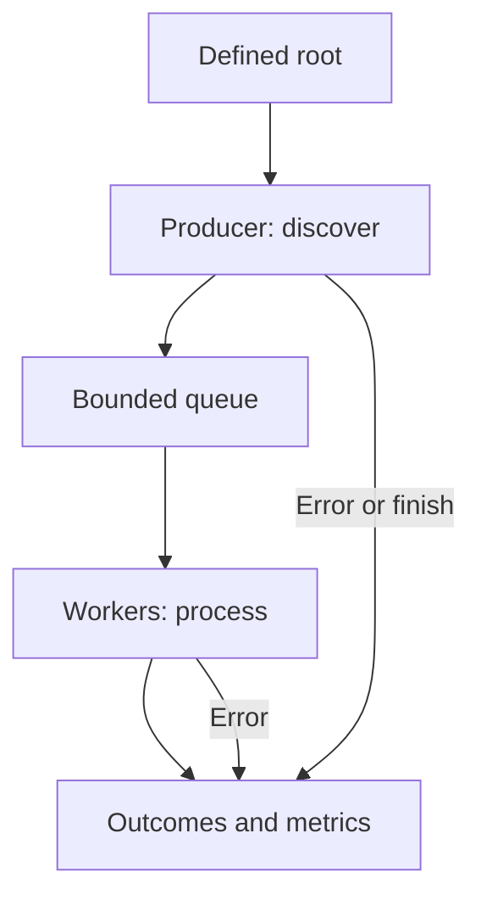
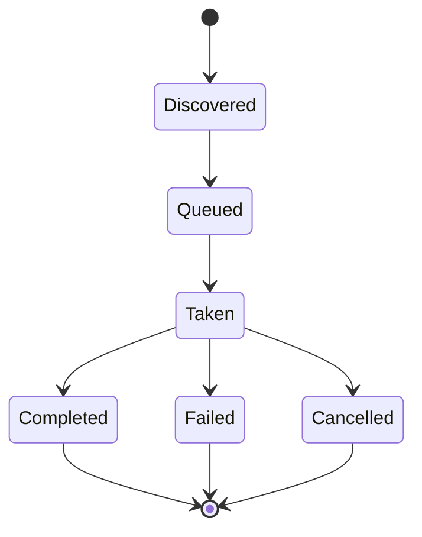
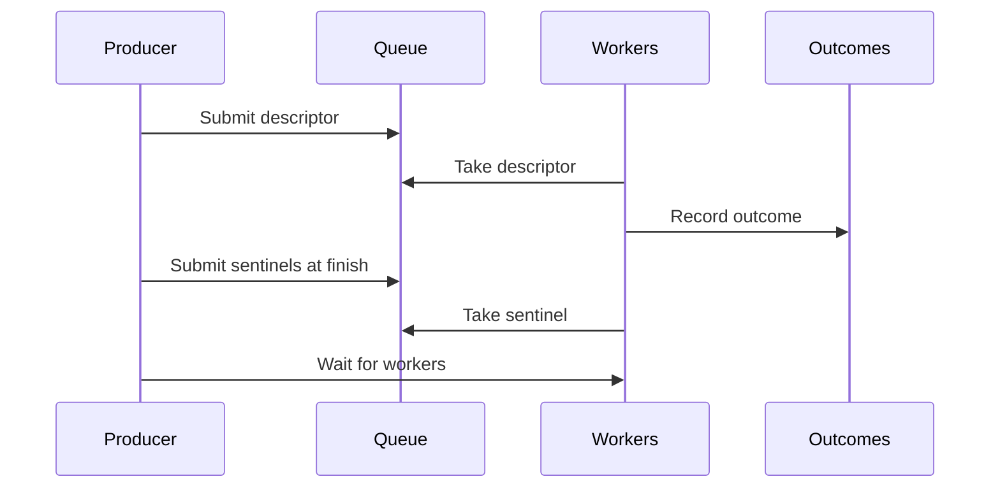

# Module 06 — Concurrent Processing Pipeline

A file-processing pipeline coordinates two activities that may progress at different rates: **discovering entries** and **processing discovered entries**. The interface between them needs an explicit contract: what data is handed over, how many tasks may wait, what it means to finish, how errors are reported, and which results survive an interruption. Merely using multiple threads solves none of these questions by itself.

This module presents the architecture from the perspective of sample analysis and controlled simulation. In a ransomware case, the second stage may transform data; here the subject is **coordination**, while the practical exercise processes temporary files through read-only operations. This isolation allows the reader to measure behavior and trigger failures without building a lab that alters unrelated documents. The pipeline's structure is the subject of study, rather than a purportedly universal speed figure.

By the end of this module, you should be able to:

1. Distinguish a complete inventory, batch processing, and a streaming pipeline.
2. Explain a task's states from discovery through a terminal outcome.
3. Justify a queue limit, a worker count, and a shutdown protocol.
4. Reproduce enumeration, reading, cancellation, and abrupt-termination failures, and distinguish their effects.
5. Measure time to first result, total time, queue occupancy, producer waiting, and coverage.
6. Interpret a trace and an experiment without conflating program capability, observed behavior, and verified outcome.

## 6.1 Where this module fits in the course

| Module | Main question | Boundary of the discussion |
| --- | --- | --- |
| [04: Enumeration](Ransomware-Modulo4-en) | Which entries are discovered, from which roots, and under what conditions? | Discovering an entry does not establish that it was processed. |
| [05: Concurrency and I/O](Ransomware-Modulo5-en) | What contracts govern threads, queues, events, reads, and thread pools? | An isolated primitive does not define the whole workflow. |
| **06: Pipeline** | How are producer, queue, workers, and outcomes connected? | The lab verifies reading and coordination; it does not implement document encryption. |
| [07: Key Transport](Ransomware-Modulo7-en) | How is cryptographic material organized and protected? | This is separate from pipeline shutdown and measurement. |

The distinction matters in analysis. An enumerator may finish before its tasks do. A worker may fail after receiving a valid entry. A discovered entry may change before it is opened. A report on a real sample should identify which stage was observed and which was inferred.

## 6.2 Components and the handoff contract



The **producer** hands off a task descriptor, not a promise of success. A descriptor may contain an identifier, an observed path, an observed size, and other information needed to verify expectations. The queue holds descriptors; it need not store the bytes of every file. A worker takes a descriptor, rechecks relevant conditions, performs the permitted operation, and publishes exactly one terminal outcome. A final component collects results and records whether the producer finished normally.

| Field or signal | Issuer | What it establishes | What it does not establish |
| --- | --- | --- | --- |
| `discovered` | Producer | An entry was encountered during this traversal. | That it could still be opened later. |
| `submitted` | Producer, after enqueueing | The queue accepted a task. | That any worker received it. |
| `started` | Worker, after dequeueing | A worker took the descriptor. | That the work completed. |
| `completed` | Worker, after verification | The lab's success criterion was met. | That a different operation, such as encryption, occurred. |
| `failed` | Worker | The task had a classified failure. | That the entire process ended. |
| `cancelled` | Worker or coordinator | The task was not executed or completed under the stop policy. | That cancellation was instantaneous. |
| Producer finished | Producer or coordinator | No further descriptors will be submitted in this run. | That the queue is empty or every task has finished. |

For a complete traversal without duplicates, `discovered` can be compared with the known test universe. For any run that **shuts down normally**, the lab's minimum invariant is:

```text
submitted = completed + failed + cancelled
```

While the program is running, some tasks are queued and others have been taken but have no terminal outcome. The terminal invariant therefore cannot be applied to an intermediate snapshot. After an abrupt process exit, only durably recorded outcomes can be counted with confidence; “absent from the journal” does not mean “never executed.”

### Changes between observation and use

A discovered path may disappear, be replaced, or change size before it is opened. This gap, known as *time of check to time of use* (TOCTOU), means enumeration metadata is not a permanent guarantee. The lab includes an intentionally stale descriptor (`stale`) to demonstrate detection of a mismatch. A system requiring stronger assurance needs to define which file identity it compares, when it compares it, and what it does if the file changes. Scope and reparse points were covered in Module 04.

## 6.3 Three ways to schedule the work

| Architecture | Processing begins | Memory and coordination | Potential benefit | Potential cost |
| --- | --- | --- | --- | --- |
| **Complete inventory first** | After enumeration finishes. | May retain every descriptor. | Inventory can be reviewed before processing. | Delays the first result and uses memory proportional to inventory size. |
| **Batches** | After each defined group is collected. | Retains a group and coordinates batch boundaries. | Supports review or logging by segment. | Adds waits between groups and requires a rule for partial batches. |
| **Streaming** | As soon as tasks are available. | Uses a bounded queue and explicit shutdown. | May overlap stages and limit pending work. | Requires backpressure, failure, and concurrent-state handling. |

If stages overlap without interfering with each other, the slower stage sets a lower bound on total streaming time. **That bound is not a guaranteed runtime formula**: startup, queue draining, coordination overhead, and disk contention can all add time. Sequential work may suffice for small sets or when a full inventory must be reviewed first. An architectural comparison needs the same test set and the same success criterion.

Time to the first result is worth measuring alongside total duration: two designs can finish at nearly the same time yet start producing results at very different points. That measure does not replace coverage. Finishing early after missing entries is not an improvement.

## 6.4 Bounded queue and backpressure

A worker limit controls how many tasks execute at once. A queue limit controls how many tasks **wait**. Without the second limit, a fast producer could hold a large inventory in memory. With a limit, the producer waits when the queue fills and resumes when a consumer takes an item. The appropriate value depends on descriptor size, arrival rate, processing cost, and environment; it cannot be derived from a fixed `CPU × 2` rule.

The lab uses the Python standard library's `queue.Queue(maxsize=N)`. Its `put()` blocks when `N` items are already present; `task_done()` acknowledges each item taken, and `join()` waits for an acknowledgment for every inserted item. The queue supplies its own synchronization. `qsize()` is an **approximate observation**, so `queue_peak` is the highest value sampled after an insertion, not a formal maximum for the entire run. [Python: queue](https://docs.python.org/3/library/queue.html).

If the producer fails, it must still announce that it will submit no more tasks. If a consumer fails, previously submitted tasks need an outcome or a cancellation policy. Adding one sentinel per worker at the end of a FIFO queue allows workers to exit after ordinary tasks. Without a matching `task_done()`, `join()` can wait indefinitely; the code uses `finally` to pair these operations.

## 6.5 States, completion, and cancellation



A cancellation signal does not automatically erase active work. In this lab, the producer stops submitting, and a worker taking a task after observing the signal marks it as cancelled. A task whose read has already started may finish after the signal. The exact numbers of completed and cancelled tasks can vary across runs because of thread scheduling; the final invariant must still hold.



The arrival order of results **need not match** discovery order: two workers may finish tasks of different durations. Task identifiers connect discoveries to outcomes without treating the position of a line in output as proof of causal order. Sentinels are inserted after accepted ordinary tasks. With a FIFO queue and one sentinel per worker, each worker can exit when it takes a sentinel. Switching to a priority queue would require revisiting that shutdown rule rather than copying it unchanged.

A run with a producer error can still close cleanly: discovery stops, already submitted tasks are consumed, workers exit, and the report includes `producer_error`. “Finished” must not hide “finished after a failure.” Abrupt termination is different: there is no opportunity to drain queues, run `finally` in every thread, or produce a final summary. The crash experiment runs in a child process so that a controller can examine what happened.

## 6.6 Resource ownership in Windows

In a native Windows thread-pool implementation, the relationship among descriptor, callback context, and `PTP_WORK` object must be established before work is submitted. Two possible cleanup models are to wait for callbacks and have each object's owner close it, or to associate objects with a *cleanup group* and close that group's members. Mixing the models leads to incorrect releases. `CloseThreadpoolCleanupGroupMembers` waits for callbacks and releases associated objects; Microsoft says those objects must not then be released individually. The thread that creates work objects must also stop creating them before group cleanup begins. [Microsoft: CloseThreadpoolWork](https://learn.microsoft.com/en-us/windows/win32/api/threadpoolapiset/nf-threadpoolapiset-closethreadpoolwork) · [CloseThreadpoolCleanupGroupMembers](https://learn.microsoft.com/en-us/windows/win32/api/threadpoolapiset/nf-threadpoolapiset-closethreadpoolcleanupgroupmembers).

The executable lab uses Python threads so the handoff contract is visible without repeating the APIs already exercised in [Module 05](Ransomware-Modulo5-en). This program illustrates **coordination and I/O over a small temporary data set**. It does not measure the maximum capacity of the native thread pool or C encryption performance. A Win32 implementation could preserve the contract between stages, but would need to define handle, buffer, shared-data alignment, and callback-lifetime rules explicitly.

## 6.7 Partial outcomes and integrity

Here, “completed” means that the worker read the temporary file and checked its SHA-256 against a known value. The files in the test set remain unchanged. An application that **does** publish new output has further decisions to make: where provisional output is written, how the result is verified, when it is marked as committed, and what happens if the process stops between steps. Writing bytes, ensuring persistence, and publishing a name do not form one indivisible operation.

| New-output state | Interruption risk | Evidence to preserve |
| --- | --- | --- |
| Not created | No partial output exists. | Pending task or absence of a terminal record. |
| Partially created | Output may be incomplete or unverifiable. | Identifier, length, and provisional status. |
| Written and verified | Publication or required persistence may still be pending. | Completed verification and outstanding publication step. |
| Published | The file system's actual guarantees must be checked. | Confirmed terminal outcome and coherent record. |

Modifying a file directly and creating a new file have different failure profiles; neither is safe merely because of the method's name. `FlushViewOfFile` begins flushing modified pages, but Microsoft specifies that it does not flush metadata and does not necessarily wait for the changes to reach physical storage. For a network path, guarantees also depend on the server. [Microsoft: FlushViewOfFile](https://learn.microsoft.com/en-us/windows/win32/api/memoryapi/nf-memoryapi-flushviewoffile). This discussion is limited to integrity and recovery; the lab neither publishes new versions nor deletes originals.

## 6.8 Ordinary errors, exceptions, and process crashes

| Case | Observable signal | Appropriate analytical treatment |
| --- | --- | --- |
| Access denied or resource in use | File-operation failure and an error code or I/O exception | Record the failed task and context. |
| Path changed | Descriptor mismatch or open failure | Do not report success merely because it was discovered. |
| Producer failure | Incomplete enumeration and end of submissions | Drain existing work and preserve producer status. |
| Cancellation request | Shared signal; mix of completed and cancelled tasks | Count states separately and define shutdown. |
| Programming defect | Unexpected exception; possibly inconsistent shared state | Diagnose the cause; a catch-all does not prove recovery. |
| Abrupt process exit | Normal shutdown does not run | Examine partial records and verify external data. |

In Win32, many failed calls indicate an error through their return value and `GetLastError`, which must be checked at the appropriate time. SEH concerns structured exceptions and does not replace checking `ReadFile` or `WriteFile`. Catching every callback exception and continuing can conceal a program defect; the lab distinguishes expected failures from a complete process exit. [Microsoft: Last-Error Code](https://learn.microsoft.com/en-us/windows/win32/debug/last-error-code) · [Structured Exception Handling](https://learn.microsoft.com/en-us/windows/win32/debug/structured-exception-handling).

## 6.9 What to measure and how to interpret it

| Metric | Calculation or definition | Interpretation |
| --- | --- | --- |
| Total time | End of workers minus start of enumeration. | Includes startup, queueing, and shutdown in this run. |
| First result | First terminal outcome minus start. | Separates startup latency from total duration. |
| Enumeration duration | Producer finish minus start. | In `batch`, includes inventory construction; in `stream`, it may include queue waits. |
| Producer waiting | Sum of time spent in `put()` when no slot was immediately available. | Evidence of backpressure, not necessarily a defect. |
| Highest observed queue size | Largest `qsize()` sample after insertion. | Approximate, bounded by capacity; not an exact peak. |
| Tasks per second | Completed tasks / total elapsed seconds. | Report alongside errors, sizes, and conditions. |
| Coverage | Discovered entries and submitted tasks compared with the known set. | Many completed tasks do not prove full coverage if the producer failed. |
| Verified bytes | Sum of reads that finished and passed the check. | Not necessarily the number of bytes physically fetched from disk. |

The program uses `time.perf_counter()` to measure intervals. It creates known small files, and repeated reads may be served from cache. For configuration comparisons, record processor, Python and Windows versions, storage type, file count and size, configured delays, queue capacity, worker count, and run order. Repeat trials and report median and spread. A single test cannot establish a general “optimal thread count” formula. [Python: time.perf_counter](https://docs.python.org/3/library/time.html#time.perf_counter).

### A fair comparison of `batch` and `stream`

Both scenarios use the same temporary data set, read function, delays, and success criterion. `batch` retains descriptors before starting workers; `stream` starts workers first and submits each descriptor as it appears. Enumeration and work delays make the two stages observable; they do not represent actual NTFS, ReFS, or SMB latency. Changing only `workers` or `queue` reveals the response of **this** model without confusing it with a native Windows performance measurement.

## 6.10 Self-contained Windows 11 lab

**Requirements:** Windows 11 and Python 3.11 or later. The script uses only the standard library. It creates 4–500 files of its own, each 4,096 bytes, inside a temporary directory, reads them, and compares their digests. It accepts no user-supplied file path and traverses no external folder. The parent process retains control of the temporary directory even during the child-process crash experiment. If an environmental issue prevents deletion at the end, `TemporaryDirectory` reports the failure; the reader can inspect the temporary-file location via `%TEMP%`. [Python: tempfile.TemporaryDirectory](https://docs.python.org/3/library/tempfile.html).

In PowerShell, save the block as `pipeline_lab.py` and run:

```powershell
py -3 pipeline_lab.py --scenario all
py -3 pipeline_lab.py --scenario stream --files 120 --workers 4 --queue 1 --enum-ms 0 --work-ms 8
py -3 pipeline_lab.py --scenario crash --files 40
```

If `py -3` is unavailable in your installation, use the Python 3 executable from your environment. `--scenario all` runs `batch`, `stream`, `worker`, `producer`, `cancel`, `stale`, and `crash` in order. Configured delays range from 0 to 100 ms; worker count from 1 to 16; queue capacity from 1 to 256.

```python
"""Coordination lab; reads only temporary files created here."""

import argparse
import hashlib
import json
import multiprocessing as mp
import os
import queue
import tempfile
import threading
import time
from dataclasses import dataclass
from pathlib import Path


@dataclass(frozen=True)
class Task:
    number: int
    path: Path
    expected_size: int
    expected_sha256: str


def create_dataset(folder: Path, count: int) -> dict[int, str]:
    folder.mkdir()
    expected = {}
    for number in range(count):
        payload = bytes([number % 251]) * 4096
        path = folder / f"item-{number:05d}.bin"
        path.write_bytes(payload)
        expected[number] = hashlib.sha256(payload).hexdigest()
    return expected


def verify_dataset(folder: Path, expected: dict[int, str]) -> bool:
    paths = sorted(folder.glob("item-*.bin"))
    if len(paths) != len(expected):
        return False
    return all(
        hashlib.sha256(path.read_bytes()).hexdigest() == expected[int(path.stem[5:])]
        for path in paths
    )


def run_pipeline(folder: Path, expected: dict[int, str], scenario: str,
                 workers: int, capacity: int, enum_ms: float, work_ms: float,
                 journal: Path | None = None) -> dict:
    started_at = time.perf_counter()
    tasks: queue.Queue[Task | None] = queue.Queue(maxsize=capacity)
    stop = threading.Event()
    lock = threading.Lock()
    trigger = max(1, len(expected) // 3)
    crash_at = max(1, len(expected) // 4)
    counters = dict(enumerated=0, submitted=0, started=0, completed=0,
                    failed=0, cancelled=0, bytes_read=0, queue_peak=0)
    error_types: dict[str, int] = {}
    first_result: float | None = None
    producer_wait = 0.0
    producer_error: str | None = None

    def record(task: Task, outcome: str, reason: str, size: int) -> None:
        nonlocal first_result
        with lock:
            if first_result is None:
                first_result = time.perf_counter() - started_at
            counters[outcome] += 1
            counters["bytes_read"] += size
            if reason:
                error_types[reason] = error_types.get(reason, 0) + 1
            if journal is not None:
                line = json.dumps({"id": task.number, "outcome": outcome,
                                   "reason": reason}) + "\n"
                with journal.open("a", encoding="utf-8") as output:
                    output.write(line)
                    output.flush()
                    os.fsync(output.fileno())
            terminal = (counters["completed"] + counters["failed"]
                        + counters["cancelled"])
            if scenario == "crash" and terminal == crash_at:
                os._exit(86)  # Only inside the isolated child process.

    def worker() -> None:
        while True:
            task = tasks.get()
            try:
                if task is None:
                    return
                with lock:
                    counters["started"] += 1
                if stop.is_set():
                    record(task, "cancelled", "stop_requested", 0)
                    continue
                try:
                    time.sleep(work_ms / 1000.0)
                    if scenario == "worker" and task.number == trigger:
                        raise OSError("injected_worker_error")
                    if task.path.stat().st_size != task.expected_size:
                        raise ValueError("metadata_mismatch")
                    data = task.path.read_bytes()
                    if hashlib.sha256(data).hexdigest() != task.expected_sha256:
                        raise ValueError("content_mismatch")
                    record(task, "completed", "", len(data))
                except (OSError, ValueError) as exc:
                    reason = (str(exc) if isinstance(exc, ValueError)
                              or str(exc).startswith("injected_") else type(exc).__name__)
                    record(task, "failed", reason, 0)
            finally:
                tasks.task_done()

    def enumerate_tasks():
        for path in sorted(folder.glob("item-*.bin")):
            time.sleep(enum_ms / 1000.0)
            number = int(path.stem[5:])
            size = 4097 if scenario == "stale" and number == trigger else 4096
            yield Task(number, path, size, expected[number])

    # Batch mode finishes inventory before starting workers.
    if scenario == "batch":
        batch = list(enumerate_tasks())
        counters["enumerated"] = len(batch)
        source = iter(batch)
    else:
        source = enumerate_tasks()

    threads = [threading.Thread(target=worker, name=f"worker-{i}")
               for i in range(workers)]
    for thread in threads:
        thread.start()

    try:
        for task in source:
            if scenario != "batch":
                counters["enumerated"] += 1
            if scenario == "producer" and counters["enumerated"] == trigger:
                raise RuntimeError("injected_producer_error")
            try:
                tasks.put_nowait(task)
            except queue.Full:
                waiting_since = time.perf_counter()
                tasks.put(task)  # Blocks until a slot becomes available.
                producer_wait += time.perf_counter() - waiting_since
            counters["submitted"] += 1
            counters["queue_peak"] = max(counters["queue_peak"], tasks.qsize())
            if scenario == "cancel" and counters["submitted"] == trigger:
                stop.set()
                break
    except Exception as exc:
        producer_error = f"{type(exc).__name__}: {exc}"
    enumeration_elapsed = time.perf_counter() - started_at

    # Sentinels follow ordinary tasks through the same FIFO queue.
    for _ in threads:
        tasks.put(None)
    tasks.join()
    for thread in threads:
        thread.join()

    terminal = counters["completed"] + counters["failed"] + counters["cancelled"]
    assert terminal == counters["submitted"]
    return dict(scenario=scenario, **counters, errors=error_types,
                producer_error=producer_error,
                first_result_ms=round((first_result or 0) * 1000, 2),
                enumeration_ms=round(enumeration_elapsed * 1000, 2),
                producer_wait_ms=round(producer_wait * 1000, 2),
                total_ms=round((time.perf_counter() - started_at) * 1000, 2))


def main() -> None:
    parser = argparse.ArgumentParser(description="Lab pipeline with controlled failures")
    parser.add_argument("--scenario", choices=("all", "batch", "stream", "worker",
                                               "producer", "cancel", "stale", "crash"),
                        default="all")
    parser.add_argument("--files", type=int, default=120)
    parser.add_argument("--workers", type=int, default=4)
    parser.add_argument("--queue", type=int, default=8)
    parser.add_argument("--enum-ms", type=float, default=2.0)
    parser.add_argument("--work-ms", type=float, default=4.0)
    args = parser.parse_args()
    if not (4 <= args.files <= 500 and 1 <= args.workers <= 16
            and 1 <= args.queue <= 256 and 0 <= args.enum_ms <= 100
            and 0 <= args.work_ms <= 100):
        parser.error("Limits: files 4..500; workers 1..16; queue 1..256; delays 0..100 ms")

    with tempfile.TemporaryDirectory(prefix="modulo06_") as temporary:
        base = Path(temporary)
        folder = base / "dataset"
        expected = create_dataset(folder, args.files)
        scenarios = ("batch", "stream", "worker", "producer", "cancel",
                     "stale", "crash") if args.scenario == "all" else (args.scenario,)
        for scenario in scenarios:
            if scenario == "crash":
                journal = base / "journal.jsonl"
                journal.write_text("", encoding="utf-8")
                process = mp.get_context("spawn").Process(
                    target=run_pipeline,
                    args=(folder, expected, scenario, args.workers, args.queue,
                          args.enum_ms, args.work_ms, journal))
                process.start()
                process.join(timeout=45)
                if process.is_alive():
                    process.terminate()
                    process.join()
                    raise RuntimeError("Child process did not finish before the timeout")
                lines = journal.read_text(encoding="utf-8").splitlines()
                recorded = [json.loads(line) for line in lines]
                unique = len({item["id"] for item in recorded}) == len(recorded)
                result = {"scenario": "crash", "child_exit": process.exitcode,
                          "journal_records": len(recorded),
                          "unique_records": unique,
                          "originals_intact": verify_dataset(folder, expected)}
                assert (result["child_exit"] == 86 and unique
                        and len(recorded) == max(1, args.files // 4))
            else:
                result = run_pipeline(folder, expected, scenario, args.workers,
                                      args.queue, args.enum_ms, args.work_ms)
                result["originals_intact"] = verify_dataset(folder, expected)
            print(json.dumps(result, ensure_ascii=False, sort_keys=True), flush=True)
        assert verify_dataset(folder, expected)


if __name__ == "__main__":
    mp.freeze_support()
    main()
```

### Reading the program stage by stage

1. `create_dataset` generates temporary originals and retains their expected SHA-256 digests. It works only within the directory the controller created.
2. `enumerate_tasks` produces descriptors. In `stale`, it changes **the descriptor's reported size**, leaving the actual file untouched. The worker detects the mismatch.
3. `queue.Queue` receives descriptors. The producer measures actual waiting time when it attempts to insert into an already full queue.
4. Workers take tasks, check size and content, record an outcome, and call `task_done()` even after an expected error.
5. When the producer finishes, one sentinel per worker travels through the queue after ordinary tasks. `join()` waits for acknowledgments before the worker threads are joined.
6. In `crash`, a child process records outcomes in a temporary journal and exits with code `86` on reaching a threshold. The controller checks journal entries for duplicate identifiers and verifies the originals again. `os._exit()` runs only in that child, allowing the lab to observe a process exit without normal cleanup. [Python: multiprocessing](https://docs.python.org/3/library/multiprocessing.html) · [os._exit](https://docs.python.org/3/library/os.html#os._exit).

**Expected outcome:** In `batch` and `stream`, `completed = submitted = files`, `failed = cancelled = 0`, and `originals_intact = true`. In `worker` and `stale`, one task fails. In `producer`, fewer tasks are discovered and submitted than the total. In `cancel`, some submitted tasks may complete and others will be classified as cancelled. In `crash`, expect `child_exit = 86`, unique journal entries, and `originals_intact = true`. Durations and the exact completed/cancelled split vary by machine.

If a producer failure occurs before the first submission in a minimal configuration, `first_result_ms = 0` indicates that there were no results; it must not be read as zero latency. The code requires at least four test files and caps its parameters so a mistaken input does not create an excessive workload.

## 6.11 Failure experiments and interpretation

| Run | Prediction to write down beforehand | Check afterward |
| --- | --- | --- |
| `--scenario stream --queue 1 --work-ms 8 --enum-ms 0` | The producer will have to wait. | `producer_wait_ms`, `queue_peak`, `total_ms`, and unchanged originals. |
| `--scenario batch` versus `--scenario stream` | The first result should arrive earlier in `stream` if stages overlap. | `first_result_ms`, `enumeration_ms`, and `total_ms` across repeated runs. |
| `--scenario producer` | Coverage will be partial, but already submitted tasks will have outcomes. | `producer_error`, `enumerated`, `submitted`, and the terminal invariant. |
| `--scenario worker` | One task will have an injected error; others can finish. | `errors` and the terminal-state equality. |
| `--scenario stale` | A metadata discrepancy prevents reporting success. | One `metadata_mismatch` without any change to originals. |
| `--scenario cancel` | Work in progress may finish after the signal. | Separate `completed` and `cancelled` counts; variation among runs. |
| `--scenario crash` | There will be no final report from the child process. | Exit code, partial journal, and intact original digests. |

### Purposeful variations

- Change **only** worker count among 1, 2, 4, 8, and 16; record three trials for each. Explain where total time stops improving.
- Repeat with queue capacities of 1, 8, and 64. Compare producer waiting against total time and highest sampled occupancy.
- Run the producer-failure case with one worker and then eight. Explain why the number of **submitted** tasks remains tied to the fault trigger, although draining the queue takes different amounts of time.
- Compare a crash with a worker error. The former lacks child cleanup and a final summary; the latter can still produce a complete accounting.
- Change the success condition in a copy of the script and state what `completed` now means. This distinguishes “was read,” “matched the digest,” and “raised no exception.”

Do not simulate a full disk by filling the machine's storage. To study that branch, add a controlled failure to the lab function that stands in for reading or publishing outcomes, record the simulated error, and verify shutdown. Crash and recovery experiments apply only to the program's own temporary directory.

## 6.12 System observation and experimental limits

In Process Monitor, filter `python.exe` and the temporary prefix `modulo06_` to inspect which files are created, read, and removed. The program writes the journal only in `crash`. A trace can show accesses and timing without containing every internal outcome; compare it with the JSON output. If a capture lacks an operation, check filters, enabled providers, and possible dropped events. [Microsoft: Process Monitor](https://learn.microsoft.com/en-us/sysinternals/downloads/procmon) · [ETW](https://learn.microsoft.com/en-us/windows/win32/etw/about-event-tracing).

The lab uses Python threads and simulated waiting. Its comparison **does not** measure real encryption, remote I/O, or the maximum throughput of a Win32 thread pool. The interpreter's global lock, `hashlib` behavior, caching, and file-system effects all influence results. For a later native evaluation, keep the same definitions of tasks, states, and metrics, and replace only stage implementations. A configuration that performs well in this script should not be assumed to do so on an SSD, HDD, or SMB share.

### Priority and performance

A process priority class affects scheduling; it does not make activity invisible. On Windows, lowering CPU priority alone does not necessarily control pressure on disk and memory. If a simulation must coexist with other applications, record which resource-use policies were actually applied and measure their effects. Do not infer “stealth” from `SetPriorityClass`. [Microsoft: SetPriorityClass](https://learn.microsoft.com/en-us/windows/win32/api/processthreadsapi/nf-processthreadsapi-setpriorityclass).

## 6.13 Short report template

| Field | Record to include with a comparison |
| --- | --- |
| Environment | Windows and Python versions, CPU, RAM, volume, file system, known cache state. |
| Data | Temporary file count, size per file, expected digest, and exact scope. |
| Parameters | Architecture, workers, queue capacity, simulated delays, and failure scenario. |
| Time | First result, end of enumeration, producer waiting, total duration. |
| Outcomes | Discovered, submitted, taken, completed, failed, cancelled, verified bytes. |
| Integrity | Terminal invariant, unchanged originals, unique journal identifiers. |
| Limitations | What the experiment observed and what properties of a real sample it does not reproduce. |

A defensible conclusion might read: “With this temporary data set, configuration A reduced time to the first result across the recorded trials; terminal outcomes were accounted for, and the originals retained their digests.” It needs the measured data alongside it. A similar result would not establish that the architecture is always faster or that a particular sample uses it.

## 6.14 Retries, duplicates, and resumption

A terminal outcome inside a running process is insufficient to design recovery after a crash. The `crash` journal is written per task and can show which outcomes were confirmed before the child exited. A task missing from the journal may never have been submitted, may have remained queued, may have been taken without reaching the log, or may even have produced an effect that was not recorded. Keep these possibilities distinct in the report.

The lab reads and compares digests, so repeating a task leaves its file unchanged. That property is **idempotence** with respect to the test data. If a real task produced new output, retrying it would require checking what the previous attempt left behind and under what conditions it may be replaced. A policy of “retry every task without a journal outcome” can duplicate work; “never retry” can leave work incomplete. A queue alone provides no general guarantee of exactly-once execution.

| Policy for a task without a recorded outcome | Potential benefit | Missing information |
| --- | --- | --- |
| Do not retry | Avoids automatic repetition. | Work may remain unfinished. |
| Retry | May recover interrupted tasks. | Needs a way to detect duplicates and partial outputs. |
| Review before deciding | Allows classification case by case. | Requires durable identifiers and sufficient evidence. |

A stable identifier, version descriptor, and output state would help make that decision. The SHA-256 digest of the originals in this lab establishes only that those known data remain unchanged; it is not a general recovery protocol. To extend the exercise, identify journal entries after `crash`, calculate which identifiers are absent, and write a hypothetical resumption policy without modifying the files.

## 6.15 Sample analysis: levels of evidence

The pipeline concept also helps interpret a trace carefully. Directory opens followed by interleaved reads and writes are **consistent** with overlapping stages, but do not prove a particular queue or Windows thread pool. A process could use callbacks, explicit threads, asynchronous I/O, a partial prior inventory, or a library that hides its internal calls. Observing a priority setting likewise cannot reliably reveal the intention behind it.

| Level | Example | Cautious conclusion |
| --- | --- | --- |
| Code present | A call to `SubmitThreadpoolWork` is identified. | The binary contains the capability to submit pool work. |
| Execution observed | Callbacks and outcomes are recorded during enumeration. | Stages overlapped in this execution under observed conditions. |
| Outcome corroborated | Identifiers, test paths, and outcomes are matched. | Scope and failures of the test can be reported. |
| Architecture attributed | Producer, queue limit, and shutdown are reconstructed. | Needs more than one isolated API call and consideration of alternatives. |

This distinction is especially valuable if a detection system stops execution halfway through traversal. The set of discovered entries may exceed submitted tasks, which in turn may exceed corroborated outcomes. A careful defensive reading preserves those differences instead of collapsing them into “processed every file.”

## Xtra:

1. Which event sequence would demonstrate that enumeration and processing overlapped, and what information would still be missing?
2. How would you distinguish a bounded queue from a pool that limits only its thread count?
3. What evidence would separate a discovered entry from a submitted, taken, and completed task?
4. What changes in the shutdown protocol if the producer fails while the queue is full?
5. When is `submitted = completed + failed + cancelled` insufficient during an active run?
6. How is a stale descriptor related to the moment a worker opens the file?
7. Why does an abrupt crash change how an absent identifier in the journal should be interpreted?
8. What observable differences would there be between publishing output directly and publishing it after verifying provisional output?
9. What lifetime risks arise if one thread continues to create `PTP_WORK` objects while another closes their *cleanup group*?
10. How would measurements support a finding that more workers improved one case without extrapolating to every device?
11. Which trace fields could verify that temporary-file reads occurred, and which findings require application-level evidence?
12. What observed sample behavior would support the hypothesis of a pipeline, and what alternative could explain the same events?

## Technical references

- [Microsoft Learn: Thread Pool API](https://learn.microsoft.com/en-us/windows/win32/procthread/thread-pool-api).
- [Microsoft Learn: CloseThreadpoolCleanupGroupMembers](https://learn.microsoft.com/en-us/windows/win32/api/threadpoolapiset/nf-threadpoolapiset-closethreadpoolcleanupgroupmembers).
- [Microsoft Learn: FlushViewOfFile](https://learn.microsoft.com/en-us/windows/win32/api/memoryapi/nf-memoryapi-flushviewoffile).
- [Microsoft Learn: Last-Error Code](https://learn.microsoft.com/en-us/windows/win32/debug/last-error-code).
- [Python: queue](https://docs.python.org/3/library/queue.html) · [threading](https://docs.python.org/3/library/threading.html) · [multiprocessing](https://docs.python.org/3/library/multiprocessing.html) · [tempfile](https://docs.python.org/3/library/tempfile.html).

© 2026 Aldair Maihuiri. All rights reserved. Sharing with attribution to the author is permitted. Reproduction without prior authorization is prohibited.
© 2026 Aldair Maihuiri. Todos los derechos reservados. Se permite compartir con atribución al autor. La reproducción sin autorización previa está prohibida.
