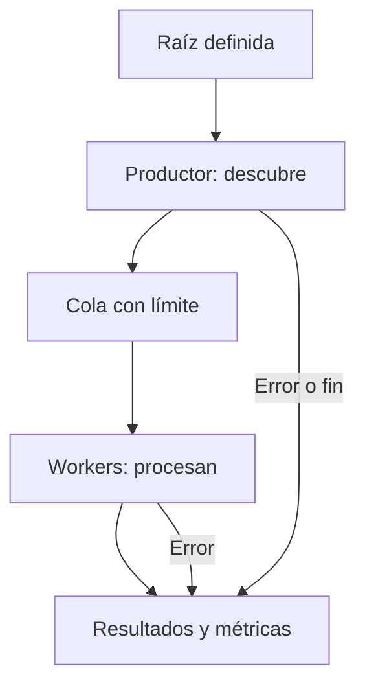
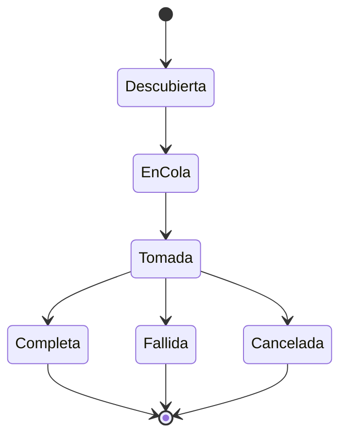
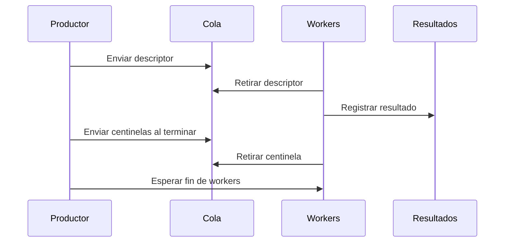

# Módulo 06 — Pipeline de procesamiento concurrente

Un pipeline de archivos coordina dos actividades con ritmos diferentes: **descubrir entradas** y **procesar las entradas descubiertas**. Entre ambas debe existir un contrato explícito: qué datos se entregan, cuántas tareas pueden esperar, qué significa terminar, cómo se notifican los errores y qué resultados sobreviven a una interrupción. La existencia de varios hilos no resuelve por sí sola ninguno de esos problemas.

Este módulo presenta la arquitectura desde el punto de vista de un analista de muestras y de quien realiza una simulación controlada. En un caso de ransomware, la segunda etapa puede realizar una transformación de datos; aquí se estudia **la coordinación**, mientras la práctica procesa archivos temporales de forma exclusivamente lectora. Ese aislamiento permite medir y provocar fallos sin convertir el laboratorio en un programa que altere documentos ajenos. La estructura del pipeline es el objeto de estudio, no una cifra de velocidad anunciada como universal.

Al terminar el módulo deberías poder:

1. Distinguir inventario completo, procesamiento por lotes y pipeline en flujo continuo.
2. Explicar los estados de una tarea desde que se descubre hasta que tiene un resultado terminal.
3. Justificar un límite de cola, un número de workers y un protocolo de cierre.
4. Reproducir fallos de enumeración, lectura, cancelación y terminación abrupta; separar sus efectos.
5. Medir tiempo hasta el primer resultado, tiempo total, ocupación de cola, espera del productor y cobertura.
6. Interpretar una traza y un experimento sin confundir capacidad del programa, comportamiento observado y resultado comprobado.

## 6.1 Ubicación del módulo dentro del curso

| Módulo | Pregunta principal | Límite de la explicación |
| --- | --- | --- |
| [04: Enumeración](Ransomware-Modulo4) | ¿Qué entradas se descubren, bajo qué raíces y condiciones? | Encontrar una entrada no demuestra que se haya procesado. |
| [05: Concurrencia y E/S](Ransomware-Modulo5) | ¿Qué contratos tienen threads, colas, eventos, lecturas y thread pools? | Una primitiva aislada no define el flujo completo. |
| **06: Pipeline** | ¿Cómo se conectan productor, cola, workers y resultados? | El laboratorio verifica lectura y coordinación; no implementa cifrado de documentos. |
| [07: Transporte de claves](Ransomware-Modulo7) | ¿Cómo se organizan y protegen los materiales criptográficos? | Es un problema distinto del cierre y la medición del pipeline. |

La separación es importante para el análisis. El enumerador puede concluir sin que hayan terminado sus tareas; un worker puede fallar después de recibir una entrada válida; una entrada descubierta puede cambiar antes de abrirse. En una muestra real, el informe debe precisar cuál de esas etapas se observó y cuál se infiere.

## 6.2 Componentes y contrato de entrega



El **productor** entrega un descriptor de tarea, no una promesa de éxito. Ese descriptor puede contener identificador, ruta observada, tamaño observado y otra información necesaria para comprobar qué se esperaba. La cola contiene descriptores; no necesita almacenar los bytes de todos los archivos. Un worker retira un descriptor, vuelve a comprobar las condiciones relevantes, ejecuta la operación permitida y publica exactamente un resultado terminal. Un componente final reúne los resultados y registra si el productor terminó normalmente.

| Campo o señal | Quién lo emite | Qué acredita | Qué no acredita |
| --- | --- | --- | --- |
| `discovered` | Productor | Se encontró una entrada durante este recorrido. | Que pudiera abrirse más tarde. |
| `submitted` | Productor, tras encolar | La cola aceptó una tarea. | Que algún worker la haya recibido. |
| `started` | Worker, tras retirarla | Un worker tomó el descriptor. | Que completara el trabajo. |
| `completed` | Worker, tras verificar | Cumplió el criterio de éxito de la práctica. | Que una operación distinta, como cifrado, se haya realizado. |
| `failed` | Worker | La tarea tuvo un fallo clasificado. | Que todo el proceso haya terminado. |
| `cancelled` | Worker o coordinador | No se ejecutó o completó por la política de parada. | Que la cancelación fuese instantánea. |
| Fin del productor | Productor o coordinador | No se enviarán más descriptores en este intento. | Que la cola esté vacía ni que todos hayan terminado. |

Para un recorrido completo y sin duplicaciones, `descubiertas` puede compararse con el universo de prueba conocido. Para cualquier ejecución que **cierre normalmente**, el invariante mínimo del laboratorio es:

```text
submitted = completed + failed + cancelled
```

Mientras está en marcha, también existen tareas en cola y tareas tomadas sin resultado. Por ello, una captura intermedia no debe evaluar el invariante terminal. Tras una caída abrupta, solo pueden contarse con certeza los resultados que se registraron de forma persistente; «no aparece en el registro» no equivale a «no se ejecutó».

### Cambio entre observación y uso

Una ruta encontrada puede desaparecer, ser reemplazada o cambiar de tamaño antes de la apertura. Este desfase, conocido como *time of check to time of use* (TOCTOU), impide tratar los metadatos de la enumeración como una garantía permanente. La práctica incluye un descriptor intencionalmente desactualizado (`stale`) y demuestra la detección de esa discrepancia. Un sistema que exige mayor certeza necesita definir qué identidad de archivo compara, en qué momento y qué hace ante un cambio; el alcance y los puntos de análisis se trataron en el módulo 04.

## 6.3 Tres formas de ordenar el trabajo

| Arquitectura | Inicio del procesamiento | Memoria y coordinación | Ventaja posible | Coste posible |
| --- | --- | --- | --- | --- |
| **Inventario previo** | Después de completar la enumeración. | Puede conservar todos los descriptores. | Inventario revisable antes de empezar. | Retrasa el primer resultado y usa memoria proporcional al inventario. |
| **Lotes** | Tras completar cada grupo de tamaño definido. | Retiene un grupo y coordina sus límites. | Permite revisar o registrar por segmentos. | Añade esperas entre grupos y exige decidir qué pasa con un lote incompleto. |
| **Flujo continuo** | En cuanto haya tareas disponibles. | Usa cola con capacidad fija y cierre explícito. | Puede solapar etapas y limitar trabajo pendiente. | Exige tratar contrapresión, fallos y estados concurrentes. |

El tiempo total de un flujo continuo tiene como límite inferior el tiempo de su etapa más lenta si ambas se solapan y no interfieren. **No es una fórmula de tiempo garantizado**: inicio, vaciado de cola, costes de coordinación y competencia por disco pueden añadir tiempo. El trabajo secuencial puede ser suficiente para conjuntos pequeños o cuando se necesita revisar el inventario completo. Comparar arquitecturas exige usar el mismo conjunto de prueba y el mismo criterio de éxito.

Una razón para medir el *tiempo hasta el primer resultado* además del tiempo total es que dos diseños pueden terminar casi a la vez pero empezar a producir resultados en momentos muy distintos. Ese dato no sustituye la cobertura: terminar pronto tras omitir entradas no constituye una mejora.

## 6.4 Cola acotada y contrapresión

Un límite de workers controla cuántas tareas se ejecutan a la vez. Un límite de cola controla cuántas **esperan**. Sin el segundo, un productor rápido podría retener un gran inventario en memoria. Con un límite, el productor se bloquea cuando la cola se llena y vuelve a avanzar cuando un consumidor retira un elemento. El valor correcto depende del tamaño de los descriptores, el ritmo de llegada, el coste del trabajo y el entorno; no se deduce de una regla fija `CPU × 2`.

La práctica usa `queue.Queue(maxsize=N)` de la biblioteca estándar de Python. Su `put()` bloquea cuando ya hay `N` elementos; `task_done()` reconoce cada elemento retirado y `join()` espera que todos los elementos introducidos hayan recibido esa señal. La cola usa sus propios mecanismos de sincronización. `qsize()` es una **observación aproximada**, por lo que el campo `queue_peak` registra el máximo observado durante las inserciones, no un máximo formal de toda la ejecución. [Python: queue](https://docs.python.org/3/library/queue.html).

Si el productor falla, aún debe notificarse que no enviará más tareas; si un consumidor falla, las tareas enviadas necesitan un resultado o una política de cancelación. Introducir un centinela por worker al final de una cola FIFO permite cerrarlos después de las tareas ordinarias. `join()` sin la llamada correspondiente a `task_done()` puede quedarse esperando indefinidamente; el código usa `finally` para emparejar ambas operaciones.

## 6.5 Estados, finalización y cancelación



La señal de cancelación no borra automáticamente el trabajo en curso. En este laboratorio, el productor deja de enviar, y cada worker que retira una tarea tras ver la señal la marca como cancelada. Una tarea que ya comenzó la lectura puede concluir después de la señal. El número exacto de tareas completadas y canceladas puede variar entre ejecuciones por la planificación de los hilos; el invariante final debe mantenerse.



El orden de llegada de resultados **no tiene por qué coincidir** con el orden de descubrimiento: dos workers pueden terminar tareas de distinta duración. El identificador de tarea permite relacionar descubrimiento y resultado sin atribuir orden causal a la posición de una línea en la salida. Los centinelas se insertan después de las tareas ya aceptadas; con una cola FIFO y un centinela por worker, cada worker puede salir tras retirar el suyo. Si se cambiara a una cola con prioridades, habría que revisar esa regla de cierre en lugar de copiarla sin más.

Una ejecución con error de productor también puede cerrarse limpiamente: se deja de descubrir, se consumen las tareas ya enviadas, se cierran workers y el informe consigna `producer_error`. El estado «terminó» no debe ocultar «terminó con fallo». Una terminación abrupta es diferente: no hay ocasión de vaciar colas, ejecutar `finally` en todos los hilos ni producir un resumen final. El experimento de caída se aísla en un proceso hijo para que el controlador pueda examinar lo ocurrido.

## 6.6 Propiedad de los recursos en Windows

En una implementación nativa con el thread pool de Windows, la relación entre descriptor, contexto del callback y objeto `PTP_WORK` debe decidirse antes de enviar trabajos. Dos modelos de cierre posibles son: esperar callbacks y cerrar cada objeto desde su propietario, o asociar los objetos a un *cleanup group* y cerrar los miembros del grupo. Mezclarlos causa liberaciones incorrectas. `CloseThreadpoolCleanupGroupMembers` espera a los callbacks y libera los objetos asociados; Microsoft indica que no deben liberarse después uno por uno. Además, el creador de trabajos debe dejar de crearlos antes de comenzar el cierre del grupo. [Microsoft: CloseThreadpoolWork](https://learn.microsoft.com/en-us/windows/win32/api/threadpoolapiset/nf-threadpoolapiset-closethreadpoolwork) · [CloseThreadpoolCleanupGroupMembers](https://learn.microsoft.com/en-us/windows/win32/api/threadpoolapiset/nf-threadpoolapiset-closethreadpoolcleanupgroupmembers).

La práctica ejecutable usa hilos de Python para que el contrato se vea sin repetir las API ya ejercitadas en el [Módulo 05](Ransomware-Modulo5). Este programa ilustra **coordinación y E/S de un pequeño conjunto temporal**. No mide la capacidad máxima del thread pool nativo ni el rendimiento de cifrado en C. Un traslado a Win32 conservaría el contrato entre etapas, pero tendría que definir explícitamente handles, buffers, alineación de datos compartidos y cierre de callbacks.

## 6.7 Resultados parciales e integridad

En la práctica, «completo» significa que el worker leyó los bytes del archivo temporal y comprobó su SHA-256 frente al valor conocido. Los archivos del conjunto permanecen sin cambios. En una aplicación que **sí** publica resultados nuevos, hay otras decisiones: dónde escribir provisionalmente, cómo verificar el resultado, cuándo marcarlo como confirmado y qué hacer si el proceso se interrumpe entre pasos. La escritura de bytes, la persistencia de datos y la publicación de un nombre no son una sola operación indivisible.

| Estado de una salida nueva | Riesgo ante interrupción | Evidencia que debería conservarse |
| --- | --- | --- |
| Aún no creada | No existe resultado parcial. | Tarea pendiente o sin registro terminal. |
| Creada parcialmente | Resultado incompleto o no verificable. | Identificador, longitud y estado provisional. |
| Escrita y verificada | Puede faltar todavía la publicación o persistencia requerida. | Comprobación terminada y etapa de publicación pendiente. |
| Publicada | Debe comprobarse qué garantía aporta el sistema de archivos. | Resultado terminal confirmado y registro coherente. |

Modificar directamente un archivo y crear uno nuevo tienen perfiles de fallo distintos; no se pueden declarar seguros solo por el nombre del método. `FlushViewOfFile` inicia el volcado de páginas modificadas, pero Microsoft aclara que no vacía los metadatos y no espera necesariamente a que los cambios lleguen al medio físico. En una ruta de red, la garantía depende también del servidor. [Microsoft: FlushViewOfFile](https://learn.microsoft.com/en-us/windows/win32/api/memoryapi/nf-memoryapi-flushviewoffile). El análisis de esta sección se limita a integridad y recuperación; la práctica no publica ni elimina originales.

## 6.8 Errores ordinarios, excepciones y caída del proceso

| Caso | Señal observable | Tratamiento correcto en el análisis |
| --- | --- | --- |
| Acceso denegado o recurso ocupado | Fallo de una operación de archivo y código o excepción de E/S | Registrar la tarea fallida y el contexto. |
| Ruta que cambió | Incompatibilidad con el descriptor o fallo de apertura | Evitar declarar éxito solo por haberla descubierto. |
| Fallo del productor | Enumeración incompleta y fin de envíos | Drenar trabajos existentes y conservar el estado de productor. |
| Cancelación solicitada | Señal común; mezcla de tareas terminadas y canceladas | Contar estados por separado y definir el cierre. |
| Fallo de programación | Excepción inesperada, posible estado compartido incoherente | Diagnosticar la causa; un capturador general no prueba recuperación. |
| Caída abrupta | No se ejecuta el cierre normal | Examinar registros parciales y verificar datos externos. |

En Win32, muchas operaciones fallidas indican el error mediante el valor devuelto y `GetLastError`, que debe consultarse en el momento apropiado. SEH se refiere a excepciones estructuradas y no reemplaza las comprobaciones de `ReadFile` o `WriteFile`. Capturar todas las excepciones de un callback y continuar puede ocultar un fallo del programa; el código de laboratorio distingue fallos previstos de una caída completa. [Microsoft: Last-Error Code](https://learn.microsoft.com/en-us/windows/win32/debug/last-error-code) · [Structured Exception Handling](https://learn.microsoft.com/en-us/windows/win32/debug/structured-exception-handling).

## 6.9 Qué medir y cómo interpretarlo

| Métrica | Cálculo o definición | Lectura correcta |
| --- | --- | --- |
| Tiempo total | Fin de los workers menos inicio de enumeración. | Incluye arranque, colas y cierre de esta ejecución. |
| Primer resultado | Primer resultado terminal menos inicio. | Separa latencia inicial de duración total. |
| Duración de enumeración | Fin del productor menos inicio. | En modo `batch` incluye la construcción del inventario; en `stream`, puede incluir esperas por cola. |
| Espera del productor | Suma del tiempo en `put()` cuando ya no había plaza inmediata. | Señal de contrapresión, no por sí sola de un defecto. |
| Máximo de cola observado | Mayor muestra de `qsize()` tras insertar. | Aproximación acotada por la capacidad; no un pico exacto. |
| Tareas por segundo | Tareas completadas / tiempo total en segundos. | Acompañar de fallos, tamaños y condiciones. |
| Cobertura | Entradas descubiertas y tareas enviadas frente al conjunto conocido. | Un número alto de resultados no demuestra cobertura total si el productor falló. |
| Bytes verificados | Suma de lecturas que terminaron y se comprobaron. | No equipararlo automáticamente a tráfico físico de disco. |

El programa usa `time.perf_counter()` para intervalos. Se generan archivos pequeños conocidos, y las lecturas repetidas pueden quedar en caché. Para comparar configuraciones, registra procesador, versión de Python, Windows, tipo de almacenamiento, número y tamaño de archivos, retrasos configurados, capacidad de cola, número de workers y orden de ejecución. Repite las pruebas y presenta mediana y dispersión. Un ensayo aislado no autoriza una fórmula general para el «número óptimo» de threads. [Python: time.perf_counter](https://docs.python.org/3/library/time.html#time.perf_counter).

### Comparación justa de `batch` y `stream`

Ambos escenarios usan el mismo conjunto temporal, la misma función de lectura, los mismos delays y el mismo criterio de éxito. El modo `batch` guarda los descriptores antes de iniciar workers; `stream` inicia workers antes y entrega cada descriptor según aparece. Los retrasos de enumeración y trabajo simulan dos etapas distinguibles; no equivalen a latencias reales de NTFS, ReFS o SMB. Cambiar solo `workers` o `queue` permite observar la respuesta de **este** modelo sin confundirla con una medición del rendimiento nativo de Windows.

## 6.10 Laboratorio autocontenido para Windows 11

**Requisitos:** Windows 11 y Python 3.11 o posterior. El script utiliza únicamente la biblioteca estándar. Crea de 4 a 500 archivos propios de 4096 bytes dentro de un directorio temporal, los lee y compara sus resúmenes. No recibe una ruta de archivos del usuario ni recorre carpetas externas. Su proceso principal conserva el control del directorio temporal incluso durante la prueba de caída del proceso hijo. Si un archivo no puede borrarse al terminar por una causa del entorno, `TemporaryDirectory` comunicará el fallo; el lector puede identificar su ubicación mediante `%TEMP%`. [Python: tempfile.TemporaryDirectory](https://docs.python.org/3/library/tempfile.html).

En PowerShell, guarda el bloque como `pipeline_lab.py` y ejecuta:

```powershell
py -3 pipeline_lab.py --scenario all
py -3 pipeline_lab.py --scenario stream --files 120 --workers 4 --queue 1 --enum-ms 0 --work-ms 8
py -3 pipeline_lab.py --scenario crash --files 40
```

Si `py -3` no está disponible en tu instalación, utiliza el ejecutable de Python 3 de tu entorno. La opción `--scenario all` ejecuta de forma sucesiva `batch`, `stream`, `worker`, `producer`, `cancel`, `stale` y `crash`. Los retrasos admitidos van de 0 a 100 ms; el número de workers, de 1 a 16; la cola, de 1 a 256.

```python
"""Laboratorio de coordinación; lee solo archivos temporales creados aquí."""

import argparse
import hashlib
import json
import multiprocessing as mp
import os
import queue
import tempfile
import threading
import time
from dataclasses import dataclass
from pathlib import Path


@dataclass(frozen=True)
class Task:
    number: int
    path: Path
    expected_size: int
    expected_sha256: str


def create_dataset(folder: Path, count: int) -> dict[int, str]:
    folder.mkdir()
    expected = {}
    for number in range(count):
        payload = bytes([number % 251]) * 4096
        path = folder / f"item-{number:05d}.bin"
        path.write_bytes(payload)
        expected[number] = hashlib.sha256(payload).hexdigest()
    return expected


def verify_dataset(folder: Path, expected: dict[int, str]) -> bool:
    paths = sorted(folder.glob("item-*.bin"))
    if len(paths) != len(expected):
        return False
    return all(
        hashlib.sha256(path.read_bytes()).hexdigest() == expected[int(path.stem[5:])]
        for path in paths
    )


def run_pipeline(folder: Path, expected: dict[int, str], scenario: str,
                 workers: int, capacity: int, enum_ms: float, work_ms: float,
                 journal: Path | None = None) -> dict:
    started_at = time.perf_counter()
    tasks: queue.Queue[Task | None] = queue.Queue(maxsize=capacity)
    stop = threading.Event()
    lock = threading.Lock()
    trigger = max(1, len(expected) // 3)
    crash_at = max(1, len(expected) // 4)
    counters = dict(enumerated=0, submitted=0, started=0, completed=0,
                    failed=0, cancelled=0, bytes_read=0, queue_peak=0)
    error_types: dict[str, int] = {}
    first_result: float | None = None
    producer_wait = 0.0
    producer_error: str | None = None

    def record(task: Task, outcome: str, reason: str, size: int) -> None:
        nonlocal first_result
        with lock:
            if first_result is None:
                first_result = time.perf_counter() - started_at
            counters[outcome] += 1
            counters["bytes_read"] += size
            if reason:
                error_types[reason] = error_types.get(reason, 0) + 1
            if journal is not None:
                line = json.dumps({"id": task.number, "outcome": outcome,
                                   "reason": reason}) + "\n"
                with journal.open("a", encoding="utf-8") as output:
                    output.write(line)
                    output.flush()
                    os.fsync(output.fileno())
            terminal = (counters["completed"] + counters["failed"]
                        + counters["cancelled"])
            if scenario == "crash" and terminal == crash_at:
                os._exit(86)  # Solo en el proceso hijo aislado.

    def worker() -> None:
        while True:
            task = tasks.get()
            try:
                if task is None:
                    return
                with lock:
                    counters["started"] += 1
                if stop.is_set():
                    record(task, "cancelled", "stop_requested", 0)
                    continue
                try:
                    time.sleep(work_ms / 1000.0)
                    if scenario == "worker" and task.number == trigger:
                        raise OSError("injected_worker_error")
                    if task.path.stat().st_size != task.expected_size:
                        raise ValueError("metadata_mismatch")
                    data = task.path.read_bytes()
                    if hashlib.sha256(data).hexdigest() != task.expected_sha256:
                        raise ValueError("content_mismatch")
                    record(task, "completed", "", len(data))
                except (OSError, ValueError) as exc:
                    reason = (str(exc) if isinstance(exc, ValueError)
                              or str(exc).startswith("injected_") else type(exc).__name__)
                    record(task, "failed", reason, 0)
            finally:
                tasks.task_done()

    def enumerate_tasks():
        for path in sorted(folder.glob("item-*.bin")):
            time.sleep(enum_ms / 1000.0)
            number = int(path.stem[5:])
            size = 4097 if scenario == "stale" and number == trigger else 4096
            yield Task(number, path, size, expected[number])

    # En lote, se completa el inventario antes de iniciar workers.
    if scenario == "batch":
        batch = list(enumerate_tasks())
        counters["enumerated"] = len(batch)
        source = iter(batch)
    else:
        source = enumerate_tasks()

    threads = [threading.Thread(target=worker, name=f"worker-{i}")
               for i in range(workers)]
    for thread in threads:
        thread.start()

    try:
        for task in source:
            if scenario != "batch":
                counters["enumerated"] += 1
            if scenario == "producer" and counters["enumerated"] == trigger:
                raise RuntimeError("injected_producer_error")
            try:
                tasks.put_nowait(task)
            except queue.Full:
                waiting_since = time.perf_counter()
                tasks.put(task)  # Bloquea hasta que haya espacio.
                producer_wait += time.perf_counter() - waiting_since
            counters["submitted"] += 1
            counters["queue_peak"] = max(counters["queue_peak"], tasks.qsize())
            if scenario == "cancel" and counters["submitted"] == trigger:
                stop.set()
                break
    except Exception as exc:
        producer_error = f"{type(exc).__name__}: {exc}"
    enumeration_elapsed = time.perf_counter() - started_at

    # Los centinelas viajan por la misma cola FIFO después de las tareas.
    for _ in threads:
        tasks.put(None)
    tasks.join()
    for thread in threads:
        thread.join()

    terminal = counters["completed"] + counters["failed"] + counters["cancelled"]
    assert terminal == counters["submitted"]
    return dict(scenario=scenario, **counters, errors=error_types,
                producer_error=producer_error,
                first_result_ms=round((first_result or 0) * 1000, 2),
                enumeration_ms=round(enumeration_elapsed * 1000, 2),
                producer_wait_ms=round(producer_wait * 1000, 2),
                total_ms=round((time.perf_counter() - started_at) * 1000, 2))


def main() -> None:
    parser = argparse.ArgumentParser(description="Pipeline de laboratorio con fallos controlados")
    parser.add_argument("--scenario", choices=("all", "batch", "stream", "worker",
                                               "producer", "cancel", "stale", "crash"),
                        default="all")
    parser.add_argument("--files", type=int, default=120)
    parser.add_argument("--workers", type=int, default=4)
    parser.add_argument("--queue", type=int, default=8)
    parser.add_argument("--enum-ms", type=float, default=2.0)
    parser.add_argument("--work-ms", type=float, default=4.0)
    args = parser.parse_args()
    if not (4 <= args.files <= 500 and 1 <= args.workers <= 16
            and 1 <= args.queue <= 256 and 0 <= args.enum_ms <= 100
            and 0 <= args.work_ms <= 100):
        parser.error("Límites: files 4..500; workers 1..16; queue 1..256; retrasos 0..100 ms")

    with tempfile.TemporaryDirectory(prefix="modulo06_") as temporary:
        base = Path(temporary)
        folder = base / "dataset"
        expected = create_dataset(folder, args.files)
        scenarios = ("batch", "stream", "worker", "producer", "cancel",
                     "stale", "crash") if args.scenario == "all" else (args.scenario,)
        for scenario in scenarios:
            if scenario == "crash":
                journal = base / "journal.jsonl"
                journal.write_text("", encoding="utf-8")
                process = mp.get_context("spawn").Process(
                    target=run_pipeline,
                    args=(folder, expected, scenario, args.workers, args.queue,
                          args.enum_ms, args.work_ms, journal))
                process.start()
                process.join(timeout=45)
                if process.is_alive():
                    process.terminate()
                    process.join()
                    raise RuntimeError("El proceso hijo no terminó dentro del límite")
                lines = journal.read_text(encoding="utf-8").splitlines()
                recorded = [json.loads(line) for line in lines]
                unique = len({item["id"] for item in recorded}) == len(recorded)
                result = {"scenario": "crash", "child_exit": process.exitcode,
                          "journal_records": len(recorded),
                          "unique_records": unique,
                          "originals_intact": verify_dataset(folder, expected)}
                assert (result["child_exit"] == 86 and unique
                        and len(recorded) == max(1, args.files // 4))
            else:
                result = run_pipeline(folder, expected, scenario, args.workers,
                                      args.queue, args.enum_ms, args.work_ms)
                result["originals_intact"] = verify_dataset(folder, expected)
            print(json.dumps(result, ensure_ascii=False, sort_keys=True), flush=True)
        assert verify_dataset(folder, expected)


if __name__ == "__main__":
    mp.freeze_support()
    main()
```

### Lectura del programa por etapas

1. `create_dataset` genera los originales temporales y conserva los SHA-256 esperados. El generador solo trabaja bajo el directorio que creó el controlador.
2. `enumerate_tasks` produce descriptores; en `stale` altera **el tamaño del descriptor**, sin cambiar el archivo. El worker detecta la diferencia.
3. `queue.Queue` recibe descriptores. El productor registra la espera real cuando intenta insertar en una cola ya llena.
4. Los workers retiran tareas, comprueban tamaño y contenido, publican un resultado y llaman a `task_done()` incluso si hubo un error previsto.
5. Al terminar el productor, un centinela por worker viaja detrás de las tareas ordinarias. `join()` espera todos los reconocimientos antes de cerrar hilos.
6. En `crash`, un proceso hijo registra resultados en un diario temporal y sale con código `86` cuando alcanza el umbral. El controlador comprueba el registro, verifica que no haya identificadores duplicados y coteja otra vez los originales. `os._exit()` se ejecuta solo en ese hijo: precisamente permite observar una salida que no hace el cierre normal. [Python: multiprocessing](https://docs.python.org/3/library/multiprocessing.html) · [os._exit](https://docs.python.org/3/library/os.html#os._exit).

**Resultado esperado:** para `batch` y `stream`, `completed = submitted = files`, `failed = cancelled = 0` y `originals_intact = true`. Para `worker` y `stale`, habrá una tarea fallida. Para `producer`, se descubrirá y enviará menos trabajo que el total. Para `cancel`, algunos trabajos enviados podrán concluir y otros quedarán clasificados como cancelados. En `crash` se esperan `child_exit = 86`, registros únicos y `originals_intact = true`. Las duraciones y la distribución exacta al cancelar dependen del equipo.

Si un fallo de productor ocurre antes del primer envío en una configuración mínima, `first_result_ms = 0` significa que no hubo resultados; no debe interpretarse como una latencia de cero. El código exige al menos cuatro archivos de prueba y limita sus parámetros para que un error de entrada no cree una carga desproporcionada.

## 6.11 Experimentos de fallo y razonamiento

| Ejecución | Predicción que conviene escribir antes | Qué comprobar después |
| --- | --- | --- |
| `--scenario stream --queue 1 --work-ms 8 --enum-ms 0` | El productor tendrá que esperar. | `producer_wait_ms`, `queue_peak`, `total_ms` y conservación de originales. |
| `--scenario batch` frente a `--scenario stream` | El primer resultado aparecerá antes en `stream` si se logra solapar etapas. | `first_result_ms`, `enumeration_ms` y `total_ms` en varias repeticiones. |
| `--scenario producer` | La cobertura será parcial, pero las tareas ya enviadas tendrán resultado. | `producer_error`, `enumerated`, `submitted` y el invariante terminal. |
| `--scenario worker` | Una tarea tendrá un error inyectado; otras podrán terminar. | `errors` y la igualdad de estados terminales. |
| `--scenario stale` | Una diferencia de metadatos impedirá declarar éxito. | Un `metadata_mismatch` sin cambio en los originales. |
| `--scenario cancel` | El trabajo en curso puede concluir después de la señal. | Separación de `completed` y `cancelled`; variación entre ejecuciones. |
| `--scenario crash` | No habrá informe final del proceso hijo. | Código de salida, diario parcial y resúmenes intactos de los originales. |

### Variaciones con propósito

- Cambia **solo** el número de workers entre 1, 2, 4, 8 y 16; registra tres ensayos de cada valor. Explica cuándo el tiempo deja de mejorar.
- Repite con colas de 1, 8 y 64 plazas. Contrasta la espera del productor con el tiempo total y el máximo observado de ocupación.
- Ejecuta el escenario de fallo de productor con un solo worker y luego con ocho. Explica por qué el número de tareas **enviadas** se mantiene ligado al punto de fallo, aunque cambie el tiempo necesario para vaciar la cola.
- Compara la caída con un error de worker. En el primero faltan el cierre y el resumen del hijo; en el segundo, el proceso aún puede producir un balance final.
- Modifica la condición de éxito en una copia del script y deja constancia de qué mide ahora `completed`. Esta acción sirve para distinguir «se leyó», «coincide el resumen» y «la tarea terminó sin lanzar excepción».

No simules disco lleno llenando la unidad del equipo. Para estudiar esa rama, incorpora un fallo controlado en la función del laboratorio que representa la lectura o la publicación de resultados; registra el código ficticio y comprueba el cierre. Las pruebas de caída y recuperación pertenecen solo al directorio temporal creado por el programa.

## 6.12 Observación del sistema y límites del experimento

En Process Monitor se puede filtrar `python.exe` y el prefijo temporal `modulo06_` para comprobar qué archivos se crean, leen y eliminan. El programa escribe el diario solo en la prueba `crash`. Una traza puede mostrar accesos y tiempos sin contener todos los resultados internos de la aplicación; compárala con la salida JSON. Si una captura no presenta una operación, revisa filtros, proveedores activados y posibles eventos perdidos. [Microsoft: Process Monitor](https://learn.microsoft.com/en-us/sysinternals/downloads/procmon) · [ETW](https://learn.microsoft.com/en-us/windows/win32/etw/about-event-tracing).

El laboratorio usa hilos de Python y espera artificial. Su comparación **no** mide cifrado real, E/S remota ni el máximo throughput de un thread pool Win32. El bloqueo global del intérprete y el comportamiento de `hashlib`, la caché y el sistema de archivos influyen en los resultados. Para una evaluación nativa posterior, conserva la misma definición de tareas, estados y métricas, y cambia solo la implementación de las etapas. No infieras que una configuración óptima en este script lo será en un SSD, un HDD o un recurso SMB.

### Prioridad y rendimiento

Una clase de prioridad modifica la planificación del proceso; no convierte una actividad en invisible. En Windows, bajar la prioridad de CPU tampoco controla por sí mismo la presión sobre disco y memoria. Si una simulación necesita coexistir con otras aplicaciones, registra las políticas de uso de recursos que realmente se aplicaron y mide sus efectos. No incluyas «sigilo» como conclusión derivada de `SetPriorityClass`. [Microsoft: SetPriorityClass](https://learn.microsoft.com/en-us/windows/win32/api/processthreadsapi/nf-processthreadsapi-setpriorityclass).

## 6.13 Plantilla breve de informe

| Campo | Registro que debe acompañar una comparación |
| --- | --- |
| Entorno | Windows, versión de Python, CPU, RAM, volumen, sistema de archivos, estado de caché conocido. |
| Datos | Cantidad de archivos temporales, tamaño por archivo, resumen esperado y alcance exacto. |
| Parámetros | Arquitectura, workers, capacidad de cola, retrasos simulados y escenario de fallo. |
| Tiempo | Primer resultado, fin de enumeración, espera del productor, duración total. |
| Resultados | Descubiertas, enviadas, tomadas, completas, fallidas, canceladas, bytes verificados. |
| Integridad | Invariante terminal, originales intactos, identificadores únicos en el diario. |
| Limitaciones | Qué observó el experimento y qué propiedades de una muestra real no reproduce. |

Una conclusión defendible podría decir: «Con este conjunto temporal, la configuración A redujo la latencia hasta el primer resultado en las repeticiones registradas; los resultados terminales se contabilizaron y los originales conservaron sus resúmenes». Debe acompañarse de los datos medidos. Un resultado similar no demuestra que una arquitectura sea siempre más rápida ni que una muestra concreta utilice ese diseño.

## 6.14 Reintentos, duplicados y reanudación

Un resultado terminal dentro de un proceso vivo no basta para diseñar una reanudación tras caída. El diario de `crash` se escribe por tarea y puede mostrar qué resultados fueron confirmados antes de que el hijo saliera. Una tarea ausente del diario podría no haberse enviado, seguir en cola, haberse tomado sin llegar al registro o incluso haber producido un efecto que no quedó anotado. Estas posibilidades deben mantenerse separadas en el informe.

El laboratorio utiliza lectura y comparación de resúmenes, por lo que repetir una tarea no cambia el archivo. Esa propiedad se llama **idempotencia** respecto de los datos de prueba. Si una tarea real produjera una salida nueva, reintentarla exigiría comprobar qué artefacto dejó la ejecución anterior y bajo qué condiciones se permite sustituirlo. Una política de «reintentar toda tarea sin resultado en el diario» puede repetir trabajo; una política de «nunca repetir» puede dejar trabajo sin terminar. No hay una garantía general de ejecución exactamente una vez por el mero hecho de utilizar una cola.

| Política ante una tarea sin resultado registrado | Beneficio posible | Información que falta |
| --- | --- | --- |
| No reintentar | Evita repeticiones automáticas. | Puede quedar trabajo sin procesar. |
| Reintentar | Puede recuperar tareas interrumpidas. | Necesita un criterio para detectar duplicados y salidas parciales. |
| Revisar antes y decidir | Permite clasificar cada caso. | Exige conservar identificadores y evidencia suficiente. |

Un identificador estable, un descriptor de versión y un estado de salida ayudarían a tomar esa decisión. El resumen SHA-256 de los originales en esta práctica demuestra solo que esos datos conocidos permanecen intactos: no es un protocolo general de recuperación. Para ampliar el experimento, identifica los registros presentes tras `crash`, calcula qué identificadores faltan y redacta una política hipotética de reanudación sin ejecutar ninguna modificación sobre los archivos.

## 6.15 Análisis de una muestra: niveles de evidencia

El concepto de pipeline también sirve para leer una traza con disciplina. Un conjunto de aperturas de directorio seguido de lecturas y escrituras intercaladas es **compatible** con etapas solapadas, pero no prueba por sí solo una cola concreta ni un thread pool de Windows. Un proceso podría usar callbacks, varios hilos explícitos, E/S asincrónica, un inventario previo parcial o bibliotecas que oculten las llamadas internas. La observación de un parámetro de prioridad tampoco revela de forma fiable la intención que motivó su uso.

| Nivel | Ejemplo | Conclusión prudente |
| --- | --- | --- |
| Código presente | Se identifica una llamada a `SubmitThreadpoolWork`. | El binario contiene la capacidad de enviar trabajo al pool. |
| Ejecución observada | Se registran callbacks y resultados durante la enumeración. | En esa ejecución hubo solapamiento bajo las condiciones observadas. |
| Resultado corroborado | Se relacionan identificadores, rutas de prueba y resultados. | Puede informarse el alcance y los fallos del ensayo. |
| Arquitectura atribuida | Se reconstruyen productor, límite de cola y cierre. | Requiere más de una llamada aislada y descartar explicaciones alternativas. |

Esta separación resulta especialmente útil si un sistema de detección corta la ejecución a mitad del recorrido. El conjunto de entradas descubiertas puede ser mayor que el de trabajos enviados, y este último mayor que el de resultados corroborados. Una lectura defensiva rigurosa conserva esas diferencias en vez de condensarlas en «procesó todos los archivos».

## Xtra:

1. ¿Qué secuencia de eventos demostraría que la enumeración y el procesamiento estuvieron solapados, y qué información seguiría faltando?
2. ¿Cómo distinguirías una cola acotada de un pool que solo limita el número de hilos?
3. ¿Qué evidencia permitiría separar una entrada descubierta de una tarea enviada, tomada y terminada?
4. ¿Qué cambia en el protocolo de cierre si el productor falla cuando la cola está llena?
5. ¿Qué escenarios hacen que `submitted = completed + failed + cancelled` sea insuficiente durante una ejecución activa?
6. ¿Qué relación hay entre un descriptor desactualizado y el instante en que un worker abre el archivo?
7. ¿Por qué una caída abrupta exige interpretar de otra manera la ausencia de un identificador en el diario?
8. ¿Qué diferencias observables habría entre publicar resultados directamente y publicarlos tras comprobar una salida provisional?
9. ¿Qué riesgos aparecen si el hilo que crea objetos `PTP_WORK` sigue activo mientras otro cierra su *cleanup group*?
10. ¿Cómo justificarías con mediciones que aumentar workers mejoró un caso, sin extrapolarlo a todos los dispositivos?
11. ¿Qué campos de una traza permitirían comprobar que la lectura de archivos temporales ocurrió, y cuáles requieren evidencia de la aplicación?
12. ¿Qué comportamiento observado en una muestra permitiría proponer la hipótesis de un pipeline, y qué alternativa explicaría los mismos eventos?

## Referencias técnicas

- [Microsoft Learn: Thread Pool API](https://learn.microsoft.com/en-us/windows/win32/procthread/thread-pool-api).
- [Microsoft Learn: CloseThreadpoolCleanupGroupMembers](https://learn.microsoft.com/en-us/windows/win32/api/threadpoolapiset/nf-threadpoolapiset-closethreadpoolcleanupgroupmembers).
- [Microsoft Learn: FlushViewOfFile](https://learn.microsoft.com/en-us/windows/win32/api/memoryapi/nf-memoryapi-flushviewoffile).
- [Microsoft Learn: Last-Error Code](https://learn.microsoft.com/en-us/windows/win32/debug/last-error-code).
- [Python: queue](https://docs.python.org/3/library/queue.html) · [threading](https://docs.python.org/3/library/threading.html) · [multiprocessing](https://docs.python.org/3/library/multiprocessing.html) · [tempfile](https://docs.python.org/3/library/tempfile.html).

© 2026 Aldair Maihuiri. Todos los derechos reservados. Se permite compartir con atribución al autor. La reproducción sin autorización previa está prohibida.
