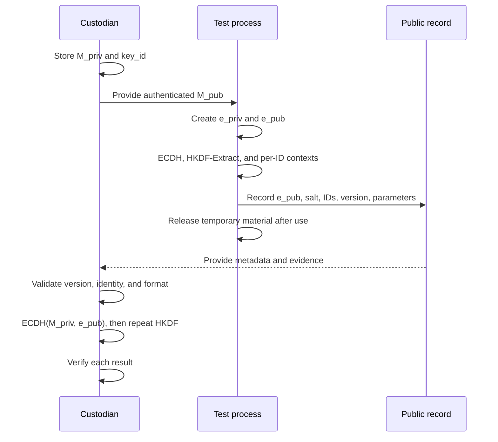

# Module 07 — Key Custody, Exposure, and Recovery

An encryption scheme must solve two problems at once: restrict who can obtain its secrets and retain everything needed to repeat derivation when data must be recovered. The first concerns confidentiality; the second, availability. A sound algorithm cannot compensate for a lost private key, an ambiguous identifier, or a public parameter that was never recorded.

[Module 03](Ransomware-Modulo3-en) compared two models: **A**, an ephemeral ECDH agreement per entry; and **B**, one ECDH agreement per session followed by independent derivations for each entry. This module follows the subsequent lifecycle of their secrets and metadata. [Module 02](Ransomware-Modulo2-en) covers algorithm properties, while [Modules 05](Ransomware-Modulo5-en) and [06](Ransomware-Modulo6-en) address I/O, concurrency, and partial results. Here we examine what those choices mean for custody and verifiable reconstruction.

For an authorized exercise, the organizing question is specific: **if execution stops and only the material in custody and the experiment's metadata remain, can the correct key be reconstructed for each entry, and can the integrity of the data be demonstrated?** A defensible answer identifies the secrets, their scope and lifetime, the authenticity of parameters, and possible failures. The exercises use synthetic material and records; they do not encrypt files or make network connections.

## 7.1 Trust model and dependencies

The word *key* is too broad when several values have different roles. The table establishes the terms used here. A value described as “public” can be known without thereby revealing a private key; **it still cannot be substituted without consequences**.

| Material | Typical scope | Secret? | Where must it be available for reconstruction? | Consequence of loss or exposure |
| --- | --- | --- | --- | --- |
| Master private key `M_priv` | All sessions that depend on that pair | Yes | Authorized custody and a tested backup | Loss may prevent recovery; exposure affects associated sessions when their public metadata remain available. |
| Master public key `M_pub` | The same master pair | No; its authenticity matters | Authorized version linked to its identifier | Substitution can change the cryptographic recipient of a session. |
| Ephemeral private key `e_priv` | One entry in A; one session in B | Yes | It need not be retained when derivation and parameters were completed and recorded | Exposure during its lifetime permits the corresponding agreement to be recomputed using `M_pub`. |
| Ephemeral public key `e_pub` | One entry in A; one session in B | No | Metadata associated with the correct scope | If missing or mismatched, the other participant cannot repeat the intended agreement. |
| Shared secret `Z` | One ECDH agreement | Yes | Recomputed from the master private key and a valid ephemeral public key | Exposure affects everything derived from that agreement. |
| Intermediate material `PRK` | One entry in A; potentially a whole session in B | Yes | Derived again from `Z`, the `salt`, and the specified KDF | In B, exposure can reach every entry derived from that `PRK`. |
| Working key `K_i` | One entry or specified use | Yes | Derived again with the exact identifier and context | Exposure alone does not imply knowledge of the master private key or every other working key. |
| Identifiers, `salt`, nonce, and version | Depends on the field | Usually no | Persistent, verifiable record | Loss, ambiguity, or alteration can prevent correct recovery. |

“A key was found, therefore all files can be decrypted” is not a sound conclusion until we establish **which** key was found, which scheme produced it, and which entries depend on it. Nor does ECDH by itself guarantee that only the intended holder of `M_priv` can recover data. The authenticity of `M_pub`, the handling of secrets during execution, the KDF, and metadata integrity are additional conditions.

In both models, the holder of `M_priv` computes an agreement with `e_pub`; the initiating process obtains the same result using `e_priv` and `M_pub`. **Neither private key needs to travel with the metadata.** Repeating a derivation requires the exact algorithm and parameters, along with the identity used as context. A `salt` and identifiers may be public, yet losing one of these public inputs can be as consequential for recovery as losing a secret.

### Four properties to assess separately

1. **Confidentiality:** who can obtain a private key, `Z`, `PRK`, or `K_i`.
2. **Authenticity:** how the master public key and metadata are tied to the intended exercise.
3. **Availability:** what remains accessible after a crash, deletion, or network failure.
4. **Integrity of recovery:** how a result is checked before being accepted as correct.

A CRC can help detect accidental corruption in a structure; it does not establish who produced it. A signature or MAC has different requirements and must be checked under the chosen protocol. With authenticated encryption such as ChaCha20-Poly1305, the tag is verified according to the algorithm before the data are accepted as authentic; the nonce and tag are part of the recovery contract. [RFC 8439](https://www.rfc-editor.org/rfc/rfc8439.html).

## 7.2 Master private key custody and public key authenticity

Long-lived material sets the maximum scope of a scheme. Saying that the master private key “lives on a server” does not answer who controls that server, how the key is protected, whether a backup exists, how its integrity is checked, or what happens if it becomes unavailable. NIST discusses generation, storage, use, backup, and destruction as parts of a key's lifecycle. [NIST SP 800-57, Part 1](https://csrc.nist.gov/pubs/sp/800/57/pt1/r5/final).

| Decision | Question to answer | Risk being tested |
| --- | --- | --- |
| Custody apart from the test process | Which people and systems may use `M_priv`? | Unintended access and exposure of multiple sessions. |
| Private key backup | Does it exist, can it be recovered, and is access controlled? | Irrecoverable loss of material needed to close the exercise. |
| Master key identifier | Which pair was used for each agreement? | Confusion after rotation or across exercises. |
| Authentication of `M_pub` | What is its trusted source, and how is its identity checked? | Public key substitution and reconstruction for a different recipient. |
| Exercise closeout | Who receives the artifacts, and how is recovery capability verified? | Subsequent dependence on an outside person or infrastructure. |

A master public key embedded in a program may be tied to a particular build, but that alone does not establish that it is the approved key. A verified fingerprint or a signature over configuration can establish identity if trust in the fingerprint or verification key is established independently. **ECDH without authenticating participants or their public keys does not address key substitution.**

An exercise report should record the identifier of the authorized public key, the custodian, the handoff procedure, and the outcome of at least one test recovery. Private values need not be included in the report. If a master key is rotated, earlier metadata must still identify the version to which they belong; updating current configuration does not move previous agreements to the new pair.

## 7.3 Secret lifetimes and memory analysis

An operation uses ephemeral private keys, a shared secret, and derived keys. Reducing their lifetimes may narrow opportunities for exposure, but it does not prove that no copies remain. A process, a cryptographic library, stacks, the heap, registers, or particular system artifacts may hold temporary representations. Whether a value can be found depends on capture timing and implementation; searching for hexadecimal strings is not a general test for binary keys.

In **A**, each agreement and its derived material belong to one entry. In **B**, releasing `e_priv` after agreement does not make `PRK` nonsensitive if it remains available to derive keys across the session. The exposure model must preserve this distinction: the lifetime of a temporary private key may be short while a downstream secret remains active.

| Frequently cited mechanism | What it can achieve | What it does not establish |
| --- | --- | --- |
| Destroying a cryptographic handle or object | Ends use of that object under the API's contract. | That earlier copies do not remain in other buffers, registers, or system artifacts. |
| Overwriting an application-controlled buffer | Reduces persistence of its contents in that buffer. | That a copy made earlier has disappeared. |
| DPAPI protection for a blob | Protects data while they remain in protected form. | Continuous protection of plaintext needed by the application in memory. |
| XOR with machine properties | Changes the representation of bytes. | Cryptographic confidentiality or an inability to reverse the transformation. |
| Splitting bytes across fields | Changes where a contiguous sequence occurs. | General invisibility to memory analysis. |

In particular, `CryptProtectData` with `CRYPTPROTECT_LOCAL_MACHINE` associates protected data with the machine; Microsoft states that any user on the same machine can call `CryptUnprotectData` to recover it. The unprotected result must also exist as plaintext at some point of use. The `CRYPTPROTECT_LOCAL_MACHINE` option applies when protecting data and is not listed among the documented flags for `CryptUnprotectData`. [Microsoft: `CryptProtectData`](https://learn.microsoft.com/en-us/windows/win32/api/dpapi/nf-dpapi-cryptprotectdata); [Microsoft: `CryptUnprotectData`](https://learn.microsoft.com/en-us/windows/win32/api/dpapi/nf-dpapi-cryptunprotectdata).

The page file, dumps, and hibernation data may provide evidence under particular circumstances. It would be inaccurate to claim that every key appears there or to prescribe system changes as a guarantee of concealment. When analyzing a sample, record capture times, accessible regions, acquisition limits, and verified correspondence between any recovered value and a cryptographic operation. Entropy in a small block does not by itself identify a key.

### A lifecycle contract that can be documented

For every sensitive object, record: **creation → expected last use → requested release → application-controlled copies → observed evidence**. For example, calling `BCryptDestroyKey` shows that destruction of an object was requested through the API; it is insufficient grounds to say that any possibility of recovering related material has vanished. The conclusion should reflect what observation supports.

## 7.4 End-to-end reconstruction

Recovery is more than the inverse of a single function: it repeats a chain of dependencies. The sequence below shows **B, one agreement per session**, without assuming that records are held on a particular server.



In model **A**, an agreement is repeated using a separate `e_pub_i` for each entry. In model **B**, `e_pub` identifies the session agreement and a stable entry identifier separates the derivations. Both require the exact representation of `salt`, `info`, identifiers, and public key formats. HKDF consists of **extract** and **expand**; saying only “use SHA-256” leaves the protocol underspecified. [RFC 5869](https://www.rfc-editor.org/rfc/rfc5869.html).

The conceptual contract can be expressed as follows, without claiming that these variable names appear in any particular binary:

```text
Z   = ECDH(M_priv, e_pub_s)           # reconstruction by the custodian
PRK = HKDF-Extract(salt_s, Z)
K_i = HKDF-Expand(PRK, context_v1 || session_id || entry_id_i, length)
```

The test process can calculate the same `Z` with `e_priv_s` and `M_pub`. Concatenated context fields require unambiguous boundaries and encoding: `ab || c` should not be confused with `a || bc`. The `entry_id_i` must be stable. A path can change name, encoding, capitalization, or location; if it was originally used as the derivation context, recovery requires preserving **the exact representation used at that time**. A new design is easier to reason about if it records an assigned entry identifier and treats the path as descriptive information.

### What the exercise must establish

- The custodian reproduces `Z` and the same KDF output using recorded parameters.
- Distinct entries produce the expected keys according to the specified context.
- A missing required field produces an error instead of an assumed replacement value.
- Algorithm and version are interpreted before parsing variable-length bytes.
- An independent check validates the result; matching lengths do not prove that a key is correct.

These checks convey more than “the ephemeral public key allows offline decryption.” The public key **contributes** to reconstruction, but the correct private key, KDF, public inputs, and verification mechanism are also needed.

## 7.5 Metadata and footer design

A footer is one possible place to store file parameters. A header, a separate manifest, or a central record are alternatives; each changes what is lost if a file is altered or an index disappears. Their common purpose is to preserve the reconstruction contract without exposing secrets. In B, `e_pub_s` can be repeated in every file or referenced through a session record that preserves it. The first choice increases redundancy and size; the second creates an external dependency.

| Logical field | Purpose | Required validation |
| --- | --- | --- |
| Format marker and version | Select the correct interpretation | Supported length and version; a marker alone is a clue, not family attribution. |
| Master key identifier | Select the pair held in custody | Link to the authorized public key and rotation rules. |
| Session and entry IDs | Bind agreement and derivation | Encoding, scope, and absence of ambiguity. |
| Ephemeral public key | Repeat the ECDH agreement | Format, curve, length, and relationship to the intended agreement. |
| `salt` and KDF version | Repeat extract and expand | Length, encoding, and specified contexts. |
| Data algorithm and nonce/IV | Select the correct verification procedure | Algorithm-specific requirements and applicable uniqueness rule. |
| Original length and segment layout | Interpret the result | Bounds against actual size and partial reads. |
| Authentication tag, when using AEAD | Check data and associated parameters | Location, length, and verification under the selected scheme. |
| Metadata length | Locate the fields | Minimum and maximum size and truncated-file checks. |

A packed C structure does not by itself specify a portable format. Byte order, integer sizes, version, handling of unknown fields, and maximum lengths must be fixed. The reader should distinguish the physical file boundary from the number of bytes a program **claims** a field contains. Reading backward from the end without first checking file size and operation results can yield errors or incomplete data.

A footer containing only a marker, session ID, ephemeral public key, nonce, original length, and `CRC32` **is insufficient** to guarantee recovery under every design: the complete KDF, stable entry ID, and location of the tag for authenticated encryption still need to be specified. A CRC detects some accidental corruption; someone able to modify a footer can recalculate it. Authentication needs an appropriate mechanism and an explicit binding between content and parameters.

Size accounting cannot be reduced to “the ciphertext has the same length as the original.” ChaCha20 as a stream cipher does not need padding, but ChaCha20-Poly1305 also produces a tag that the format must store. AES-CBC padding changes length in a different way. These differences belong with the algorithm description and partial-data policy; no single size rule covers every scheme.

### Public format and observability

A fixed marker at the end of many files can help classify them during an investigation. A rule that searches for it is an **initial filter**: other applications may contain similar bytes, and a truncated file may lack its footer even after being processed. Estimating scope calls for a combination of marker, structure, version, valid lengths, and sample context. A match alone does not prove that the file can be recovered.

## 7.6 Online registration and network dependency

A central register can associate a session with public metadata, a delivery state, and an administrative identifier. **It is not a mandatory cryptographic step** if the local format already preserves everything needed. When metadata exist only in the register, loss of connectivity or of the register itself affects reconstruction. Keeping them in each entry as well provides redundancy at a cost in space and management.

| Observed state | What it establishes | What remains to check |
| --- | --- | --- |
| Record prepared | The process assembled fields | Whether they are correct and retained. |
| Request initiated | Communication was attempted | Whether the destination received every byte. |
| Send API returned success | The call completed under its contract | Response code and body; persistence by the receiver. |
| Valid acceptance response | The receiver stated it accepted an identifier | Whether the record can be queried later and contains the same fields. |
| Test recovery completed | Parameters allowed a result to be repeated and checked | Coverage of other entries and loss conditions. |

A WinINet function that returns `TRUE` without checking `HttpSendRequestA`, the HTTP status, or the response reports success that has not been established. The API reports whether sending succeeded; response status is a separate check. Neither automatically establishes durable storage. [Microsoft: `HttpSendRequestA`](https://learn.microsoft.com/en-us/windows/win32/api/wininet/nf-wininet-httpsendrequesta); [Microsoft: `HttpQueryInfoA`](https://learn.microsoft.com/en-us/windows/win32/api/wininet/nf-wininet-httpqueryinfoa).

Depending on configuration and trust in the endpoint, HTTPS protects content from certain observers along the route. It does not make communication invisible or replace checks of identity, state, and retention. A register containing a computer name or other identifiers also introduces data whose collection and custody the exercise must justify. A **local registration simulation**, including acceptance and loss states, is enough for this module's learning goals; it needs no external connection.

### Retries and consistency

A duplicate registration should not silently acquire a new identity on every retry. An idempotency key can distinguish a repeated attempt from a different session with conflicting parameters. After a crash, “no confirmation exists” does not imply “the receiver never got it.” [Module 06](Ransomware-Modulo6-en) develops this distinction between submitted, completed, and recorded work; it also applies to recovery evidence.

## 7.7 Failures that change the outcome

A protocol becomes clearer when a contradiction is introduced and we observe where it is detected. The matrix below can guide both the exercises and the reading of a malware analysis report: a prediction about recoverability needs support from verified fields and operations.

| Scenario | Material still available | Possible outcome | Decisive check |
| --- | --- | --- | --- |
| `M_priv` is lost without backup | Public metadata and files | An input for all agreements under that master pair may be missing | Complete a test recovery using an authorized copy before custody is closed. |
| One `K_i` is exposed | Parameters for its entry | Limited scope if derivations are properly separated under the model | Compare the KDF's actual dependencies. |
| A session's `PRK` is exposed in B | Session metadata | Its entries may be affected | Identify which outputs were derived from that `PRK`. |
| `e_pub` is missing | Master private key and other parameters | The corresponding agreement cannot be repeated | Link the missing public key to its session or entry. |
| Entry ID is changed | Secret and other fields remain | Derivation produces a different output or validation fails | Compare original context bytes, not merely displayed names. |
| Master public key changes in configuration | Earlier metadata | Sessions may be tied to different pairs | Verify the identifier and authenticity of each version. |
| Authentication tag is altered | Key and nonce may still be correct | Data should be rejected as unauthenticated | Run verification for the selected algorithm. |
| Footer is incomplete | Some metadata | Interpretation is uncertain; do not assume defaults | Validate sizes, version, and required fields before derivation. |
| Central register is lost | Local metadata, depending on format | Recovery remains possible or becomes blocked depending on redundancy | Reconstruct an entry using only material retained outside the register. |
| Session stops halfway through | States of some entries | Partial scope and possibly incomplete records | Correlate identifiers, artifacts, and acknowledgments per entry. |

Error handling should **fail explicitly** when a parameter is missing or a tag cannot be verified. Trying alternative algorithms or changing path handling “until something comes out” undermines diagnosis and can produce plausible-looking but incorrect data. The matrix also separates three very different claims: “metadata were located,” “a candidate key was obtained,” and “recovery was verified.”

## 7.8 Technical review of Windows implementations

A sequence of CNG calls may appear complete at a glance while its contracts are unsatisfied. Before attributing an outcome to it, check the following in code and during execution:

1. **Public key import.** A P-256 `BCRYPT_ECCPUBLIC_BLOB` needs a header and actual coordinates of the declared length. Claiming a 72-byte length without possessing all 72 bytes does not produce a valid public key and can lead to a read beyond an array. CNG format is not equivalent to SEC1 without an explicit conversion.
2. **Each API result.** `BCryptFinalizeKeyPair`, `BCryptDeriveKey`, `BCryptGenRandom`, file operations, and network calls all require result checks. An error path must release resources created along the way and leave state unambiguous.
3. **KDF actually requested.** With `BCryptDeriveKey`, `BCRYPT_KDF_HASH` and a null parameter list do not specify HKDF-SHA-256: Microsoft documents SHA-1 as the default hash for that option. Declaring a 64-byte buffer likewise does not mean 64 bytes were derived; check the actual returned length. The provider documents HKDF separately, with its own parameters. [Microsoft: `BCryptDeriveKey`](https://learn.microsoft.com/en-us/windows/win32/api/bcrypt/nf-bcrypt-bcryptderivekey).
4. **Stable identity.** `WideCharToMultiByte` can fail or need a larger buffer than allocated. A conversion failure must not silently reduce a derivation to a less specific context. The traditional `MAX_PATH` limit alone does not define every observable Windows path length.
5. **Nonce and format.** Check the random generator's result; drawing a fresh random nonce is not a mathematical guarantee against collision. Interpretation depends on the algorithm and key, and the value actually used must be retained.
6. **Release and forensic claims.** Closing a handle and overwriting a buffer owned by the application are verifiable resource management steps. They do not justify declaring the entire RAM free of copies.
7. **Metadata read.** Before moving a pointer from the end of a file, obtain its length and check errors and bytes read. Then validate version, bounds, and fields; `CRC32` does not replace authentication.
8. **Registration.** An API return value, a response, and durable acceptance are separate stages. A function that ignores them cannot reliably report successful registration.

This checklist describes what must be verified when reviewing a sample or prototype. An isolated API symbol does not establish an object's lifecycle, a KDF, or ultimate recoverability.

## 7.9 Self-contained lab: reconstructing metadata

The exercise uses Python 3 and only its standard library, available with a current Python installation on Windows 11. **It does not perform ECDH, encrypt files, or transmit data.** A fixed synthetic secret stands in for an agreement; the program applies HKDF-SHA-256 and compares reconstruction against the expected record. A separate HMAC tag illustrates how a changed record is rejected. Since every test secret appears in the code, this program cannot protect real information.

Save the block as `lab_module7.py` and run `py -3 lab_module7.py` in a Windows console, or `python lab_module7.py` wherever `python` points to Python 3. It only prints validation states and does not modify files. First it checks `HKDF-Extract` and `HKDF-Expand` against [RFC 5869, Appendix A.1](https://www.rfc-editor.org/rfc/rfc5869.html#appendix-A.1). The fixed byte strings used as derivation contexts are intentionally identical in both language versions, so the demonstration describes the same protocol.

```python
"""Module 07: synthetic metadata lab; no file encryption."""

import copy
import hashlib
import hmac
import json


def extract(salt: bytes, ikm: bytes) -> bytes:
    return hmac.new(salt, ikm, hashlib.sha256).digest()


def expand(prk: bytes, info: bytes, length: int) -> bytes:
    if not 0 <= length <= 255 * hashlib.sha256().digest_size:
        raise ValueError("HKDF length outside the permitted range")
    result = b""
    block = b""
    for counter in range(1, (length + 31) // 32 + 1):
        block = hmac.new(prk, block + info + bytes([counter]), hashlib.sha256).digest()
        result += block
    return result[:length]


def enc_field(value: str) -> bytes:
    raw = value.encode("utf-8")
    if not raw or len(raw) > 255:
        raise ValueError("Empty or excessively long identifier")
    return bytes([len(raw)]) + raw


def canonical(record: dict) -> bytes:
    return json.dumps(record, sort_keys=True, separators=(",", ":"),
                      ensure_ascii=True).encode("ascii")


def parse_record(record: dict) -> tuple[bytes, bytes]:
    if set(record) != {"version", "kdf", "salt", "session_id", "entry_id"}:
        raise ValueError("Missing or unexpected fields")
    if record["version"] != 1 or record["kdf"] != "HKDF-SHA256":
        raise ValueError("Unsupported version or KDF")
    if not isinstance(record["salt"], str) or len(record["salt"]) != 26:
        raise ValueError("Invalid salt format")
    try:
        salt = bytes.fromhex(record["salt"])
    except ValueError as exc:
        raise ValueError("Salt is not hexadecimal") from exc
    if not all(isinstance(record[k], str) for k in ("session_id", "entry_id")):
        raise ValueError("Non-text identifier")
    info = b"modulo7/entrada/v1" + enc_field(record["session_id"])
    info += enc_field(record["entry_id"])
    return salt, info


def reconstruct(record: dict, ikm: bytes) -> bytes:
    salt, info = parse_record(record)
    return expand(extract(salt, ikm), info, 32)


def stamp(record: dict, mac_key: bytes) -> str:
    return hmac.new(mac_key, canonical(record), hashlib.sha256).hexdigest()


def verify(record: dict, tag: str, mac_key: bytes) -> bool:
    return hmac.compare_digest(stamp(record, mac_key), tag)


def main() -> None:
    ikm = bytes.fromhex("0b" * 22)  # Published test data; not a real secret.
    salt = bytes(range(13))
    known_prk = bytes.fromhex(
        "077709362c2e32df0ddc3f0dc47bba63"
        "90b6c73bb50f9c3122ec844ad7c2b3e5")
    known_okm = bytes.fromhex(
        "3cb25f25faacd57a90434f64d0362f2a"
        "2d2d0a90cf1a5a4c5db02d56ecc4c5bf"
        "34007208d5b887185865")
    assert extract(salt, ikm) == known_prk
    assert expand(known_prk, bytes.fromhex("f0f1f2f3f4f5f6f7f8f9"), 42) == known_okm
    print("RFC 5869 vector -> matches: True")
    mac_key = expand(extract(salt, ikm), b"modulo7/registro/v1", 32)

    base = {"version": 1, "kdf": "HKDF-SHA256", "salt": salt.hex(),
            "session_id": "sesion-demo", "entry_id": "entrada-001"}
    tag = stamp(base, mac_key)
    expected = reconstruct(base, ikm)

    def report(label: str, record: dict, supplied_tag: str) -> None:
        try:
            parse_record(record)
            authentic = verify(record, supplied_tag, mac_key)
            if not authentic:
                print(label, "-> invalid tag: record rejected")
                return
            candidate = reconstruct(record, ikm)
            equal = hmac.compare_digest(candidate, expected)
            print(label, "-> valid record; matches:", equal)
        except (ValueError, TypeError, KeyError) as exc:
            print(label, "-> invalid format:", exc)

    report("Original", base, tag)

    missing = copy.deepcopy(base)
    del missing["salt"]
    report("No salt", missing, tag)

    changed = copy.deepcopy(base)
    changed["entry_id"] = "entrada-002"
    report("Changed ID", changed, tag)

    print("A different ID produces different output:",
          not hmac.compare_digest(reconstruct(changed, ikm), expected))
    report("Changed tag", base, "0" * 64)


if __name__ == "__main__":
    main()
```

The initial check should match the published vector. The original record should then be reported as valid and matching. A missing `salt` is rejected; an altered ID fails authentication under the original tag; a derivation calculated **outside** that check produces another output. Finally, changing the tag causes rejection. The lab distinguishes two controls: **repeating the same result** and **authenticating a record**.

The lab's HMAC uses a key derived from synthetic data printed in the program: anyone who knows those data can make a new tag. In a real protocol, authorization to authenticate metadata, storage of the relevant key, and treatment of associated fields would need their own design. This exercise also establishes nothing about ECDH, a CNG API, AEAD encryption, or a security product.

### Further experiments

1. **Identity and scope.** Change `session_id` while keeping `entry_id`; compare outputs. Then create two entries with the same `entry_id` in one session and explain why repeating the derivation could violate the design's contract.
2. **Version.** Change `version` to `2` without changing anything else. Rejection illustrates why an unknown version requires its own specification instead of an improvised interpretation.
3. **Loss of the record.** Retain `ikm`, but separately remove `salt`, `session_id`, or `entry_id`. Make a table of the lost input, the operation you can no longer repeat, and the evidence required to recover it.
4. **Integrity versus correctness.** Replace the ID and then generate a new tag with `stamp`. Verification will pass, but the output will no longer match the original. The ability to authenticate a changed configuration does not make it the configuration used earlier.

### Short results template

| Case | Retained fields | Valid format? | Valid tag? | Output matches? | Supported conclusion |
| --- | --- | --- | --- | --- | --- |
| Original | All | Yes | Yes | Yes | This synthetic result was reproduced. |
| Missing field | Name it | To check | To check | To check | Identify the blocked operation. |
| Changed ID | Record original and current bytes | To check | To check | To check | Separate identity change from authenticity. |

Filling in this table with actual program observations is more informative than simply saying that the scheme “works”: it identifies which part of the contract has been demonstrated.

## 7.10 Sample observation and limits of inference

When analyzing a sample, a 72-byte public key consistent with a P-256 `BCRYPT_ECCPUBLIC_BLOB`, a call to `BCryptSecretAgreement`, or a footer with recognizable fields are **clues** to an architecture. None alone identifies the KDF, the scope of a key, or whether recovery succeeds. The same program may register keys in another structure, use several versions, or fail before persisting a field.

A defensible conclusion correlates call parameters, serialized bytes, dependencies between identifiers, object lifetimes, error paths, and a reconstruction using authorized data. Code and telemetry reviews should also record negative findings: a missing expected public key may have been placed in another file, omitted because of a crash, or never been part of the design. Failure to observe an artifact does not distinguish those explanations by itself.

A useful technical record includes sample version, demonstrated A/B or alternative architecture, agreement algorithm, exact KDF, scope of each secret, recovered public fields, location of the authentication tag, failure tests, and confidence level. A claim based only on a function name or code comment remains a hypothesis until the flow is verified.

## 7.11 Rules of engagement and verifiable handoff

Custody of cryptographic material during an engagement requires owners, a defined scope, and a clear endpoint. Before work begins, the participants should agree on synthetic data or authorized entries, custodians for test private keys, preservation of backups, the recovery procedure, and how the exercise will be closed. Secrets do not belong in screenshots, repositories, or shared reports merely for convenience.

A verifiable handoff includes the identifier inventory, metadata format and version, test results, unresolved errors, and confirmation that the authorized party can repeat recovery. The statement “recovery is possible” rests on that test, not solely on possession of a master key. Custody and closeout complete the lifecycle begun in Module 03.

## Xtra:

1. In model B, what operational benefit comes from retaining one derived secret throughout the session, and which entries would be affected if it were exposed?
2. What information would the operator need to retain to reconstruct a session if the central register disappeared?
3. If each file already contains the ephemeral public key and sufficient parameters, what additional function would justify online session registration?
4. How would losing a working key differ from losing the master private key when assessing the scope of an incident?
5. How does recoverability change when the derivation context depends on a path that is later renamed?
6. What can be inferred from the same ephemeral public key appearing in hundreds of files, and what further evidence is needed to claim that they share a `PRK`?
7. What evidence would distinguish an ephemeral agreement per entry from one agreement per session with separate derivations?
8. What would happen if an execution received a master public key other than the approved one and no one checked its identity?
9. When does lack of connectivity actually prevent key reconstruction, and when does it only prevent access to redundant metadata?
10. What does a complete footer establish about the scope of an execution, and which conclusions require correlation with the register or observed outcomes?
11. Why does a correct `CRC32` not prove that the original operator produced the footer?
12. If a registration function reports success before checking the response, which subsequent decisions rest on an unverified premise?
13. What changes in custody when master key pairs are rotated but older sessions still depend on earlier versions?
14. What recovery test should close an exercise to distinguish a documented scheme from one that can actually be reversed?

## Module 07 summary

Key protection requires separating roles and scopes: a master private key, an ephemeral private key, a shared secret, and a per-entry key have different consequences if lost or exposed. Reconstruction needs secrets in custody, authentic public values, an unambiguous KDF specification, and complete metadata. A footer and a central register are storage decisions; their failures are judged by what remains available and verifiable. Memory controls can reduce exposure within demonstrable limits, and an API success return alone does not prove that a session was durably recorded. The lab separates format, authentication, and reproducibility of a synthetic result.

**Next:** Module 08 — Ransom Note.

## Technical references

- [RFC 5869: HKDF and test vectors](https://www.rfc-editor.org/rfc/rfc5869.html).
- [RFC 8439: ChaCha20-Poly1305, nonce, and authentication](https://www.rfc-editor.org/rfc/rfc8439.html).
- [NIST SP 800-57, Part 1, Revision 5: key management](https://csrc.nist.gov/pubs/sp/800/57/pt1/r5/final).
- [Microsoft: `BCryptDeriveKey`](https://learn.microsoft.com/en-us/windows/win32/api/bcrypt/nf-bcrypt-bcryptderivekey).
- [Microsoft: `CryptProtectData`](https://learn.microsoft.com/en-us/windows/win32/api/dpapi/nf-dpapi-cryptprotectdata) and [`CryptUnprotectData`](https://learn.microsoft.com/en-us/windows/win32/api/dpapi/nf-dpapi-cryptunprotectdata).
- [Microsoft: `HttpSendRequestA`](https://learn.microsoft.com/en-us/windows/win32/api/wininet/nf-wininet-httpsendrequesta) and [`HttpQueryInfoA`](https://learn.microsoft.com/en-us/windows/win32/api/wininet/nf-wininet-httpqueryinfoa).

© 2026 Aldair Maihuiri. All rights reserved. Sharing with attribution to the author is permitted. Reproduction without prior authorization is prohibited.
© 2026 Aldair Maihuiri. Todos los derechos reservados. Se permite compartir con atribución al autor. La reproducción sin autorización previa está prohibida.
