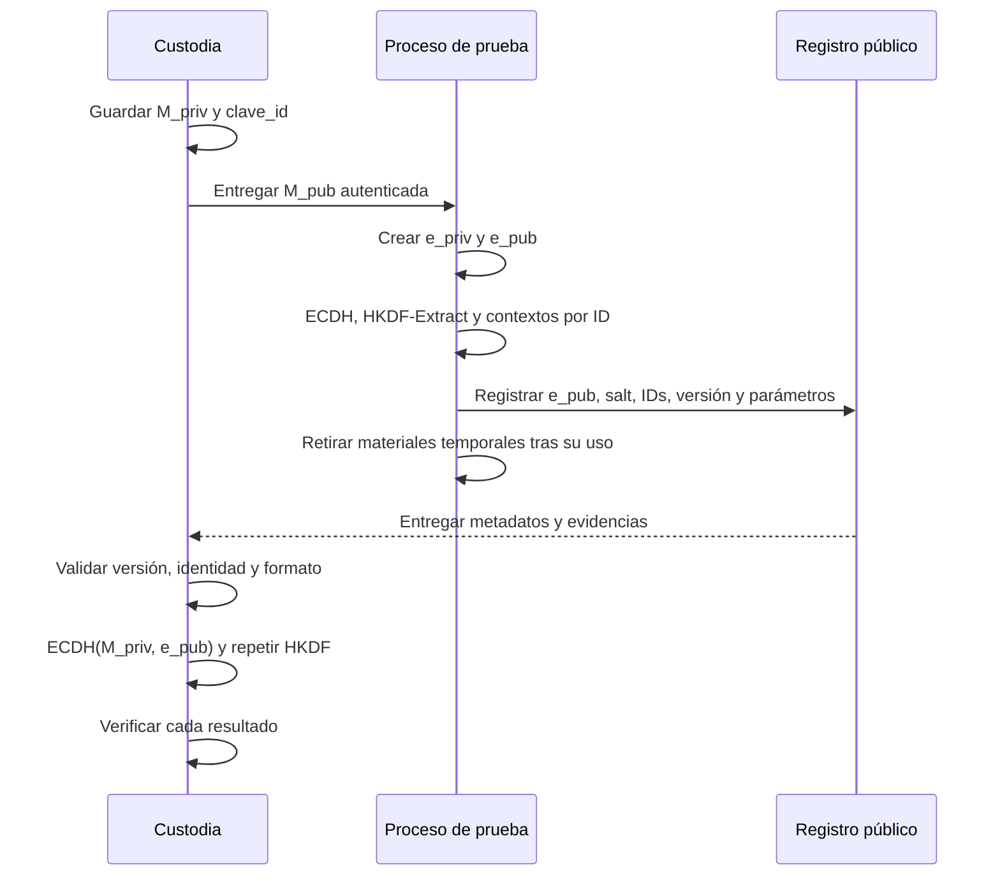

# Módulo 07 — Custodia, exposición y recuperación de claves

Un esquema de cifrado tiene que resolver dos problemas simultáneos: limitar quién puede obtener sus secretos y conservar todo lo necesario para repetir la derivación cuando llegue el momento de recuperar los datos. El primero afecta la confidencialidad; el segundo, la disponibilidad. Un algoritmo correcto no compensa la pérdida de una clave privada, un identificador ambiguo ni un parámetro público que nunca se guardó.

En el [Módulo 03](Ransomware-Modulo3) se compararon dos modelos: **A**, acuerdo ECDH efímero por entrada; y **B**, acuerdo ECDH por sesión con derivaciones independientes por entrada. Aquí se sigue el recorrido posterior de sus secretos y metadatos. El [Módulo 02](Ransomware-Modulo2) cubre las propiedades de los algoritmos, y los [Módulos 05](Ransomware-Modulo5) y [06](Ransomware-Modulo6) tratan E/S, concurrencia y resultados parciales. Este módulo estudia qué implica todo eso para la custodia y para una reconstrucción verificable.

En un ejercicio autorizado, la pregunta rectora es concreta: **si se interrumpe la ejecución y solo se conservan el material bajo custodia y los metadatos del experimento, ¿se puede reconstruir la clave correcta para cada entrada y demostrar que los datos siguen intactos?** Una respuesta válida exige identificar los secretos, su alcance, su tiempo de vida, la autenticidad de los parámetros y los fallos posibles. Las prácticas emplean registros y material sintéticos; no cifran archivos ni realizan conexiones de red.

## 7.1 Modelo de confianza y dependencias

La palabra *clave* resulta insuficiente cuando varios valores cumplen funciones diferentes. La tabla fija los roles que usaremos. «Pública» significa que el valor puede conocerse sin revelar por ello una privada; **no** significa que pueda sustituirse libremente.

| Material | Alcance habitual | ¿Secreto? | ¿Dónde debe poder obtenerse al reconstruir? | Consecuencia de perderlo o exponerlo |
| --- | --- | --- | --- | --- |
| Privada maestra `M_priv` | Todas las sesiones que dependan de ese par | Sí | Custodia autorizada y respaldo comprobado | Su pérdida puede impedir la recuperación; su exposición alcanza las sesiones asociadas si se conservan sus metadatos públicos. |
| Pública maestra `M_pub` | Mismo par maestro | No; requiere autenticidad | Versión autorizada y vínculo con su identificador | Una sustitución puede cambiar el destinatario criptográfico de una sesión. |
| Privada efímera `e_priv` | Una entrada en A; una sesión en B | Sí | No hace falta conservarla si la derivación y los parámetros quedaron completos | Su exposición durante su vida útil permite recalcular el acuerdo correspondiente junto con `M_pub`. |
| Pública efímera `e_pub` | Una entrada en A; una sesión en B | No | Metadatos vinculados al alcance correcto | Si falta o no corresponde al par usado, el otro participante no puede repetir el acuerdo esperado. |
| Secreto compartido `Z` | Un acuerdo ECDH | Sí | Se reconstruye mediante la privada maestra y la pública efímera válida | Exponerlo afecta todo lo derivado de ese acuerdo. |
| Material intermedio `PRK` | Una entrada en A; potencialmente una sesión en B | Sí | Se vuelve a derivar a partir de `Z`, el `salt` y el KDF especificado | En B puede alcanzar todas las entradas derivadas del mismo `PRK`. |
| Clave de trabajo `K_i` | Una entrada o un uso especificado | Sí | Se vuelve a derivar con el identificador y el contexto exactos | Su exposición no implica por sí sola conocer la privada maestra ni todas las demás claves. |
| Identificadores, `salt`, nonce y versión | Según el campo | Normalmente no | Registro persistente y verificable | Pérdida, ambigüedad o cambio pueden impedir una recuperación correcta. |

La conclusión «se encontró una clave, luego se descifran todos los archivos» no es válida sin identificar **qué** clave se encontró, bajo qué esquema se generó y qué entradas dependen de ella. También sería incorrecto afirmar que ECDH garantiza por sí solo que únicamente el titular previsto de `M_priv` puede recuperar: la autenticidad de `M_pub`, el manejo de secretos durante la ejecución, el KDF y la integridad de los metadatos son condiciones adicionales.

En los dos modelos, quien conserva `M_priv` calcula un acuerdo con `e_pub`; quien inicia la sesión calcula el mismo resultado con `e_priv` y `M_pub`. **Ninguna privada necesita viajar en los metadatos.** Para reproducir una derivación hacen falta el algoritmo y sus parámetros exactos, además de la identidad usada como contexto. El `salt` y los identificadores pueden ser públicos, pero una entrada pública faltante puede ser tan decisiva para la recuperación como la pérdida de un secreto.

### Las cuatro propiedades que conviene examinar por separado

1. **Confidencialidad:** quién puede acceder a una privada, a `Z`, a `PRK` o a `K_i`.
2. **Autenticidad:** cómo se sabe que la pública maestra y los metadatos corresponden al ejercicio previsto.
3. **Disponibilidad:** qué información sigue accesible después de una caída, un borrado o un fallo de red.
4. **Integridad de la recuperación:** cómo se comprueba el resultado antes de considerarlo correcto.

Un CRC puede ayudar a detectar corrupción accidental de una estructura; no demuestra quién la produjo. Una firma o un MAC tienen otros requisitos y deben verificarse conforme al protocolo elegido. Para un cifrado autenticado como ChaCha20-Poly1305, la etiqueta se valida con el algoritmo antes de aceptar los datos como íntegros; el nonce y la etiqueta forman parte del contrato de recuperación. [RFC 8439](https://www.rfc-editor.org/rfc/rfc8439.html).

## 7.2 Custodia de la privada maestra y autenticidad de la pública

El material de larga duración establece el alcance máximo del esquema. Su ubicación no queda resuelta con la frase «está en un servidor»: hay que saber quién controla ese servidor, cómo se protege la privada, si existen respaldos, cómo se comprueba su integridad y qué sucede si deja de estar disponible. NIST trata la generación, el almacenamiento, el uso, el respaldo y la destrucción como partes del ciclo de vida de las claves. [NIST SP 800-57, parte 1](https://csrc.nist.gov/pubs/sp/800/57/pt1/r5/final).

| Decisión | Pregunta que debe responderse | Riesgo que pone a prueba |
| --- | --- | --- |
| Custodia separada del proceso de prueba | ¿Qué personas y sistemas pueden usar `M_priv`? | Acceso no previsto y exposición de múltiples sesiones. |
| Respaldo de la privada | ¿Existe, es recuperable y está sujeto a control de acceso? | Pérdida irreversible del material necesario para cerrar el ejercicio. |
| Identificador de clave maestra | ¿Con qué par se hizo cada acuerdo? | Confusión después de una rotación o de varios ejercicios. |
| Autenticación de `M_pub` | ¿Cuál es el origen confiable y cómo se comprueba su identidad? | Sustitución de la pública y reconstrucción con un destinatario distinto. |
| Cierre del ejercicio | ¿Quién recibe los artefactos y cómo se verifica su capacidad de recuperación? | Dependencia posterior de una persona o infraestructura externa. |

Una pública maestra embebida en un programa puede quedar asociada a una versión concreta, pero esa circunstancia no demuestra por sí sola que sea la pública aprobada. Una huella verificada o una firma sobre la configuración pueden servir para establecer identidad, siempre que la confianza en la huella o en la clave de verificación venga de otro lugar. **ECDH sin autenticación de sus participantes o de sus públicas no resuelve la sustitución de claves.**

Para documentar el ejercicio, el informe debería registrar el identificador de la pública autorizada, el responsable de custodia, el procedimiento de entrega y el resultado de al menos una recuperación de prueba. Los valores privados no tienen que incluirse en el informe. Si se rota la maestra, los metadatos anteriores deben seguir indicando a qué versión pertenecen; cambiar la configuración actual no convierte automáticamente los acuerdos previos al par nuevo.

## 7.3 Vida útil de los secretos y análisis de memoria

Durante la operación se utilizan privadas efímeras, un secreto compartido y claves derivadas. La reducción de su tiempo de vida puede disminuir las oportunidades de exposición, pero no equivale a demostrar que no quedan copias. Un proceso, la biblioteca criptográfica, las pilas, el heap, los registros o determinados artefactos del sistema pueden mantener representaciones temporales. La posibilidad de hallar un valor depende del momento de captura y de cómo se implementó cada paso; una búsqueda de cadenas hexadecimales no es una prueba general para claves binarias.

En **A**, cada acuerdo y su material derivado se asocian con una entrada. En **B**, retirar `e_priv` después del acuerdo no elimina la sensibilidad de `PRK` si ese material se conserva para derivar las claves de toda una sesión. Esta diferencia debe figurar en el modelo de exposición: limitar una privada temporal puede ser útil, mientras un secreto posterior continúa activo.

| Mecanismo citado con frecuencia | Qué puede aportar | Qué no demuestra |
| --- | --- | --- |
| Destruir un identificador u objeto criptográfico | Termina el uso de ese objeto conforme al contrato de la API. | Que no existan copias previas en otros búferes, registros o artefactos del sistema. |
| Sobrescribir un búfer controlado por la aplicación | Reduce la permanencia de ese contenido en ese búfer. | Que una copia hecha antes haya desaparecido. |
| DPAPI sobre un `blob` | Protege los datos mientras permanecen en la representación protegida. | Protección continua del texto claro cuando la aplicación lo necesita en memoria. |
| XOR con datos del equipo | Cambia su representación. | Confidencialidad criptográfica o imposibilidad de reconstruir la transformación. |
| Repartir bytes en varios campos | Cambia dónde aparece una secuencia contigua. | Invisibilidad general frente al análisis de memoria. |

En particular, `CryptProtectData` con `CRYPTPROTECT_LOCAL_MACHINE` asocia la protección al equipo; Microsoft indica que cualquier usuario del mismo equipo puede llamar a `CryptUnprotectData` para recuperar el dato. Además, el resultado desprotegido se usa necesariamente como texto claro en algún punto. La opción `CRYPTPROTECT_LOCAL_MACHINE` se aplica al proteger y no aparece entre las marcas documentadas de `CryptUnprotectData`. [Microsoft: `CryptProtectData`](https://learn.microsoft.com/en-us/windows/win32/api/dpapi/nf-dpapi-cryptprotectdata); [Microsoft: `CryptUnprotectData`](https://learn.microsoft.com/en-us/windows/win32/api/dpapi/nf-dpapi-cryptunprotectdata).

El archivo de paginación, los volcados y la hibernación pueden aportar evidencia en circunstancias específicas; no debe afirmarse que cualquier clave estará allí ni prescribir cambios del sistema como garantía de ocultación. Para analizar una muestra, se documentan los tiempos de captura, las regiones accesibles, los límites de la adquisición y la correspondencia comprobada entre un valor encontrado y una operación criptográfica. La entropía de un bloque pequeño por sí sola no identifica una clave.

### Contrato de vida que sí puede documentarse

Para cada objeto sensible, anotar: **creación → último uso esperado → liberación solicitada → copias controladas por la aplicación → evidencia observada**. Por ejemplo, haber ejecutado `BCryptDestroyKey` prueba que se solicitó destruir un objeto mediante la API; no basta para afirmar que «desaparece toda posibilidad» de recuperar material relacionado. Una conclusión técnica debe reflejar lo que la observación sostiene.

## 7.4 Reconstrucción de extremo a extremo

La recuperación no es la operación inversa de una sola función: repite una cadena de dependencias. La secuencia siguiente muestra **B, acuerdo por sesión**, sin asignar el almacenamiento a un servidor concreto.



Para el modelo **A**, se repite el acuerdo con una `e_pub_i` por entrada. Para el modelo **B**, `e_pub` identifica el acuerdo de sesión y un identificador estable de entrada separa cada derivación. En ambos casos hay que fijar la representación exacta de `salt`, `info`, los identificadores y el formato de las claves públicas. HKDF consta de **extracción** y **expansión**; acordar «usar SHA-256» sin indicar el orden y el contexto de estas operaciones deja un protocolo incompleto. [RFC 5869](https://www.rfc-editor.org/rfc/rfc5869.html).

Una forma de expresar el contrato conceptual, sin atribuir estos nombres a un binario real, es:

```text
Z   = ECDH(M_priv, e_pub_s)           # reconstrucción en custodia
PRK = HKDF-Extract(salt_s, Z)
K_i = HKDF-Expand(PRK, contexto_v1 || session_id || entry_id_i, longitud)
```

El proceso de prueba puede calcular el mismo `Z` con `e_priv_s` y `M_pub`. La concatenación del contexto requiere límites y codificación inequívocos: `ab || c` y `a || bc` no deberían confundirse. El uso de `entry_id_i` debe ser estable. Una ruta puede cambiar de nombre, codificación, mayúsculas o ubicación; si la ruta fue el contexto original, la recuperación necesita preservar **la representación exacta empleada entonces**. Para un diseño nuevo resulta más fácil registrar un identificador asignado a la entrada y mantener la ruta solo como atributo descriptivo.

### Qué debe poder probar el ejercicio

- El custodio reproduce `Z` y la misma salida del KDF con los parámetros registrados.
- Entradas distintas producen las claves esperadas de acuerdo con el contexto especificado.
- La ausencia de un campo necesario se detecta como error, sin asumir un valor alternativo.
- El algoritmo y la versión se leen antes de interpretar bytes variables.
- La salida resultante se contrasta con una verificación independiente; la coincidencia de longitud no prueba que una clave sea correcta.

Estas comprobaciones son más informativas que una frase como «la pública efímera permite descifrar offline». La pública **participa** en la reconstrucción, pero hace falta la privada correcta, el KDF, sus entradas públicas y el mecanismo de verificación.

## 7.5 Metadatos y diseño del footer

Un footer es una ubicación posible para los parámetros del archivo. Una cabecera, un manifiesto separado o un registro central son otras opciones; cada una modifica qué se pierde si se altera un archivo o desaparece un índice. El objetivo común es conservar el contrato de reconstrucción sin introducir secretos. En B puede repetirse `e_pub_s` por archivo o referirse a un registro de sesión que la conserve: la primera elección aumenta redundancia y tamaño; la segunda introduce una dependencia externa.

| Campo lógico | Función | Validación requerida |
| --- | --- | --- |
| Marca de formato y versión | Seleccionar la interpretación correcta | Longitud y versión admitida; una marca sola es una pista, no atribución de familia. |
| Identificador de maestra | Seleccionar el par bajo custodia | Asociación con la pública autorizada y las reglas de rotación. |
| ID de sesión y de entrada | Vincular acuerdo y derivación | Codificación, ámbito y ausencia de ambigüedades. |
| Pública efímera | Repetir el acuerdo ECDH | Formato, curva, longitud y pertenencia al acuerdo previsto. |
| `salt` y versión del KDF | Repetir extracción y expansión | Longitud, codificación y contextos especificados. |
| Algoritmo de datos y nonce/IV | Seleccionar la verificación correcta | Requisitos propios del algoritmo; regla de unicidad aplicable. |
| Longitud original y distribución de segmentos | Interpretar el resultado | Límites frente al tamaño real y a lecturas parciales. |
| Etiqueta de autenticación, si se usa AEAD | Comprobar datos y parámetros asociados | Ubicación, longitud y verificación conforme al esquema elegido. |
| Tamaño de metadatos | Localizar campos | Comprobar tamaño mínimo, máximo y archivo truncado. |

Una estructura C empaquetada no especifica por sí sola un formato portable. Hay que fijar orden de bytes, tamaños enteros, versión, manejo de campos desconocidos y longitudes máximas. El lector debe distinguir el límite físico del archivo del número de bytes que el programa **afirma** que hay en un campo. Leer desde el final sin comprobar previamente el tamaño ni los resultados de las operaciones puede producir errores o datos incompletos.

Un footer que solo conserve una marca, un identificador de sesión, una pública efímera, un nonce, el tamaño original y un `CRC32` **es insuficiente** para declarar garantizada la recuperación de todos los diseños: todavía habría que precisar el KDF completo, el identificador estable de entrada y el lugar de la etiqueta cuando se emplea cifrado autenticado. El CRC detecta ciertas corrupciones accidentales; alguien capaz de modificar el footer puede recalcularlo. La autenticación exige un mecanismo apropiado y una asociación clara entre el contenido y sus parámetros.

La explicación del tamaño tampoco puede reducirse a «el texto cifrado mide lo mismo que el original». ChaCha20 como flujo no necesita relleno, pero ChaCha20-Poly1305 produce además una etiqueta que debe guardarse según el formato elegido. Con AES-CBC, el relleno modifica la longitud de otro modo. Se deben registrar estas diferencias junto con el algoritmo y el tratamiento de los datos parciales, sin atribuir un único tamaño a cualquier esquema.

### Formato público y observabilidad

Un identificador fijo al final de múltiples archivos puede facilitar su clasificación en una investigación. Una regla que lo busque es un **filtro inicial**: otras aplicaciones pueden contener bytes semejantes y un archivo truncado puede carecer del footer aun si fue procesado. Para estimar el alcance, se combinan marca, estructura, versión, tamaños válidos y contexto de la muestra. Una coincidencia aislada no demuestra que el archivo pueda recuperarse.

## 7.6 Registro en línea y dependencia de conectividad

Un registro central podría asociar una sesión con metadatos públicos, un estado de entrega y un identificador administrativo. **No es un paso criptográfico obligatorio** cuando el formato local ya conserva todo lo necesario. Si los metadatos solo están en el registro, una pérdida de conectividad o del propio registro afecta la reconstrucción; si están también en cada entrada, existe redundancia, con un coste de espacio y gestión.

| Estado observado | Qué demuestra | Qué falta comprobar |
| --- | --- | --- |
| Registro preparado | El proceso construyó los campos | Que sean correctos y se hayan conservado. |
| Solicitud iniciada | Se intentó la comunicación | Que el destino haya recibido todos los bytes. |
| API de envío informó éxito | La llamada terminó según su contrato | Código y contenido de la respuesta; persistencia del lado receptor. |
| Respuesta de aceptación válida | El receptor afirmó aceptar un identificador | Que el registro pueda consultarse después y vincule los mismos campos. |
| Recuperación de prueba completa | Los parámetros permitieron repetir y verificar un resultado | Cobertura del resto de entradas y condiciones de pérdida. |

Una función WinINet que devuelve `TRUE` sin comprobar `HttpSendRequestA`, el estado HTTP ni la respuesta comunica un éxito no demostrado. La API reporta éxito o fallo del envío; el estado de la respuesta es otra comprobación. Ninguno de los dos equivale automáticamente a persistencia fiable. [Microsoft: `HttpSendRequestA`](https://learn.microsoft.com/en-us/windows/win32/api/wininet/nf-wininet-httpsendrequesta); [Microsoft: `HttpQueryInfoA`](https://learn.microsoft.com/en-us/windows/win32/api/wininet/nf-wininet-httpqueryinfoa).

HTTPS protege el contenido frente a determinados observadores del trayecto según la configuración y la confianza en el extremo; no demuestra que la comunicación sea invisible ni sustituye la validación de identidad, estado y conservación. Un registro que incluye nombre de equipo u otros identificadores introduce además datos que el ejercicio debe justificar y custodiar. Para el aprendizaje de este módulo basta una **simulación local del registro**, con estados de aceptación y pérdida, sin conexión externa.

### Reintentos y consistencia

Un registro duplicado no debería cambiar de identidad en cada reintento. Si existe una clave de idempotencia, se puede distinguir el mismo intento repetido de otra sesión con parámetros distintos. Después de una caída, «no hay confirmación» no permite concluir «el receptor no lo recibió». El [Módulo 06](Ransomware-Modulo6) desarrolla esta diferencia entre trabajo enviado, completado y registrado; aquí se aplica a la evidencia de recuperación.

## 7.7 Fallos que cambian el resultado

El protocolo se entiende mejor cuando se fuerza una contradicción y se observa dónde se detecta. Esta matriz sirve tanto para planear las prácticas como para leer un informe de análisis de malware: una predicción sobre capacidad de recuperación debe apoyarse en los campos y las operaciones comprobados.

| Escenario | Material todavía disponible | Consecuencia posible | Comprobación decisiva |
| --- | --- | --- | --- |
| Se pierde `M_priv` y no hay respaldo | Metadatos públicos y archivos | Puede faltar el insumo para todos los acuerdos bajo esa maestra | Recuperación de prueba con una copia autorizada antes de cerrar la custodia. |
| Se expone una `K_i` | Parámetros de su entrada | Alcance acotado según el modelo, si las derivaciones están separadas correctamente | Comparar dependencias reales del KDF. |
| Se expone `PRK` de una sesión B | Metadatos de la sesión | Puede extenderse a sus entradas | Identificar qué salidas se derivaron de ese `PRK`. |
| Falta `e_pub` | Privada maestra y demás parámetros | No puede repetirse el acuerdo correspondiente | Correlacionar pública ausente con acuerdo de la sesión o entrada. |
| Se cambia el ID de entrada | Secreto y otros campos intactos | La derivación produce otra salida o falla la validación | Comparar los bytes originales del contexto, no solo el nombre visible. |
| Cambia la pública maestra en la configuración | Metadatos anteriores | Puede haber sesiones vinculadas a pares diferentes | Verificar el identificador y la autenticidad de cada versión. |
| Se altera la etiqueta de autenticación | Clave y nonce potencialmente correctos | Los datos deben rechazarse como no autenticados | Ejecutar la verificación del algoritmo elegido. |
| Footer incompleto | Parte de los metadatos | Interpretación incierta; no asumir valores por defecto | Validar tamaños, versión y campos obligatorios antes de derivar. |
| Se pierde el registro central | Metadatos locales según el formato | Recuperación posible o bloqueada según la redundancia | Reconstruir una entrada únicamente con lo conservado fuera del registro. |
| La sesión se interrumpe a mitad del trabajo | Estado de algunas entradas | Alcance parcial y registros posiblemente incompletos | Relacionar identificadores, artefactos y confirmaciones por entrada. |

La prioridad del manejo de errores es **fallar de manera explícita** cuando falta un parámetro o no se verifica una etiqueta. Probar otros algoritmos o cambiar el tratamiento de las rutas «hasta obtener alguna salida» dificulta el diagnóstico y puede producir datos aparentemente plausibles pero incorrectos. La matriz también ayuda a separar tres frases muy diferentes: «se localizaron metadatos», «se obtuvo una clave candidata» y «se verificó correctamente la recuperación».

## 7.8 Auditoría técnica de implementaciones Windows

Una secuencia de llamadas CNG puede parecer completa en una lectura rápida sin que sus contratos estén satisfechos. Antes de atribuirle un resultado, conviene comprobar los siguientes puntos en el código y en la ejecución:

1. **Importación de la pública.** Un `BCRYPT_ECCPUBLIC_BLOB` para P-256 necesita cabecera y coordenadas reales del tamaño declarado. Declarar una longitud de 72 bytes sin disponer de esos 72 bytes no produce una pública válida y puede ocasionar una lectura fuera del arreglo. El formato de CNG tampoco equivale a SEC1 sin conversión explícita.
2. **Resultado de cada API.** `BCryptFinalizeKeyPair`, `BCryptDeriveKey`, `BCryptGenRandom`, operaciones de archivo y funciones de red requieren comprobaciones. Una ruta de error debe liberar los recursos que consiguió crear y dejar el estado inequívoco.
3. **KDF realmente solicitado.** En `BCryptDeriveKey`, `BCRYPT_KDF_HASH` con lista de parámetros nula no expresa HKDF-SHA-256: Microsoft documenta SHA-1 como algoritmo predeterminado de esa opción. Un búfer declarado con 64 bytes tampoco implica que se hayan derivado 64 bytes: hay que comprobar la longitud efectivamente devuelta. El proveedor documenta HKDF como una opción distinta, con sus propios parámetros. [Microsoft: `BCryptDeriveKey`](https://learn.microsoft.com/en-us/windows/win32/api/bcrypt/nf-bcrypt-bcryptderivekey).
4. **Identidad estable.** `WideCharToMultiByte` puede fallar o requerir un búfer mayor que el asignado. Una conversión fallida no debe degradar silenciosamente la derivación a un contexto menos específico. El límite tradicional de `MAX_PATH` no define por sí solo el tamaño de todas las rutas observables en Windows.
5. **Nonce y formato.** La salida del generador aleatorio debe comprobarse; producir un nonce nuevo no garantiza de manera matemática que nunca haya colisiones. Su interpretación exige algoritmo y clave correctos, y el valor utilizado debe conservarse.
6. **Liberación y afirmaciones forenses.** Cerrar un `handle` y sobrescribir un búfer propio son pasos verificables de gestión de recursos. No autorizan a describir toda la RAM como libre de copias.
7. **Lectura de metadatos.** Antes de mover un puntero desde el final del archivo hay que conocer su longitud y comprobar errores y bytes leídos. Después se validan versión, límites y campos; un `CRC32` no reemplaza la autenticación.
8. **Registro.** El resultado de la API, la respuesta y la aceptación persistida son etapas diferentes. Una función que ignora los tres no puede informar éxito de registro.

Esta lista establece qué se debe verificar al leer una muestra o evaluar un prototipo. Un símbolo de API aislado no demuestra una secuencia de vida, un KDF ni la capacidad final de recuperación.

## 7.9 Laboratorio autocontenido: reconstrucción de metadatos

La práctica utiliza Python 3 y únicamente la biblioteca estándar, disponible en una instalación actual de Python para Windows 11. **No emplea ECDH, no cifra archivos y no transmite datos.** Se introduce un secreto sintético fijo como sustituto del acuerdo, se aplica HKDF-SHA-256 y se compara la reconstrucción con el registro esperado. Una etiqueta HMAC independiente ilustra cómo se rechaza una modificación del registro. Como todos los secretos de prueba aparecen en el código, este programa no sirve para proteger información real.

Guarda el bloque como `lab_modulo7.py` y ejecútalo con `py -3 lab_modulo7.py` en una consola de Windows, o `python lab_modulo7.py` donde `python` identifique Python 3. Solo imprime estados de validación; no modifica archivos. Primero comprueba `HKDF-Extract` y `HKDF-Expand` contra el caso 1 publicado en [RFC 5869, apéndice A.1](https://www.rfc-editor.org/rfc/rfc5869.html#appendix-A.1).

```python
"""Módulo 07: laboratorio de metadatos sintéticos, sin cifrado de archivos."""

import copy
import hashlib
import hmac
import json


def extract(salt: bytes, ikm: bytes) -> bytes:
    return hmac.new(salt, ikm, hashlib.sha256).digest()


def expand(prk: bytes, info: bytes, length: int) -> bytes:
    if not 0 <= length <= 255 * hashlib.sha256().digest_size:
        raise ValueError("Longitud HKDF fuera del rango permitido")
    result = b""
    block = b""
    for counter in range(1, (length + 31) // 32 + 1):
        block = hmac.new(prk, block + info + bytes([counter]), hashlib.sha256).digest()
        result += block
    return result[:length]


def enc_field(value: str) -> bytes:
    raw = value.encode("utf-8")
    if not raw or len(raw) > 255:
        raise ValueError("Identificador vacío o demasiado largo")
    return bytes([len(raw)]) + raw


def canonical(record: dict) -> bytes:
    return json.dumps(record, sort_keys=True, separators=(",", ":"),
                      ensure_ascii=True).encode("ascii")


def parse_record(record: dict) -> tuple[bytes, bytes]:
    if set(record) != {"version", "kdf", "salt", "session_id", "entry_id"}:
        raise ValueError("Faltan campos o sobran campos")
    if record["version"] != 1 or record["kdf"] != "HKDF-SHA256":
        raise ValueError("Versión o KDF no admitido")
    if not isinstance(record["salt"], str) or len(record["salt"]) != 26:
        raise ValueError("Salt con formato incorrecto")
    try:
        salt = bytes.fromhex(record["salt"])
    except ValueError as exc:
        raise ValueError("Salt no hexadecimal") from exc
    if not all(isinstance(record[k], str) for k in ("session_id", "entry_id")):
        raise ValueError("Identificador no textual")
    info = b"modulo7/entrada/v1" + enc_field(record["session_id"])
    info += enc_field(record["entry_id"])
    return salt, info


def reconstruct(record: dict, ikm: bytes) -> bytes:
    salt, info = parse_record(record)
    return expand(extract(salt, ikm), info, 32)


def stamp(record: dict, mac_key: bytes) -> str:
    return hmac.new(mac_key, canonical(record), hashlib.sha256).hexdigest()


def verify(record: dict, tag: str, mac_key: bytes) -> bool:
    return hmac.compare_digest(stamp(record, mac_key), tag)


def main() -> None:
    ikm = bytes.fromhex("0b" * 22)  # Dato público de prueba, no secreto real.
    salt = bytes(range(13))
    known_prk = bytes.fromhex(
        "077709362c2e32df0ddc3f0dc47bba63"
        "90b6c73bb50f9c3122ec844ad7c2b3e5")
    known_okm = bytes.fromhex(
        "3cb25f25faacd57a90434f64d0362f2a"
        "2d2d0a90cf1a5a4c5db02d56ecc4c5bf"
        "34007208d5b887185865")
    assert extract(salt, ikm) == known_prk
    assert expand(known_prk, bytes.fromhex("f0f1f2f3f4f5f6f7f8f9"), 42) == known_okm
    print("Vector RFC 5869 -> coincide: True")
    mac_key = expand(extract(salt, ikm), b"modulo7/registro/v1", 32)

    base = {"version": 1, "kdf": "HKDF-SHA256", "salt": salt.hex(),
            "session_id": "sesion-demo", "entry_id": "entrada-001"}
    tag = stamp(base, mac_key)
    expected = reconstruct(base, ikm)

    def report(label: str, record: dict, supplied_tag: str) -> None:
        try:
            parse_record(record)
            authentic = verify(record, supplied_tag, mac_key)
            if not authentic:
                print(label, "-> etiqueta inválida: registro rechazado")
                return
            candidate = reconstruct(record, ikm)
            equal = hmac.compare_digest(candidate, expected)
            print(label, "-> registro válido; coincide:", equal)
        except (ValueError, TypeError, KeyError) as exc:
            print(label, "-> formato inválido:", exc)

    report("Original", base, tag)

    missing = copy.deepcopy(base)
    del missing["salt"]
    report("Sin salt", missing, tag)

    changed = copy.deepcopy(base)
    changed["entry_id"] = "entrada-002"
    report("ID alterado", changed, tag)

    print("Otro ID produce otra salida:",
          not hmac.compare_digest(reconstruct(changed, ikm), expected))
    report("Etiqueta alterada", base, "0" * 64)


if __name__ == "__main__":
    main()
```

La comprobación inicial debe coincidir con el vector publicado. El primer registro debe informar que es válido y coincide. La falta de `salt` se rechaza; el ID modificado hace que falle la autenticación del registro original; una derivación calculada **fuera** de esa comprobación produce otra salida. La última línea demuestra el rechazo de una etiqueta cambiada. El laboratorio enseña dos controles diferentes: **reconstrucción del mismo resultado** y **autenticidad del registro**.

El HMAC de esta práctica utiliza una clave derivada del dato sintético que aparece en el programa: quien conoce ese dato puede crear una etiqueta nueva. En un protocolo real, los derechos para autenticar metadatos, el almacenamiento de la clave correspondiente y el tratamiento de los campos asociados necesitarían diseño independiente. La práctica tampoco prueba propiedades de ECDH, de una API CNG, de un cifrado AEAD ni de un producto de seguridad.

### Experimentos complementarios

1. **Identidad y ámbito.** Cambia `session_id` manteniendo `entry_id`; compara las salidas. Después crea dos entradas con el mismo `entry_id` dentro de una sesión y explica por qué repetir la misma derivación puede ser una violación del contrato del diseño.
2. **Versión.** Cambia `version` a `2` sin modificar el resto. El rechazo expresa que una versión desconocida requiere una especificación, no una interpretación improvisada.
3. **Pérdida del registro.** Conserva `ikm`, pero elimina por separado `salt`, `session_id` o `entry_id`. Construye una tabla con el dato perdido, la operación que no puedes repetir y la evidencia necesaria para recuperarlo.
4. **Integridad frente a corrección.** Sustituye el ID y genera después una nueva etiqueta con `stamp`. El registro pasará la verificación, pero su salida ya no coincidirá con la original. Quien puede autenticar una configuración cambiada no convierte por ello esa configuración en la utilizada en el pasado.

### Plantilla breve de resultados

| Caso | Campos conservados | ¿Formato válido? | ¿Etiqueta válida? | ¿Salida coincide? | Conclusión sustentada |
| --- | --- | --- | --- | --- | --- |
| Original | Todos | Sí | Sí | Sí | Se reprodujo este resultado sintético. |
| Campo ausente | Anotar cuál | Por comprobar | Por comprobar | Por comprobar | Indicar la operación que queda bloqueada. |
| ID cambiado | Anotar bytes originales y actuales | Por comprobar | Por comprobar | Por comprobar | Separar cambio de identidad y autenticidad. |

Completar esta tabla con las observaciones reales del programa resulta más útil que afirmar simplemente que el esquema «funciona»: identifica qué parte del contrato quedó demostrada.

## 7.10 Observación de muestras y límites de inferencia

Al analizar una muestra, una pública de 72 bytes compatible con un `BCRYPT_ECCPUBLIC_BLOB` de P-256, una llamada a `BCryptSecretAgreement` o un footer con campos reconocibles son **indicios** de una arquitectura; ninguno identifica por sí solo el KDF, el alcance de la clave ni el éxito de una recuperación. El mismo programa puede registrar claves en otra estructura, usar más de una versión o fallar antes de persistir un campo.

Para sostener una conclusión se correlacionan: parámetros de las llamadas, bytes de los formatos, dependencias entre identificadores, duración de los objetos, rutas de error y una reconstrucción con datos autorizados. Al revisar código o telemetría también conviene registrar resultados negativos: una pública esperada que no aparece puede haber quedado en un archivo separado, puede no haberse escrito por una caída o puede no existir en ese diseño. La ausencia de un artefacto observado no distingue automáticamente esas alternativas.

Una ficha técnica útil incluye: versión de la muestra, arquitectura A/B u otra demostrada, algoritmo de acuerdo, KDF exacto, alcance de cada secreto, campos públicos recuperados, ubicación de la etiqueta de autenticación, pruebas de fallo y grado de certeza. Si una conclusión se apoya solo en un nombre de función o en un comentario del código, se marca como hipótesis hasta comprobar el flujo.

## 7.11 Reglas del ejercicio y entrega verificable

La custodia de material criptográfico en un *engagement* necesita responsables, alcance y una salida clara. Antes de empezar deben quedar acordados los datos sintéticos o las entradas autorizadas, los custodios de las privadas de prueba, la conservación de respaldos, el procedimiento de recuperación y la forma de cerrar el ejercicio. No se incluyen secretos en capturas, repositorios o informes compartidos por comodidad.

Al terminar, una entrega verificable contiene el inventario de identificadores, el formato y la versión de los metadatos, los resultados de las pruebas, los errores pendientes y la comprobación de que la parte autorizada puede repetir una recuperación. La afirmación «se puede recuperar» se sustenta con esa prueba, no con el mero hecho de disponer de una clave maestra. La custodia y el cierre completan el recorrido iniciado en el módulo 3.

## Xtra:

1. En el modelo B, ¿qué beneficio operativo aporta conservar un único material derivado durante la sesión y qué entradas quedarían afectadas si se expusiera?
2. ¿Qué información tendría que conservar el operador para reconstruir una sesión si desapareciera el registro central?
3. Si cada archivo ya contiene la pública efímera y los parámetros suficientes, ¿qué función adicional justificaría registrar la sesión en línea?
4. ¿Qué diferencia habría entre perder una clave de trabajo y perder la privada maestra al evaluar el alcance de un incidente?
5. ¿Cómo cambia la posibilidad de recuperación si el contexto de derivación se basa en una ruta que luego cambia de nombre?
6. ¿Qué puede deducirse de encontrar la misma pública efímera en cientos de archivos y qué dato faltaría para afirmar que comparten un único `PRK`?
7. ¿Qué evidencia permitiría distinguir un acuerdo efímero por entrada de un acuerdo por sesión con derivaciones separadas?
8. ¿Qué ocurriría si una ejecución recibiera una pública maestra distinta de la aprobada y nadie verificara su identidad?
9. ¿Cuándo la ausencia de conectividad impide realmente reconstruir claves y cuándo solo impide consultar metadatos redundantes?
10. ¿Qué conclusiones sobre el alcance de una ejecución permite un footer completo y cuáles requieren correlacionarlo con el registro o con los resultados observados?
11. ¿Por qué un `CRC32` correcto no demuestra que el operador original produjo el footer?
12. Si una función de registro devuelve éxito antes de comprobar la respuesta, ¿qué decisiones posteriores se basarían en una premisa no demostrada?
13. ¿Qué cambia para la custodia cuando se rotan pares maestros pero siguen existiendo sesiones vinculadas a versiones anteriores?
14. ¿Qué prueba de recuperación debería cerrar un ejercicio para distinguir un esquema documentado de uno que realmente puede revertirse?

## Resumen del módulo 07

La protección de las claves exige distinguir roles y alcances: una privada maestra, una privada efímera, un secreto compartido y una clave por entrada no tienen el mismo efecto si se pierden o se exponen. La reconstrucción requiere los secretos bajo custodia, públicos auténticos, un KDF especificado sin ambigüedad y metadatos completos. Un footer y un registro central son decisiones de almacenamiento; sus fallos se evalúan por lo que queda disponible y verificable. Los controles de memoria reducen exposición dentro de límites comprobables, y el éxito de una API no prueba por sí solo que una sesión haya sido conservada. El laboratorio separa formato, autenticación y reproducción de un resultado con datos sintéticos.

**Siguiente:** Módulo 08 — Nota de rescate.

## Referencias técnicas

- [RFC 5869: HKDF y vectores de prueba](https://www.rfc-editor.org/rfc/rfc5869.html).
- [RFC 8439: ChaCha20-Poly1305, nonce y autenticación](https://www.rfc-editor.org/rfc/rfc8439.html).
- [NIST SP 800-57, parte 1, revisión 5: gestión de claves](https://csrc.nist.gov/pubs/sp/800/57/pt1/r5/final).
- [Microsoft: `BCryptDeriveKey`](https://learn.microsoft.com/en-us/windows/win32/api/bcrypt/nf-bcrypt-bcryptderivekey).
- [Microsoft: `CryptProtectData`](https://learn.microsoft.com/en-us/windows/win32/api/dpapi/nf-dpapi-cryptprotectdata) y [`CryptUnprotectData`](https://learn.microsoft.com/en-us/windows/win32/api/dpapi/nf-dpapi-cryptunprotectdata).
- [Microsoft: `HttpSendRequestA`](https://learn.microsoft.com/en-us/windows/win32/api/wininet/nf-wininet-httpsendrequesta) y [`HttpQueryInfoA`](https://learn.microsoft.com/en-us/windows/win32/api/wininet/nf-wininet-httpqueryinfoa).

© 2026 Aldair Maihuiri. Todos los derechos reservados. Se permite compartir con atribución al autor. La reproducción sin autorización previa está prohibida.
