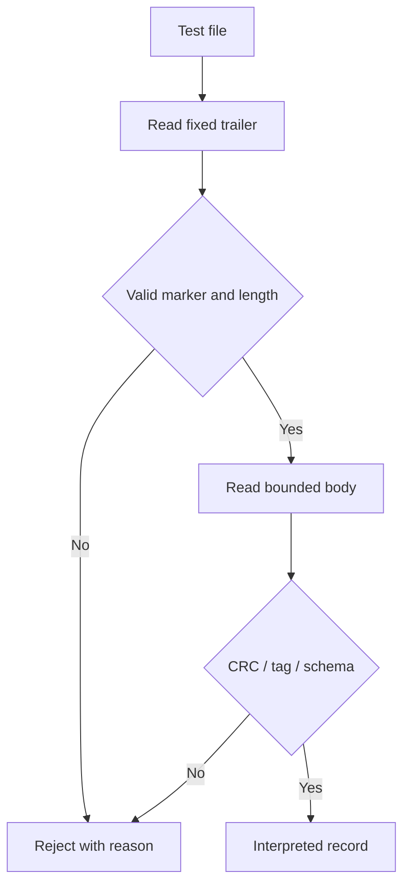

# Module 09 — Metadata Formats and Recovery

A footer is one way to retain metadata at the end of a file. Its usefulness depends on a reader's ability to locate it, interpret its version, check its bounds, and reproduce the correct treatment of data. **A footer does not guarantee recovery**: a private key in custody, derivation parameters, original segments, or a valid authentication tag may still be missing. A header, separate manifest, or session register are other possible locations for those parameters.

[Module 07](Ransomware-Modulo7-en) identified the material required by each cryptographic architecture and separated authenticity, confidentiality, and availability. This chapter specifies how to represent **public metadata** so that it can be read even after an interruption. [Module 10](Ransomware-Modulo10-en) will examine I/O completions and range plans; here we only specify how those ranges would be described within a format. The lab creates synthetic bytes, appends a test structure, and analyzes it without altering preexisting files.

## 9.1 From a cryptographic model to persistent fields

There is no universal list of fields. An ECDH agreement per entry, one agreement per session, and a scheme retaining material separately have different dependencies. Before drawing a C structure, create an inventory of each **value, source, scope, representation, length, location, validation owner, and consequence of loss**.

| Dependency | Model A: agreement per entry | Model B: agreement per session | Recovery criterion |
| --- | --- | --- | --- |
| Ephemeral public key | One per entry | One per session, repeated or referenced | The correct public key must be available and format-validated. |
| Session ID | Correlation if used | Correlation and derivation scope | Preserve its exact encoding. |
| Stable entry ID | Useful for indexing | Necessary when it separates KDF outputs | A path change must not unintentionally change derivation. |
| Master key identifier | Distinguishes pairs and rotations | Same | Identifies the pair actually used. |
| KDF, `salt`, and context | Depends on protocol | Depends on protocol | Repeat without guessing inputs or default values. |
| Data algorithm and nonce/IV | Per entry | Per entry | Interpret under the chosen algorithm's rules. |
| Authentication tag | When the design uses AEAD or a MAC | Same | Know which bytes it covers and where it resides. |
| Range descriptor | When work was partial | Same | The reader can reconstruct exactly which regions were treated. |

For example, saying “version 2 = P-256 + ChaCha20” does not specify whether ChaCha20 is unauthenticated or used with Poly1305, how the key is derived, its context, or the entry's identity. A protocol version can select a set of rules **only if those rules are documented and remain stable**. With ChaCha20-Poly1305, the information needed to check the tag must be preserved and the nonce uniqueness rule for a key must be respected. [RFC 8439](https://www.rfc-editor.org/rfc/rfc8439.html).

The ID shown in the note from [Module 08](Ransomware-Modulo8-en) may refer to the session but does not replace an ephemeral public key. An original extension is also not a complete original filename: if the entire path changes, restoring merely `.docx` does not restore the earlier name.

## 9.2 Binary format: explicit decisions

The field sizes of a packed structure can add up correctly while still describing an insufficient format. `#pragma pack(1)` removes certain padding bytes under a compiler, but it does not specify byte order, valid values, flag semantics, version, text encoding, or bounds for a reader written in another language.

| Property | Decision required by the specification | Failure if left implicit |
| --- | --- | --- |
| Byte order | For example, unsigned 32/64-bit little-endian integers | Another reader sees different lengths or sizes. |
| Format identifier | Exact byte sequence and location | Accidental matches or interpretation as another format. |
| Versioning | Required and optional fields per version | A future version is parsed with old sizes. |
| Length and bound | Maximum metadata-body size | A forged length causes excessive or out-of-bounds reads. |
| Text | UTF-8/UTF-16, normalization, and length limit | Original IDs are lost or unequal representations are compared. |
| Flags | Allowed bits, valid combinations, reserved values | An impossible state, such as incompatible modes together, is accepted. |
| Public key | Curve, serialization, and checks | A CNG blob is confused with SEC1 or X25519. |
| Integrity | Distinct coverage of CRC and authentication | Detecting corruption is mistaken for proving authorship. |

A `footer_size` inside a footer of unknown length creates a bootstrap problem: **how can the reader find the field without already knowing the footer's location?** One option is a fixed-size final trailer containing a marker and length. The reader first checks the trailer and applies a strict limit, then locates the variable body. Another option sets size by version. Both need behavior for files that are too short, repeated markers, and false length values.

Do not trust a declared size until `0 ≤ size ≤ maximum` and it fits within the remaining file without arithmetic overflow. Nor should a byte stream be interpreted as a C structure before validating format and reading constraints. `SetFilePointerEx` and the following read each return a result that must be checked. [Microsoft: `SetFilePointerEx`](https://learn.microsoft.com/en-us/windows/win32/api/fileapi/nf-fileapi-setfilepointerex).

## 9.3 Accidental corruption, authenticity, and final verification

There are three separate questions:

1. **Can I parse the structure?** Marker, version, sizes, and types are consistent.
2. **Was it changed?** CRC32 detects certain accidental changes, but anyone able to alter the body can calculate another CRC. A MAC or signature contributes authenticity only under its key and trust model.
3. **Is reconstruction correct?** An AEAD tag or an independent check must validate recovered bytes under the chosen protocol.

A decryptor using only a stream cipher can produce bytes with the wrong key without signaling an error. Matching the first bytes against a file signature can be a clue, but cannot establish that an entire file is sound: DOCX is a ZIP container, PDF objects and references may occupy different positions, and a database has its own validation rules. PKWARE's ZIP specification places a central directory and closing records separately from local headers; one cannot claim that the central directory of every DOCX resides “in the first 4 KB.” [PKWARE APPNOTE](https://www.pkware.com/documents/APPNOTE/APPNOTE-6.2.0.txt).

A footer `CRC32` **does not** validate associated file contents. If AEAD is used, specify whether the tag covers all ciphertext or separate segments, which footer fields are associated data, and where each tag is stored. These decisions determine whether a lost or reordered region can be detected.

## 9.4 Writing: states, interruption, and originals

Writing the footer as the “last step” is insufficient. Work may leave a partial output, omit the tag, fail to flush buffers, or lose a session record. The design must specify what is published as complete and what remains available after a crash.

| State | Possible evidence | Exercise rule |
| --- | --- | --- |
| Original intact, output not yet created | Identifiable original | Do not attribute an unobserved transformation. |
| Incomplete provisional output | Temporary file and partial result | Mark incomplete; retain the original intact. |
| Body and metadata written | Lengths and writes confirmed | The outcome still needs contract-specific verification. |
| Verified output | Consistent test data and metadata | Publish a terminal state and record its ID. |
| Interruption between stages | Combination of earlier artifacts | Reconcile by ID; do not guess completion. |

An example that deletes the original after unchecked `WriteFile` calls violates this table: **it may report success and remove the only intact copy**. Check bytes written, read failures, close errors, and the outcome of `FlushFileBuffers` under the agreed persistence criterion. That function requests flushing of Windows-managed buffers; merely calling it does not replace data validation or an interruption policy. [Microsoft: `WriteFile`](https://learn.microsoft.com/en-us/windows/win32/api/fileapi/nf-fileapi-writefile); [`FlushFileBuffers`](https://learn.microsoft.com/en-us/windows/win32/api/fileapi/nf-fileapi-flushfilebuffers).

A duplicate write raises another question: replace an existing output, retain another version, or reject it? Stable states and identifiers help distinguish retries, duplicates, and a second processing attempt. [Module 06](Ransomware-Modulo6-en) addressed this distinction for tasks; it also applies to publishing a result.

## 9.5 Adversarial parsing and version compatibility

A parser receives potentially truncated or manipulated bytes, even during a controlled exercise. Its order of operations should be visible:



Inputs deserving defined behavior include an empty file, fewer bytes than the trailer, a declared length larger than the file, a maximum-length body, extra bytes, unknown version, incompatible flags, duplicate fields, invalid text, inconsistent original size, incorrect tag, and two concatenated footers. A parser should report **which stage** failed rather than silently reinterpreting the version.

The lab below distinguishes a CRC from a tag using a key **published in the script itself**. It demonstrates a parser contract and protects nothing. In a real format, custody and authority to authenticate metadata return to Module 07.

## 9.6 Reproducible lab: synthetic footer

On Windows 11, save the block as `lab_module9.py` and run `py -3 lab_module9.py` with Python 3. It uses only the standard library. The program creates a file in a temporary directory, retains known bytes, and appends a canonical JSON body and a `M9FT + little-endian length` trailer. Its metadata specify `synthetic` mode: **they do not describe an encrypted file or include a real ECDH public key**.

```python
"""Synthetic footer lab. No file encryption or deletion."""
import hashlib
import hmac
import json
import struct
import tempfile
import zlib
from pathlib import Path

MAGIC = b"M9FT"
KEY = b"PUBLIC-TEST-KEY-ONLY"
MAX_BODY = 4096
REQUIRED = {"version", "session_id", "entry_id", "kdf", "salt", "mode"}

def unique_pairs(pairs):
    result = {}
    for key, value in pairs:
        if key in result:
            raise ValueError("DUPLICATE_FIELD")
        result[key] = value
    return result

def encode(record):
    body = json.dumps(record, sort_keys=True, separators=(",", ":")).encode("utf-8")
    if len(body) > MAX_BODY:
        raise ValueError("OVERSIZE")
    crc = struct.pack("<I", zlib.crc32(body))
    tag = hmac.new(KEY, body, hashlib.sha256).digest()
    return body + crc + tag + MAGIC + struct.pack("<I", len(body))

def decode(data):
    if len(data) < 44 or data[-8:-4] != MAGIC:
        raise ValueError("BAD_TRAILER")
    size = struct.unpack("<I", data[-4:])[0]
    if size > MAX_BODY or size > len(data) - 44:
        raise ValueError("BAD_LENGTH")
    start = len(data) - 44 - size
    body = data[start:start + size]
    crc = struct.unpack("<I", data[start + size:start + size + 4])[0]
    tag = data[start + size + 4:start + size + 36]
    if zlib.crc32(body) != crc:
        raise ValueError("BAD_CRC")
    if not hmac.compare_digest(hmac.new(KEY, body, hashlib.sha256).digest(), tag):
        raise ValueError("BAD_TAG")
    record = json.loads(body.decode("utf-8"), object_pairs_hook=unique_pairs)
    if set(record) != REQUIRED or type(record["version"]) is not int:
        raise ValueError("BAD_SCHEMA")
    if record["version"] != 1 or record["mode"] != "synthetic":
        raise ValueError("UNKNOWN_VERSION_OR_MODE")
    if not all(isinstance(record[k], str) and record[k]
               for k in REQUIRED - {"version"}):
        raise ValueError("BAD_FIELD")
    return data[:start], record

record = {"version": 1, "session_id": "S-1", "entry_id": "E-1",
          "kdf": "HKDF-SHA256", "salt": "test-only", "mode": "synthetic"}
with tempfile.TemporaryDirectory(prefix="module9_") as directory:
    path = Path(directory) / "fixture.bin"
    original = b"Known test bytes; no encryption."
    path.write_bytes(original + encode(record))
    fixture = path.read_bytes()
    restored, parsed = decode(fixture)
    print("ROUND_TRIP", restored == original, parsed["entry_id"])
    tiny = b"x" + encode(record)
    tiny_data, _ = decode(tiny)
    print("TINY_FILE", len(tiny_data), "METADATA_BYTES", len(tiny) - len(tiny_data))
    double = fixture + encode(record)
    double_data, _ = decode(double)
    print("TWO_FOOTERS_PREFIX_MATCH", double_data == original,
          "EXTRA_PREFIX_BYTES", len(double_data) - len(original))
    cases = {
        "MISSING_FOOTER": original,
        "TRUNCATED": fixture[:-2],
        "FALSE_LENGTH": fixture[:-4] + struct.pack("<I", 999999),
        "CHANGED_BYTE": fixture.replace(b"E-1", b"E-2"),
        "UNKNOWN_VERSION": original + encode({**record, "version": 2}),
    }
    altered = fixture.replace(b"E-1", b"E-2")
    size = struct.unpack("<I", altered[-4:])[0]
    start = len(altered) - 44 - size
    mutable = bytearray(altered)
    mutable[start + size:start + size + 4] = struct.pack(
        "<I", zlib.crc32(mutable[start:start + size]))
    cases["CRC_RECOMPUTED"] = bytes(mutable)
    for name, sample in cases.items():
        try:
            decode(sample)
            print(name, "UNEXPECTED_ACCEPT")
        except ValueError as exc:
            print(name, str(exc))
```

Execution should report a successful round trip; relative growth of a one-byte file; rejection of a missing footer; failures for trailer, length, CRC after an ID change, unknown version; and `BAD_TAG` after recomputing CRC without updating the tag. `TWO_FOOTERS_PREFIX_MATCH False` shows a significant limit: this reader parses **the last** footer while leaving the first among preceding bytes. An application would need a history or ambiguity policy before claiming restoration. A correct CRC is not authenticity, and the key published in the code does not model a trustworthy production signature.

### Extensions of the experiment

1. Replace `entry_id` with an empty string and create a valid tag; distinguish record authenticity from field validity.
2. Append a second block to the test file. Decide under an explicit rule whether to accept the last one, reject duplicates, or require a version supporting history.
3. Change the permitted maximum size and record where rejection first occurs. Never allocate memory based on an unchecked length.
4. Rename the test file. Confirm that the original `entry_id` remains the one recorded in the footer.
5. Compare synthetic fields with the table in 9.1: list what would be missing for reconstruction of a real ECDH agreement. Parsing alone does not establish that capability.

| Case | Trailer | Length | CRC | Tag | Schema | Outcome |
| --- | --- | --- | --- | --- | --- | --- |
| Original | Valid | Valid | Valid | Valid | Supported | Original bytes and record recovered. |
| Truncated | Invalid | — | — | — | — | Rejected before interpretation. |
| False length | Valid | Invalid | — | — | — | Rejected before allocation or body read. |
| Recomputed CRC | Valid | Valid | Valid | Invalid | — | Unauthenticated modification rejected. |

## 9.7 Partial ranges and file structures

A partial-work descriptor should state **which byte intervals were treated**, their scope, order, and verification rules. A single “partial” bit cannot tell a reader whether the prefix, suffix, alternating blocks, or size-dependent regions were changed. Module 10 formalizes intervals and overlaps. This module requires any range decision to be serialized unambiguously when recovery depends on it.

The usefulness of untouched bytes depends on the format: headers, indexes, and references may reside in different places. A ZIP has local entries and a central directory near its closing records; a PDF may need references near the end. It is therefore inaccurate to say that changing the first 256 KB **always** makes every file unrecoverable. A coverage table should separate bytes retained, bytes altered, the regular reader's ability to open a format, and the possibility of partial extraction: those are different outcomes.

Likewise, figures such as “40 times faster” cannot be accepted without device, size, access method, cache, version, repetitions, and denominator. In a metadata exercise, the first aim is **correct description of ranges**, not a universal speed ranking.

## 9.8 Testable specification and format evolution

Treat a persistent format as a contract between a **byte producer** and a **byte reader**. A C structure copied from memory does not define that contract: padding, alignment, type sizes, byte order, and versions can differ. Document byte offsets and lengths, field order, supported encodings, and maximum sizes. If a variable-length field precedes another field, the parser verifies that `start + length` stays within the body without arithmetic overflow. A zero-length field may be valid or forbidden, but the specification must say which.

A useful conceptual grammar is `versioned body | authentication proof | fixed-size trailer`. The trailer makes it possible to locate a body from the end of a file; the body may describe an identifier, algorithm, public material, and ranges. The specification must identify the exact bytes covered by a tag, whether that includes the trailer, how the version is encoded, and whether trailing bytes are allowed. Two readers that accept different interpretations of one byte string might attribute different tags or ranges to the same file. Canonical interpretation and rejection of ambiguity support interoperability and forensic analysis.

| Property | Required design decision | Minimum test |
| --- | --- | --- |
| Version | Supported values and behavior for future values | Change a version byte; verify rejection or an explicit branch. |
| Lengths | Minimum, maximum, and validation before allocation | Zero, maximum, maximum + 1, and overflow. |
| Duplicate fields | Prohibition, ordering, or repetition semantics | Duplicate a field and compare two readers. |
| Tag | Intended key, domain, and covered bytes | Change a covered field while keeping or recomputing the CRC. |
| Identity | Connection between entry ID and original path/object | Rename a copy without changing its internal record. |
| Ranges | Unit, origin, order, overlap, and file size | Test zero boundary, end boundary, and a short final block. |

Version compatibility needs tests **across producers and readers**, not just a producer's unit tests. A version 1 reader faced with a version 2 file should reject cleanly if it does not understand new fields. Ignoring an optional field is safe only when recovery does not depend on it and it is authenticated under the contract. An unknown range field cannot be discarded while still claiming complete recovery. Retain small known samples from each version, expected outputs, and rejection reasons for invalid cases.

## 9.9 Recovery, interruption, and lab limits

Write order creates states that a report must distinguish. A partial temporary file, complete content without a footer, an incomplete footer, a complete file not yet published, or a published file awaiting verification may exist. An atomic rename within one volume may improve visibility of a complete result, but it does not by itself guarantee durability after power loss or provide an equivalent transaction across volumes. Interpret `FlushFileBuffers` and every operation's result in the context of the file system and path. Before removing or replacing an original, an authorized exercise needs an explicit preservation and verification policy; this module implements no replacement.

The following matrix supports reasoning about failure without building software that alters third-party files:

| Interruption point | Possible residual artifact | Recovery question |
| --- | --- | --- |
| Before the body begins | Missing or empty record | Can it be reliably associated with an entry? |
| During the body | Incomplete length | Does the reader reject before parsing fields? |
| After body, before trailer | Plausible bytes without a reliable boundary | Is there an independent index, or can the sample only be preserved? |
| After trailer, before verification | Visible syntactic structure | Were authenticity, version, and identity correspondence checked? |
| After publication | Artifact visible to other readers | Is there evidence of a test read and preservation of the original? |

In lab 9.6, `ROUND_TRIP` means that **this** encoder and **this** reader agree on one known case. It proves neither compatibility with other implementations, persistence after reboot, security of a key included in source code, nor restoration of an actually encrypted file. `BAD_TAG` after recomputing the CRC shows that the two checks answer different questions; it does not prove that authentication and key management are suitable for deployment. A sound report records these boundaries with the observed results.

As a second exercise on the same bytes, record each mutation's offset, rejection reason, and whether the parser reached any memory allocation. Insert an unsupported version, an invalid `entry_id` with a recomputed tag, and a length above the limit. Repeat with two independent readers or a manual offset specification: an encoder and decoder that share the same bug can appear to round-trip correctly. Neither a victim's keys nor a real ransomware footer is needed to find inconsistent boundaries, states, and attribution.

## 9.10 Location and scope of metadata

*Footer* denotes one particular location: bytes at the end of the primary stream. Not every design stores all its information there. Before comparing formats, distinguish a **per-entry record**, **per-session record**, **external index**, and **remotely held material**. One system can combine several layers. Location changes which objects must survive together and what evidence a recovery attempt requires.

| Scope | Recovery dependency | Loss to model |
| --- | --- | --- |
| Metadata in each file | File and added bytes travel together if the copy preserves them | Truncation, modification, or a copy that drops the ending. |
| Separate folder or volume index | IDs and paths must remain associated | The index is lost even though all files remain. |
| Session manifest | One common reference connects many entries | Loss or corruption affects its whole set. |
| Remote record | Recovery depends on external availability and custody | A local copy may lack sufficient parameters. |

There is no universally “most recoverable” choice: repeating a field resists loss of an index but consumes space per entry; a central record makes auditing easier but concentrates dependency. Redundancy requires a rule for **which copy takes precedence** when records disagree and how their authenticity is checked. The master private key remains governed by Module 07; duplicating public metadata does not solve loss of that secret.

## 9.11 Small files, alternate streams, and containers

Added size matters. For a 100-byte file with 200 bytes of metadata, relative growth is 200%, although the absolute cost is 200 bytes. Report body, tag, trailer, and possible alignment separately. A format might exclude entries below a threshold or reference them through a manifest, but must record the rule and test `size < footer`. Size growth and data coverage have different denominators.

On NTFS, a file can have a primary stream and named alternate data streams (*ADS*). Placing metadata in an ADS changes what is visible when inspecting only the primary stream, but **guarantees neither invisibility nor faithful transport**: the destination file system and copy method matter. An analyst should enumerate streams, relate them to their files, and test whether a copy to another destination preserves them. This module does not implement ADS storage or concealment. [Microsoft: File Streams](https://learn.microsoft.com/en-us/windows/win32/fileio/file-streams).

A ZIP, DOCX, or other container has an internal structure separate from bytes that may be added **after** its end. Appending an external footer does not put it inside the container. Some readers tolerate trailing bytes while others reject or interpret them differently; test specific tools and versions instead of asserting one rule for every ZIP. A report distinguishes an *application footer*, an *external trailer*, and *archived content*. [PKWARE APPNOTE](https://www.pkware.com/documents/APPNOTE/APPNOTE-6.2.0.txt).

On SMB, a client sees a remote file under the permissions, caching, and opening semantics of its environment. Do not assume access to the server's physical volume, or that a local path and UNC path accept the same streams or preserve identical metadata after copying. An authorized trial compares reads, test writes, file size as seen from both ends when available, and hashes; record latency and errors without automatically attributing them to the parser.

## 9.12 Corruption, migration, and measurement

For a missing or invalid footer, **rejecting interpretation** prevents false conclusions; it does not tell us whether another copy exists. Without modifying the sample, an analyst looks for an authorized manifest, session record, prior copy, or independent metadata. Validate identity and version before using any such source. Report partial recovery as partial with verifiable offsets and files; do not claim complete restoration of unchecked bytes. If two plausible footers are present, the format must define whether there is history or an ambiguity error.

Migrating from v1 to v2 means retaining examples of both versions and specifying whether a new reader supports v1, whether a separate v2 artifact is created, and which fields cannot be inferred from v1. Do not reinterpret an older record under new rules just because it has the same marker. For two observed versions, deliver a `producer × reader × outcome` matrix and versioned inventory. If an update happened during a session, establish from evidence which version belongs to each entry: one “global” version without an ID relation may fail.

Measure `N` files, aggregate original bytes `B`, metadata bytes `M`, p50/p95 added size, and rejected records by cause. Report `M/B` for the set and `metadata/size` per category: a single average conceals the impact on small files. Measure added time against the same work and result with cache and device conditions documented. A known field size does not establish the “typical size” of footers from different families.

## 9.13 Report on an observed format

For analysis of a real sample, provide a table of verified offsets, example bytes and their provenance, supported version, parser bounds, public fields and their scopes, integrity method, observed errors, and confidence. A byte pattern at the end of a file is a classification clue; only protocol analysis and authorized recovery support a conclusion that the format is sufficient to reproduce results.

## Xtra:

1. If the operator holds the master private key but loses the original entry ID, which architecture could still be recoverable, and under what conditions?
2. What information must a format provide to distinguish a session's ephemeral public key from one created per file?
3. How does it affect offensive design when a footer can be recognized by fixed bytes at the end of many entries?
4. Why does repeating `e_pub` in each file change dependence on a central register without changing the public nature of that value?
5. What follows from accepting an unbounded `footer_size` before identifying its protocol version?
6. If someone changes a field and recalculates the CRC, what mechanism would still be needed to attribute the change to the intended sender?
7. What is lost when a descriptor says only “partial” without recording the exact treated intervals?
8. What evidence would show that a complete output was published after its metadata were verified rather than merely after some bytes were written?
9. How does retaining an extension differ from retaining an entry's full identity?
10. What observation would show that a reader for another version misinterpreted a footer instead of establishing that the data were corrupt?
11. If a session index and a per-entry footer disagree, what evidence could resolve the correct identity and version?
12. Which fields must survive if a small file does not carry complete metadata in its primary stream?
13. Which test distinguishes a copy that dropped an ADS from a record that was never created?

## Module 09 summary

A footer is a location and format, not a recovery promise. Metadata can also reside per entry, volume, or session; each location creates different dependencies. Specify bounds, versions, authenticity, and loss behavior before interpreting bytes. Small files, ADS, containers, and SMB call for transport and compatibility checks. The lab rejects incomplete formats without confusing located bytes with recovered data.

## Technical references

- [RFC 8439: ChaCha20-Poly1305](https://www.rfc-editor.org/rfc/rfc8439.html).
- [PKWARE: APPNOTE, ZIP format](https://www.pkware.com/documents/APPNOTE/APPNOTE-6.2.0.txt).
- [Microsoft: `SetFilePointerEx`](https://learn.microsoft.com/en-us/windows/win32/api/fileapi/nf-fileapi-setfilepointerex).
- [Microsoft: `WriteFile`](https://learn.microsoft.com/en-us/windows/win32/api/fileapi/nf-fileapi-writefile).
- [Microsoft: `FlushFileBuffers`](https://learn.microsoft.com/en-us/windows/win32/api/fileapi/nf-fileapi-flushfilebuffers).
- [Microsoft: File Streams](https://learn.microsoft.com/en-us/windows/win32/fileio/file-streams).

© 2026 Aldair Maihuiri. All rights reserved. Sharing with attribution to the author is permitted. Reproduction without prior authorization is prohibited.
© 2026 Aldair Maihuiri. Todos los derechos reservados. Se permite compartir con atribución al autor. La reproducción sin autorización previa está prohibida.
