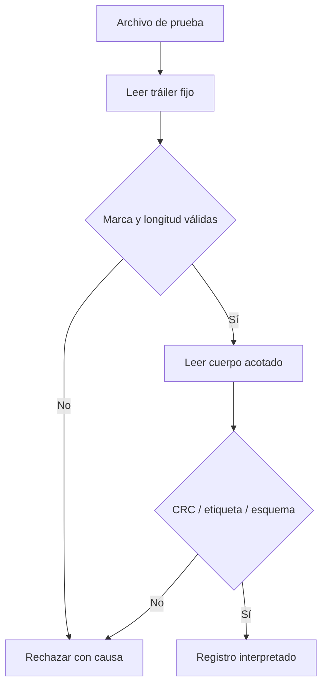

# Módulo 09 — Formatos de metadatos y recuperación

Un footer es una forma de conservar metadatos al final de un archivo. Su utilidad depende de que un lector pueda localizarlo, interpretar su versión, comprobar sus límites y reproducir el tratamiento correcto de los datos. **La presencia de un footer no garantiza recuperación**: también pueden faltar una privada bajo custodia, parámetros de derivación, segmentos originales o una etiqueta de autenticación válida. Una cabecera, un manifiesto aparte o un registro de sesión son otros lugares posibles para esos parámetros.

El [Módulo 07](Ransomware-Modulo7) identifica el material que requiere cada arquitectura criptográfica y distingue autenticidad, confidencialidad y disponibilidad. Este capítulo precisa cómo representar **metadatos públicos** de forma que se puedan leer incluso después de una interrupción. El [Módulo 10](Ransomware-Modulo10) tratará finalizaciones de E/S y planes de rangos; aquí solo se especifica cómo se describirían esos rangos dentro de un formato. El laboratorio crea bytes sintéticos, añade una estructura de prueba y después la analiza sin modificar archivos preexistentes.

## 9.1 Del modelo criptográfico a los campos persistentes

No existe una lista universal de campos. Un acuerdo ECDH por entrada, un acuerdo por sesión y un esquema que guarda material por separado tienen dependencias distintas. Antes de dibujar una estructura C, se redacta un inventario: **valor, fuente, ámbito, representación, longitud, ubicación, responsable de validarlo y consecuencia si falta**.

| Dependencia | Modelo A: acuerdo por entrada | Modelo B: acuerdo por sesión | Criterio de recuperación |
| --- | --- | --- | --- |
| Pública efímera | Una para cada entrada | Una para la sesión, repetida o referenciada | La pública correcta debe estar accesible y validarse en su formato. |
| ID de sesión | Correlación si se usa | Correlación y ámbito de derivación | Se conserva exactamente la misma codificación. |
| ID estable de entrada | Útil para indexar | Necesario si separa salidas del KDF | Un cambio de ruta no debe cambiar inadvertidamente la derivación. |
| Identificador de maestra | Distingue pares y rotaciones | Igual | Apunta al par realmente utilizado. |
| KDF, `salt` y contexto | Según protocolo | Según protocolo | Se reproducen sin adivinar parámetros ni valores predeterminados. |
| Algoritmo de datos y nonce/IV | Por entrada | Por entrada | Se interpretan según las reglas del algoritmo elegido. |
| Etiqueta de autenticación | Si el diseño emplea AEAD o MAC | Igual | Se sabe qué bytes cubre y dónde reside. |
| Descriptor de rangos | Si hubo procesamiento parcial | Igual | El lector reconstruye exactamente qué regiones se trataron. |

Por ejemplo, indicar «versión 2 = P-256 + ChaCha20» no especifica si se usa ChaCha20 sin autenticación o ChaCha20-Poly1305, cómo se deriva la clave, cuál es su contexto ni cómo se identifica la entrada. Una versión del protocolo puede seleccionar un conjunto de reglas **solo si esas reglas están documentadas y permanecen estables**. En ChaCha20-Poly1305 debe conservarse la información necesaria para comprobar la etiqueta y respetar la unicidad del nonce por clave. [RFC 8439](https://www.rfc-editor.org/rfc/rfc8439.html).

El ID mostrado en la nota del [Módulo 08](Ransomware-Modulo8) puede referirse a la sesión, pero no sustituye una pública efímera. La extensión original tampoco equivale al nombre completo del archivo: si se modifica toda la ruta, recuperar únicamente `.docx` no reconstruye el nombre anterior.

## 9.2 Formato binario: decisiones explícitas

La suma de tamaños de una estructura empaquetada puede ser correcta y aun así describir un formato insuficiente. `#pragma pack(1)` elimina cierto relleno entre campos bajo un compilador, pero no establece por sí mismo orden de bytes, valores permitidos, semántica de flags, versión, codificación de texto o límites de un lector escrito en otro lenguaje.

| Propiedad | Decisión que debe fijar la especificación | Fallo si queda implícita |
| --- | --- | --- |
| Orden de bytes | Por ejemplo, enteros sin signo de 32/64 bits en little-endian | Otro lector interpreta longitudes o tamaños distintos. |
| Identificador de formato | Secuencia exacta de bytes y posición | Coincidencias casuales o lectura del formato equivocado. |
| Versionado | Campos obligatorios y opcionales por versión | Una versión futura se analiza con tamaños antiguos. |
| Longitud y límite | Tamaño máximo del bloque de metadatos | Una longitud manipulada ocasiona lectura excesiva o fuera de límites. |
| Texto | UTF-8/UTF-16, normalización y límite | Se pierde el ID original o se comparan representaciones distintas. |
| Flags | Bits admitidos, combinaciones válidas, valores reservados | Se acepta un estado imposible, como modos incompatibles simultáneos. |
| Clave pública | Curva, serialización y comprobaciones | Confundir un blob de CNG con SEC1 o X25519. |
| Integridad | Alcance de CRC y autenticación por separado | Se presenta corrupción detectable como prueba de autoría. |

Un campo `footer_size` situado dentro de un footer de longitud desconocida plantea un problema de arranque: **¿cómo se encuentra ese campo sin conocer previamente la posición del footer?** Un diseño posible conserva un tráiler final de longitud fija con marca y longitud; primero se lee y valida el tráiler, se aplica un límite estricto y solo entonces se localiza el cuerpo variable. Otra opción fija el tamaño por versión. Las dos exigen documentar qué ocurre con archivos demasiado cortos, con varias marcas coincidentes y con valores falsos.

No se debe confiar en el tamaño declarado antes de verificar que `0 ≤ tamaño ≤ máximo` y que cabe en el archivo restante sin desbordar las operaciones aritméticas. Tampoco se interpreta una estructura como C antes de confirmar el formato y las restricciones de alineación de la lectura. La función `SetFilePointerEx` y la lectura posterior proporcionan resultados separados que hay que comprobar. [Microsoft: `SetFilePointerEx`](https://learn.microsoft.com/en-us/windows/win32/api/fileapi/nf-fileapi-setfilepointerex).

## 9.3 Integridad accidental, autenticidad y comprobación final

Hay tres preguntas distintas:

1. **¿Puedo leer la estructura?** Marca, versión, tamaños y tipos son coherentes.
2. **¿Fue alterada?** Un CRC32 detecta determinados cambios accidentales, pero cualquiera que pueda modificar el cuerpo puede calcular otro CRC. Un MAC o una firma solo aportan autenticidad dentro de su modelo de claves y confianza.
3. **¿La reconstrucción es correcta?** Una etiqueta de AEAD o una comprobación independiente debe verificar los bytes recuperados de acuerdo con el protocolo elegido.

Un descifrador que solo usa un cifrado de flujo puede producir bytes para una clave equivocada sin generar un error. Comparar los primeros bytes con una firma de formato puede aportar una pista, pero tampoco garantiza que el archivo completo esté sano: un DOCX es un contenedor ZIP, un PDF puede tener objetos y referencias en distintas posiciones y una base de datos exige validaciones propias. La especificación ZIP de PKWARE sitúa el directorio central y el registro de cierre como elementos distintos de las cabeceras locales; no se puede sostener que su directorio central está «en los primeros 4 KB» de todo DOCX. [PKWARE APPNOTE](https://www.pkware.com/documents/APPNOTE/APPNOTE-6.2.0.txt).

Un `CRC32` del footer **no** valida el contenido asociado. Si se usa una etiqueta de AEAD, hay que definir si cubre todo el texto cifrado o varios segmentos, qué campos del footer son datos asociados y cómo se almacena cada etiqueta. Esas decisiones influyen en si es posible detectar una parte perdida o reordenada.

## 9.4 Escritura: estados, interrupciones y originales

No basta con escribir el footer como «último paso». Durante el trabajo puede quedar una salida parcial, faltar la etiqueta, fallar el vaciado de búferes o perderse el registro de sesión. El diseño debe especificar qué se publica como terminado y qué se conserva para recuperarse de una caída.

| Estado | Evidencia posible | Regla del ejercicio |
| --- | --- | --- |
| Original intacto; salida aún no creada | Original identificable | No atribuir una transformación no observada. |
| Salida provisional incompleta | Archivo temporal y resultado parcial | Marcarla como incompleta; el original permanece intacto. |
| Cuerpo y metadatos escritos | Longitudes y escrituras confirmadas | Todavía falta verificar el resultado según el contrato. |
| Salida verificada | Datos de prueba y metadatos coherentes | Publicar un estado terminal y registrar el ID. |
| Interrupción entre etapas | Combinación de artefactos anteriores | Reconciliar por ID; no adivinar que terminó. |

El ejemplo de escritura que elimina el archivo original tras llamadas `WriteFile` sin revisar sus resultados no cumple esta tabla: **puede informar éxito y borrar la única copia íntegra**. Se deben comprobar bytes escritos, fallos de lectura, errores de cierre y el resultado de `FlushFileBuffers` según el criterio de persistencia acordado. Este último solicita vaciar los búferes gestionados por Windows; su mera invocación no sustituye la validación de los datos ni una política ante interrupciones. [Microsoft: `WriteFile`](https://learn.microsoft.com/en-us/windows/win32/api/fileapi/nf-fileapi-writefile); [`FlushFileBuffers`](https://learn.microsoft.com/en-us/windows/win32/api/fileapi/nf-fileapi-flushfilebuffers).

Una escritura duplicada plantea otra cuestión: ¿se reemplaza una salida existente, se conserva otra versión o se rechaza? Un estado e identificador estables permiten distinguir reintento, duplicado y segundo procesamiento. El [Módulo 06](Ransomware-Modulo6) aborda esa diferencia para tareas; aquí se aplica a la publicación del resultado.

## 9.5 Parsing adversarial y compatibilidad de versiones

Un parser recibe bytes potencialmente truncados o manipulados, incluso cuando proceden de un ejercicio controlado. Su orden de trabajo debe ser visible:



Algunas entradas que merecen respuesta definida: archivo vacío; menos bytes que el tráiler; longitud declarada mayor que el archivo; cuerpo de tamaño máximo; bytes adicionales; versión desconocida; flags incompatibles; campos repetidos; texto inválido; tamaño original incoherente; etiqueta incorrecta; dos footers concatenados. Un parser que falla debe dejar claro **en qué etapa** ocurrió, sin reinterpretar automáticamente la versión.

El laboratorio de abajo distingue CRC y etiqueta con una clave **publicada en el propio script**. Esa clave solo sirve para demostrar el contrato del parser: no protege nada. Para un formato real, la custodia y los derechos para autenticar metadatos vuelven al Módulo 07.

## 9.6 Laboratorio reproducible: footer sintético

En Windows 11, guarda el bloque como `lab_modulo9.py` y ejecuta `py -3 lab_modulo9.py` con Python 3. El script usa únicamente la biblioteca estándar. Crea un archivo en un directorio temporal, conserva bytes conocidos, añade un cuerpo JSON canónico y un tráiler `M9FT + longitud little-endian`. En el ejercicio, los metadatos tienen modo `synthetic`: **no describen un archivo cifrado ni contienen una pública ECDH real**.

```python
"""Synthetic footer lab. No file encryption or deletion."""
import hashlib
import hmac
import json
import struct
import tempfile
import zlib
from pathlib import Path

MAGIC = b"M9FT"
KEY = b"PUBLIC-TEST-KEY-ONLY"
MAX_BODY = 4096
REQUIRED = {"version", "session_id", "entry_id", "kdf", "salt", "mode"}

def unique_pairs(pairs):
    result = {}
    for key, value in pairs:
        if key in result:
            raise ValueError("DUPLICATE_FIELD")
        result[key] = value
    return result

def encode(record):
    body = json.dumps(record, sort_keys=True, separators=(",", ":")).encode("utf-8")
    if len(body) > MAX_BODY:
        raise ValueError("OVERSIZE")
    crc = struct.pack("<I", zlib.crc32(body))
    tag = hmac.new(KEY, body, hashlib.sha256).digest()
    return body + crc + tag + MAGIC + struct.pack("<I", len(body))

def decode(data):
    if len(data) < 44 or data[-8:-4] != MAGIC:
        raise ValueError("BAD_TRAILER")
    size = struct.unpack("<I", data[-4:])[0]
    if size > MAX_BODY or size > len(data) - 44:
        raise ValueError("BAD_LENGTH")
    start = len(data) - 44 - size
    body = data[start:start + size]
    crc = struct.unpack("<I", data[start + size:start + size + 4])[0]
    tag = data[start + size + 4:start + size + 36]
    if zlib.crc32(body) != crc:
        raise ValueError("BAD_CRC")
    if not hmac.compare_digest(hmac.new(KEY, body, hashlib.sha256).digest(), tag):
        raise ValueError("BAD_TAG")
    record = json.loads(body.decode("utf-8"), object_pairs_hook=unique_pairs)
    if set(record) != REQUIRED or type(record["version"]) is not int:
        raise ValueError("BAD_SCHEMA")
    if record["version"] != 1 or record["mode"] != "synthetic":
        raise ValueError("UNKNOWN_VERSION_OR_MODE")
    if not all(isinstance(record[k], str) and record[k]
               for k in REQUIRED - {"version"}):
        raise ValueError("BAD_FIELD")
    return data[:start], record

record = {"version": 1, "session_id": "S-1", "entry_id": "E-1",
          "kdf": "HKDF-SHA256", "salt": "test-only", "mode": "synthetic"}
with tempfile.TemporaryDirectory(prefix="module9_") as directory:
    path = Path(directory) / "fixture.bin"
    original = b"Known test bytes; no encryption."
    path.write_bytes(original + encode(record))
    fixture = path.read_bytes()
    restored, parsed = decode(fixture)
    print("ROUND_TRIP", restored == original, parsed["entry_id"])
    cases = {
        "TRUNCATED": fixture[:-2],
        "FALSE_LENGTH": fixture[:-4] + struct.pack("<I", 999999),
        "CHANGED_BYTE": fixture.replace(b"E-1", b"E-2"),
        "UNKNOWN_VERSION": original + encode({**record, "version": 2}),
    }
    altered = fixture.replace(b"E-1", b"E-2")
    size = struct.unpack("<I", altered[-4:])[0]
    start = len(altered) - 44 - size
    mutable = bytearray(altered)
    mutable[start + size:start + size + 4] = struct.pack(
        "<I", zlib.crc32(mutable[start:start + size]))
    cases["CRC_RECOMPUTED"] = bytes(mutable)
    for name, sample in cases.items():
        try:
            decode(sample)
            print(name, "UNEXPECTED_ACCEPT")
        except ValueError as exc:
            print(name, str(exc))
```

La ejecución debe mostrar una ida y vuelta correcta; rechazos por tráiler y longitud; rechazo por CRC al modificar el ID; rechazo por versión desconocida; y `BAD_TAG` cuando se recalcula el CRC tras modificar un campo sin actualizar la etiqueta. Este último resultado demuestra que **un CRC correcto no es autenticidad**. Como la clave de prueba está en el código, cualquiera puede calcular otra etiqueta: no se está modelando una firma confiable para uso real.

### Extensiones del experimento

1. Sustituye `entry_id` por una cadena vacía manteniendo una etiqueta válida; identifica la diferencia entre autenticidad del registro y validez de sus campos.
2. Añade un segundo bloque al archivo de prueba. Decide mediante una regla explícita si se acepta el último, se rechazan los duplicados o se requiere una versión que describa historial.
3. Cambia el tamaño máximo permitido y registra el primer lugar donde se rechaza el cuerpo. No reserves memoria a partir de una longitud no validada.
4. Usa un archivo de prueba con nombre modificado. Comprueba que el `entry_id` original sigue siendo el que consta en el footer.
5. Compara el conjunto de campos sintéticos con la tabla 9.1: enumera qué faltaría para reconstruir un acuerdo ECDH de verdad. El laboratorio de parsing no establece esa capacidad.

| Caso | Tráiler | Tamaño | CRC | Etiqueta | Esquema | Resultado |
| --- | --- | --- | --- | --- | --- | --- |
| Original | Válido | Válido | Válido | Válida | Admitido | Bytes originales y registro recuperados. |
| Truncado | Inválido | — | — | — | — | Rechazo previo a interpretación. |
| Longitud falsa | Válido | Inválido | — | — | — | Rechazo antes de reservar o leer el cuerpo. |
| CRC recalculado | Válido | Válido | Válido | Inválida | — | Rechazo de modificación no autenticada. |

## 9.7 Rangos parciales y estructuras de archivos

Un descriptor parcial debe expresar **qué intervalos de bytes se trataron**, su ámbito, el orden y la forma de comprobarlos. «Cifrado parcial» como un único bit no determina si se alteró el principio, el final, bloques alternos o un conjunto elegido por tamaño. El Módulo 10 formaliza intervalos y solapamientos. Este módulo exige que cualquier decisión de rango quede serializada de modo inequívoco si la recuperación depende de ella.

La utilidad de los datos no transformados varía con el formato: las cabeceras, índices y referencias pueden ocupar posiciones distintas. Un ZIP tiene entradas locales y un directorio central hacia su cierre; un PDF puede requerir localizar referencias cercanas al final. Por ello no debe afirmarse que tratar los primeros 256 KB vuelve **siempre** irrecuperable cualquier archivo. La tabla de cobertura debe distinguir bytes conservados, bytes alterados, capacidad del lector habitual para abrir el formato y posibilidad de extracción parcial: son resultados diferentes.

Tampoco se pueden aceptar tiempos como «40 veces más rápido» sin dispositivo, tamaño, forma de acceso, caché, versión, repeticiones y denominador. En un experimento de metadatos, el objetivo inicial es la **corrección de la descripción de rangos**, no un ranking universal de velocidad.

## 9.8 Especificación comprobable y evolución del formato

Un formato persistente se puede tratar como un contrato entre un **productor de bytes** y un **lector de bytes**. El contrato no queda definido por una estructura C copiada en memoria: el padding, la alineación, el tamaño de tipos, el endianness y las versiones pueden cambiar. Se documentan offsets y longitudes expresados en bytes, orden de campos, codificaciones admitidas y límites máximos. Si un campo de longitud variable precede a otro, el parser comprueba que `inicio + longitud` no exceda el límite del cuerpo sin permitir overflow aritmético. Una longitud cero puede ser legítima o rechazada, pero esa decisión debe constar en la especificación.

Una gramática conceptual útil es `cuerpo versionado | prueba de autenticidad | tráiler de longitud fija`. El tráiler permite localizar el cuerpo desde el final de un archivo; el cuerpo puede describir identificador, algoritmo, material público y rangos. La especificación debe contestar qué bytes exactos cubre una etiqueta, si el tráiler se incluye, cómo se codifica la versión y si se permiten bytes finales adicionales. Dos lectores que acepten interpretaciones distintas de la misma cadena pueden atribuir etiquetas o rangos diferentes a un solo archivo. La canonización y el rechazo de ambigüedades son requisitos de interoperabilidad y análisis forense.

| Propiedad | Decisión que debe documentarse | Prueba mínima |
| --- | --- | --- |
| Versión | Valores admitidos y comportamiento ante un valor futuro | Cambiar un byte de versión y comprobar rechazo o ruta explícita. |
| Longitudes | Máximos, mínimo y validación previa a reservas | Longitud cero, máxima, máxima + 1 y desbordamiento. |
| Campos repetidos | Prohibición, orden o semántica de repetición | Duplicar un campo y comparar ambos lectores. |
| Etiqueta | Clave prevista, dominio y bytes cubiertos | Cambiar un campo cubierto y conservar o recalcular el CRC. |
| Identidad | Correspondencia entre ID de entrada y ruta/objeto original | Renombrar una copia sin alterar el registro interno. |
| Rangos | Unidad, origen, orden, solapamiento y tamaño de archivo | Tratar borde cero, borde final y bloque corto. |

Las versiones necesitan pruebas **entre productores y lectores**, no solo pruebas unitarias del productor. Un lector de versión 1 frente a un archivo de versión 2 debe rechazarlo limpiamente si no conoce los campos nuevos. Un campo opcional solo es seguro de ignorar cuando la semántica de recuperación no depende de él y está autenticado conforme al contrato. Un campo de rango desconocido no puede descartarse y luego declarar recuperación completa. Mantén muestras pequeñas conocidas de cada versión, resultado esperado y razón de rechazo para los casos inválidos.

## 9.9 Recuperación, interrupción y límites del laboratorio

El orden de escritura crea estados que un informe debe distinguir. Puede existir archivo temporal incompleto, contenido completo sin footer, footer incompleto, archivo completo aún no publicado, o archivo publicado con verificación pendiente. Una renombrada atómica dentro de un mismo volumen puede mejorar la visibilidad de un resultado completo, pero por sí sola no garantiza durabilidad frente a una caída de energía ni una transacción equivalente entre volúmenes. `FlushFileBuffers` y los resultados de cada operación deben interpretarse según el sistema de archivos y la ruta utilizada. Antes de borrar o sustituir un original, una práctica autorizada necesita una política explícita de conservación y verificación; este módulo no implementa sustitución.

La matriz siguiente permite razonar sobre fallos sin construir un programa que altere archivos de terceros:

| Punto de interrupción | Artefacto que podría quedar | Pregunta de recuperación |
| --- | --- | --- |
| Antes de comenzar el cuerpo | Registro ausente o vacío | ¿Se puede asociar con certeza a una entrada? |
| Durante el cuerpo | Longitud incompleta | ¿El lector rechaza antes de interpretar campos? |
| Después del cuerpo y antes del tráiler | Bytes plausibles sin límite fiable | ¿Existe un índice independiente o solo se puede preservar la muestra? |
| Después del tráiler y antes de verificar | Estructura sintáctica visible | ¿Se validó autenticidad, versión y correspondencia de identidad? |
| Después de la publicación | Artefacto visible a otros lectores | ¿Hay constancia de lectura de prueba y de conservación del original? |

En el laboratorio 9.6, `ROUND_TRIP` demuestra que **ese** codificador y **ese** lector coinciden para un caso conocido. No prueba compatibilidad con otras implementaciones, persistencia tras reinicio, seguridad de una clave codificada en el programa, ni restauración de un archivo cifrado real. `BAD_TAG` con CRC recalculado demuestra que las dos verificaciones responden a preguntas distintas; no demuestra que el algoritmo de autenticación y su gestión de claves sean adecuados para un despliegue. Un informe responsable enumera estas fronteras junto a los resultados observados.

Como segunda práctica sobre los mismos bytes, registra para cada mutación el offset modificado, el motivo del rechazo y si el parser alcanzó alguna reserva de memoria. Introduce una versión no admitida, un `entry_id` inválido con etiqueta recalculada y una longitud mayor que el límite. Repite el caso con dos lectores independientes o con una especificación manual de offsets: una ida y vuelta entre funciones que comparten el mismo error puede parecer correcta. No necesitas claves de una víctima ni un footer de ransomware real para detectar incoherencias de límites, estados y atribución.

## 9.10 Informe de un formato observado

Para analizar una muestra real, entregar una tabla de offsets comprobados, bytes de ejemplo con su procedencia, versión admitida, límites del parser, campos públicos y alcance de cada uno, método de integridad, errores observados y grado de certeza. Un patrón de bytes al final del archivo es una pista de clasificación; solo el análisis del protocolo y una recuperación autorizada pueden sostener la conclusión de que el formato basta para reconstruir resultados.

## Xtra:

1. Si el operador conserva la privada maestra pero no el ID de entrada original, ¿qué arquitectura podría seguir siendo recuperable y bajo qué condiciones?
2. ¿Qué información debe aportar un formato para distinguir la pública efímera de sesión de una pública creada por archivo?
3. ¿Cómo afecta al diseño ofensivo que un footer pueda identificarse mediante bytes fijos al final de muchas entradas?
4. ¿Por qué repetir `e_pub` en cada archivo cambia la dependencia del registro central sin cambiar la naturaleza pública de ese valor?
5. ¿Qué consecuencia tiene aceptar un `footer_size` sin límites antes de saber a qué versión pertenece?
6. Si alguien modifica un campo y recalcula el CRC, ¿qué mecanismo faltaría para atribuir la modificación al emisor previsto?
7. ¿Qué se pierde si el descriptor solo indica «parcial» y no conserva los intervalos exactos tratados?
8. ¿Qué evidencia demostraría que una salida completa fue publicada después de verificar sus metadatos y no solo después de escribir algunos bytes?
9. ¿En qué se diferencia conservar la extensión de conservar la identidad completa de una entrada?
10. ¿Qué hallazgo permitiría afirmar que un parser de otra versión interpretó mal un footer en vez de concluir que los datos estaban corruptos?

## Resumen del módulo 09

El footer es un formato, no una promesa de recuperación. Se especifican dependencias, límites, versiones y autenticidad antes de publicar una estructura binaria. Una longitud al final permite localizar un cuerpo solo si el tráiler y sus límites son conocidos y verificables. Un CRC detecta ciertos daños accidentales; una etiqueta se evalúa bajo otro contrato. El laboratorio demuestra rechazo de formatos incompletos y evita confundir bytes localizados con datos recuperados.

## Referencias técnicas

- [RFC 8439: ChaCha20-Poly1305](https://www.rfc-editor.org/rfc/rfc8439.html).
- [PKWARE: APPNOTE, formato ZIP](https://www.pkware.com/documents/APPNOTE/APPNOTE-6.2.0.txt).
- [Microsoft: `SetFilePointerEx`](https://learn.microsoft.com/en-us/windows/win32/api/fileapi/nf-fileapi-setfilepointerex).
- [Microsoft: `WriteFile`](https://learn.microsoft.com/en-us/windows/win32/api/fileapi/nf-fileapi-writefile).
- [Microsoft: `FlushFileBuffers`](https://learn.microsoft.com/en-us/windows/win32/api/fileapi/nf-fileapi-flushfilebuffers).

© 2026 Aldair Maihuiri. Todos los derechos reservados. Se permite compartir con atribución al autor. La reproducción sin autorización previa está prohibida.
