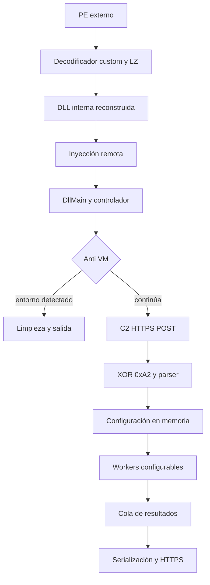

# Reverse engineering notes: loader x64 con DLL interna, stealer y clipper

**Muestra:** `12d0cfedae1778a72603e49a461d7c7375a58c800d8ced9acf8cf04c3321dd1b`  
**Arquitectura:** PE x64 (loader externo) + DLL x64 reconstruida en memoria  
**Autor del análisis:** Aldair Maihuiri  
**Estado:** análisis estático; comportamiento condicionado por configuración remota.

> Copyright © 2026 Gino Aldair Maihuiri Romero. Todos los derechos reservados.  
> Este write-up fue preparado a partir de notas de análisis de malware y evidencia técnica revisada. Un Modelo de Lenguaje asistió con la estructura y edición; el autor revisó el texto final y asume responsabilidad por su publicación.

## Resumen

La muestra no contiene indicadores estáticos de XMRig, RandomX, CryptoNight, Stratum, pools, wallets de minería ni drivers para MSR. El ejecutable analizado funciona como un **loader configurable**: descifra y descomprime una DLL embebida, la prepara como imagen PE válida y la ejecuta dentro de otro proceso.

La DLL es la parte relevante. Su hilo controlador aplica comprobaciones anti-VM, consulta un endpoint HTTPS, descifra la respuesta con XOR `0xA2` y actualiza estructuras de configuración en memoria. De esa configuración dependen sus módulos: clipper de direcciones de criptomonedas, captura de pantalla, recolección de perfiles de navegador y aplicaciones, consultas al registro, descarga/ejecución de segunda etapa y una ruta de token/proceso.

No se observó persistencia por `Run/RunOnce`, tarea programada, servicio, WMI, Startup o escritura de registro. Tampoco hay un dominio, IP, wallet o URL de descarga fijados en el binario; esos valores pueden llegar desde el C2.

## Flujo de ejecución



La secuencia anterior es importante porque separa lo que está **siempre presente** de lo que se activa por configuración. La inyección, el anti-VM, el cliente HTTPS y el parser forman parte del núcleo. El clipper, las descargas y varios recolectores se habilitan únicamente cuando las listas y flags recibidos lo permiten.

## Mapa rápido de nodos y funciones

| Nodo | Dirección | Nombre propuesto | Papel | Prioridad |
|---|---:|---|---|---|
| N1 | `0x14000738d` | `DecodeAndExpandBlob` | Decodificador custom y expansión LZ | Crítica |
| N1 | `0x14000a73d` | `LaunchInternalDllInRemoteProcess` | Reconstruye y lanza la DLL interna | Crítica |
| N2 | `0x18001bf79` | `MalwareDllMain` | Inicializa contexto e hilo controlador | Crítica |
| N2/N3 | `0x180057ace` | `ControllerMain` | Orquestador de C2 y workers | Crítica |
| N2 | `0x180047f22` | `IsVirtualizedOrSandboxed` | Anti-VM y anti-sandbox | Media |
| N3/N5 | `0x180009d00` | `SendHttpsPost` | Transporte WinHTTP | Crítica |
| N3/N5 | `0x1800248a7` | `SerializeAndSubmitHttpJob` | Empaqueta y envía jobs HTTP | Crítica |
| N4 | `0x18001e022` | `ClipboardReplacementWorker` | Clipper de wallets | Alta |
| N4 | `0x18001c54f` | `ProcessDownloadTasks` | Descarga y ejecución de segunda etapa | Alta |
| N4 | `0x1800310c5` | `CaptureScreenAndQueue` | Captura de pantalla | Alta |
| N4 | `0x1800226d` | `CollectRegistryValues` | Inventario de registro | Media |
| N4 | `0x18003bb9c` | `CollectApplicationArtifacts` | Datos de aplicaciones | Alta |
| N4 | `0x18002d2eb` | `CollectChromiumArtifacts` | Datos de Chromium | Alta |
| N4 | `0x180007110` | `CollectFirefoxArtifacts` | Datos de Firefox | Alta |
| N5 | `0x18000ecbf` | `QueueTypedMessage` | Cola concurrente de resultados | Alta |

## N1: loader externo y ejecución de la DLL

El entrypoint del PE llega a la ruta `0x14000a73d`. Antes de ejecutar la DLL, el loader procesa tres blobs: cabeceras, secciones y un stub auxiliar. La rutina de decodificación principal está en `0x14000738d`.

### Decodificador y compresión

El loader contiene un alfabeto de 64 símbolos no estándar:

```text
_VpGTo62f8%:!rYaDg.K30IvE~$*QeRAL|>-h]#ynw?lZ5dz9<jFJCUOHsSuc1t^
```

La rutina convierte cada símbolo a un índice, aplica una operación basada en una clave por blob y genera un flujo de seis bits. El flujo resultante contiene una longitud objetivo seguida de un formato de compresión tipo LZ con banderas y referencias hacia atrás. Este mecanismo recupera una imagen DLL x64 con base preferida `0x180000000`.

La combinación de alfabeto y blob codificado es el indicador estático usado en la regla YARA asociada.

### Inyección de imagen PE

Una vez recuperada la DLL, el loader realiza resolución de importaciones y relocalizaciones antes de copiarla en un proceso remoto. La cadena observada es:

```text
OpenProcess(0x1FFFFF)
  -> VirtualAllocEx
  -> WriteProcessMemory
  -> CreateRemoteThread
```

El hilo remoto se crea con una dirección dentro de la DLL reconstruida. Esto confirma **inyección de DLL/imágen PE manual**. No se afirma process hollowing porque no hay evidencia suficiente de creación suspendida de un proceso y sustitución de su imagen principal.

## N2: inicialización, controlador y evasión

La DLL inicia en el wrapper `0x180067ba0`, pasa por el inicializador de cookie y llega a `DllMain` en `0x18001bf79`. En el evento `DLL_PROCESS_ATTACH` crea un worker con callback `0x180057ace`.

Ese worker es el centro de control. Antes de iniciar red o módulos, consulta tres fuentes de virtualización:

- **CPUID:** comparación contra identificadores de hipervisores, incluidos VMware, VirtualBox, KVM, Xen, TCG, Intel TDX y otros.
- **Adaptador gráfico:** búsqueda de nombres como `Standard VGA`, `Basic Display` y `Virtio`.
- **SMBIOS:** consulta de la tabla `RSMB` mediante `GetSystemFirmwareTable`.

Si encuentra coincidencias, la rama termina el worker. Esta condición domina el flujo previo a las conexiones HTTPS y a la creación de varios threads, por lo que no es una comprobación decorativa.

## N3: C2, cifrado ligero y configuración

El cliente HTTP se apoya en WinHTTP. La ruta y el método observados son `POST /`; el puerto usado es `443` y se crea una solicitud segura. El host se obtiene de una estructura de contexto, no de una cadena estática recuperable en el binario.

Las llamadas relevantes son `WinHttpConnect`, `WinHttpOpenRequest`, `WinHttpSendRequest`, `WinHttpWriteData`, `WinHttpReceiveResponse`, `WinHttpQueryDataAvailable` y `WinHttpReadData`.

Después de una respuesta satisfactoria, el buffer se modifica byte por byte con XOR `0xA2`. El parser posterior trabaja con longitudes de 64 bits y limita cada objeto a `0x400000` bytes. No es un cifrado fuerte; parece una capa de ocultamiento de configuración y no un canal criptográfico completo.

### Estructura de configuración reconstruida

La base global está en `0x18007de68`. Los campos de interés son:

| Offset | Contenido inferido | Uso |
|---:|---|---|
| `+0x00` | Vector de descargas | Activa downloader y tipo de ejecutable |
| `+0x18` | Vector de entradas de registro (`0x60` bytes) | Define claves y valores a leer |
| `+0x30` | Vector de entradas de aplicaciones (`0x70` bytes) | Selecciona objetivos de aplicaciones |
| `+0x48` a `+0x120` | Diez strings | Destinos de reemplazo para el clipper |
| desde `+0x138` | Flags | Habilitan o deshabilitan ramas de workers |

La configuración explica por qué no es correcto atribuir un conjunto fijo de wallets, URLs o objetivos a todas las ejecuciones de esta muestra.

## N4: módulos que reciben tareas

### Clipper de criptomonedas

`ClipboardReplacementWorker` (`0x18001e022`) consulta el número de secuencia del portapapeles cada 600 ms. Cuando detecta cambios, obtiene texto Unicode, lo convierte a UTF-8, identifica el patrón de dirección y, si existe un destino configurado, reemplaza el contenido usando `CF_UNICODETEXT`.

Los patrones cubiertos incluyen Bitcoin (`bc1`, `1`, `3`), EVM (`0x` y 40 hex), Tron, Monero, Litecoin, XRP, Cardano, Bitcoin Cash, TON y un formato Base58 compatible con Solana. La validación observada es sobre todo sintáctica; no hay evidencia de una verificación de checksum completa para cada cadena.

El módulo no realiza una conexión directa. Su resultado práctico depende de las diez direcciones que entregue la configuración remota.

### Captura de pantalla

`CaptureScreenAndQueue` (`0x1800310c5`) copia el escritorio con `BitBlt` usando `CAPTUREBLT`, extrae píxeles con `GetDIBits` y compone un BMP de 24 bits. El buffer se envía a la cola interna con la etiqueta `0x8000000000000004`.

Esta rama permite reconstruir una parte concreta del protocolo de salida:

```text
0x06 | longitud BMP little-endian de 64 bits | bytes BMP
```

La etiqueta interna y el `0x06` de serialización no deben confundirse: el primero clasifica el mensaje dentro de la cola; el segundo identifica la variante BMP dentro del cuerpo HTTP.

### Datos de Chromium y Firefox

La ruta Chromium (`0x18002d2eb`) referencia `Local State`, `Login Data`, `Login Data For Account`, `Network/Cookies`, `History`, `Web Data`, `Preferences` y `Local Storage/leveldb`.

La ruta Firefox (`0x180007110`) referencia `key4.db`, `logins.json`, `cookies.sqlite`, `places.sqlite`, `formhistory.sqlite`, `autofill-profiles` y almacenamiento local. Los helpers asociados incluyen manejo de archivos y se observan rutas de DPAPI, Base64 y AES-GCM en la familia de funciones de aplicaciones. Esto respalda recolección de perfiles, cookies, historial y material de autenticación; no permite afirmar que todas las credenciales se descifren correctamente en cada ejecución.

### Aplicaciones y tokens

`CollectApplicationArtifacts` (`0x18003bb9c`) incluye rutas y marcadores de:

- Discord: LevelDB, `Local State` y el marcador de token `dQw4w9WgXcQ:`.
- Steam: `local.vdf`, `SteamPath`, `MachineUserConfigStore` y `ConnectCache`.
- Roblox: `LocalStorage`.

El binario llama a un wrapper de `CryptUnprotectData` y a rutinas relacionadas con `CryptStringToBinaryA` y `BCryptDecrypt`. Estas APIs encajan con el tratamiento de material protegido/serializado, aunque la semántica de cada registro final no está totalmente reconstruida.

### Registro de Windows

`CollectRegistryValues` (`0x1800226d`) procesa entradas entregadas por configuración. Reconoce HKLM, HKCU, HKU, HKCR y HKCC; abre claves y consulta valores mediante `RegOpenKeyExW` y `RegQueryValueExW`.

La dirección del flujo es de lectura hacia la cola. No se halló escritura `RegSetValue*` usada para persistencia.

### Downloader y ejecución secundaria

`ProcessDownloadTasks` (`0x18001c54f`) evalúa extensiones `.exe`, `.bat`, `.cmd` y `.msi`. Las cadenas recuperadas muestran el uso de `certutil.exe -urlcache -split -f`, `cmd.exe /c` y `msiexec.exe /i ... /qn /norestart`. También aparece automatización COM mediante `IShellDispatch2`/`ShellExecute`.

El dato decisivo -URL, ruta local y comando- no está embebido: procede de la lista de tareas. Por ello esta rama se clasifica como capacidad de segunda etapa condicionada por C2.

### Token y contexto de proceso

Otro worker resuelve y usa `GetShellWindow`, `GetWindowThreadProcessId`, `OpenProcess`, `OpenProcessToken`, `GetTokenInformation`, `DuplicateTokenEx`, `QueryFullProcessImageNameW`, `CreateProcessWithTokenW` y `CreateProcessW`.

La ruta consulta `TokenLinkedToken`, duplica un token primario con alto acceso y puede solicitar creación de proceso. Los argumentos del proceso son dinámicos y el flujo estático no permite confirmar una escalada de privilegios exitosa. También existen referencias a `WriteProcessMemory` y APIs de enumeración de threads, pero no hay una segunda cadena de inyección completa demostrada dentro de la DLL.

## N5: cola, serialización y salida

Los workers no envían directamente todos los datos al C2. Usan una estructura de cola concurrente alrededor de `0x18000ecbf`. El controlador drena los mensajes aceptados, descarta determinados valores centinela y agrupa el resto antes de delegar la serialización y el job HTTP.

Etiquetas observadas:

| Etiqueta interna | Ruta asociada | Observación |
|---:|---|---|
| `0x8000000000000000` | Metadatos de extensión | El controlador la descarta en la rama observada |
| `0x8000000000000001` | Registro y aplicaciones | Pasa al flujo de lote |
| `0x8000000000000003` | Navegadores | Pasa al flujo de lote |
| `0x8000000000000004` | Captura BMP | Formato de salida parcialmente confirmado |

No se debe extrapolar el formato BMP al resto de variantes. Para navegador, registro y aplicaciones se confirma que llegan a la cola y que el controlador los acepta, pero no se ha reconstruido el layout completo de cada objeto dentro del cuerpo HTTP.

## Indicadores y detección

- Alfabeto de 64 símbolos del decodificador custom en `.rdata`.
- Fragmento estático del blob que contiene la DLL codificada.
- Cadena de inyección remota: apertura de proceso con acceso amplio, reserva remota, escritura de memoria y creación de hilo remoto.
- Proceso con WinHTTP que realiza `POST /` sobre TLS y trata la respuesta con XOR `0xA2`.
- Ejecución de `certutil`, `cmd` y `msiexec` a partir de una aplicación inesperada.
- Uso conjunto de operaciones de portapapeles, consultas frecuentes de secuencia y sustitución de `CF_UNICODETEXT`.

La regla YARA debe usarse como detección de este loader concreto, no como una firma genérica de infostealers. Su condición combina dos artefactos específicos para reducir coincidencias accidentales.

## Límites y siguientes pasos

Este write-up no incluye análisis dinámico. Para cerrar los puntos pendientes se requiere una ejecución contenida y con instrumentación: captura de comunicaciones, registro de procesos/hilos, inspección de buffers posterior a XOR y monitorización de escritura de archivos y portapapeles. La prioridad es recuperar una configuración real sin asumir que cualquier ruta condicional se ejecutó en la muestra observada.

La clasificación final queda como: **loader configurable con infostealer, clipper de criptomonedas, captura de pantalla y capacidad de segunda etapa; coinminer no confirmado.**
