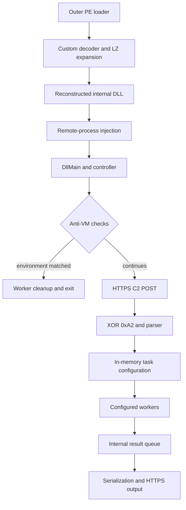

# Reverse engineering notes: x64 loader with embedded DLL, stealer, and cryptocurrency clipper

**Sample:** `12d0cfedae1778a72603e49a461d7c7375a58c800d8ced9acf8cf04c3321dd1b`  
**Architecture:** x64 PE outer loader and an in-memory reconstructed x64 DLL  
**Author:** Gino Aldair Maihuiri Romero  
**Status:** static analysis; several features depend on remotely supplied configuration.

> Copyright © 2026 Gino Aldair Maihuiri Romero. All rights reserved.  
> This write-up was prepared from malware-analysis notes and reviewed technical evidence. A Large Language Model assisted with translation, structure, and copy-editing; the author reviewed the final text and is responsible for its publication.

## Summary

This sample is **not statically supported as a coinminer**. The outer executable behaves as a configurable loader: it decodes and decompresses an embedded DLL, reconstructs it as a PE image, and runs it inside a remote process.

The DLL is the operational component. Its controller thread performs anti-VM checks, contacts a HTTPS endpoint, applies XOR `0xA2` to the response, and updates configuration structures in memory. The received configuration can enable a cryptocurrency clipboard clipper, screen capture, browser and application collection, registry queries, second-stage download/execution, and a token/process path.

No static evidence was found for XMRig, RandomX, CryptoNight, Stratum, mining pools, mining wallets, MSR drivers, scheduled tasks, services, Run/RunOnce persistence, WMI persistence, Startup-folder persistence, or Defender exclusions. The binary does not contain a hardcoded C2 domain, IP address, wallet, or download URL; these values can be delivered by the C2.

## Execution flow



This separation matters. The loader, anti-VM logic, HTTPS transport, and configuration parser are core components. The clipper, downloader, and several collectors are gated by configuration flags and lists, so their presence in the binary does not prove that every module ran in a given execution.

## Function and node map

| Node | Address | Proposed name | Role | Priority |
|---|---:|---|---|---|
| N1 | `0x14000738d` | `DecodeAndExpandBlob` | Custom decoding and LZ expansion | Critical |
| N1 | `0x14000a73d` | `LaunchInternalDllInRemoteProcess` | PE reconstruction and DLL injection | Critical |
| N2 | `0x18001bf79` | `MalwareDllMain` | Context initialization and controller creation | Critical |
| N2/N3 | `0x180057ace` | `ControllerMain` | C2 and worker orchestration | Critical |
| N2 | `0x180047f22` | `IsVirtualizedOrSandboxed` | Anti-VM and anti-sandbox checks | Medium |
| N3/N5 | `0x180009d00` | `SendHttpsPost` | WinHTTP transport | Critical |
| N3/N5 | `0x1800248a7` | `SerializeAndSubmitHttpJob` | HTTP job serialization | Critical |
| N4 | `0x18001e022` | `ClipboardReplacementWorker` | Cryptocurrency wallet clipper | High |
| N4 | `0x18001c54f` | `ProcessDownloadTasks` | Second-stage download and execution | High |
| N4 | `0x1800310c5` | `CaptureScreenAndQueue` | Screen capture | High |
| N4 | `0x1800226d` | `CollectRegistryValues` | Registry inventory | Medium |
| N4 | `0x18003bb9c` | `CollectApplicationArtifacts` | Application data collection | High |
| N4 | `0x18002d2eb` | `CollectChromiumArtifacts` | Chromium artifact collection | High |
| N4 | `0x180007110` | `CollectFirefoxArtifacts` | Firefox artifact collection | High |
| N5 | `0x18000ecbf` | `QueueTypedMessage` | Concurrent result queue | High |

## N1: outer loader and internal DLL launch

The outer PE reaches `0x14000a73d` after CRT setup. Before launching the DLL, it processes encoded header, section, and helper-stub blobs. The main decoding routine is located at `0x14000738d`.

### Decoder and compression stage

The loader stores a non-standard 64-symbol alphabet:

```text
_VpGTo62f8%:!rYaDg.K30IvE~$*QeRAL|>-h]#ynw?lZ5dz9<jFJCUOHsSuc1t^
```

Each input symbol is mapped to an index, transformed with a blob-specific key, and turned into a six-bit stream. That stream contains a target length followed by a LZ-style representation with control flags and back-references. The final output is a x64 DLL with preferred image base `0x180000000`.

This alphabet, combined with a static fragment of the encoded DLL blob, is used by the companion YARA rule. The rule is intentionally tied to this loader rather than generic infostealer strings.

### PE image preparation and remote execution

After reconstruction, the loader resolves imports and relocations before copying the DLL image into a remote process. The observed sequence is:

```text
OpenProcess(0x1FFFFF)
  -> VirtualAllocEx
  -> WriteProcessMemory
  -> CreateRemoteThread
```

The remote thread starts at an address within the reconstructed DLL. This supports **manual PE/DLL injection**. It does not support a process-hollowing conclusion, because the static path does not show the required suspended-process creation and primary-image replacement sequence.

## N2: DLL start-up, controller, and evasion

The DLL starts at wrapper `0x180067ba0`, reaches `DllMain` at `0x18001bf79`, and creates a worker whose callback is `0x180057ace`. That worker is the controller.

Before it permits networking or task creation, the controller checks:

- **CPUID vendor information:** strings associated with VMware, VirtualBox, KVM, Xen, TCG, Intel TDX, and other virtualized environments.
- **Display adapter names:** including `Standard VGA`, `Basic Display`, and `Virtio`.
- **SMBIOS data:** through `GetSystemFirmwareTable` and the `RSMB` table.

When a condition matches, the worker follows a cleanup/exit path. The checks dominate branches that precede HTTP activity and worker startup, which makes them an active execution gate rather than unused capability code.

## N3: C2 transport and runtime configuration

The network client uses WinHTTP. The observed method and path are `POST /`, with TLS on port `443`. The destination host is read from a runtime context instead of a recoverable plaintext string.

Relevant API use includes `WinHttpConnect`, `WinHttpOpenRequest`, `WinHttpSendRequest`, `WinHttpWriteData`, `WinHttpReceiveResponse`, `WinHttpQueryDataAvailable`, and `WinHttpReadData`.

After a successful response, the buffer is transformed byte-by-byte with XOR `0xA2`. The following parser reads 64-bit lengths and rejects elements larger than `0x400000`. This is lightweight configuration obfuscation, not evidence of a complete secure application protocol.

### Reconstructed configuration layout

The global base is `0x18007de68`.

| Offset | Inferred content | Operational use |
|---:|---|---|
| `+0x00` | Download-task vector | Enables downloader and payload type selection |
| `+0x18` | Registry-entry vector (`0x60` bytes) | Selects keys and values to query |
| `+0x30` | Application-entry vector (`0x70` bytes) | Selects application targets |
| `+0x48` to `+0x120` | Ten strings | Clipboard-replacement destinations |
| from `+0x138` | Flags | Enables or disables worker branches |

This layout is why wallets, download locations, and collection targets should not be presented as fixed attributes of every execution.

## N4: configured capability modules

### Cryptocurrency clipboard clipper

`ClipboardReplacementWorker` at `0x18001e022` polls the clipboard sequence number every 600 ms. After a change, it reads Unicode text, converts it to UTF-8, identifies a wallet-like pattern, and replaces the text if the matching destination in the runtime configuration is populated.

Observed syntax checks cover Bitcoin (`bc1`, `1`, `3`), EVM-style `0x` addresses, Tron, Monero, Litecoin, XRP, Cardano, Bitcoin Cash, TON, and a Base58 format compatible with Solana. The checks appear primarily syntactic; a complete checksum implementation was not established for every format.

This worker does not directly contact the network. Its monetary impact depends on addresses received through configuration.

### Screen capture

`CaptureScreenAndQueue` at `0x1800310c5` copies the desktop using `BitBlt` with `CAPTUREBLT`, obtains pixels with `GetDIBits`, and builds a 24-bit BMP. The result enters the internal queue under tag `0x8000000000000004`.

The screen-capture branch reveals one output variant end to end:

```text
0x06 | 64-bit little-endian BMP length | BMP bytes
```

The queue tag and the `0x06` serializer variant serve different purposes. The first classifies an internal message; the second identifies a BMP object in the HTTP body.

### Chromium and Firefox artifacts

The Chromium route at `0x18002d2eb` references `Local State`, `Login Data`, `Login Data For Account`, `Network/Cookies`, `History`, `Web Data`, `Preferences`, and `Local Storage/leveldb`.

The Firefox route at `0x180007110` references `key4.db`, `logins.json`, `cookies.sqlite`, `places.sqlite`, `formhistory.sqlite`, `autofill-profiles`, and local storage. Related helper paths contain file operations as well as DPAPI, Base64, and AES-GCM handling. This supports the collection of profile data, cookies, history, and authentication material; it does not prove that every credential is successfully decrypted in every run.

### Application artifacts and tokens

`CollectApplicationArtifacts` at `0x18003bb9c` includes paths and markers for:

- Discord: LevelDB, `Local State`, and the token marker `dQw4w9WgXcQ:`.
- Steam: `local.vdf`, `SteamPath`, `MachineUserConfigStore`, and `ConnectCache`.
- Roblox: `LocalStorage`.

The DLL also calls a `CryptUnprotectData` wrapper and routines related to `CryptStringToBinaryA` and `BCryptDecrypt`. Those APIs are consistent with handling protected or serialized application material, but the final meaning of every record was not fully recovered.

### Windows registry inventory

`CollectRegistryValues` at `0x1800226d` receives entries from the C2 configuration. It recognizes HKLM, HKCU, HKU, HKCR, and HKCC, then uses `RegOpenKeyExW` and `RegQueryValueExW` to read data.

The static data flow is read-only and points to the queue. No `RegSetValue*` persistence path was found.

### Downloader and second-stage execution

`ProcessDownloadTasks` at `0x18001c54f` recognizes `.exe`, `.bat`, `.cmd`, and `.msi` tasks. Recovered strings show `certutil.exe -urlcache -split -f`, `cmd.exe /c`, and `msiexec.exe /i ... /qn /norestart`. COM automation through `IShellDispatch2` and `ShellExecute` is also present.

The URL, local path, and final command are supplied by the task list. This is therefore a C2-gated second-stage capability, not a list of embedded payloads.

### Token and process context

Another worker resolves and uses `GetShellWindow`, `GetWindowThreadProcessId`, `OpenProcess`, `OpenProcessToken`, `GetTokenInformation`, `DuplicateTokenEx`, `QueryFullProcessImageNameW`, `CreateProcessWithTokenW`, and `CreateProcessW`.

It queries `TokenLinkedToken`, duplicates a primary token with broad access, and may request process creation. The process arguments are dynamic, and static analysis does not establish a successful privilege escalation. `WriteProcessMemory` and thread-enumeration APIs also appear in the DLL, but a second complete injection path was not proven there.

## N5: queue, serialization, and output

Workers place records into a concurrent queue centered around `0x18000ecbf`. The controller drains accepted messages, drops specific sentinel values, batches the remaining records, and hands them to the HTTP serializer.

| Internal tag | Associated route | Finding |
|---:|---|---|
| `0x8000000000000000` | Extension metadata | Discarded by the observed controller branch |
| `0x8000000000000001` | Registry and application records | Reaches the batch path |
| `0x8000000000000003` | Browser records | Reaches the batch path |
| `0x8000000000000004` | BMP capture | Partially confirmed output layout |

The BMP format must not be applied to every record type. Browser, registry, and application entries are accepted into the queue and batch path, but their complete HTTP-body layouts were not recovered.

## Detection notes

- The custom 64-character decoder alphabet in `.rdata`.
- A static fragment of the encoded internal-DLL blob.
- Remote-process injection behavior: broad process access, remote allocation, remote write, and remote thread creation.
- WinHTTP `POST /` traffic over TLS followed by response handling with XOR `0xA2`.
- Unexpected use of `certutil`, `cmd`, and `msiexec` from the loader's process tree.
- Frequent clipboard sequence polling combined with `CF_UNICODETEXT` replacement.

The YARA rule should be treated as a signature for this loader, not as a generic infostealer rule. Its condition combines two loader-specific artifacts to reduce accidental matches.

## Limitations and next steps

This write-up is static-only. Closing the remaining gaps requires contained execution with process/thread telemetry, traffic capture, inspection of post-XOR buffers, and clipboard/file monitoring. The immediate objective would be recovering a real configuration without assuming that every conditional branch executed.

**Final classification:** configurable loader with infostealer functions, a cryptocurrency clipboard clipper, screen capture, and second-stage capability; coinminer not confirmed.
